<div align="left">


</div>


## Environment

<div align="left">

<br>
<br>
<br>

</div>

---

# <h1 style="color:yellow;">Hack The Box: Cicada</h1>

> **Machine Type:** Active Directory / Windows
>
> **Objective:** Document the full attack chain: Recon → SMB enum → Credential discovery → WinRM access → PrivEsc → Proof

---

## <h1 style="color:skyblue;">Overview</h1>

**What this is:**

* Cicada is an Active Directory target where the main path is driven by **SMB share exposure + credential discovery**, followed by **remote access** and **privilege escalation**.

**Why it matters:**

* This is a realistic enterprise failure chain: weak internal hygiene (shares/scripts) → credential leakage → privilege misuse.

---

## <h1 style="color:skyblue;">Core idea</h1>

This machine reinforces a key security principle:

* **Misconfigurations + credential exposure** are often more impactful than “highly technical exploits”.
* AD environments collapse fast when:

  * shares are readable by low-priv users
  * passwords are stored in files/scripts
  * privileged rights (backup/restore) exist without tight monitoring

---

## <h1 style="color:red;">Common misunderstandings</h1>

* “Guest access is harmless.”
  ➜ It’s enough to enumerate shares and find sensitive files.

* “A default password is low impact.”
  ➜ It becomes a key for password spraying and account takeover.

* “Backup privileges are not admin.”
  ➜ In Windows/AD, backup/restore privileges can lead to full compromise.

---

## <h1 style="color:skyblue;">Why this matters in real security</h1>

This attack chain appears in real-world assessments when:

* HR/IT shares contain onboarding files with passwords
* scripts contain hardcoded credentials for automation
* legacy privileges are left enabled on service/employee accounts

If you can **read the right file**, you often skip “exploits” entirely.

---

## <h1 style="color:skyblue;">Concept behind the lab</h1>

This lab practices:

* **Recon discipline** (identify DC traits)
* **SMB enumeration** (shares, readable files)
* **Credential discovery & validation** (spraying / testing)
* **Remote access** (WinRM)
* **Privilege awareness** (whoami /priv)
* **Controlled escalation** (use privileges to access sensitive assets)

---

## <h1 style="color:pink;">Walkthrough steps</h1>

### Step 1 Recon (Nmap)

**Goal:** identify services and confirm AD/DC.

**Command(s):**

```bash
nmap -sC -sV -Pn <IP>
```

**What to observe:**

* DNS/Kerberos/LDAP/SMB/WinRM presence
* Host looks like Domain Controller

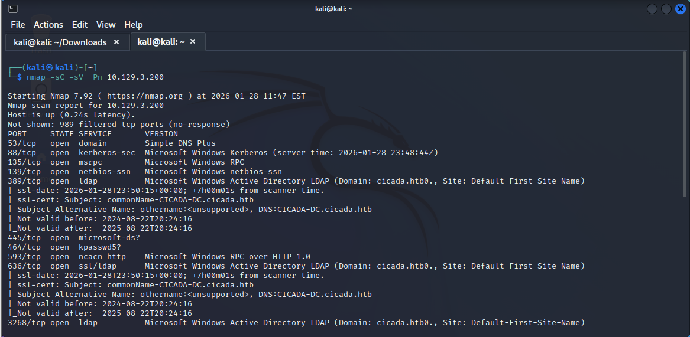
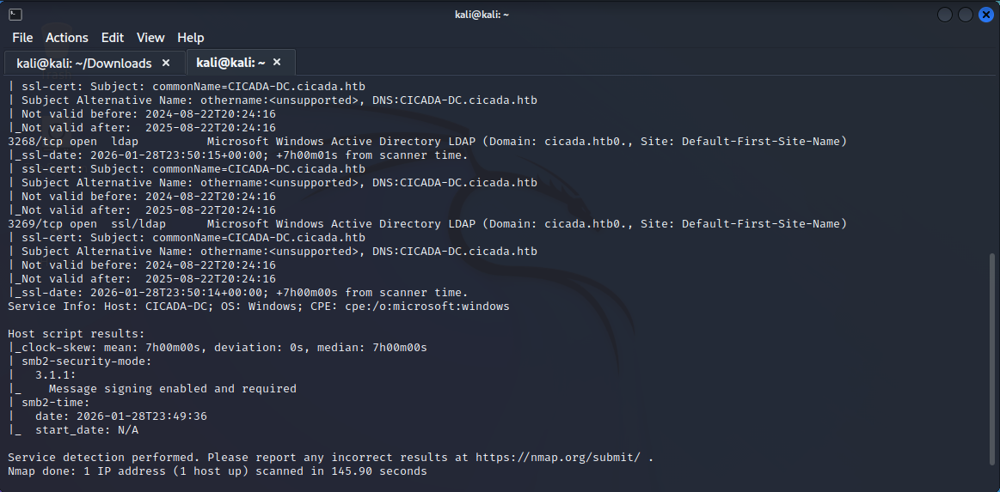

---

### Step 2 SMB share enumeration (Guest)

**Goal:** check if any shares are accessible anonymously.

**Command(s):**

```bash
crackmapexec smb cicada.htb -u 'guest' -p '' --shares
```

**What to observe:**

* Which shares are readable
* HR / IPC$ access

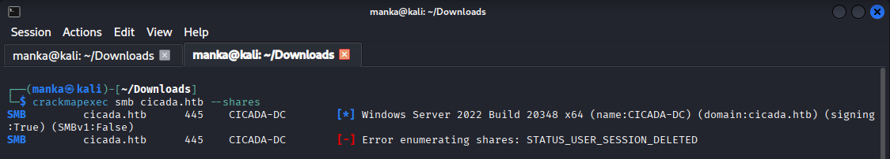
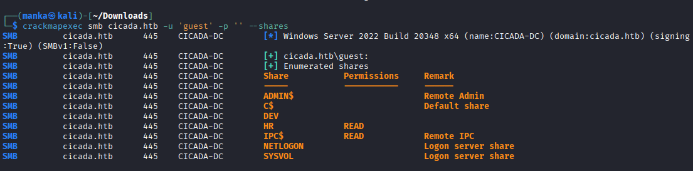

---

### Step 3 — Access HR share + download onboarding file

**Goal:** pull files from readable shares.

**Command(s):**

```bash
smbclient //cicada.htb/HR
ls
get "notice from HR.txt"
```

**What to observe:**

* The share contains an onboarding notice

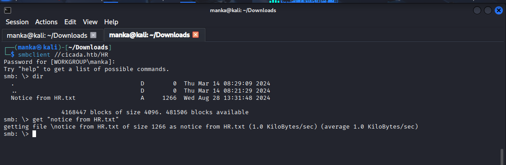

---

### Step 4 Extract leaked password from HR notice

**Goal:** read the file and extract credentials.

**Command(s):**

```bash
cat "notice from HR.txt"
```

**What to observe:**

* Default password disclosed in plaintext

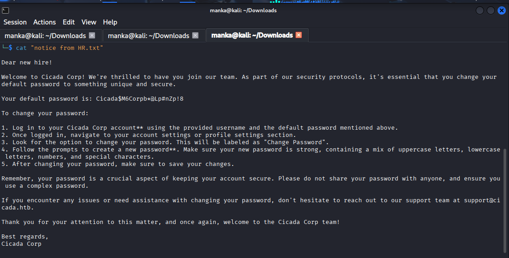

---

### Step 5 Enumerate domain users (RID cycling / lookups)

**Goal:** identify valid domain accounts.

**Command(s):**

```bash
impacket-lookupsid cicada.htb/guest@cicada.htb -no-pass
```

**What to observe:**

* domain SID
* user/group objects

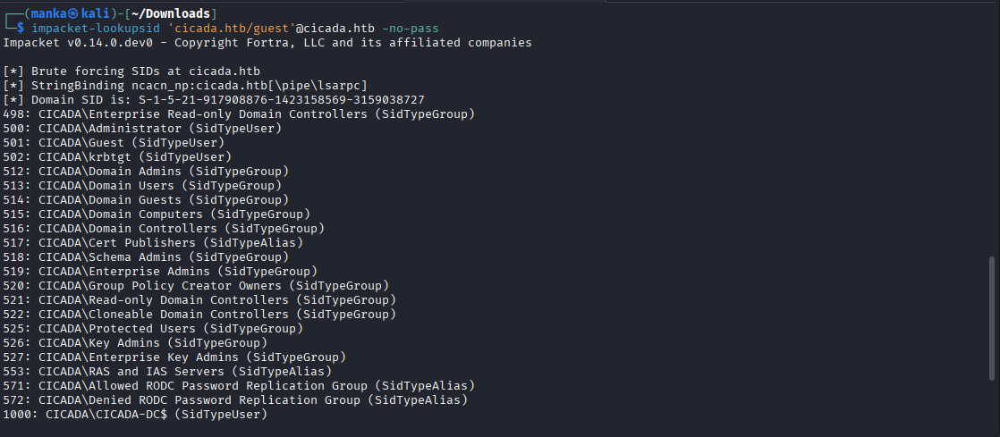
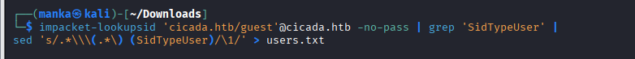
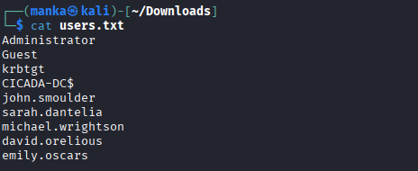
---

### Step 6 Password spraying with discovered password

**Goal:** validate which user(s) reuse the default password.

**Command(s):**

```bash
crackmapexec smb cicada.htb -u users.txt -p '<DEFAULT_PASSWORD>'
```

**What to observe:**

* which username returns successful auth

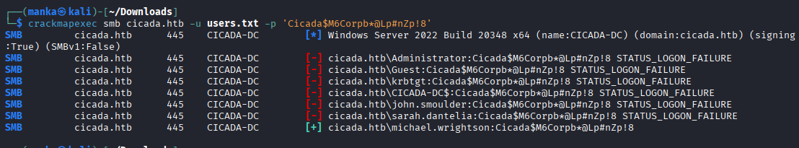
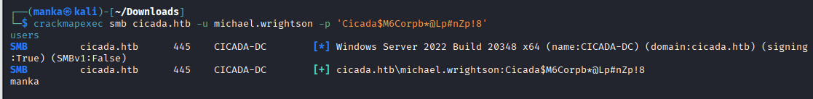
---

### Step 7 Authenticated enumeration + notes extraction (badpwdcount / description)

**Goal:** enumerate users and mine descriptions for hints.

**Command(s):**

```bash
crackmapexec smb cicada.htb -u michael.wrightson -p '<PASSWORD>' --users
```

**What to observe:**

* user descriptions can contain passwords or hints

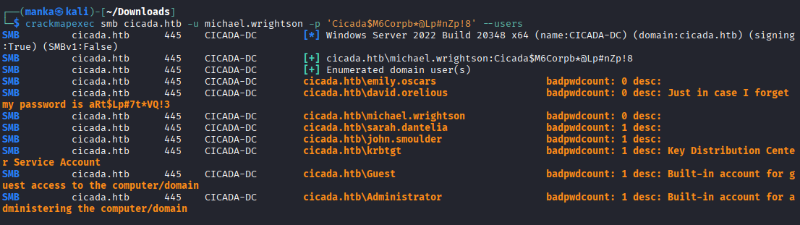
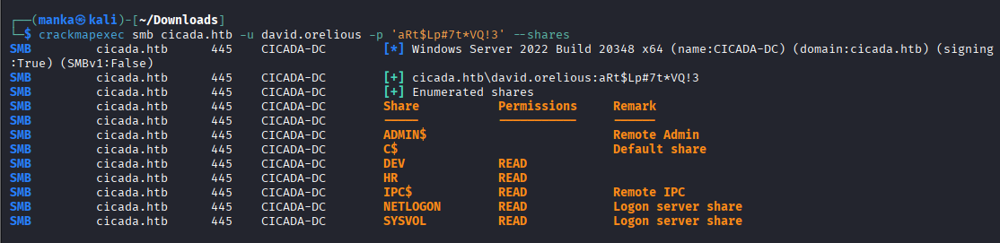
---

### Step 8 — DEV share: find script with hardcoded credentials

**Goal:** pull scripts/configs from accessible shares.

**Command(s):**

```bash
smbclient //cicada.htb/DEV -U david.orelious
ls
get Backup_script.ps1
```

**What to observe:**

* script exists in DEV share

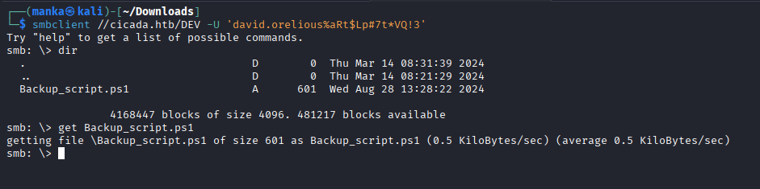

---

### Step 9 — Analyze backup script for credentials

**Goal:** extract credentials from code.

**Command(s):**

```bash
cat Backup_script.ps1
```

**What to observe:**

* hardcoded username/password (emily.oscars)

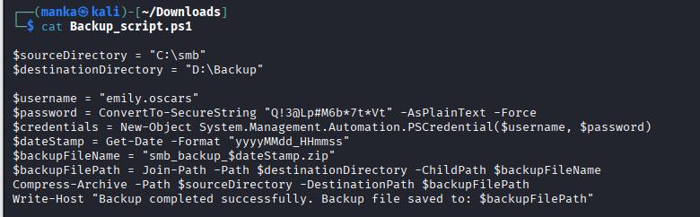

---

### Step 10 — WinRM access + privilege confirmation

**Goal:** login with the leaked credentials and confirm privileges.

**Command(s):**

```bash
evil-winrm -u emily.oscars -p '<PASSWORD>' -i cicada.htb
whoami
whoami /priv
```

**What to observe:**

* interactive shell
* privileges like SeBackupPrivilege / SeRestorePrivilege

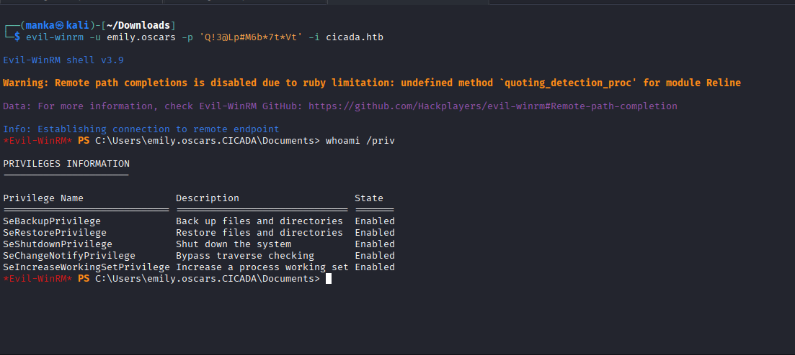

---

## <h1 style="color:lightgreen;">Proof</h1>

* **User proof:** `C:\Users\<user>\Desktop\user.txt`
* **Root/System proof:** `C:\Users\Administrator\Desktop\root.txt`

📸 **Proof screenshot(s):**


---

## Reflection

* What became clearer?

  * [ ] SMB enumeration discipline
  * [ ] Credential discovery patterns
  * [ ] Why backup privileges are dangerous

* What needs more study?

  * [ ] AD privilege escalation patterns
  * [ ] NTDS/dump concepts (high-level)
  * [ ] OPSEC and safe documentation practices

---

## <h1 style="color:lightgreen;">Summary</h1>

Cicada demonstrates a realistic AD breach chain where **exposed shares** and **credential leakage** lead to **authenticated access**, followed by privilege-based escalation.

---

This work is part of FuzzRaiders’ structured hands-on training program, where learning is guided, documented, and continuously reviewed to build practical skills, disciplined methodology, and real-world security readiness.

---
👤 Author  Anka0X

 ## [LinkedIn:](https://www.linkedin.com/in/manka-sec/)


