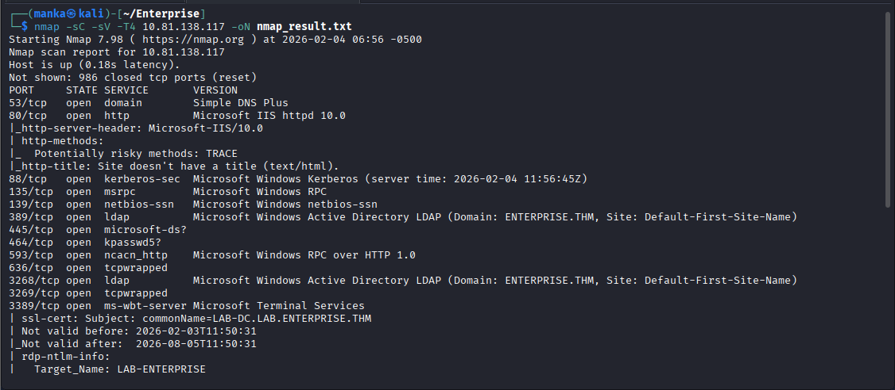
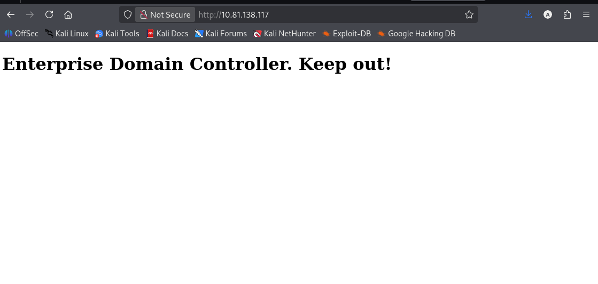
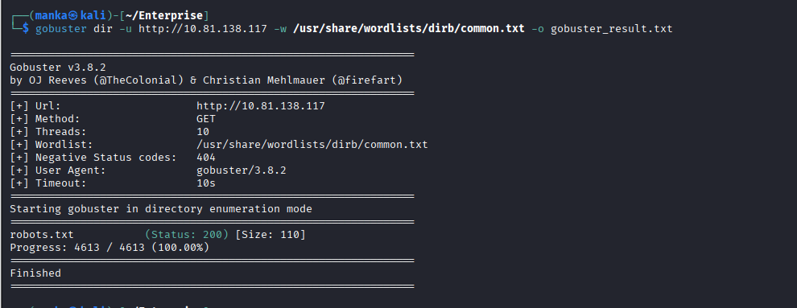
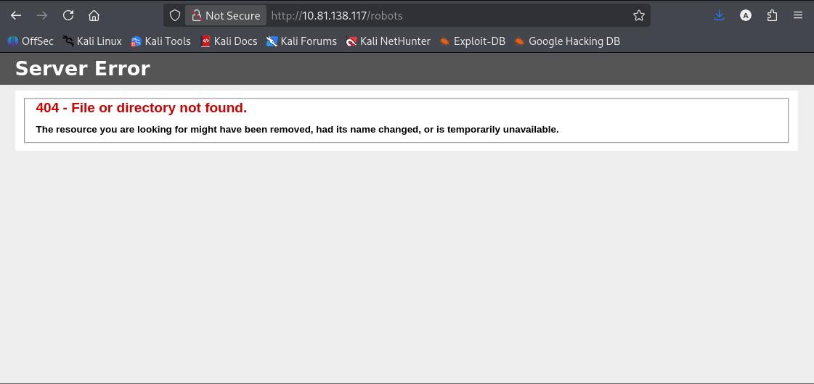
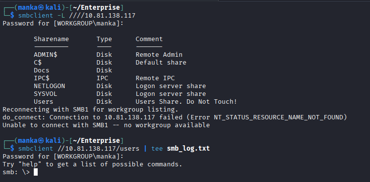
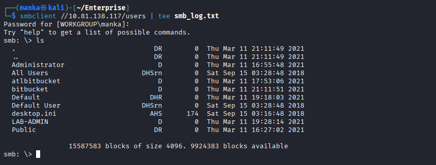
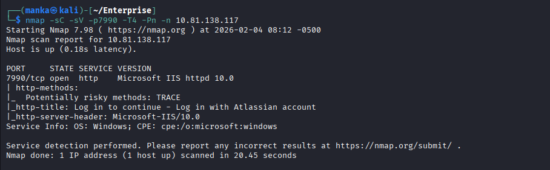
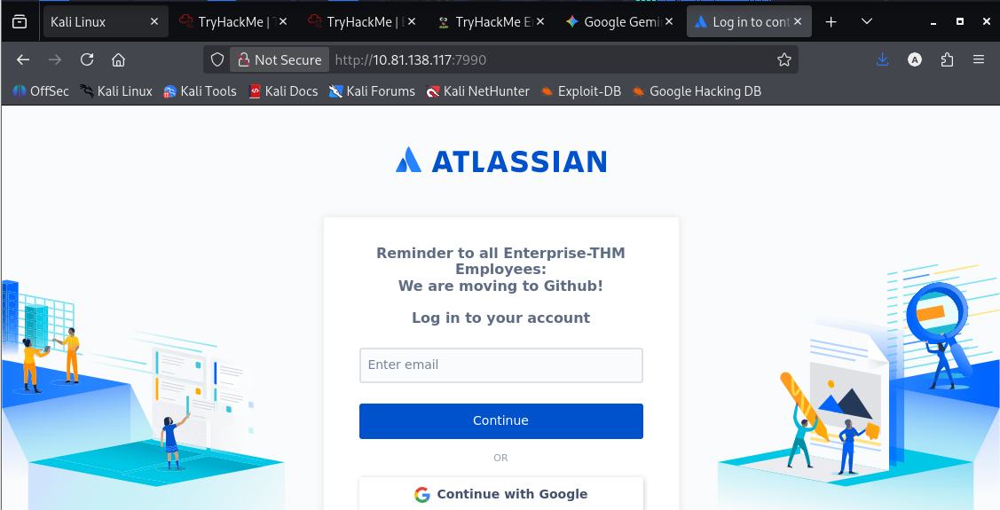
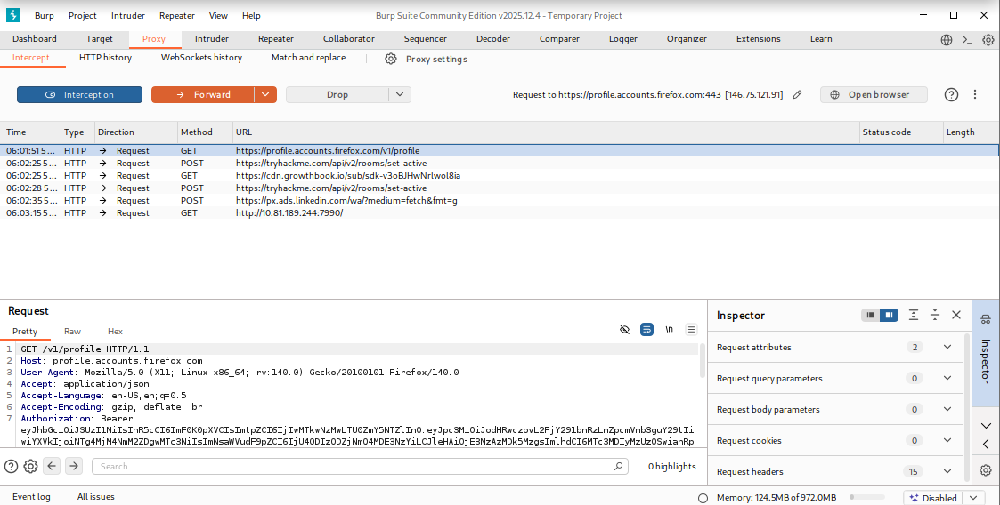
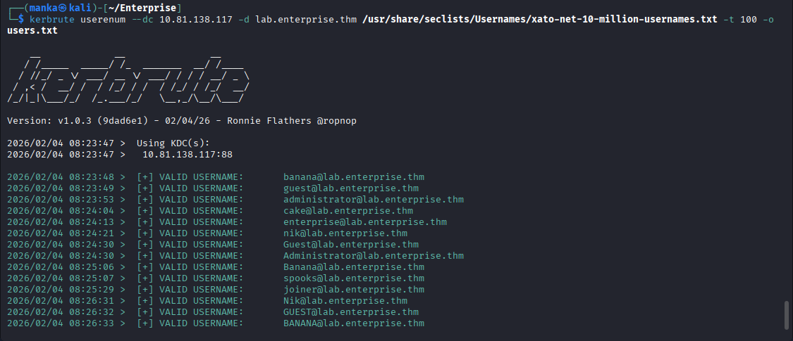

<div align="left">

    

# 🖨️ Hack The Box: Return P1: LDAP Pass-back Attack

<br>
<br>


</div>

# 🏢 Enterprise P1: TryHackMe Write-Up

**Enterprise** is a Windows Active Directory machine that demonstrates how **sensitive data exposure** in web directories and **misconfigured SMB shares** can lead to a **full Domain Controller compromise**.

---

## 🔗 Attack Chain Overview

* Anonymous SMB access used to harvest internal usernames
* Hidden web assets discovered via directory brute-forcing
* Active Directory user validation using Kerberos (Kerbrute)
* Analysis of internal developer tooling (Atlassian Bitbucket)

---

## 🧰 Tools Used

| Tool        | Purpose                               |
| ----------- | ------------------------------------- |
| `nmap`      | Service discovery & DC identification |
| `gobuster`  | Directory brute-forcing               |
| `smbclient` | SMB share enumeration & file access   |
| `kerbrute`  | Kerberos-based AD user validation     |
| `burpsuite` | Web traffic interception & analysis   |

---

## 🔍 Enumeration

### 🔎 Nmap Recon

**Goal:** Identify exposed services and confirm Active Directory role.

```bash
nmap -sC -sV -T4 10.81.138.117
```

**Observations:**

* DNS
* Kerberos (88)
* SMB (445)
* Atlassian Bitbucket (7990)



---

### 🌐 Web Enumeration (Port 80)

The root page displays a **"Keep Out"** warning indicating the server is a Domain Controller.



#### Directory Brute-Forcing

```bash
gobuster dir -u http://10.81.138.117 -w common.txt
```

**Result:**

* `robots.txt` identified
* Manual access resulted in **404 Not Found**



---

### 📁 SMB Enumeration (Guest Access)

**Goal:** Identify publicly accessible SMB shares to harvest usernames.

```bash
smbclient -L //10.81.138.117/
```

**Observations:**

* Open **Users** directory
* Internal folders discovered:

  * `bitbucket`
  * `cake`
  * `nik`
  * `LAB-ADMIN`




---

## 🧑‍💻 Atlassian Bitbucket (Port 7990)

**Goal:** Analyze internal developer infrastructure.

* Bitbucket login portal exposed
* GitHub migration notice visible




### 🔬 Traffic Interception

Authentication requests and backend headers analyzed using **Burp Suite**.



---

## 🔑 Kerberos User Enumeration

**Goal:** Validate harvested usernames against the Domain Controller.

```bash
kerbrute userenum --dc 10.81.138.117 -d lab.enterprise.thm userlist.txt
```

**Result:**
Validated Active Directory users:

* `banana`
* `bitbucket`
* `cake`
* `nik`


---

## 🧠 What This Box Teaches

* **Information Leakage:** Public SMB shares are high‑value targets for user enumeration
* **Kerberos Weaknesses:** Username validation is possible without account lockouts
* **Service Footprinting:** Non‑standard ports often host critical internal tools

---

## 📌 Conclusion

**Enterprise** reinforces a core penetration testing principle:

> *Major compromises often begin with simple information disclosure.*

By chaining SMB harvesting with Kerberos validation, an attacker can fully map internal Active Directory users — setting the stage for total domain compromise.

---

This work is part of **FuzzRaiders**’ structured hands-on training and research program, where every lab, project, and technical study is formally documented, reviewed, and validated to ensure real-world applicability, methodological rigor and real-world security execution

Happy hacking 🚀
---
### Author
## [LinkedIn:](https://www.linkedin.com/in/manka-sec/)