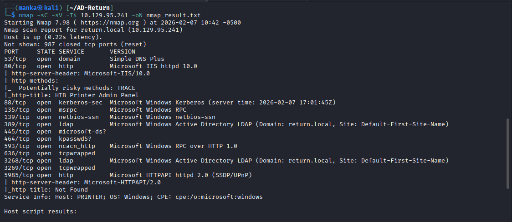
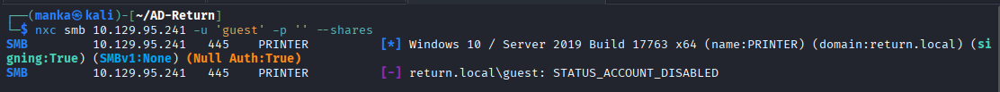
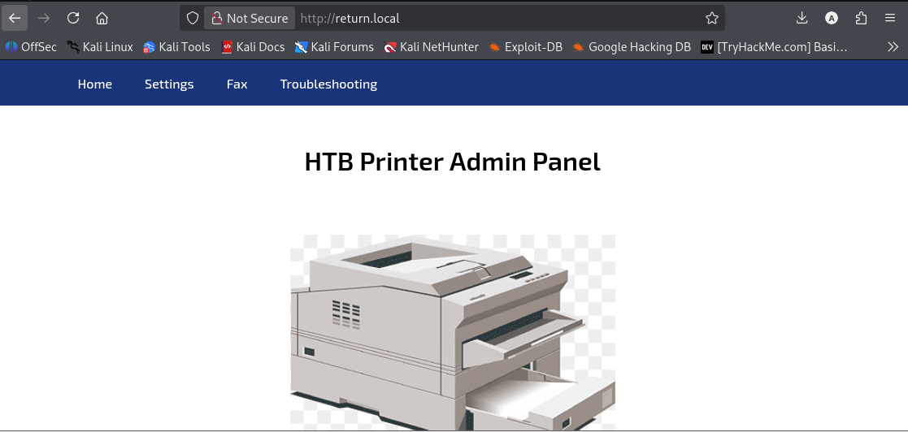
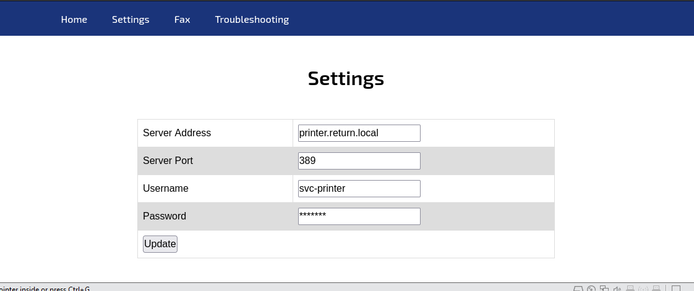
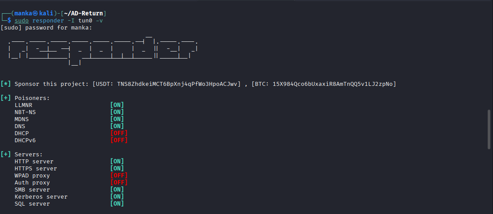
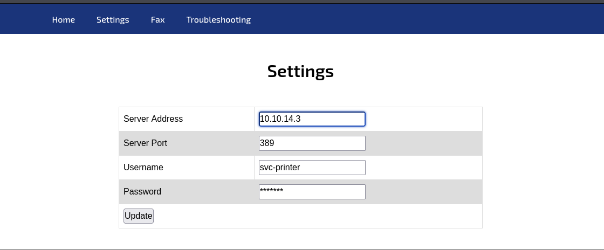
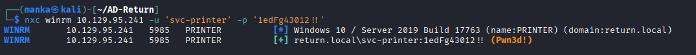
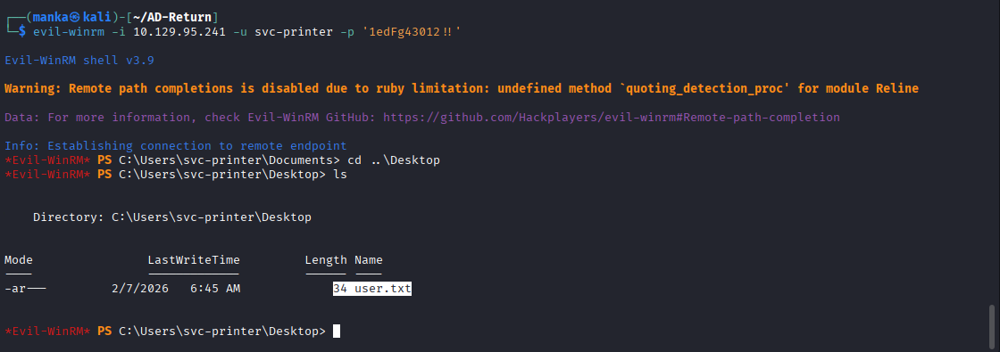
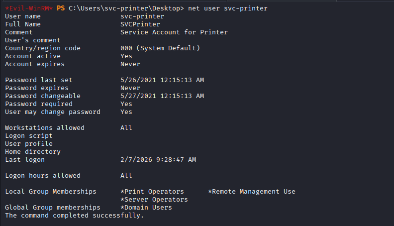

<div align="left">

    

</div>

# 🖨️ Hack The Box: Return P1: LDAP Pass-back Attack

## 📌 Overview

**Return** is a Windows Active Directory machine that demonstrates a **realistic enterprise vulnerability** commonly found in office peripherals such as **printers and scanners**.

Many of these devices store **Active Directory service credentials** for LDAP lookups. When their **web management interfaces are insecure**, attackers can abuse **LDAP Pass-back** to intercept credentials and pivot into the domain.

This lab showcases how a **non-traditional asset (a printer)** can become the entry point to a **full system compromise**.

---

## 🔗 Attack Chain Summary

* Information disclosure via printer web management console
* LDAP Pass-back used to capture service account credentials
* Credential validation through SMB / WinRM
* Privilege escalation via **Server Operators** group membership
* SYSTEM-level compromise

---
```
## 🛠 Tools Used

| Tool            | Purpose                                   |
| --------------- | ----------------------------------------- |
| `nmap`          | Service discovery & domain identification |
| `netcat (nc)`   | LDAP credential capture listener          |
| `nxc (NetExec)` | Credential validation & access checks     |
| `evil-winrm`    | Authenticated shell & post-exploitation   |
```
---

## 🔍 Enumeration

### 🔎 Nmap Recon

The initial scan identifies the target as a **Windows Server 2019** acting as a **Domain Controller** for `return.local`.

```bash
nmap -sC -sV <TARGET_IP>
```

**Observations:**

* Port **80 (HTTP)** — HTB Printer Admin Panel
* LDAP **(389)**
* WinRM **(5985)**
* Standard Active Directory services

---

### 📁 SMB Enumeration


Anonymous SMB access was tested and **Guest access is restricted**, eliminating SMB as the initial access vector.

---

### 🌐 Web Interface Discovery

Navigating to **port 80** reveals a **printer management dashboard**.

Inside the **Settings** menu, the **LDAP configuration** for address book lookups is exposed.

**Information Disclosed:**

* Service account username: `svc-printer`


---

## 🎣 Initial Access — LDAP Pass-back Attack

### 1️⃣ Redirecting the LDAP Server

By modifying the **Server Address** field to the attacker’s IP address and clicking **Update**, the printer is forced to authenticate against a malicious LDAP listener.

---

### 2️⃣ Capturing Credentials

A listener is started on **port 389** to capture incoming authentication requests.

```bash
sudo responder -I -tun0 -v 
```



**Captured Credentials:**

```
svc-printer : 1edFg43012!!
```

---

## 🖥 Credential Validation & Shell Access

### 1️⃣ Credential Validation

The captured credentials are validated using **NetExec (nxc)** to confirm SMB and WinRM access.



---

### 2️⃣ Gaining a Shell

With valid credentials confirmed, an interactive shell is obtained using **evil-winrm**, allowing access to the user context and flag collection.

---

## 🧭 Privilege Enumeration

Group membership enumeration reveals a **high-impact misconfiguration**.

```powershell
net user svc-printer
```

**Observation:**

* `svc-printer` is a member of the **Server Operators** group

This group allows:

* Service configuration changes
* Binary path modification
* Indirect execution as **SYSTEM**

---

## 👑 Privilege Escalation — Path to SYSTEM

By abusing **Server Operators** privileges, a service binary path can be modified to:

* Execute a reverse shell, or
* Add the user to the local **Administrators** group

This results in **SYSTEM-level control** of the host.

---

## 🧠 What This Box Teaches

* **Peripherals Matter**
  Printers and scanners are often overlooked but store high-value credentials

* **LDAP Security Is Critical**
  LDAP traffic must be protected with **LDAPS (port 636)** to prevent credential interception

* **Built-in Group Risks**
  Groups like **Server Operators** should be treated as Tier-0 privileges

---

## 📌 Conclusion

**Return** demonstrates how a **simple configuration change** on a web-exposed printer can escalate into a **full domain compromise**.

This machine reinforces that internal security failures often originate from **forgotten assets and implicit trust**, not advanced exploits.
---

This work is part of **FuzzRaiders**’ structured hands-on training and research program, where every lab, project, and technical study is formally documented, reviewed, and validated to ensure real-world applicability, methodological rigor and real-world security execution

Happy hacking 🚀

---

### Author
## [LinkedIn:](https://www.linkedin.com/in/manka-sec/)
---
