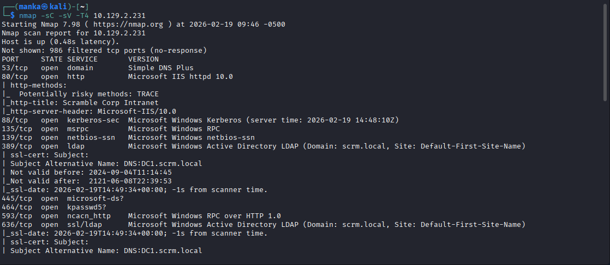
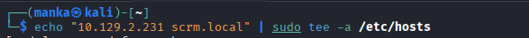
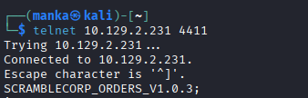
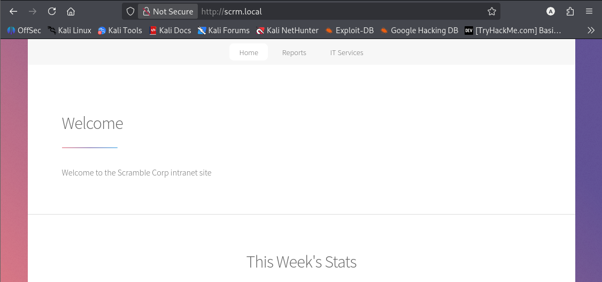
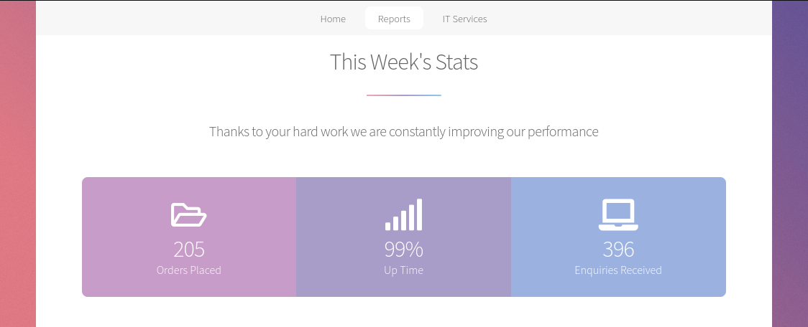
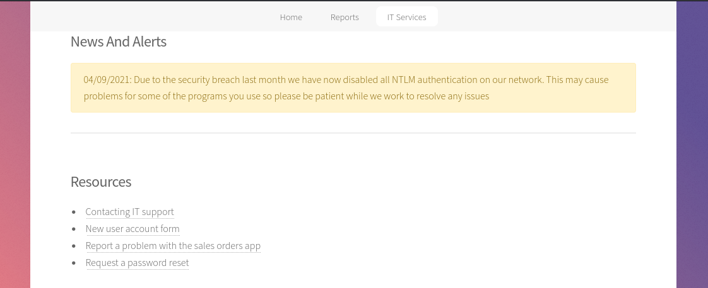
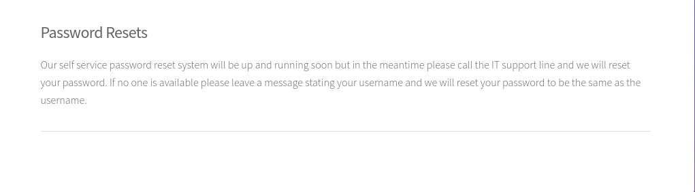
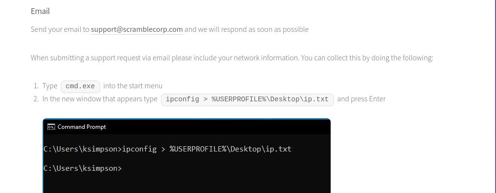
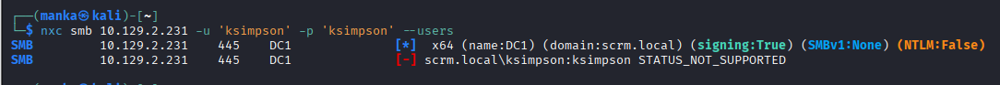
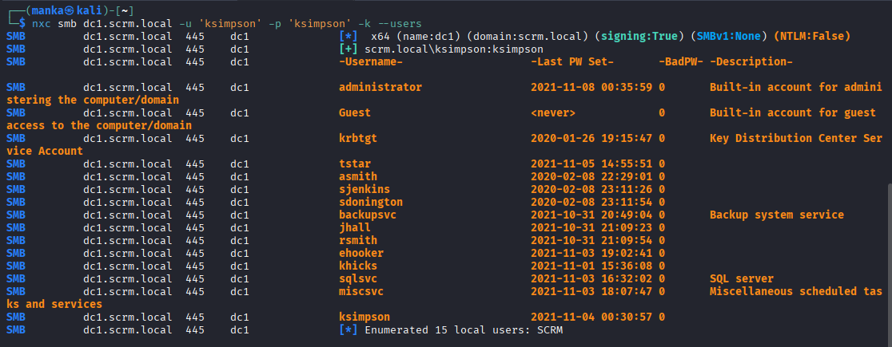

<div align="left">


</div>

# Hack The Box: Scrambled p1

<div align="left">

<br>
<br>


</div>

---

# 📌 Overview

Scrambled is a Windows Active Directory lab that demonstrates how **internal portals + service exposure + account enumeration** can guide an attacker toward authenticated access and deeper service misuse.

The attack chain is driven by:

* SMB enumeration and user discovery
* Intranet OSINT (policy/alerts that change attack paths)
* Custom service interaction on non-standard ports
* Credential validation adjustments when NTLM is restricted

---

## 🛠 Tools Used

```
nmap                → service discovery and DC identification
netexec (nxc)       → SMB enumeration and user listing
browser             → intranet enumeration / OSINT
telnet              → raw interaction with custom TCP service
/etc/hosts edit     → internal domain resolution
```

---

## <h1 style="color:pink;">Walkthrough steps</h1>

---
### Step 1 Full Recon Snapshot (Nmap)

**Goal:** Record full port/service exposure for reporting.

```bash
nmap -sC -sV -T4 10.129.2.231
```

**What to observe:**

* IIS/HTTP details
* AD services (Kerberos/LDAP/SMB)
* Certificate hints (SAN: `DC1.scrm.local`)



---
### Step 2 Add Domain to /etc/hosts

**Goal:** Ensure the domain resolves for toolchains and browser access.

```bash
echo "10.129.2.231 scrm.local" | sudo tee -a /etc/hosts
```



---
### Step 3  Custom Service Interaction (Port 4411)

**Goal:** Identify non-standard service exposed on the host.

```bash
telnet 10.129.2.231 4411
```

**What to observe:**

* Service banner/version string (e.g., `SCRAMBLECORP_ORDERS_V1.0.3`)


---
### Step 4 Intranet Landing Page Confirmation

**Goal:** Confirm base app context and available navigation.

**What to observe:**

* Site identity: Scramble Corp intranet
* Menu items (Home / Reports / IT Services)


---
### Step 5  Intranet Enumeration: Reports / Stats

**Goal:** Map application surface and endpoints.

**What to observe:**

* Pages/sections exposed via navigation
* Potential endpoints tied to backend services


---
### Step 6 Intranet OSINT: Password Reset Policy

**Goal:** Identify weak org practices that influence attack strategy.

**What to observe:**

* Password reset behavior (e.g., reset to username)
* Potential for predictable credentials


---
### Step 7  Intranet OSINT: Support Contact Instructions

**Goal:** Extract operational details from the intranet.

**What to observe:**

* Support email instructions
* Command hints that may indicate file paths / user context


---
Step 8  Intranet OSINT: Support Contact Instructions

Goal: Extract operational details from the intranet.

What to observe:

Support email instructions

Command hints that may indicate file paths / user context


---
### Step 9  Confirm Auth Limitation (STATUS_NOT_SUPPORTED)

**Goal:** Validate authentication behavior when NTLM is restricted/disabled.

```bash
nxc smb 10.129.2.231 -u 'ksimpson' -p 'ksimpson' --users
```

**What to observe:**

* `STATUS_NOT_SUPPORTED` (auth method mismatch / policy restriction)


---
### Step 10 Enumerate Users via SMB (nxc)

**Goal:** Enumerate users and identify service accounts.

```bash
nxc smb dc1.scrm.local -u 'ksimpson' -p 'ksimpson' -k --users
```

**What to observe:**

* User list output (including service accounts)
* Descriptions that hint at roles (e.g., SQL / backup services)


---
## 🧠 What This Lab Teaches

* Internal portals often leak high-value security context (policies, auth changes)
* NTLM restrictions force you to adapt tools and auth methods
* Service banners and non-standard ports are strong pivot points
* Enumeration + OSINT is usually the fastest path in internal AD labs

---

## 📌 Conclusion

Scrambled reinforces a core internal pentesting lesson:

> When exploitation is blocked, **environment signals** (policy, auth controls, exposed services) show the real path.

Solid enumeration, intranet OSINT, and service interaction are what move internal assessments forward.

---

This work is part of **FuzzRaiders**’ structured hands-on training and research program, where every lab, project, and technical study is formally documented, reviewed, and validated to ensure real-world applicability, methodological rigor and real-world security execution

Happy hacking 🚀

---

### Author
## [LinkedIn:](https://www.linkedin.com/in/manka-sec/)
---