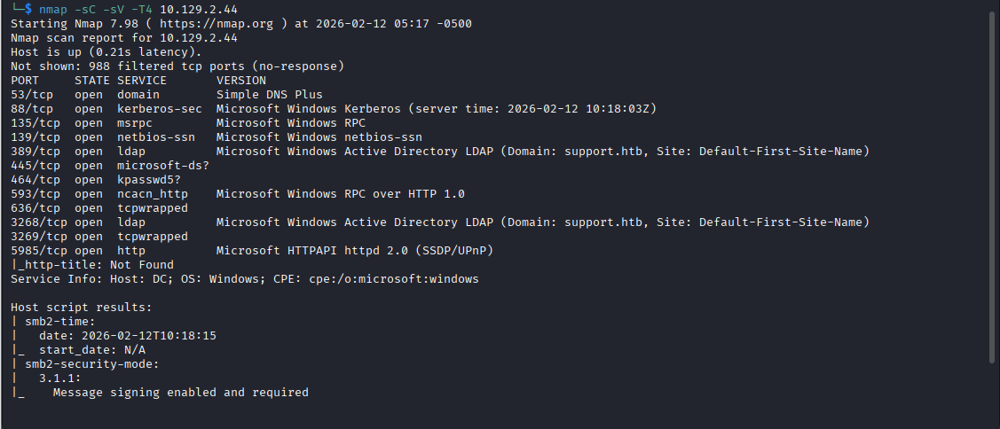
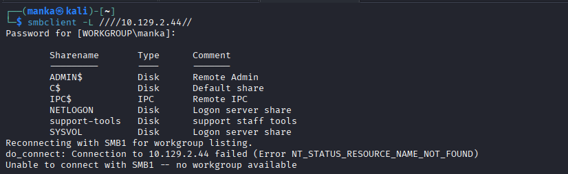
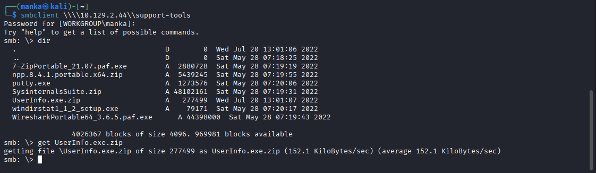
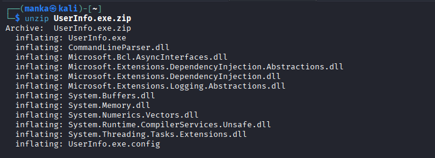
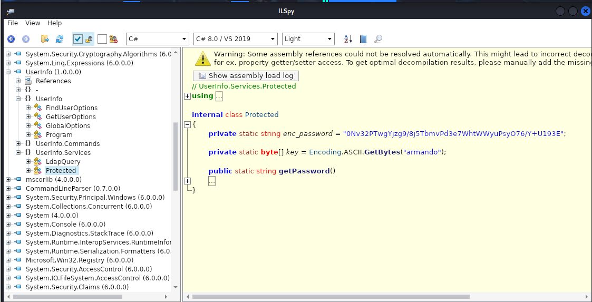
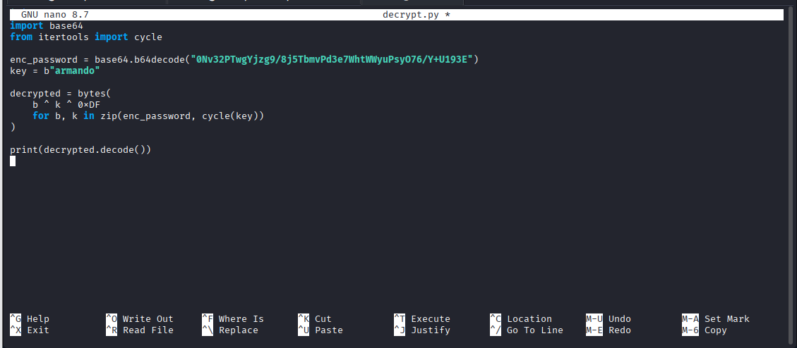
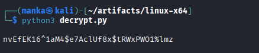

<div align="left">


</div>

# Hack The Box: Support P1

<div align="left">

<br>
<br>


</div>

---

# 📌 Overview

Support is a **Windows Active Directory lab** that demonstrates how exposed internal tools and hardcoded credentials inside compiled applications can lead to domain compromise.

The attack path is driven by:

* SMB share enumeration
* Internal tool extraction
* .NET binary reverse engineering
* Custom decryption logic recovery
* LDAP credential validation
* Authenticated domain access

This reflects realistic enterprise weaknesses where internal utilities leak sensitive authentication material.

---

## 🛠 Tools Used

```
nmap                → service discovery and domain controller identification
smbclient           → SMB share enumeration and file retrieval
file                → binary identification
ILSpy               → .NET decompilation
python3             → custom decryption script
netexec             → LDAP authentication validation
```

---

## <h1 style="color:pink;">Walkthrough steps</h1>

---

### Step 1  Recon (Nmap)

**Goal:** Identify exposed services and confirm Domain Controller role.

```bash
nmap -sC -sV -T4 10.129.2.44
```

**What to observe:**

* DNS, Kerberos, LDAP, SMB present
* Domain identified as `support.htb`
* Host recognized as Domain Controller



---

### Step 2  SMB Share Enumeration

**Goal:** Identify accessible shares.

```bash
smbclient -L //10.129.2.44/
```

**What to observe:**

* Presence of `support-tools` share
* Potential internal tooling exposure



---

### Step 3 Access support-tools Share

**Goal:** Download internal utilities.

```bash
smbclient //10.129.2.44/support-tools
get UserInfo.exe.zip
```

**What to observe:**

* Archived .NET executable retrieved



---

### Step 4  Analyze Extracted Binary

**Goal:** Identify binary type.

```bash
file UserInfo.exe
```

**What to observe:**

* PE32 .NET assembly
* Indicates easy decompilation path



---

### Step 5  Decompile with ILSpy

**Goal:** Identify hardcoded credentials.

**What to observe:**

* Encoded password string
* Static key (`armando`)
* Custom decryption logic



---

### Step 6  Recreate Decryption Logic

**Goal:** Recover plaintext password.

```python
import base64
from itertools import cycle

enc_password = base64.b64decode("<encoded_string>")
key = b"armando"

decrypted = bytes(
    b ^ k ^ 0xDF
    for b, k in zip(enc_password, cycle(key))
)

print(decrypted.decode())
```

**What to observe:**

* Recovered plaintext credential



---

### Step 7 Validate via LDAP

**Goal:** Confirm valid domain credentials.

```bash
netexec ldap 10.129.2.44 -u support -p '<DECRYPTED_PASSWORD>'
```

**What to observe:**

* Successful LDAP authentication



---

## 🧠 What This Lab Teaches

* Internal tools can leak sensitive credentials
* .NET binaries are easily reversible
* Base64 + XOR does not equal security
* Reverse engineering is critical for internal pentesting
* Misplaced trust in internal utilities leads to compromise

This is foundational knowledge for **Internal Pentesting and AD assessments**.

---

## 📌 Conclusion

Support reinforces a key real-world lesson:

> Internal tools are often trusted blindly — but attackers inspect everything.

Hardcoded credentials inside enterprise utilities can provide direct authenticated access without exploiting vulnerabilities.

Understanding reverse engineering workflows is essential for modern internal penetration testing.

---
This work is part of **FuzzRaiders**’ structured hands-on training and research program, where every lab, project, and technical study is formally documented, reviewed, and validated to ensure real-world applicability, methodological rigor and real-world security execution

Happy hacking 🚀

---

### Author: Anka0X
---
## [LinkedIn:](https://www.linkedin.com/in/manka-sec/)
---