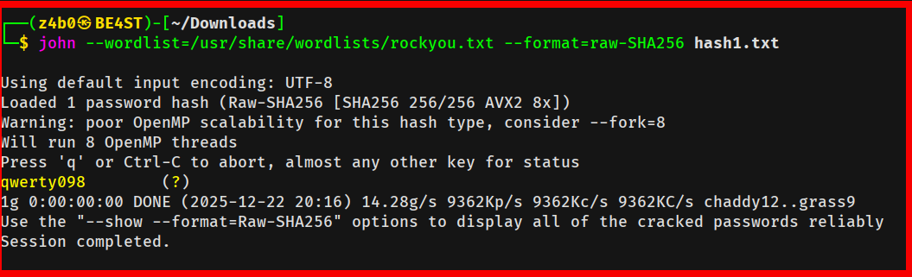

# picoCTF – Hashcrack

##


This challenge involves interacting with a remote service that requires us to crack multiple hashes in succession to prove our cryptographic cracking skills. By using **John the Ripper**, we can quickly identify and crack these passwords to retrieve the flag.

> _In this report, we will cover_

- Establishing a remote connection via Netcat

- Identifying hash types based on character length (MD5, SHA1, SHA256)

- Utilizing John the Ripper to crack passwords and retrieve the flag

---

## 🛠 Tools

A combination of remote connection tools and local password crackers was used to compromise the target

```
Netcat                   → For connecting to the remote challenge server.
John the Ripper          → The primary tool for cracking the MD5, SHA1, and SHA256 hashes.
Wordlists                → Standard lists used to match common passwords against the hashes.

```

---

## Walkthrough

### 1. Launch the Instance

The challenge starts by providing a connection string. We need to use Netcat to talk to the server.

`nc verbal-sleep.picoctf.net 56561`


---

### 2. Connect to the Service

Once we run the command in the terminal, the service greets us with our first challenge: a 32-character hash.


---

### 3. Identify and Save the Hash

The first hash provided is `482c811da5d5b4bc6d497ffa98491e38`. Based on its length, we can identify this as an **MD5** hash. We save it to a file for processing.

```bash
echo "482c811da5d5b4bc6d497ffa98491e38" > hash1.txt

```


---

### 4. Crack the MD5 Hash

Using John the Ripper with the specific format, we find the password almost instantly.

```bash
john --format=raw-md5 hash1.txt

```

**Password Found:** `password123`


---

### 5. Submit and Receive Next Challenge

We enter `password123` back into our active Netcat session. The server accepts it but immediately prompts us for a second password based on a new hash.


---

### 6. Crack the SHA1 Hash

The second hash is identified as **SHA1** (40 characters). We repeat the cracking process:

```bash
john --format=raw-sha1 hash2.txt

```

**Password Found:** `letmein`


---

### 7. Crack the SHA256 Hash

After submitting `letmein`, the server gives us one final hash. This one is 64 characters long, meaning it is **SHA256**.

```bash
john --format=raw-sha256 hash3.txt

```

**Password Found:** `qwerty098`



---

### 8. Capture the Flag

We go back to our terminal, enter the final password `qwerty098`, and the server rewards us with the flag.

**Flag:** `picoCTF{...}`


---

## 🧠 What This Challenge Teaches

- **Systematic Enumeration:** Moving through sequential challenges to prove consistency in cryptographic identification.
- **Hash Identification:** Learning to recognize MD5 (32 chars), SHA1 (40 chars), and SHA256 (64 chars) as a vital skill.
- **Weak Passwords:** Even strong algorithms like SHA256 cannot protect data if the password itself is a common string like "qwerty098".
- **Workflow:** Efficiently moving between a remote connection and local cracking tools is key for these types of "speed" challenges.

This is an excellent challenge for those looking to master **Cryptographic Attack fundamentals.**

---

## 📌 Conclusion

The Hashcrack challenge demonstrates that security is only as strong as the passwords being hashed. By combining fast identification with efficient use of cracking tools, we were able to move from a basic MD5 hash to a SHA256 compromise.

Always remember:

> _*A complex hash algorithm does not fix a weak password. Always enforce strong password policies on the user side.*_

Happy hacking 🚀

## Author: Z4B0

## [LinkedIn:](https://www.linkedin.com/in/mahamud-abdirahman-151493375/)
