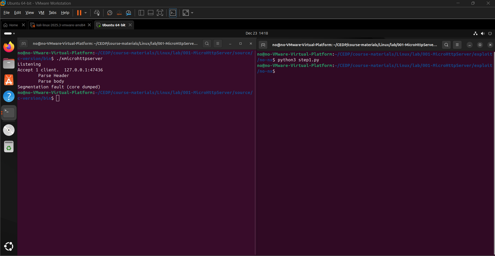
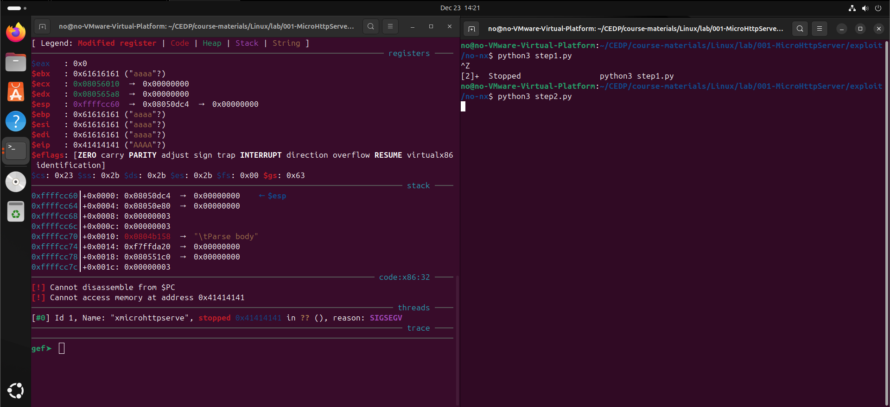

# 📛 CVE-2023-50965 — MicroHttpServer

### Stack-Based Buffer Overflow Leading to Remote Code Execution

---

## 📌 CVE Summary

**CVE ID:** CVE-2023-50965
**Affected Product:** MicroHttpServer
**Vulnerability Type:** Stack-Based Buffer Overflow
**Attack Vector:** Network (Remote)
**Impact:** Remote Code Execution (RCE)
**Severity:** High
**CWE:** CWE-121 – Stack-Based Buffer Overflow

A stack-based buffer overflow vulnerability exists in **MicroHttpServer** due to improper bounds checking when parsing HTTP request data. A remote attacker can exploit this flaw by sending a crafted HTTP request, resulting in memory corruption and arbitrary code execution.

---

## 🧠 Vulnerability Details

MicroHttpServer processes incoming HTTP requests and copies user-supplied data into a fixed-size stack buffer **without validating length boundaries**.
By supplying an overly long request path, an attacker can overwrite critical stack data, including the saved instruction pointer (EIP).

This allows full control over program execution flow.

---

## 🔍 Technical Root Cause

- Unsafe handling of HTTP request parsing
- Missing input length validation
- Stack buffer overflow during request processing
- No effective exploit mitigations (e.g., stack canaries, ASLR hardening)

---

## 🧪 Proof of Concept (PoC)

A malformed HTTP GET request containing excessive data triggers a segmentation fault and allows EIP overwrite:

```
GET /AAAA....AAAA HTTP/1.1
Host: target
```

Observed behavior:

```
Parse Header
Parse body
Segmentation fault (core dumped)
```

Debugger analysis confirms **user-controlled EIP overwrite**.

---

## 🖼️ Evidence / Screenshots


### Crash confirmation (Segmentation fault)

**What this shows:** The service crashes after receiving a crafted request, confirming memory corruption.



---

###  EIP control (0x41414141)

**What this shows:** Instruction pointer is overwritten with attacker-controlled bytes.



---

###  Offset discovery (pattern search → 148)

**What this shows:** Exact offset to EIP is identified using cyclic patterns.


---

###  Shellcode generation (msfvenom)

**What this shows:** Reverse shell payload generated with bad chars avoided.


---

### Exploit script (payload layout)

**What this shows:** Final exploit script with junk + EIP + NOPs + shellcode.


---

###  Successful RCE (reverse shell proof)

**What this shows:** Netcat listener receives a connection and commands execute.


---

## ⚙️ Exploitation Impact

Successful exploitation allows an attacker to:

- Overwrite the instruction pointer (EIP)
- Redirect execution to attacker-controlled shellcode
- Achieve **remote command execution**
- Spawn a reverse shell with the privileges of the running service

This attack requires **no authentication** and can be performed remotely.

---

## 🎯 Exploitability Conditions

- Vulnerable MicroHttpServer version
- Network access to the service
- No additional protections preventing stack execution

---

## 🔐 Security Impact Assessment

| Impact Area     | Result |
| --------------- | ------ |
| Confidentiality | High   |
| Integrity       | High   |
| Availability    | High   |

---

## 🛡️ Mitigation & Recommendations

- Implement strict bounds checking on all user input
- Replace unsafe string operations with safer alternatives
- Enable modern exploit mitigations:

  - Stack canaries
  - ASLR
  - DEP / NX

- Avoid parsing network input directly into stack buffers
- Apply patches or upgrade to a secure version

---

## 📚 References

- CVE-2023-50965
- CWE-121: Stack-Based Buffer Overflow
- OWASP Secure Coding Practices

---

## 📌 Disclosure Notes

This vulnerability was reproduced in a controlled lab environment for educational and security research purposes.
No active exploitation was performed against production systems.

---

## 🧩 Researcher

**Discovered & Exploited by:**
FuzzRaiders / Exploit Development Research
(Controlled lab exploitation)

---

### ✅ Status

✔ Confirmed
✔ Exploitable
✔ Remote Code Execution Achieved

## Author: SUB-ZERO

## [LinkedIn:](https://www.linkedin.com/in/salman-hussein-3615852a4/)