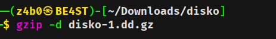
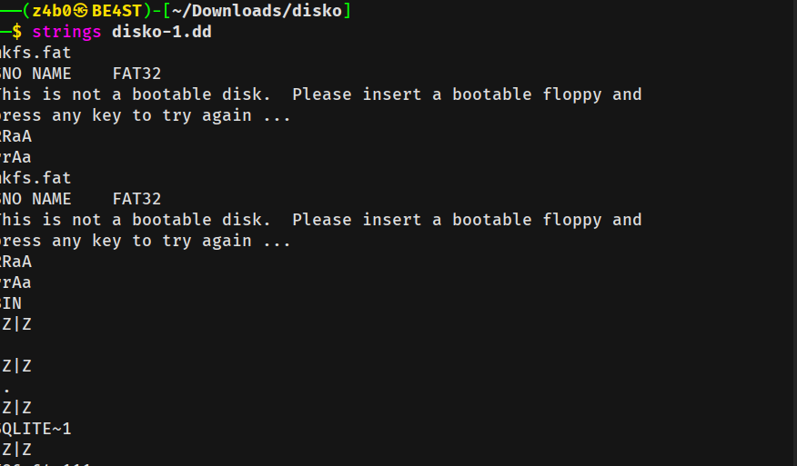
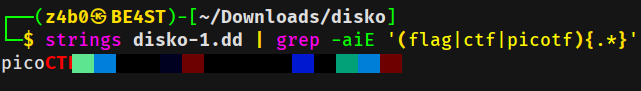

<div align="left">


</div>

# Disko 1 - Digital Forensics

<div align="left">

<br>
<br>


</div>

Here begins my journey into **Digital Forensics**. I decided to start with **picoCTF**, as it allows learning and hands-on practice at the same time. Below is a short walkthrough of one of the beginner-friendly forensic challenges.

---

## 🛠 Tools Used

```
strings   → extract human-readable strings
grep      → filter relevant output
gzip       → extract compressed files
```

---

## 📌 Challenge Overview

The challenge provided a downloadable file. No source code, no binary execution — just pure analysis.

---

## Initial Analysis

After downloading the file, I noticed it was in a **compressed format**. The first step was to extract its contents:

```bash
gzip -d challenge_file
```



Once extracted, I attempted a quick check using `cat`, but the output was unreadable and clearly not useful for direct inspection.

Lesson learned 😅 — not all files are meant to be viewed this way.

---

## Hint Review

Before diving deeper, I reviewed the provided hint:

> _"Maybe strings could help? If only there was a way to do that?"_

That immediately pointed toward searching for **human-readable strings** inside the file.

---

## Strings Analysis

Using the `strings` utility revealed a large amount of readable data:

```bash
strings extracted_file
```



However, the output was noisy. To narrow things down, I combined it with `grep` to filter relevant patterns:

```bash
strings extracted_file | grep picoCTF
```

To ensure nothing was missed, a deeper grep search was used, which quickly led to the flag.



---

## Flag Discovery

The flag was successfully recovered from the filtered strings output.

🎉 **Challenge solved!**

---

## 🧠 What This Challenge Teaches

- Always check the file type before analysis
- `strings` is a powerful first tool in forensic investigations
- Combining tools (`strings` + `grep`) is often more effective than using one alone
- Beginner forensic challenges emphasize observation over exploitation

---

## 📌 Conclusion

This was a simple but rewarding introduction to **Digital Forensics**. It reinforced the importance of using the right tools and paying attention to hints. A great starting point for building forensic intuition.

> More forensic challenges coming soon

This work is part of **FuzzRaiders’ structured hands-on training and research program**, where every lab, project, and technical study is formally documented, reviewed, and validated to ensure real-world applicability, methodological rigor, and real-world security execution

Happy hacking 🚀

# Author: Z4B0 [LinkedIn](https://www.linkedin.com/in/mahamud-abdirahman-151493375/)
