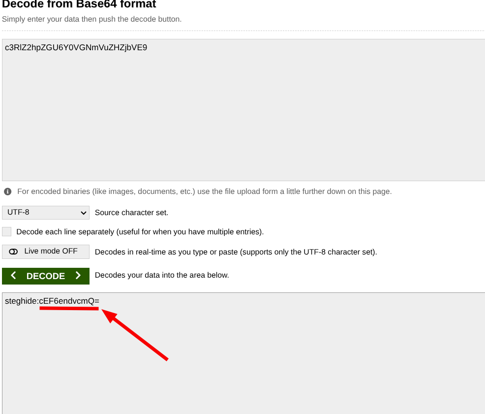
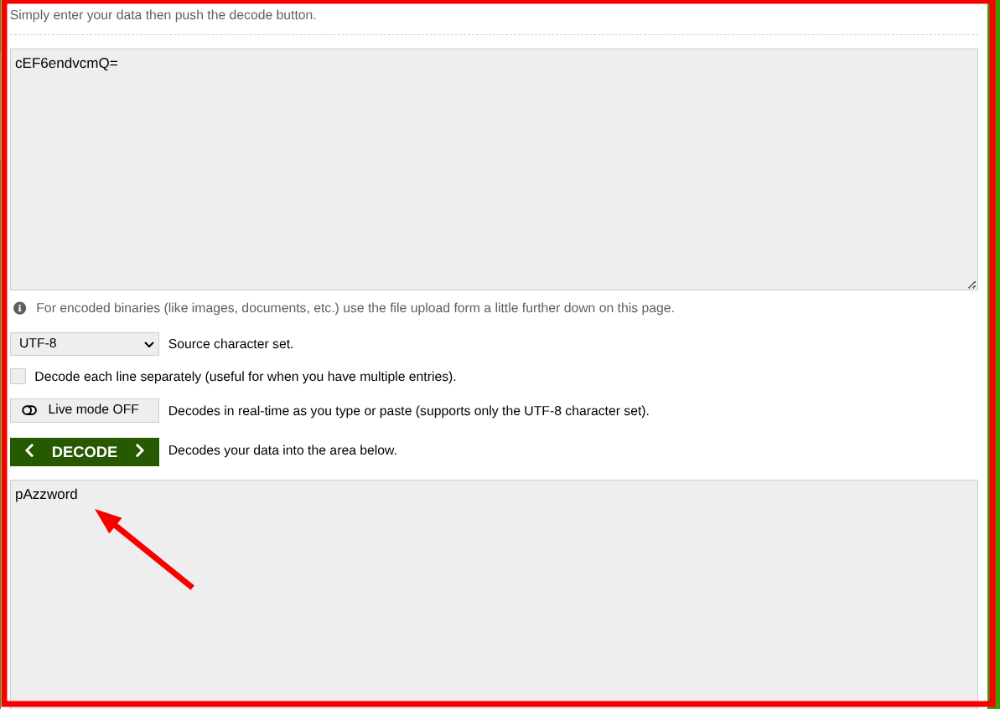

# picoCTF – Hidden in Plain Sight

##


This challenge demonstrates how sensitive information can be hidden inside **image metadata** and later protected using **steganography**. By carefully inspecting metadata, decoding encoded strings, and applying the correct extraction technique, we are able to recover the hidden flag.

> _In this report, we will cover_

- Downloading and inspecting image files
- Extracting metadata using ExifTool
- Identifying encoded comments
- Decoding Base64 strings
- Extracting hidden data using Steghide

---

## 🛠 Tools

The following tools and techniques were used to solve this challenge:

```
Web Browser        → To download the challenge file
ExifTool           → To inspect image metadata
Base64 Decoder     → To decode encoded strings
Steghide           → To extract hidden files from images
Linux Terminal     → To execute commands and read files
```

---

## Walkthrough

### 1. Download the Image

The challenge begins by clicking the provided link to download the image file.

📎 **File obtained:** `img.jpg`


---

### 2. Verify the Downloaded File

After downloading, we confirm that the image exists locally.

The file `img.jpg` is present.


---

### 3. Extract Metadata Using ExifTool

We inspect the image metadata to look for hidden information.

```bash
exiftool img.jpg
```

While reviewing the output, we discover a suspicious **Comment** field containing encoded data.


---

### 4. Decode the Metadata Comment

The encoded comment is copied and decoded using an online Base64 decoder.

📌 **Decoded output:**

```
steghide:cEF6endvcmQ=
```

This reveals two important clues:

- The tool to use: **steghide**
- Another encoded string to decode



---

### 5. Decode the Encoded String

We decode the Base64 string `cEF6endvcmQ=`.

📌 **Result:**

```
pAzzword
```

This value is used as a password.



---

### 6. Extract Hidden Data Using Steghide

Using the discovered password, we extract hidden data from the image.

```bash
steghide extract -sf img.jpg -p pAzzword
```

A file named `flag.txt` is successfully extracted.


---

### 7. Read the Flag

Finally, we read the extracted file to retrieve the flag.

```bash
cat flag.txt
```

🏁 **Flag successfully recovered!**


---

## 🧠 What This Challenge Teaches

- **Metadata Analysis:** Image metadata can leak or hide sensitive information
- **Encoding Awareness:** Base64 is commonly used to obscure clues
- **Steganography Basics:** Steghide is a powerful tool for hiding and extracting data
- **Forensics Mindset:** Always inspect files beyond surface appearance

---

## 📌 Conclusion

Hidden in Plain Sight is an excellent beginner-level forensics challenge that reinforces the importance of metadata inspection and steganography awareness.

> _Not all secrets are visible — some are hidden in plain sight._

Happy hacking 🚀

---

## Author: Z4B0

## [LinkedIn](https://www.linkedin.com/in/mahamud-abdirahman-151493375/)
