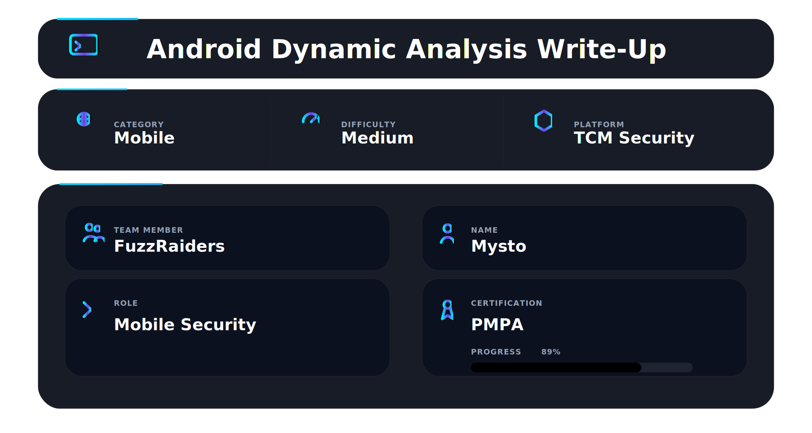

---

This module provides a comprehensive introduction to **Android Dynamic Analysis**, focusing on how mobile applications can be analyzed **while running in real time** to uncover protections, insecure behavior, hidden functionality, and vulnerable runtime logic.

Unlike static analysis, dynamic testing observes the application **during execution**, enabling security professionals to intercept traffic, bypass restrictions, manipulate logic, and validate vulnerabilities live.

Core areas covered:

* Runtime behavior analysis
* SSL Pinning identification & bypass
* Live traffic interception
* Automated and manual APK patching
* Runtime instrumentation using Frida
* Practical troubleshooting and debugging

---

## 📌 Overview

Many mobile vulnerabilities cannot be confirmed through static analysis alone.

Dynamic analysis allows testers to observe:

* live API requests
* authentication flows
* certificate pinning protections
* hidden screens and debug functions
* insecure runtime storage
* business logic flaws

This module emphasizes a **runtime methodology**:
---

## 🛠 Tools

Advanced runtime analysis using real-world tooling.

```bash
MobSF          → dynamic analysis environment
Burp Suite     → intercepting HTTP/HTTPS traffic
Frida          → runtime instrumentation framework
Objection      → mobile runtime exploration toolkit
ADB            → Android device bridge
apktool        → unpacking/rebuilding APKs
jarsigner      → APK signing
zipalign       → APK optimization
```

---

**Install → Observe → Intercept → Modify → Validate**

---

## 📱 Dynamic Analysis Environment Setup

Applications are tested on:

* Android Emulator
* Rooted Android Device
* Genymotion / Virtual Device
* Proxy-connected lab environment

ADB is commonly used for device communication:

```bash
adb devices
adb install target.apk
adb logcat
```

A proper environment enables safer and repeatable mobile testing.

---

## 🔐 Intro to SSL Pinning & Dynamic Analysis

Many Android applications implement **SSL Pinning** to prevent traffic interception.

SSL Pinning compares the server certificate or public key with a trusted embedded value inside the application.

When a proxy certificate is detected, the app blocks traffic.

Common symptoms:

* connection errors
* login failure
* blank screens
* TLS handshake rejection

This protection is common in banking, fintech, and enterprise apps.

---

## 🌐 Dynamic Analysis Using MobSF

MobSF provides automated runtime testing features in addition to static analysis.

```bash
docker run -it -p 8000:8000 mobsf/mobsf
```

Capabilities include:

* launching Android apps in emulator environments
* API monitoring
* traffic inspection
* file system review
* runtime security checks
* dynamic vulnerability validation

**Figure 1 — MobSF dynamic analysis dashboard**


MobSF accelerates early-stage testing before manual deep dives.

---

## 🪝 Runtime Instrumentation with Frida

Frida allows testers to hook functions while the application is running.

Examples:

```bash
frida-ps -U
frida -U -f com.target.app
```

Use cases:

* bypass root detection
* disable SSL pinning
* inspect method calls
* modify return values
* trace sensitive functions

This gives deep control without modifying source code.

---

## ⚡ Patching Applications Automatically Using Objection

Objection can automatically patch applications to disable protections.

```bash
objection patchapk -s target.apk
```

Common patch targets:

* SSL pinning
* root detection
* emulator detection

Benefits:

* fast deployment
* beginner-friendly workflow
* reduced manual reversing effort

---

## 🛠 Manual Application Patching

When automatic tools fail, applications can be patched manually.

Typical workflow:

```bash
apktool d target.apk
# modify smali logic
apktool b target.apk
jarsigner target.apk
```

Manual patching enables:

* removing security checks
* altering logic branches
* disabling pinning code
* unlocking hidden features

**Figure 2 — Smali patching and APK rebuild process**


This skill is valuable for advanced mobile assessments.

---

## 📡 Intercepting Traffic After Pinning Bypass

Once protections are bypassed, traffic can be reviewed in Burp Suite.

Focus areas:

* authentication tokens
* insecure APIs
* IDOR behavior
* sensitive data leakage
* weak session handling
* verbose server errors

Dynamic traffic analysis often reveals backend flaws hidden from static review.

---

## 🧩 The Frida Codeshare

Frida CodeShare contains reusable scripts for common bypasses.

Examples:

* SSL pinning bypass scripts
* root detection bypass
* biometric bypass
* anti-debug bypass

This dramatically speeds up assessments when dealing with protected apps.

---

## ⚠️ Common Issue — Can't Decode Resources

Some APKs fail during decompilation due to:

* protected resources
* corrupted resource tables
* non-standard packaging
* obfuscation layers

Common fixes:

```bash
apktool d target.apk --no-res
apktool d target.apk --force
```

Even when resources fail, code analysis may still succeed.

---

## 🔥 Full Dynamic Analysis Chain

1. Install target APK
2. Launch in test device
3. Route traffic through proxy
4. Detect SSL pinning
5. Bypass using Frida / Objection
6. Inspect runtime behavior
7. Validate vulnerabilities
8. Patch manually if required

➡️ Result: Full runtime visibility and deeper exploit potential

---

## 🧠 What This Module Teaches

* Live Android application testing
* SSL pinning detection & bypass
* Runtime instrumentation methodology
* APK patching workflows
* Intercepting protected mobile traffic
* Combining automation with manual testing

This builds a strong foundation for:

* Android pentesting
* mobile bug bounty hunting
* app hardening reviews
* advanced runtime exploitation

---

## 🏆 Module Completion

After completing all labs and exercises, the **Android Dynamic Analysis module** was successfully completed.

This directly contributes to:

* Mobile Security expertise
* Android runtime testing capability
* Real-world bypass techniques
* Advanced vulnerability research

---

## 📌 Conclusion

Many critical mobile vulnerabilities only appear **while the application is running**.

Dynamic analysis enables security professionals to:

* observe real behavior
* defeat client-side protections
* inspect hidden communications
* validate exploitable weaknesses

This module reinforces a key principle:

> **If you can control the runtime, you can control the app.**

---

This work is part of **FuzzRaiders**’ structured hands-on training and research program, where every lab, project, and technical study is formally documented, reviewed, and validated to ensure real-world applicability, methodological rigor and real-world security execution

Happy hacking 🚀

---


