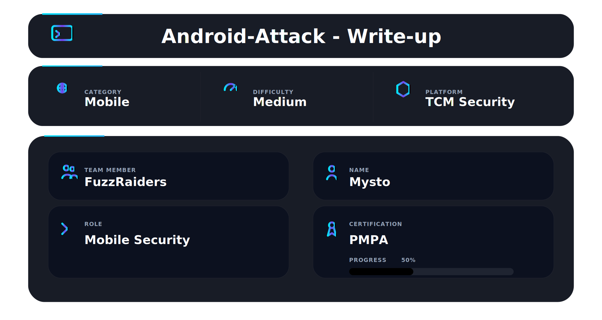
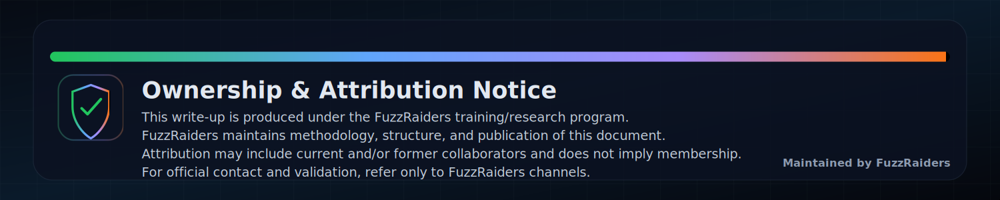

## 📌 Overview

Android applications often expose critical information through their internal structure. Static analysis allows security professionals to **map the entire attack surface before execution**, reducing risk and increasing efficiency.

By analyzing APK contents, it is possible to uncover:

* hidden application logic
* insecure configurations
* exposed endpoints
* sensitive credentials

This module emphasizes a **methodology-driven approach**, where analysis moves from **structure → logic → data → infrastructure**.

---

## 🛠 Tools

Advanced static analysis using real-world tooling.

```bash
apktool        → decompiling APK resources & manifest
jadx-gui       → reconstructing Java/Kotlin source code
MobSF          → automated static + security analysis
strings        → extracting embedded data
grep           → pattern matching for secrets
awscli         → enumerating S3 buckets
curl           → interacting with exposed endpoints
```

---

## APK Acquisition & Reverse Engineering

The first phase involves acquiring and unpacking the APK.

```bash
apktool d target.apk -o app_decoded
```

**Figure 1 — Decompiled APK structure showing resources and manifest**


This reveals:

* `AndroidManifest.xml`
* `res/` resources
* `smali/` bytecode representation
* compiled assets and configurations

---

## AndroidManifest.xml — Attack Surface Mapping

The manifest defines the application’s exposed components and permissions.

Key areas analyzed:

* `android:exported="true"` → exposed components
* dangerous permissions (`READ_EXTERNAL_STORAGE`, `INTERNET`)
* activities, services, broadcast receivers
* intent filters

**Figure 2 — AndroidManifest.xml analysis of exported components**


Misconfigured manifests can lead to:

* unauthorized component access
* privilege escalation paths
* inter-application attacks

---

## Source Code Reconstruction & Manual Analysis

Using `jadx`, the application is reconstructed into readable Java/Kotlin code.

```bash
jadx-gui target.apk
```

Focus areas:

* authentication flows
* API calls
* hidden features
* debug logic

**Figure 3 — Decompiled Java/Kotlin code inside JADX**


Manual analysis provides context that automated tools cannot detect.

---

## Hardcoded Secrets & Sensitive Data Discovery

One of the most critical vulnerabilities in mobile apps is **hardcoded secrets**.

Detection techniques:

```bash
strings target.apk | grep -Ei "key|token|secret|password"
```

Common findings:

* API keys
* JWT tokens
* database URLs
* private endpoints

**Figure 4 — Extracted API keys and endpoints from APK**


Impact:

Direct backend compromise without authentication

---

## Practical Analysis — Injured Android (Flags 1–4)

The **Injured Android** lab demonstrates real-world vulnerable patterns.

Through static analysis:

* flags were identified inside application logic
* insecure implementations were mapped
* hidden vulnerabilities were uncovered

This reinforces how real applications leak sensitive data through poor coding practices.

---

## Cloud Infrastructure Enumeration

Static analysis often reveals backend infrastructure.

---

### AWS S3 Bucket Enumeration

Discovered bucket references can be tested:

```bash
aws s3 ls s3://target-bucket
```

**Figure 5 — Public AWS S3 bucket exposure**


Risks:

* data leakage
* file exposure
* sensitive asset disclosure

---

### Firebase Database Enumeration

Firebase endpoints are often embedded:

```bash
curl https://target.firebaseio.com/.json
```

**Figure 6 — Firebase database exposed data**


Risks:

* full database access
* user data exposure
* write permissions exploitation

---

## Automated Analysis with MobSF

MobSF automates large parts of static analysis.

```bash
docker run -it -p 8000:8000 mobsf/mobsf
```

**Figure 7 — MobSF analysis dashboard**


Capabilities:

* vulnerability classification
* permission analysis
* API discovery
* security scoring

---

## 📌 Conclusion

Android applications often expose critical weaknesses before execution.

Static analysis enables security professionals to:

* understand application logic
* identify vulnerabilities early
* uncover backend infrastructure

This module reinforces a key principle:

> **If you can read the app, you can break the app.**

---

This work is part of **FuzzRaiders**’ structured hands-on training and research program, where every lab, project, and technical study is formally documented, reviewed, and validated to ensure real-world applicability, methodological rigor and real-world security execution

Happy hacking 🚀

---

