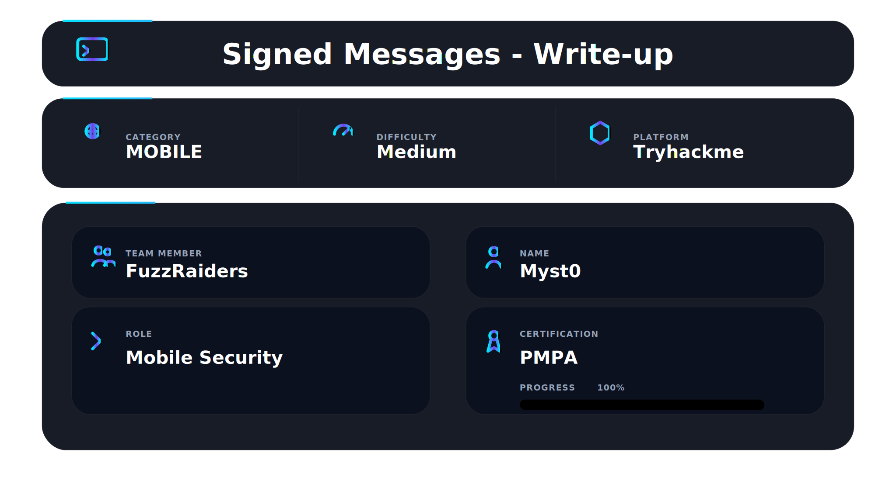

## 📌 Overview

This room focused on exploiting insecure cryptographic implementation inside a web-based secure messaging platform called **LoveNote**.

The application used RSA-2048 digital signatures to validate user identity and message authenticity. However, exposed debug information revealed that the entire key generation process was deterministic and based on predictable seed material.

Core areas covered:

* Web enumeration
* Cryptographic implementation analysis
* RSA key generation weaknesses
* Signature forgery
* Information disclosure exploitation
* Authentication trust abuse

Unlike traditional web exploitation, this challenge focused heavily on how insecure cryptographic logic can completely destroy platform trust even when strong algorithms like RSA-2048 are used.


━━━━━━━━━━━━━━━━━━

# 🛠️ Tools Used

| Tool                        | Purpose                                                                  |
| -------------------------   | ------------------------------------------------------------------------ |
| **ffuf**                    | directory and endpoint fuzzing                                           |
| **Burp Suite**              | request interception and analysis                                        |
| **Python**                  | cryptographic testing and key reproduction                               |
| **RSA Utilities**           | key generation and signature validation                                  |
| **Firefox Developer Tools** | inspecting application behavior                                          |
| **Linux Terminal**          | exploitation workflow and automation                                     |


## 1.🌐 Initial Enumeration

Initial reconnaissance started with directory fuzzing using `ffuf`.

```bash
ffuf -w /usr/share/dirb/wordlists/common.txt \
-u http://TARGET:5000/FUZZ \
-e .txt,.php
```


* ffuf directory discovery results
* discovered endpoints output

Interesting endpoints discovered:

* `/login`
* `/register`
* `/messages`
* `/compose`
* `/dashboard`
* `/verify`
* `/debug`

The `/debug` endpoint immediately stood out because it exposed internal implementation details that should never be publicly accessible.

━━━━━━━━━━━━━━━━━━

## 2.🔍 Debug Endpoint Analysis

The debug page leaked internal cryptographic processing logs.

Critical findings included:

```text
Development mode: ENABLED

Using deterministic key generation
Seed pattern:
{username}_lovenote_2026_valentine
```


* debug endpoint
* leaked deterministic seed information

Additional debug output revealed:

* SHA256 seed hashing
* Deterministic prime derivation
* RSA modulus generation from predictable seed material

This completely broke the security assumptions of RSA key generation.

Instead of cryptographically secure random primes, the application generated keys from predictable user-controlled input.

━━━━━━━━━━━━━━━━━━

## 3.👤 User Registration & Key Observation

A normal account was registered:

* Username: `test`
* Email: `test@gmail.com`

After registration, the application automatically generated:

* RSA Public Key
* RSA Private Key


* account registration
* generated RSA keys

Observation:

The platform generated keys deterministically rather than randomly.

This indicated that any user’s private key could potentially be regenerated if the seed formula was known.

━━━━━━━━━━━━━━━━━━

## 4. 🧪 Signature Verification Testing

The `/verify` endpoint allowed submitted messages and signatures to be cryptographically validated.

A test signed message was created and verified successfully.


* signature verification page
* successful validation output

This confirmed:

* The platform fully trusted RSA signatures
* Forging the administrator’s private key would allow valid administrator impersonation

━━━━━━━━━━━━━━━━━━

## 5. 👑 Administrator Enumeration

The public message board exposed the administrator account:

```text
System Administrator
@admin
```

The dashboard also revealed:

```text
Username: admin
Email: admin@lovenote.com
```


* admin profile exposure
* dashboard information disclosure

Using the leaked seed format:

```text
admin_lovenote_2026_valentine
```

the administrator’s RSA key generation process became reproducible.

━━━━━━━━━━━━━━━━━━

## 6. 🔐 Cryptographic Weakness

The core vulnerability was:

### Predictable Deterministic RSA Key Generation

Effectively:

```text
Known username
+ Known seed pattern
+ Deterministic key generation
= Recoverable private key
```

* vulnerable key generation logic
* predictable seed usage

This completely defeats the purpose of digital signatures because the private key is no longer secret.

Even though RSA-2048 itself is secure, the implementation destroyed all cryptographic trust guarantees.

━━━━━━━━━━━━━━━━━━

## 7.🔥 Exploitation Process

Using the predictable seed:

```text
admin_lovenote_2026_valentine
```

the administrator’s RSA private key was reconstructed.

This enabled:

* Forging administrator signatures
* Creating trusted signed messages
* Passing cryptographic verification checks

 

* generated admin private key
* forged signed message
* successful admin verification

After generating a forged signature, the application accepted the message as authentic.

━━━━━━━━━━━━━━━━━━

## 8.✅ Flag Obtained

```text
THM{PR3D1CT4BL3_S33D5_BR34K_H34RT5}
```


* final flag screenshot


## 📌 Conclusion

This room demonstrates how a single implementation mistake can completely compromise strong cryptographic systems.

Even modern algorithms like RSA-2048 become useless when:

* key generation is predictable,
* seeds are exposed,
* or cryptographic design is flawed.

The challenge reinforces an important lesson:

> Cryptography is only as secure as its implementation.

---

This work is part of **FuzzRaiders**’ structured hands-on training and research program, where every lab, project, and technical study is formally documented, reviewed, and validated to ensure real-world applicability, methodological rigor and real-world security execution

Happy hacking 🚀


