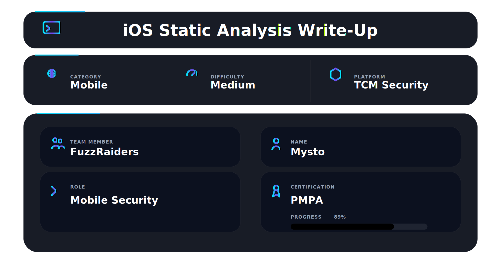

---

## 📌 Overview

Many mobile vulnerabilities can be identified **before execution**.

Static analysis enables testers to uncover:

* hardcoded credentials and secrets
* insecure configurations and permissions
* hidden application logic
* exposed API endpoints
* weak cryptographic implementations
* sensitive data stored within the application

This module emphasizes a structured methodology:

**Extract → Inspect → Analyze → Discover → Validate**

---

## 🛠 Tools

```bash
class-dump     → Objective-C header extraction  
otool          → Mach-O binary inspection  
strings        → Extract embedded data and secrets  
grep           → Pattern-based searching  
MobSF          → Automated mobile security analysis  
Hopper/Ghidra  → Binary reverse engineering  
plutil         → Property list analysis  
codesign       → Signature verification  
```

---

## 📱 iOS Application Structure Analysis


iOS applications are distributed as `.ipa` files, which contain:

* compiled application binary (Mach-O)
* `Info.plist` configuration file
* embedded frameworks and libraries
* application assets and resources

```bash
unzip target.ipa -d app_dump
```

Key focus areas:

* misconfigured `Info.plist`
* insecure URL schemes
* exposed permissions and entitlements
* debugging flags

➡️ This phase defines the **initial attack surface**.

---

## 🔍 Binary Reverse Engineering (Manual Analysis)


The Mach-O binary contains the core application logic.

```bash
otool -ov target_binary
strings target_binary | grep -i "token"
```

Analysis reveals:

* authentication mechanisms
* API communication patterns
* internal business logic
* hidden features

➡️ Understanding logic is more important than just extracting data.

---

## 🧠 Manual Static Analysis


Manual analysis focuses on **deep reasoning**:

### . Bundle Inspection

Review configuration and exposed components.

### . Binary & Symbol Analysis

Understand methods and internal logic.

### . Secret Discovery & Data Flow

Identify:

* API keys
* tokens
* endpoints
* credentials

➡️ Key question: *Why is this data exposed and how can it be abused?*

---

## ⚙️ Automated Analysis with MobSF


```bash
docker run -it -p 8000:8000 mobsf/mobsf
```

Capabilities include:

* vulnerability detection
* configuration analysis
* API extraction
* permission review
* secret scanning

➡️ Automation validates findings, not replaces analysis.

---

## 🔥 Full Static Analysis Chain

1. Extract IPA file
2. Inspect application bundle
3. Analyze `Info.plist`
4. Reverse engineer binary
5. Extract secrets
6. Map logic
7. Validate with tools

➡️ Result: Full visibility into the application

---

## 🧠 What This Module Teaches

* iOS reverse engineering fundamentals
* static binary analysis techniques
* sensitive data extraction
* structured analysis workflow
* mobile attack surface mapping

---

## 🏆 Module Completion

After completing all labs and exercises, the **iOS Static Analysis module** was successfully completed.

This contributes to:

* Mobile Security expertise
* iOS reversing capability
* vulnerability discovery skills
* real-world analysis proficiency

---

## 📌 Conclusion

Static analysis exposes vulnerabilities **before execution**.

It enables testers to:

* understand application logic
* uncover hidden secrets
* identify insecure configurations
* map backend interactions

---

This work is part of **FuzzRaiders**’ structured hands-on training and research program, where every lab, project, and technical study is formally documented, reviewed, and validated to ensure real-world applicability, methodological rigor and real-world security execution

Happy hacking 🚀


