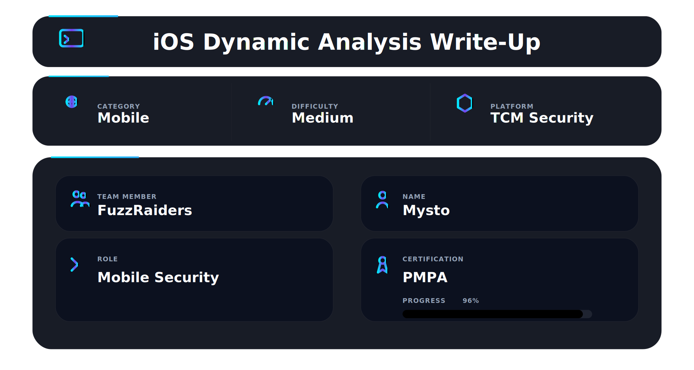

## 📌 Overview

Many vulnerabilities only become visible **when the application is running**.

While static analysis shows structure, dynamic analysis reveals:

* how the application communicates with backend servers
* how authentication is enforced in practice
* how protections like SSL pinning behave
* how data flows during real user interaction

This is critical because:

➡️ Developers often implement protections incorrectly
➡️ Backend systems may trust insecure client behavior
➡️ Hidden features may only be triggered at runtime

**Methodology:**

**Setup → Intercept → Bypass → Analyze → Validate**

---

## 🛠 Tools

```bash
Proxyman              → Intercepts and decrypts iOS traffic  
Burp Suite            → Advanced manipulation and testing of requests  
Objection             → Runtime exploration without modifying app  
Frida                 → Low-level dynamic instrumentation  
SSL KillSwitch        → Disables SSL pinning at system level  
Burp Mobile Assistant → Simplifies proxy/certificate setup  
```

Each tool serves a **specific role** — professional testing comes from combining them, not relying on one.

---

## 📱 Dynamic Analysis Environment Setup

Dynamic analysis requires **full control over the device and network**.

### Why Jailbroken Device?

iOS normally restricts:

* filesystem access
* process injection
* runtime modification

Jailbreaking removes these restrictions, allowing:

* installation of tweaks (SSL KillSwitch)
* runtime hooking (Frida/Objection)
* deeper inspection of application behavior

---

## 🌐 Traffic Interception with Proxyman


Proxyman acts as a **man-in-the-middle proxy** between the app and the server.

### What actually happens?

1. App sends request
2. Request goes through proxy
3. Proxy decrypts HTTPS using installed certificate
4. You see full request/response

### Why this matters:

Without interception, you **cannot see or test backend communication**.

This step reveals:

* API structure
* authentication tokens
* sensitive data in transit

---

## 🔐 SSL Pinning in iOS


SSL Pinning is a **client-side defense mechanism**.

### How it works:

Instead of trusting system certificates, the app:

* stores a trusted certificate/public key
* compares it with server response
* rejects anything different (like proxy certs)

### Why it exists:

To prevent attackers from intercepting traffic.

### Weakness:

➡️ It is enforced on the client — meaning it can be bypassed.

---

## 🪝 Runtime Instrumentation with Objection


```bash
objection -g com.target.app explore
```

Objection uses **Frida under the hood** to inject into the running app.

### What this allows:

* intercept function calls
* modify return values
* disable security checks

### Real example:

Instead of patching the app, you can:

➡️ hook SSL validation function
➡️ force it to always return "valid"

This is powerful because:

* no need to modify APK/IPA
* changes are runtime only
* safer and faster testing

---

## ⚡ SSL Pinning Bypass (SSL KillSwitch)


SSL KillSwitch works at the **system level**, not app level.

### What it does:

* hooks system SSL functions
* disables certificate validation globally

### Why it's useful:

* works instantly
* no manual hooking required

### Limitation:

On newer iOS versions (15.x–16.x):

* Apple hardened security
* requires updated tweaks or alternative methods

---

## 🔓 Jailbreaking iOS


Jailbreaking is **not just a step — it is the foundation**.

### Without jailbreak:

❌ No runtime hooking
❌ No SSL bypass tweaks
❌ Limited visibility

### With jailbreak:

✔ Full system control
✔ Ability to modify app behavior
✔ Install advanced security tools

---

## 📡 Traffic Interception After Bypass


Once SSL pinning is bypassed, this is where **real pentesting begins**.

### What you analyze:

* request parameters
* authentication tokens
* API endpoints
* server responses

### What you test:

* can tokens be reused?
* can IDs be changed (IDOR)?
* is data properly protected?

---

## 🔎 Vulnerability Identification & Reasoning

Dynamic analysis is about **thinking like an attacker**.

### Method:

**Observation → Interpretation → Impact → Exploitation**

---

### 🔑 Example: Token Reuse

*Observation:* Token captured in request
*Interpretation:* Token not bound to session/device
*Impact:* Unauthorized reuse possible
*Exploitation:* Replay attack

---

### 🌐 Example: IDOR

*Observation:* Changing user ID returns another user’s data
*Interpretation:* Missing authorization check
*Impact:* Data exposure
*Exploitation:* Enumerate users

---

## 🚨 Common iOS Dynamic Findings

* SSL pinning bypassable protections
* weak authentication validation
* IDOR vulnerabilities
* sensitive data leakage
* hidden API endpoints
* improper session handling

---

## 🔥 Full Dynamic Analysis Chain

1. Jailbreak device
2. Configure proxy
3. Install certificate
4. Launch application
5. Detect SSL pinning
6. Bypass protections
7. Intercept traffic
8. Analyze and exploit

➡️ Result: Full runtime control and vulnerability validation


## 📌 Conclusion

Dynamic analysis transforms theory into **real exploitation capability**.

It allows you to:

* observe real behavior
* bypass protections
* validate vulnerabilities
* understand full attack surface

---

This work is part of **FuzzRaiders**' structured hands-on training and research program, where every lab, project, and technical study is formally documented, reviewed, and validated to ensure real-world applicability and methodological rigor.

Happy hacking 🚀

---


