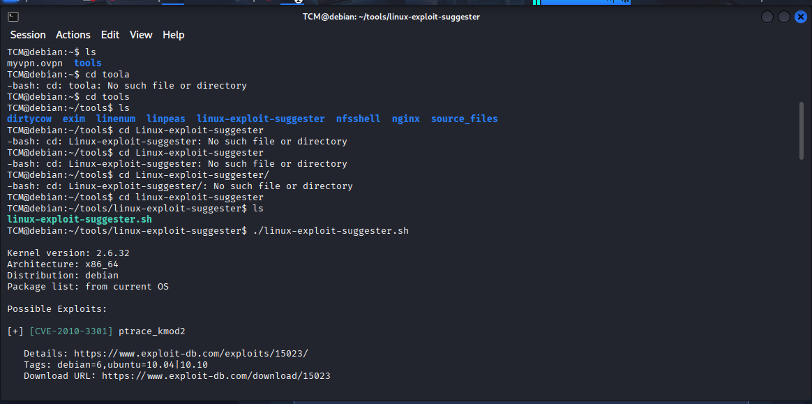
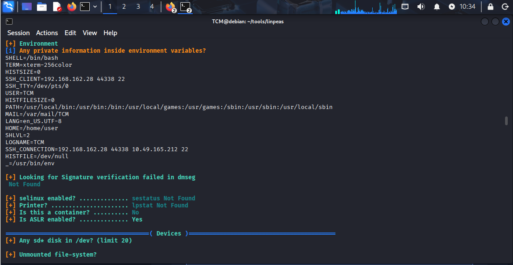
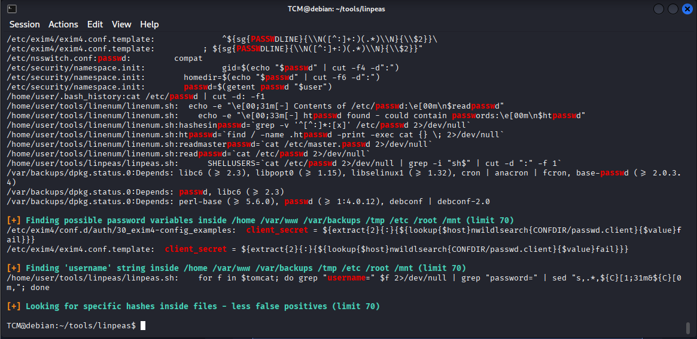
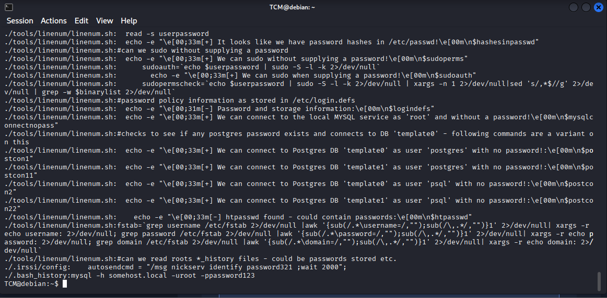
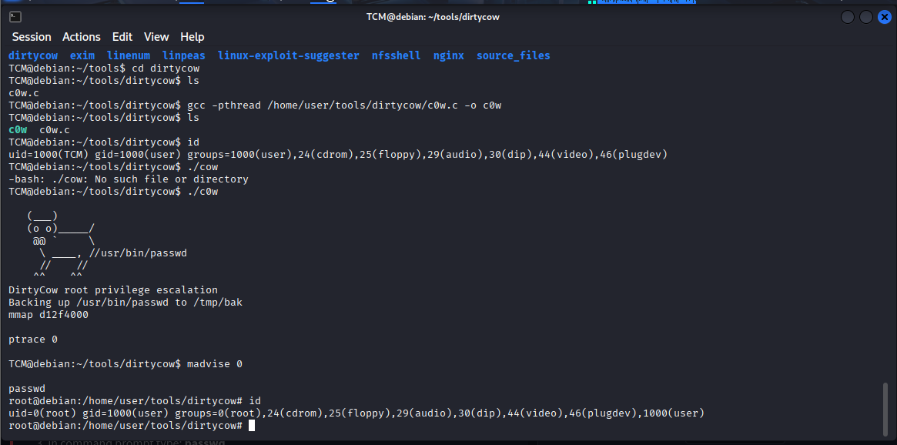
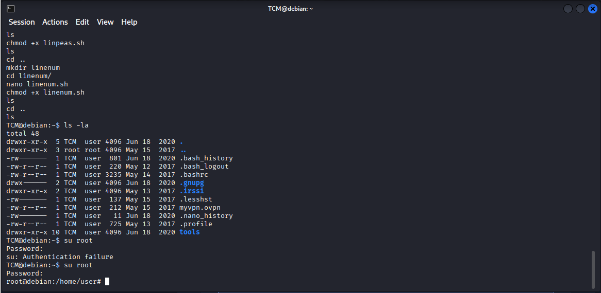

# 🚩 TryHackMe – Linux PrivEsc  

<br>
<br>


---

## 📌 Overview  

This write-up documents a full **Linux privilege escalation attack** against a vulnerable Debian system hosted on TryHackMe.  
Starting from a low-privileged SSH user (**TCM**), the machine was enumerated to identify kernel vulnerabilities and critical misconfigurations, ultimately leading to **full root compromise** using both **sudo abuse** and the **Dirty COW kernel exploit (CVE-2016-5195)**.

---
## 🛠 Tools  

```
ssh
uname
lsb_release
linux-exploit-suggester.sh
linpeas.sh
sudo
gcc
Dirty COW exploit (c0w.c)
Linux command-line utilities
```
## 🧭 Walkthrough  

The attack began by establishing an SSH connection to the target Debian machine.

Target IP: `10.82.186.208`  
User: `TCM`  

Connection command used to bypass legacy host key restrictions:

`ssh -o HostKeyAlgorithms=+ssh-rsa TCM@10.82.186.208`

Upon successful login, a directory named **tools** was discovered in the user’s home folder. This directory contained multiple enumeration scripts and exploit source codes, indicating potential privilege escalation paths.



---

### 🔍 System Enumeration  

System enumeration was performed to understand the operating environment and identify kernel-level attack vectors.

Findings:
- Operating System: Debian GNU/Linux 6.0  
- Kernel Version: 2.6.32-5-amd64  
- Architecture: x86_64  
- Listening Ports: 22 (SSH), 8080, 2049 (NFS)  

The outdated kernel immediately suggested susceptibility to known local privilege escalation exploits.


---

### ⚡ Automated Enumeration Tools  

To accelerate discovery, automated enumeration scripts were executed from the `/tools` directory.

**Linux Exploit Suggester** identified several high-impact vulnerabilities, most notably:
- CVE-2010-3301 (ptrace_kmod2)  
- CVE-2016-5195 (Dirty COW)  

**LinPEAS** was used to enumerate environment variables, active network services, permissions, and sensitive files.


---

### 🔥 Privilege Identification – Sudo Abuse  

Privilege checks revealed a severe sudo misconfiguration.

Current User:
`uid=1000(TCM)`

The sudoers configuration allowed **TCM to execute multiple binaries as root without a password (NOPASSWD)**.

Exploitable binaries included:
`find`, `vim`, `nano`, `awk`, `man`, `nmap`, `apache2`, and others.

This misconfiguration alone provided multiple GTFOBins-based privilege escalation paths.



---

### 🔑 Sensitive Data Extraction  

Using the excessive sudo permissions, sensitive system files were accessed.

Targeted files:
- `/etc/passwd` → Enumerated all system users  
- `/etc/shadow` → Extracted encrypted password hashes  

The **root password hash** was successfully retrieved, confirming high-impact privilege exposure.




---

### 🧨 Privilege Escalation – Dirty COW (CVE-2016-5195)  

Although multiple sudo vectors existed, the final escalation was achieved using the **Dirty COW kernel exploit**, leveraging the vulnerable kernel version.

Exploit steps:
- Navigate to exploit directory:  
  `cd /home/user/tools/dirtycow`
- Compile exploit:  
  `gcc -pthread c0w.c -o c0w`
- Execute exploit:  
  `./c0w`

After execution, privilege escalation was verified.

Verification command:
`id`

Output confirmed:
`uid=0(root)`



---

## 🚀 Summary of Findings  

Initial Access → SSH via TCM user  
Critical Vulnerability → Kernel 2.6.32 vulnerable to Dirty COW  
Misconfiguration → Extensive NOPASSWD sudo permissions  
Final Result → Full root access achieved  

---

## 🧠 Key Takeaways  

• Outdated kernels remain a critical real-world risk  
• Sudo misconfigurations can be more dangerous than kernel exploits  
• Automated tools speed up discovery, but manual validation is essential  
• Enumeration is the foundation of successful privilege escalation  

---

## 📌 Conclusion  

This lab demonstrates how **weak privilege boundaries**, **poor patch management**, and **excessive sudo permissions** can be chained together to achieve full system compromise.  
By combining enumeration, misconfiguration abuse, and kernel exploitation, root access was obtained in a realistic attack scenario.

> *In Linux privilege escalation, the real exploit often begins with enumeration.*

---
👤 Author  Anka0X

## [LinkedIn:](https://www.linkedin.com/in/manka-sec/)