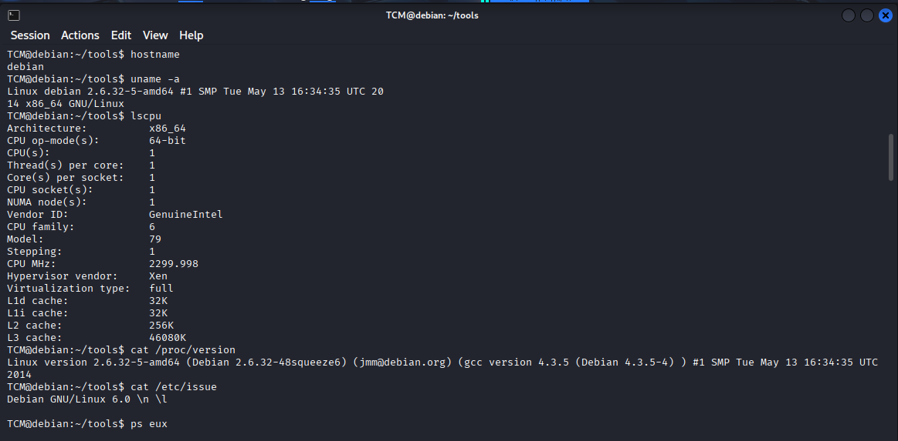
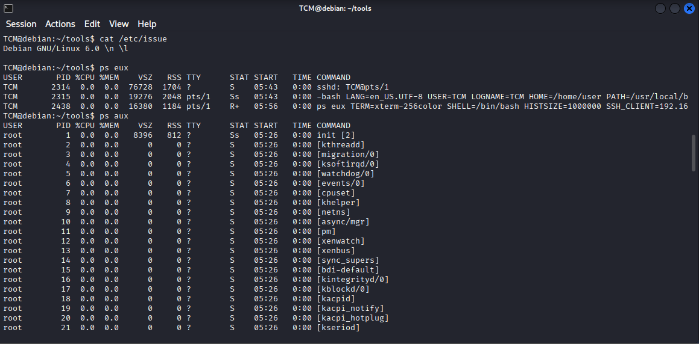
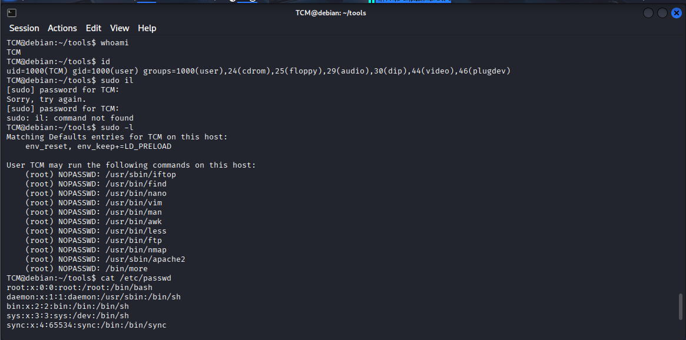
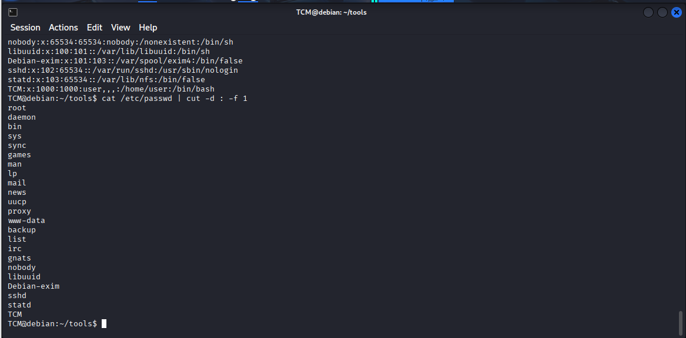
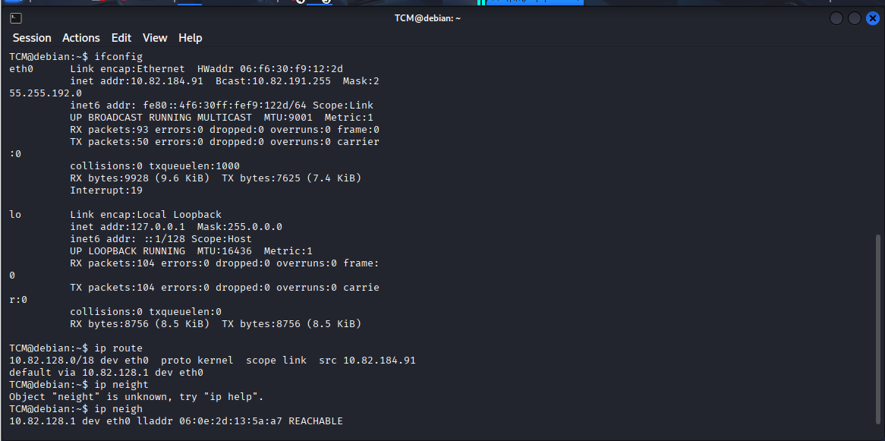
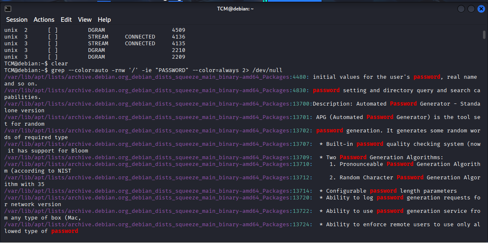

# 🚩 TryHackMe – Linux PrivEsc Arena  

<br>
<br>


---

## 📌 Overview  

This lab demonstrates how a **misconfigured sudo policy** combined with **weak system hardening** can lead to a full **Linux privilege escalation**.  
Starting from a low‑privileged user (**TCM**), we identify a sudo misconfiguration that allows execution of multiple binaries as root without authentication and leverage **GTFOBins** to gain access to sensitive system files.

> *In this write‑up we cover:*

* Linux enumeration methodology  
* Kernel and OS analysis  
* Process & user enumeration  
* Sudo misconfiguration discovery  
* GTFOBins exploitation  
* Root‑level data access  

---

## 🛠 Tools  

```
ssh → Initial access
ps → Process enumeration
id → User privilege checking
sudo → Privilege escalation
netstat → Network inspection
ifconfig → Interface enumeration
Linux CLI → Manual exploitation

```
---

## Step‑by‑Step Attack Walkthrough  

### Step 1 – Initial Access  

We connected to the target machine using SSH with the provided credentials.  

`ssh TCM@10.82.186.208`  

Then we moved into the tools directory.  

`cd /tools`  


---

### Step 2 – System & Kernel Enumeration  

System information was collected.  

`uname -a`  
`cat /etc/issue`  
`lscpu`  

The system was running **Debian 6 (Squeeze)** with kernel **2.6.32‑5‑amd64**, which is vulnerable to multiple LPE exploits.  



---

### Step 3 – Process Enumeration  

We listed running processes to identify root‑owned services.  

`ps aux`  
`ps eux`  

Services like apache2, acpid and udevd were found running as root.  



---

### Step 4 – User & Group Enumeration  

We identified our current privileges.  

`whoami`  
`id`  

User: TCM  
UID: 1000  
Groups: cdrom, floppy, audio, dip, video, plugdev  



---

### Step 5 – Sudo Misconfiguration  

We checked sudo privileges.  

`sudo -l`  

The output showed multiple binaries executable as root without a password (GTFOBins).  



---

### Step 6 – Privilege Escalation  

We used the sudo misconfiguration to access sensitive system files.  

`sudo cat /etc/passwd`  
`sudo cat /etc/shadow`  

The root password hash was successfully retrieved.  


---

### Step 7 – Network Enumeration  

Network configuration was identified.  

`ifconfig`  
`ip route`  
`netstat -ano`  

Open ports included SSH (22), HTTP (80), and NFS (2049).  



---

### Step 8 – Command History  

We reviewed the command history.  

`history`  

This confirmed all enumeration and exploitation steps.  




---

🧠 What This Lab Teaches

- Sudo misconfigurations are extremely dangerous
- GTFOBins can turn normal tools into root shells
- Enumeration is the most important phase
- Old Linux systems are highly exploitable

📌 Conclusion

This lab was fully compromised due to an insecure sudo configuration and an outdated Linux kernel.
By abusing GTFOBins, a low‑privileged user was able to access root‑level data and achieve full privilege escalation.

> *When sudo is misconfigured — root is only one command away.*

---
👤 Author  Anka0X

## [LinkedIn:](https://www.linkedin.com/in/manka-sec/)