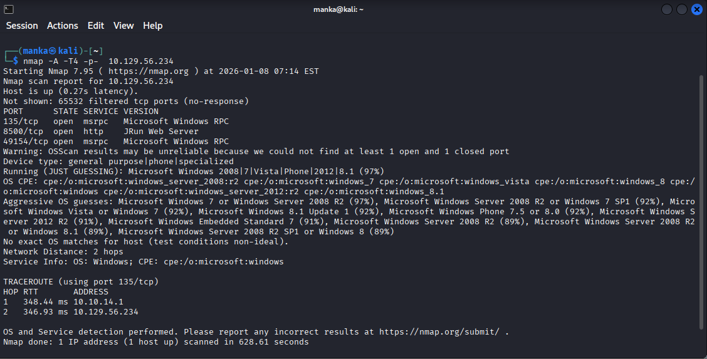
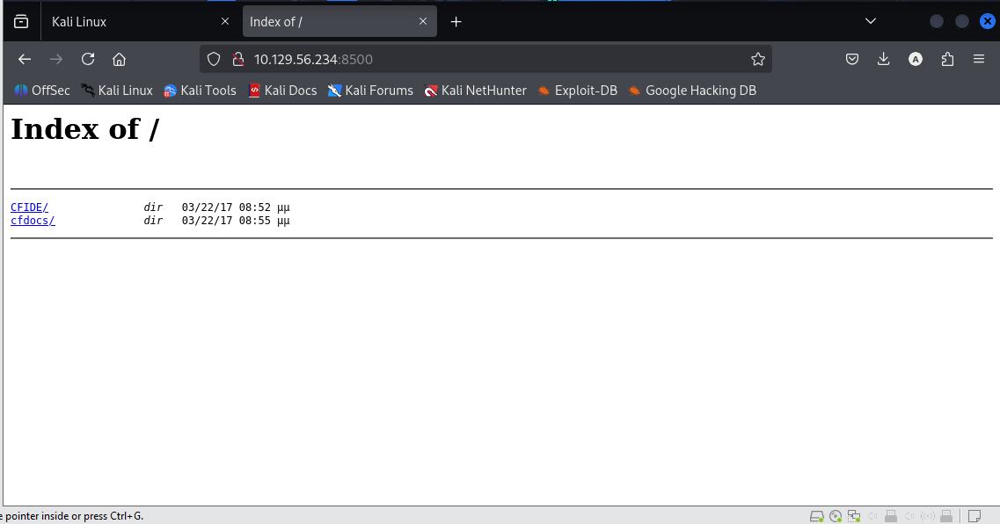
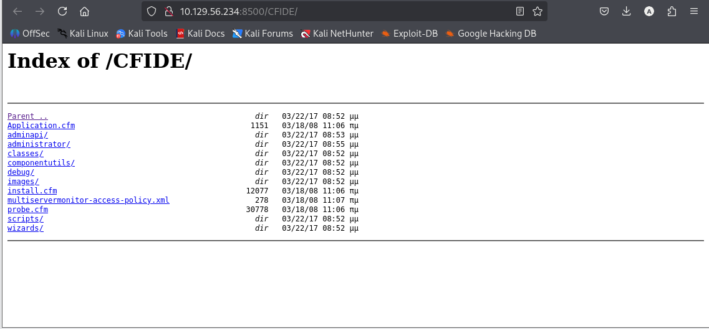
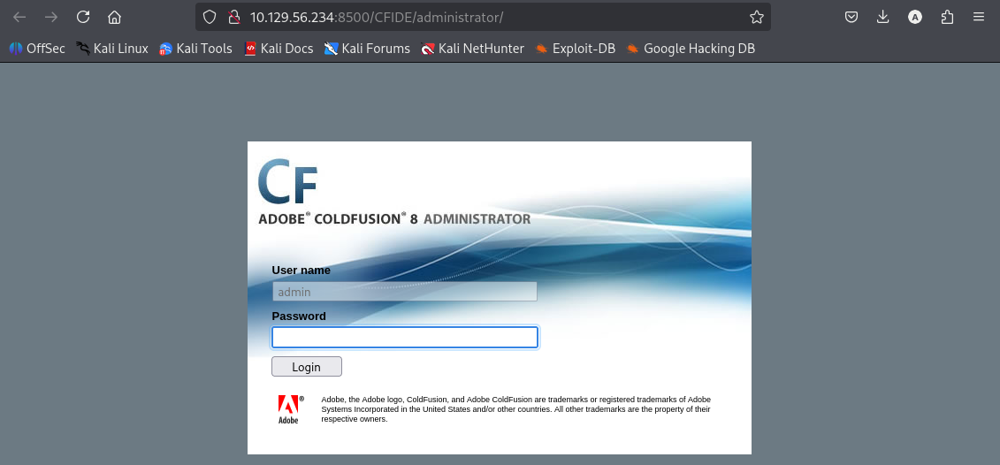
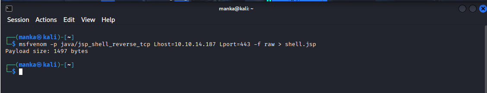
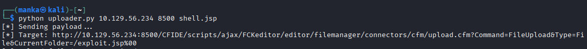
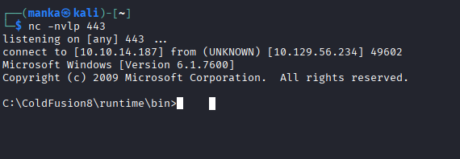
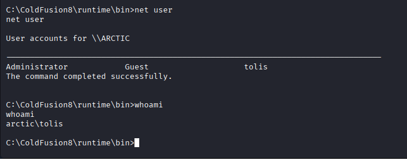
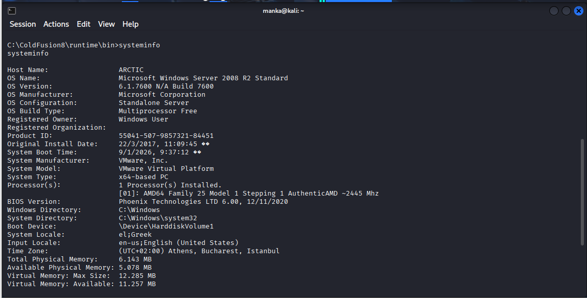

# Arctic – Hack The Box Mechine

**Author:** Anka0X  
**Platform:** Hack The Box  
**Target OS:** Windows Server 2008 R2  
**Architecture:** x64  
**Initial Access:** Web Application  
**Attack Vector:** Adobe ColdFusion 8 – Arbitrary File Upload  
**Privilege Escalation:** Windows Kernel Exploit  

---

## Overview
This write-up documents the compromise of the *Arctic* machine on Hack The Box. Initial access was obtained by exploiting a known vulnerability in Adobe ColdFusion 8, followed by local privilege escalation through an unpatched Windows kernel vulnerability, resulting in full SYSTEM-level access.

---

## Initial Enumeration
Service discovery was performed to identify exposed services.

**Tool:** Nmap  

**Action:**
- Full TCP port scan
- Service and version detection enabled

**Key Finding:**
- Port **8500** open
- Service identified as **JRun Web Server**
- Hosting **Adobe ColdFusion**

---

## Web Enumeration
The ColdFusion service was accessed through the browser.

**Findings:**
- Directory listing enabled
- `/CFIDE/administrator/` accessible
- Adobe ColdFusion 8 Administrator login panel discovered

- Index of web root  
- CFIDE directory  
- ColdFusion 8 login page  

---

## Exploitation – Gaining Initial Access
ColdFusion 8 is vulnerable to an **arbitrary file upload** via the integrated **FCKeditor**.

### Payload Preparation
A JSP reverse shell payload was generated.

**Tool:** msfvenom  

---

### File Upload
A custom Python exploit script was used to upload the malicious JSP file through the FCKeditor upload connector.

**Result:**
- JSP shell successfully uploaded to the server

---

### Reverse Shell
A listener was prepared to receive the incoming connection.

**Result:**
- Reverse shell obtained
- Access gained as a low-privileged web user

---

## Post-Exploitation Enumeration
System information was gathered after initial access.

**Findings:**
- User context: Low-privileged service account  
- Operating System: Windows Server 2008 R2  
- Architecture: x64  

---

## Privilege Escalation
The system was assessed for missing patches and kernel vulnerabilities.

**Technique:**
- Local exploit enumeration
- Identification of vulnerable Windows kernel components

**Finding:**
- System vulnerable to known Windows kernel privilege escalation exploits

---

## Privilege Escalation Execution
A suitable kernel exploit was executed to elevate privileges.

**Result:**
- New session spawned with elevated privileges
- Successful escalation to:

---

## Impact
- Complete compromise of the target system
- Full administrative control achieved

---

## Mitigation & Defensive Recommendations
- Update and patch Adobe ColdFusion installations
- Restrict access to administrative endpoints
- Disable directory listing on production servers
- Apply Windows security patches regularly
- Monitor abnormal file uploads and web shell activity

---

## Attack Summary

| Phase | Technique | Outcome |
|------|----------|---------|
| Recon | Port & Service Scan | ColdFusion identified |
| Initial Access | File Upload Exploit | Web shell obtained |
| Enumeration | System Inspection | Kernel vuln identified |
| Escalation | Kernel Exploit | SYSTEM access |
| Impact | Full Compromise | Administrative control |

---
👤 Author  Anka0X

## [LinkedIn:](https://www.linkedin.com/in/manka-sec/)

