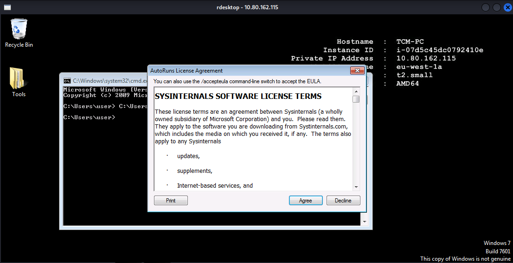
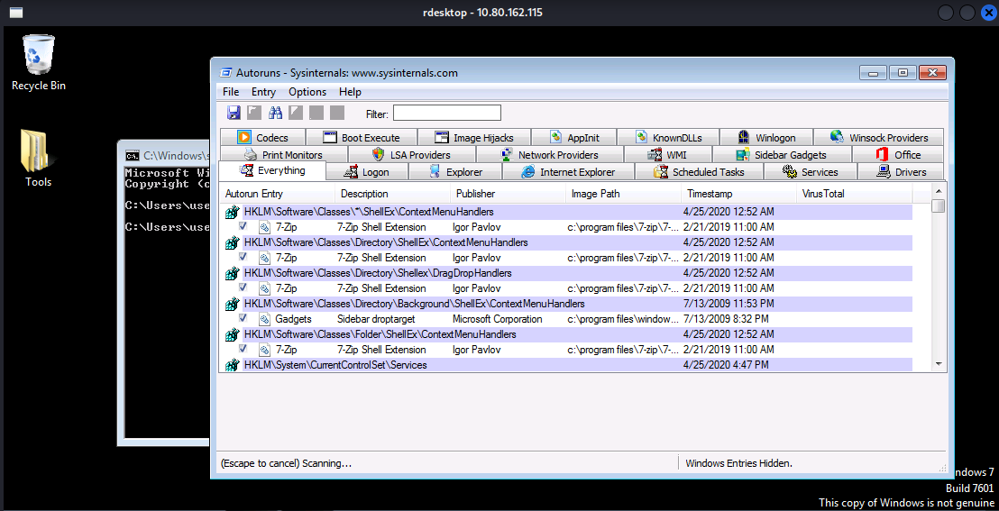
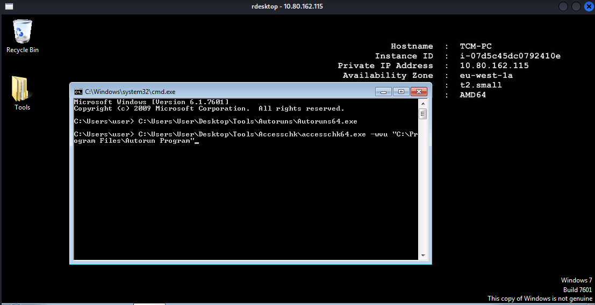
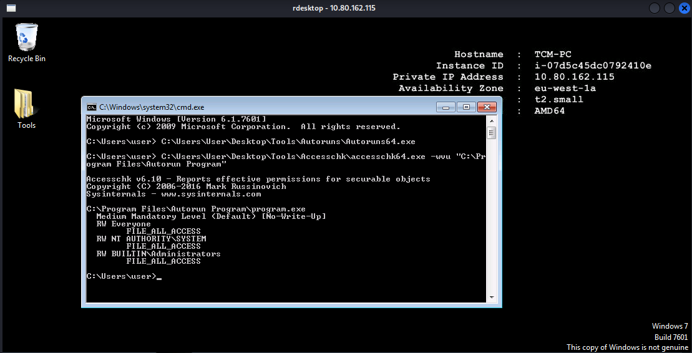
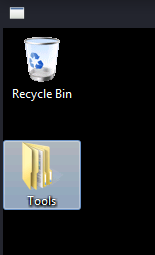
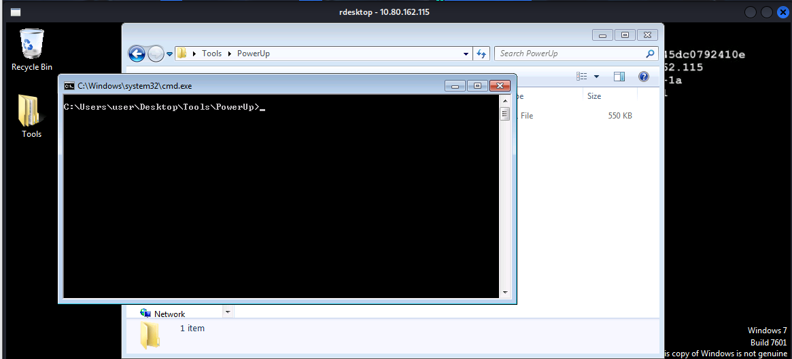
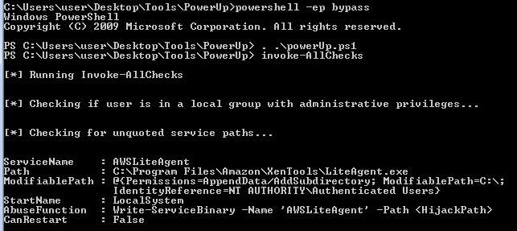
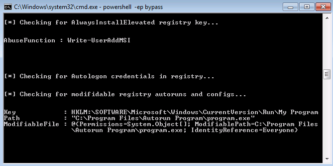

# TryHackMe | Register P1: Windows Privilege Escalation

**Author:** Anka0X
**Platform:** TryHackMe
**Target OS:** Windows 7 (Build 7601)
**Architecture:** AMD64 (x64)
**Initial Access:** Low-privilege user (`user`)
**Attack Vector:** Registry Autorun Misconfiguration / Weak File Permissions

---

## 📌 Overview

This write-up demonstrates a classic **Windows privilege escalation** technique leveraging **weak file permissions on a registry autorun binary**. By identifying a writable executable configured to run with elevated privileges at startup, a low-privileged user can escalate to **NT AUTHORITY\SYSTEM**.

This lab emphasizes **real-world enumeration methodology**, not just exploitation.

---

## 1️⃣ Information Gathering & System Recon

After gaining initial access to the target, basic system enumeration was performed to establish context.

**Findings:**

* **Hostname:** TCM-PC
* **Current User:** user
* **Operating System:** Windows 7 SP1
* **Architecture:** x64 (AMD64)


---

## 2️⃣ Enumerating Autoruns

Autorun entries are common privilege escalation vectors when misconfigured.

**Tool Used:** `Autoruns64.exe` (Sysinternals)

**Steps:**

* Accepted the EULA
* Reviewed the **Everything** tab
* Looked for non-standard or third-party startup entries

🔍 **Finding:**
A suspicious autorun entry pointing to:

```
C:\Program Files\Autorun Program\program.exe
```



---

## 3️⃣ Verifying Weak File Permissions

To determine exploitability, folder permissions were audited.

**Tool Used:** `accesschk64.exe`

**Command:**

```powershell
accesschk64.exe -wvu "C:\Program Files\Autorun Program"
```

🚨 **Critical Finding:**

* The **Everyone** group has `FILE_ALL_ACCESS`
* Any user can modify or replace `program.exe`

This confirms a **privilege escalation vulnerability**.



---

## 4️⃣ Preparing the Audit Tools

To ensure accuracy and professionalism, automated checks were also performed.

**Tools Prepared:**

* PowerUp.ps1




---

## 5️⃣ Automated Vulnerability Confirmation (PowerUp)

**Tool Used:** `PowerUp.ps1`

**Command:**

```powershell
Invoke-AllChecks
```

✅ **Result:**
PowerUp detected a **modifiable registry autorun**:

```
HKLM:\SOFTWARE\Microsoft\Windows\CurrentVersion\Run\My Program
```

This confirms that the autorun binary is writable and executed with elevated privileges.




---

## 6️⃣ Exploitation Path (Theory)

> ⚠️ This section explains the attack path conceptually (no payload included).

**Exploitation Steps:**

1. Generate a malicious `program.exe` (e.g., reverse shell)
2. Replace the original binary at:

   ```
   C:\Program Files\Autorun Program\program.exe
   ```
3. Restart the system or wait for an administrator logon
4. The payload executes automatically with **SYSTEM privileges**

🎯 **Outcome:**

```
NT AUTHORITY\SYSTEM
```

---

## 7️⃣ Mitigation & Defensive Recommendations

🛡️ **Security Hardening:**

* **File Permissions:**

  * Restrict write access in `C:\Program Files` to **Administrators only**

* **Registry Security:**

  * Ensure `HKLM\\...\\Run` keys are not writable by standard users

* **Security Auditing:**

  * Regularly audit autorun entries and startup applications

* **Least Privilege Enforcement:**

  * Avoid executing third-party software with elevated privileges

---

## 8️⃣ Summary Table

| Phase            | Tool                  | Purpose                     |
| ---------------- | --------------------- | --------------------------- |
| Reconnaissance   | Desktop / System Info | Confirm OS & architecture   |
| Enumeration      | Autoruns64            | Identify startup programs   |
| Permission Audit | Accesschk64           | Detect writable binaries    |
| Verification     | PowerUp.ps1           | Automated vuln confirmation |
| Goal             | Privilege Escalation  | Obtain SYSTEM access        |

---
👤 Author  Anka0X

## [LinkedIn:](https://www.linkedin.com/in/manka-sec/)


