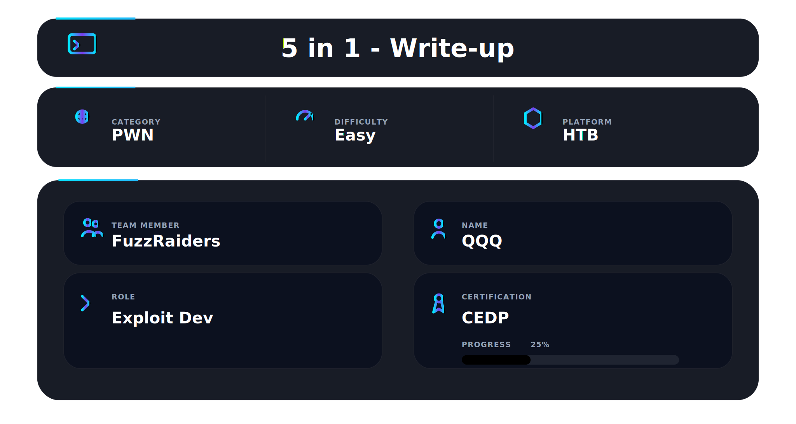


## 📌 Overview

> “Binary exploitation begins the moment programs trust memory more than they should.”

This write-up documents the completion of several beginner-focused binary exploitation challenges from the Hack The Box Binary Exploitation Track.

The challenges covered include:

* Mathematricks
* racecar
* El Pipo
* El Teteo
* El Mundo

Each challenge focuses on a different exploitation concept ranging from simple logic flaws to direct execution flow hijacking.

Throughout the track, several important binary exploitation concepts are explored including:

* Integer Overflow
* Format String Vulnerabilities
* Stack Memory Corruption
* Shellcode Injection
* RIP Control
* Ret2Win Exploitation
* Remote Code Execution

The goal of this series was not only to retrieve flags, but to understand how vulnerable programs behave internally and how small memory mistakes can eventually lead to full compromise.

---

# 🛠️ Tools Used

| Tool                      | Purpose                                                                  |
| ------------------------- | ------------------------------------------------------------------------ |
| **Cutter**                | Used for reverse engineering and binary analysis                         |
| **Pwntools**              | Used for exploit development, payload generation, and remote interaction |
| **Python 3**              | Used for writing and automating exploit scripts                          |
| **checksec**              | Used for analyzing binary security protections                           |
| **GDB / pwndbg**          | Used for runtime debugging and memory analysis                           |
| **Netcat (`nc`)**         | Used for communicating with remote challenge instances                   |
| **file**                  | Used for identifying binary architecture and properties                  |
| **Hack The Box Platform** | Used for launching and validating challenge instances                    |

---


# Challenge 1 -> Mathematricks

## Step 1: Reviewing the Challenge

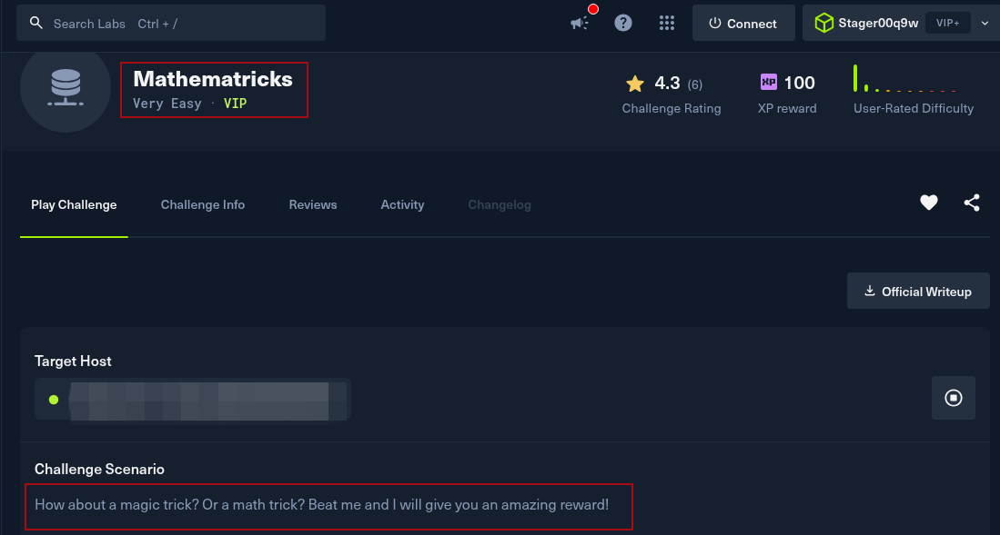

Mathematricks presents itself as a simple mathematics-based challenge where the player must answer arithmetic questions correctly in order to continue progressing.

At first glance, the challenge looks completely harmless.

The application asks several basic arithmetic questions and expects normal user interaction.

Nothing unusual yet.

---

## Step 2: Inspecting the Binary

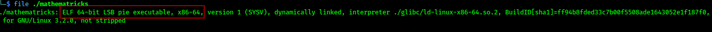

The binary was inspected using:

```bash
file mathematricks
````

The output reveals:

```text
ELF 64-bit LSB pie executable
```

A few important details immediately stand out:

* 64-bit binary
* PIE enabled
* dynamically linked
* not stripped

The binary still containing symbols makes analysis and debugging significantly easier.

At this point, the objective becomes understanding how the application validates the mathematical conditions internally.

---

## Step 3: Interacting with the Program

The challenge starts with several straightforward questions:

```text
1 + 1
2 - 1
1337 - 1337
```

Then the application suddenly introduces a very strange condition:

```text
Enter 2 numbers n1, n2 where:

n1 > 0
n2 > 0
n1 + n2 < 0
```

Which immediately feels wrong.

Two positive numbers producing a negative result should not normally happen.

And that is exactly where the vulnerability begins to reveal itself.

---

## Step 4: Understanding the Vulnerability

The condition strongly hints toward:

```text
Signed Integer Overflow
```

Signed integers have a maximum possible value.

For 32-bit signed integers:

```text
2147483647
```

is the upper limit.

Adding any value beyond that boundary causes integer wrapping internally.

Instead of becoming larger:

```text
2147483647 + 1
```

becomes:

```text
-2147483648
```

which unexpectedly satisfies:

```text
n1 + n2 < 0
```

even though both supplied values remain positive.

The payload used:

```text
2147483647
1
```

successfully triggers the overflow condition.

Seeing arithmetic itself become the vulnerability is always slightly cursed in the best possible way.

---

## Step 5: Retrieving the Flag


After triggering the integer overflow successfully, the application accepts the impossible condition and reveals the hidden flag.

At this stage, the challenge confirms that the validation logic can be bypassed entirely through integer wrapping behavior.

A tiny arithmetic oversight becomes enough to completely break the intended restriction.

---

## Step 6: Challenge Completion


The challenge was successfully solved and validated by Hack The Box.

---

After dealing with integer boundaries and arithmetic overflow behavior in the previous challenge, the next target becomes significantly more interactive.

Instead of manipulating calculations, this challenge revolves around user-controlled input reaching places it absolutely should not — eventually turning a simple racing game into a stack memory leak.

---


# Challenge 2 -> racecar

## Step 1: Reviewing the Challenge

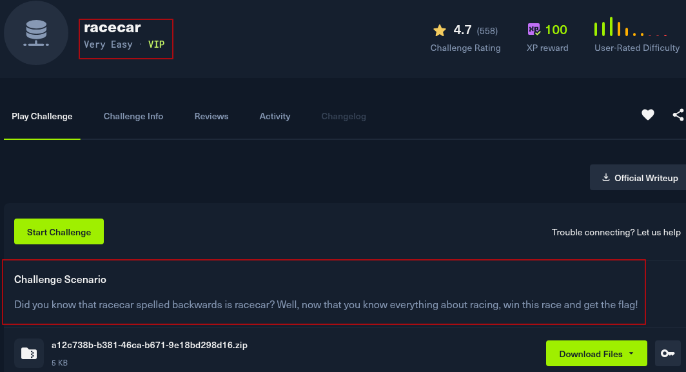

racecar presents itself as a small racing-themed terminal application where the player competes in races and interacts with the game afterward.

The challenge initially feels more like a simple arcade game than a binary exploitation challenge.

The workflow includes:

* selecting a racer
* choosing a track
* racing
* speaking to the press after winning

Somewhere in that interaction flow, the vulnerability is hiding.

---

## Step 2: Inspecting the Binary

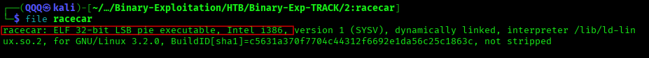

The binary was inspected using:

```bash
file racecar
````

The output reveals:

```text
ELF 32-bit LSB pie executable
```

Important observations:

* 32-bit binary
* PIE enabled
* dynamically linked
* not stripped

The 32-bit architecture immediately changes several exploitation assumptions compared to x64 binaries:

* addresses become 4 bytes
* registers become 4 bytes
* payload structures change
* leaked values appear differently in memory

At this point, the goal becomes understanding how the application handles user input internally.

---

## Step 3: Preparing the Environment

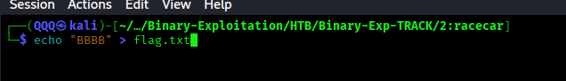

Before interacting with the remote challenge instance, a local `flag.txt` file was created for testing purposes.

This makes debugging easier because leaked values can first be validated locally before attacking the remote service itself.

Simple preparation step.
Saves a ridiculous amount of time later.

---

## Step 4: Navigating Through the Program

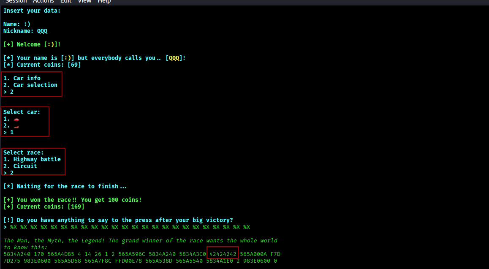

The application walks through several menus before finally asking:

```text
Do you have anything to say to the press after your big victory?
```

That input field immediately stands out.

Instead of sending normal text, format string payloads were supplied:

```text
%x %x %x %x
```

The application responds by leaking hexadecimal values directly from memory.

And that confirms it.

---

## Step 5: Identifying the Vulnerability

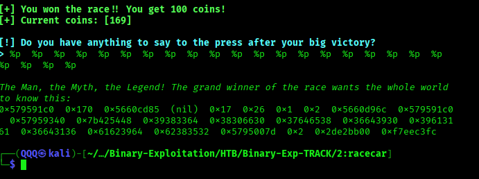

The `%x` payload successfully leaks stack contents.

Several hexadecimal values begin appearing in the output:

```text
39383364
38306630
37646538
```

At this stage, the vulnerability becomes obvious:

```text
Format String Vulnerability
```

The application is likely performing something similar to:

```c
printf(user_input);
```

instead of:

```c
printf("%s", user_input);
```

which allows attacker-controlled format specifiers to interact directly with stack memory.

Classic format string mistake.
Still one of the easiest ways to accidentally leak memory.

---

## Step 6: Manual Flag Reconstruction

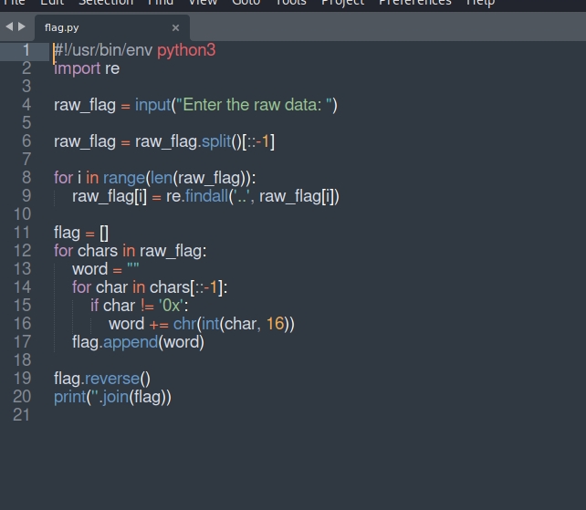

The first approach involved manually reconstructing the leaked stack data.

The leaked hexadecimal values were:

* reversed
* converted from hexadecimal
* decoded into ASCII

to slowly reconstruct readable flag fragments from memory.

This method is slightly more manual, but it makes the memory disclosure process much easier to understand internally.

Seeing raw stack leaks slowly transform into a valid flag never gets old.

---

## Step 7: Retrieving the Flag Manually

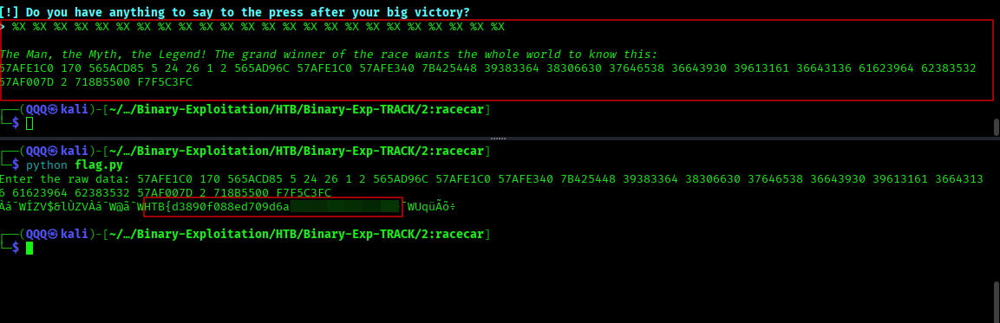

After decoding the leaked values correctly, the hidden flag becomes visible directly from the leaked stack contents.

At this point, the challenge confirms successful exploitation through direct memory disclosure.

No shellcode.
No RIP overwrite.
Just unsafe formatting exposing stack memory.

---

## Step 8: Automating the Exploitation Process

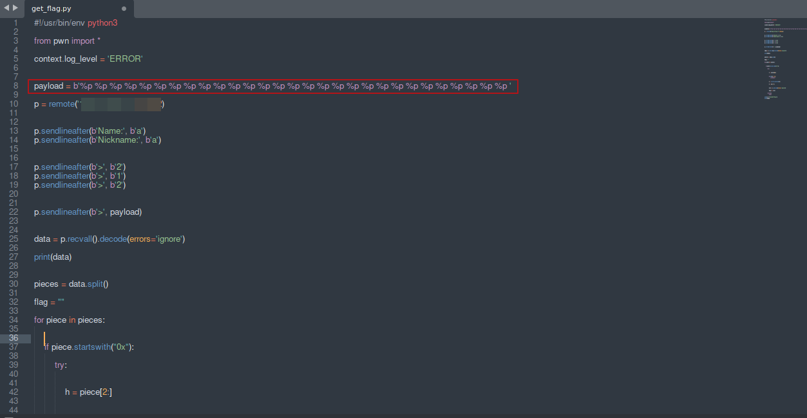

After confirming the vulnerability manually, the next step was automating the process using Pwntools.

The exploit script handled:

* menu navigation
* payload delivery
* stack leaking
* hexadecimal parsing
* flag reconstruction

The script continuously sends:

```text
%x
```

payloads and automatically processes the leaked output.

Much cleaner than manually decoding memory leaks one value at a time.

Especially once the stack starts looking cursed.

---

## Step 9: Retrieving the Flag with Pwntools

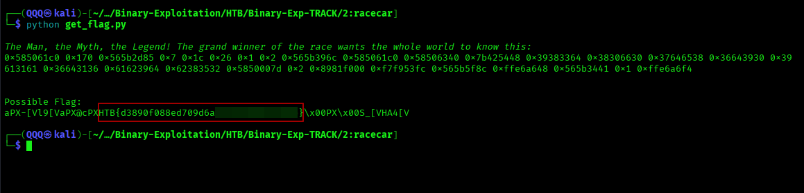

After automating the leak parsing process successfully, the exploit script reconstructs the flag directly from memory.

At this stage, exploitation becomes fully automated and reusable against the remote challenge instance.

---

## Step 10: Challenge Completion

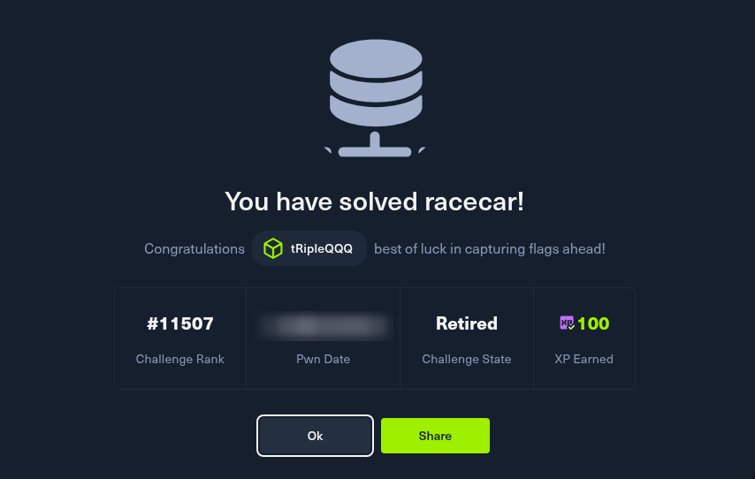

The racecar challenge was successfully solved and validated by Hack The Box.

---

```
After exploiting unsafe memory disclosure through a format string vulnerability in racecar, the next challenge shifts away from leaking memory and moves toward something more direct:

controlling program execution itself.

And this time, the binary practically dares us to overflow it.

```
---

# Challenge 3 -> El Pipo

## Step 1: Reviewing the Challenge

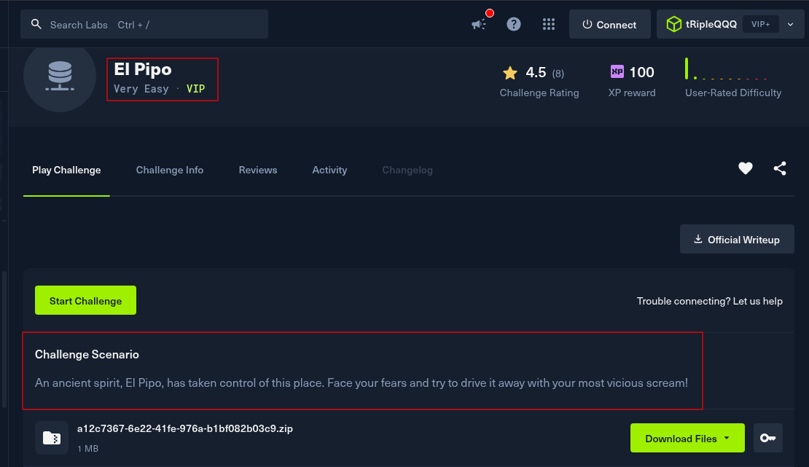

El Pipo introduces itself as a haunted web challenge where the goal is to “say something scary.”

Behind the Halloween theme sits a backend binary handling the submitted input.

The provided challenge description immediately hints at reverse engineering being required.

---

## Step 2: Reading the Provided Notes

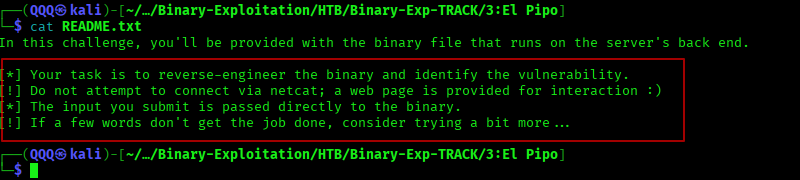

The README explains several important details:

* the backend binary is provided
* user input is passed directly into the binary
* the challenge should not be solved through normal web fuzzing
* reversing the binary is required

That last sentence matters the most.

This was not going to be a web vulnerability challenge.

The website was only the front-end decoration.
The real target was the backend binary itself.

---

## Step 3: Reverse Engineering the Binary

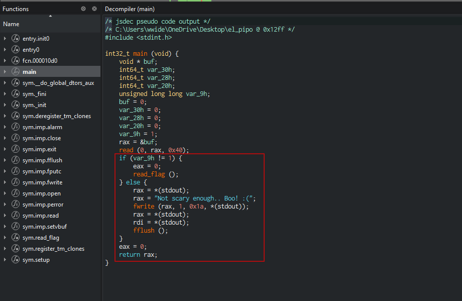

The binary was opened inside Cutter for static analysis.

Inside the `main()` function, the vulnerable logic becomes visible almost immediately.

The program:

* creates a stack buffer
* initializes several local variables
* performs a `read()` call
* checks a variable named `var_9h`

The critical part:

```
read(0, rax, 0x40);
```

The binary reads:

```
0x40 bytes = 64 bytes
```
into a significantly smaller stack buffer.

Classic overflow territory.

Even more interesting:

```
if (var_9h != 1)
{
    read_flag();
}
```

That means if the overflow changes the value of `var_9h`, execution jumps directly into the hidden `read_flag()` function.

No shell needed.
No ROP chain needed.

Just change one variable and the binary betrays itself.

---

## Step 4: Visualizing the Control Flow

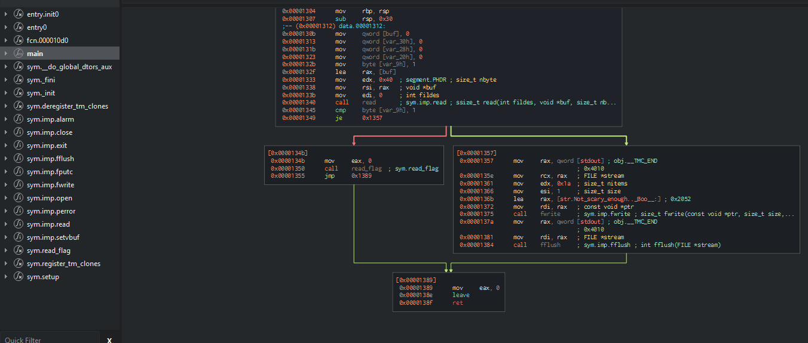

Viewing the function graph inside Cutter makes the vulnerability even clearer.

The execution flow splits into two paths:

* safe path → prints “Not scary enough”
* modified path → directly executes `read_flag()`

The challenge becomes less about advanced exploitation and more about understanding stack layout properly.

Very beginner-friendly binary exploitation design.
But still satisfying.

---

## Step 5: Interacting with the Web Application

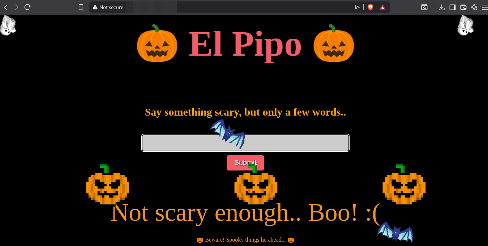

The web application provides a textbox asking for scary input.

Under normal conditions, short inputs simply trigger:

```
Not scary enough.. Boo! :(
```

At first glance, it looks harmless.

But now that the backend logic is known, the textbox effectively becomes a direct entry point into the vulnerable binary.

---

## Step 6: Triggering the Overflow

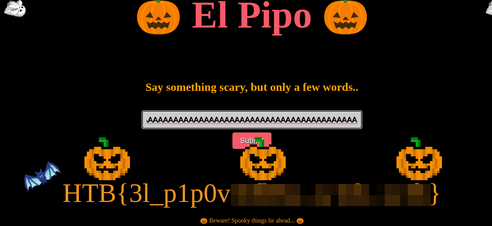

A long sequence of `A` characters was submitted through the page.

The oversized input overwrites nearby stack variables, including the conditional variable controlling access to `read_flag()`.

Once the value changes successfully, the application immediately reveals the flag directly on the webpage.

Simple overflow.
Instant reward.

---

## Step 7: Testing Direct Interaction with Netcat

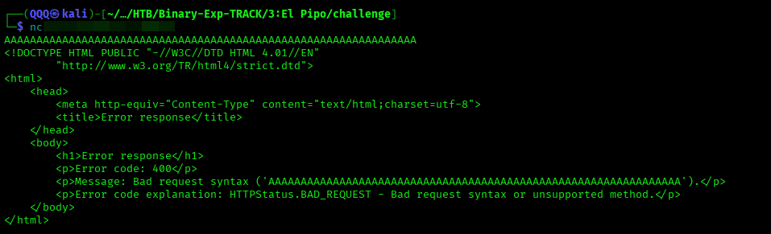

The challenge behavior was also tested manually using `nc`.

Sending oversized input directly confirms that the backend service is processing raw input exactly as expected.

The HTTP error response helps confirm the interaction path while testing direct communication with the service.

Sometimes even the error messages help tell the story.

---

## Step 8: Challenge Completion

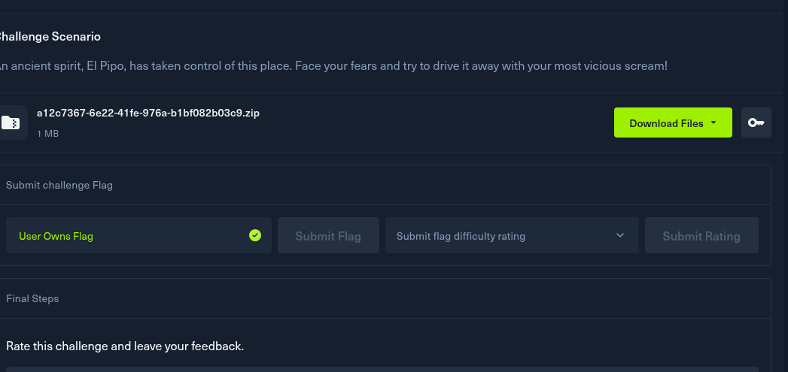

The El Pipo challenge was successfully solved and validated by Hack The Box.

---

## Step 9: Final Verification

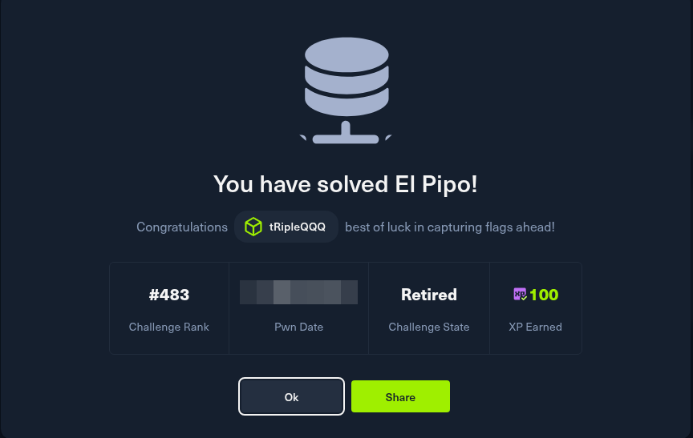

Challenge ownership and successful completion were fully confirmed on the platform.


```
After directly manipulating stack variables in El Pipo, the next challenge raises the difficulty slightly by introducing something every binary exploitation learner eventually meets:

binary protections.

This time the target includes protections like:

* stack canaries
* PIE
* Full RELRO

At first glance, it looks far more intimidating.

But El Teteo hides a very different kind of weakness.

```
---

# Challenge 4 -> El Teteo

## Step 1: Reviewing the Challenge

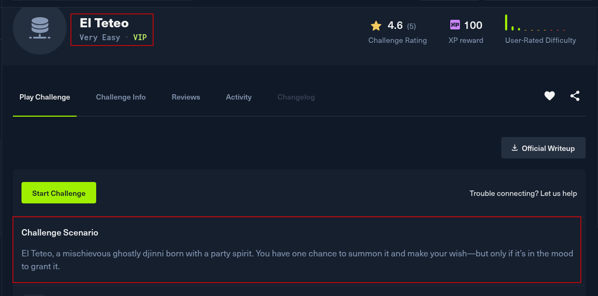

El Teteo presents itself as a ghostly djinni capable of granting wishes.

The challenge description immediately hints that the binary may behave differently depending on how it is interacted with.

That small detail ends up mattering a lot later.

---

## Step 2: Inspecting Binary Protections

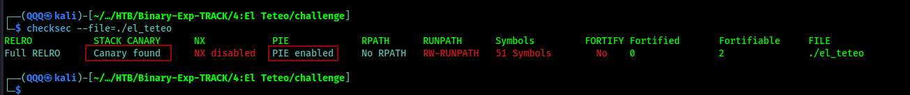

The binary protections were inspected using:

```bash
checksec --file=./el_teteo
````

The results reveal:

* Full RELRO
* Stack Canary enabled
* PIE enabled
* NX disabled

At first glance, this looks annoying.

Normally:

* stack canaries stop buffer overflows
* PIE randomizes addresses
* RELRO protects GOT overwrites

But one line stands out immediately:

```text
NX disabled
```

That means injected shellcode can still execute directly in memory.

And suddenly the challenge becomes far more interesting.

---

## Step 3: First Interaction with the Binary

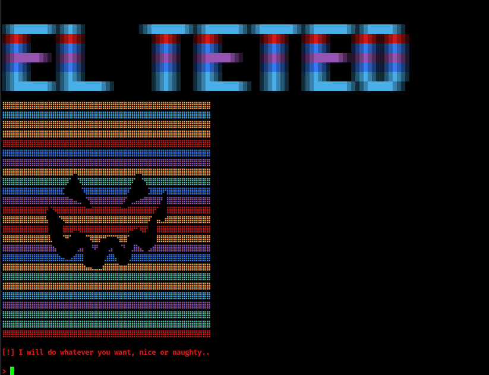

Running the binary displays an ASCII-art interface asking for input:

```text
I will do whatever you want, nice or naughty..
```

The wording strongly suggests direct command execution or unsafe input handling somewhere behind the scenes.

At this stage, the goal becomes identifying how the program handles supplied data internally.

---

## Step 4: Discovering the Fake Flag

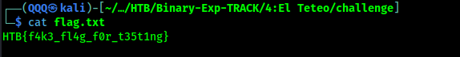

A local `flag.txt` file was created for testing purposes during exploit development.

This helps confirm whether exploitation works locally before attacking the remote instance.

Local testing showed that arbitrary commands could successfully retrieve the local flag.

Which is usually a very good sign.

Or a very bad sign for the binary developer.

---

## Step 5: Understanding the Exploitation Strategy

Because NX protection is disabled, shellcode injection becomes possible.

Instead of building a complex ROP chain, shellcode can simply be sent directly into the process memory and executed.

The exploit uses standard Linux x64 execve shellcode designed to spawn:

```text
/bin/sh
```

Once the shell is obtained, interacting with the target becomes trivial.

The challenge effectively turns into:

```text
get shell → read flag
```

Simple.
Clean.
Very satisfying.

---

## Step 6: Exploiting the Remote Service

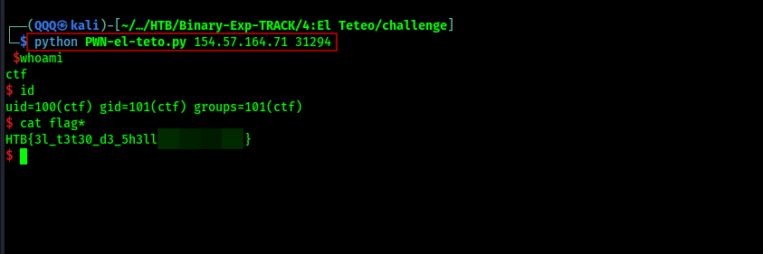

A Pwntools exploit script was developed to automate:

* connecting to the remote target
* delivering shellcode
* spawning an interactive shell
* reading the remote flag

After successful exploitation:

```bash
whoami
id
cat flag*
```

confirmed full command execution on the remote service.

At this point, the real challenge flag was successfully retrieved.

---

## Step 7: Local Verification

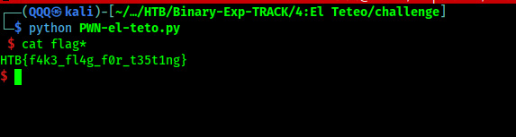

The same exploit was also tested locally against the challenge binary.

The local shell successfully accessed the locally created `flag.txt` file, confirming that the exploit behaved consistently across both local and remote environments.

Testing locally first saved a lot of unnecessary guessing later.

Which is usually how exploitation should be done whenever possible.

---

## Step 8: Challenge Completion


The El Teteo challenge was successfully solved and validated by Hack The Box.

---

```
After gaining shell access through injected shellcode in El Teteo, the final challenge takes a slightly different direction.

Instead of spawning a shell or leaking memory, El Mundo focuses entirely on one of the most fundamental concepts in binary exploitation:

controlling execution flow through a stack buffer overflow.

No distractions.
No unnecessary complexity.

Just pure stack smashing.
```
---

# Challenge 5 -> El Mundo

## Step 1: Reviewing the Challenge

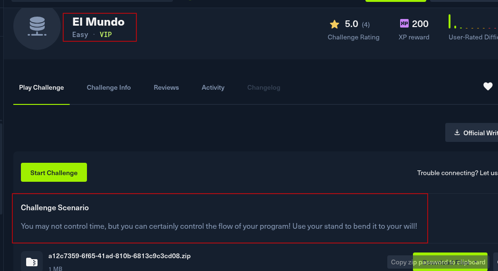

El Mundo introduces itself with a direct hint about program flow manipulation:

```text
Use your stand to bend it to your will!
```

Compared to previous challenges, this one feels much more focused on teaching stack behavior and return address control directly.

And honestly, it does that extremely well.

---

## Step 2: First Interaction with the Program

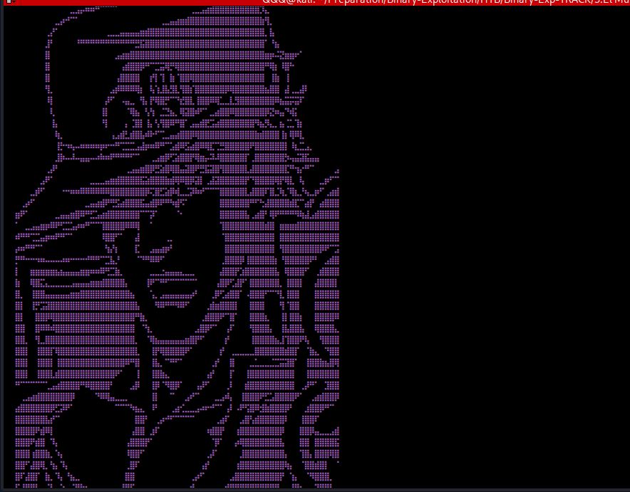

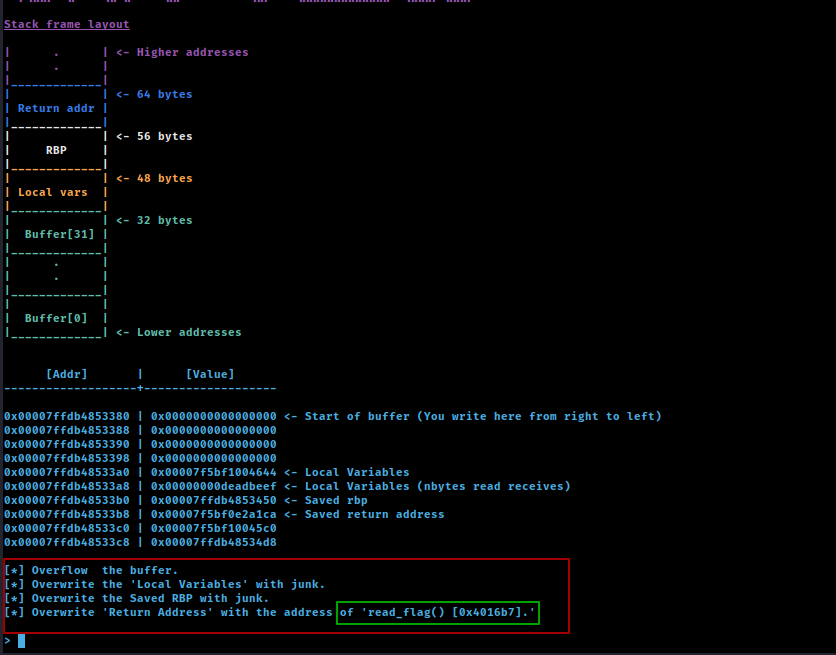
Running the binary reveals an ASCII-art interface followed by a detailed visualization of the stack layout.

Unlike most binaries, this challenge practically explains the vulnerability itself.

The program shows:

* buffer boundaries
* local variables
* saved RBP
* saved return address

as well as the exact overwrite path needed to redirect execution.

A very educational design choice.

---

## Step 3: Understanding the Stack Layout

The binary explains the memory structure step by step:

```text
Buffer[0] → Local Variables → Saved RBP → Return Address
```

The program even provides the exact target function:

```text
read_flag() [0x4016b7]
```

At this stage, the exploitation plan becomes obvious:

1. overflow the buffer
2. overwrite saved RBP
3. replace the saved return address
4. redirect execution into `read_flag()`

Classic return address overwrite.

The kind every binary exploitation learner eventually remembers forever.

---

## Step 4: Crafting the Payload

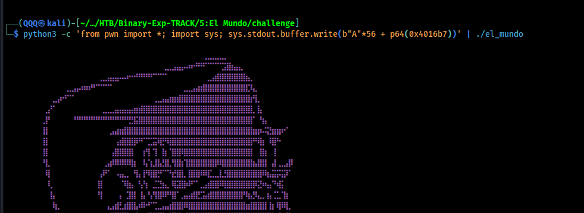


The exploit payload was generated using Python and Pwntools:

```python
from pwn import *
import sys

sys.stdout.buffer.write(b"A"*56 + p64(0x4016b7))
```

The payload structure:

* 56 bytes padding
* overwritten saved RBP
* new return address pointing into `read_flag()`

The program then executes the hidden function directly after returning from `main()`.

Clean.
Minimal.
Beautiful.

---

## Step 5: Local Exploitation

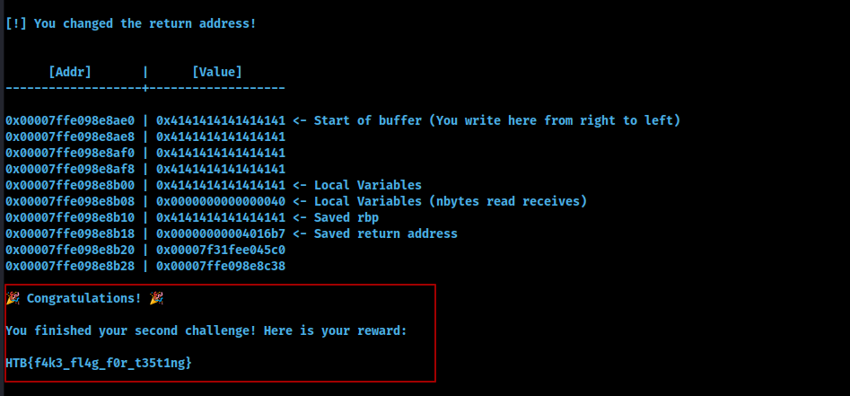

Running the payload locally successfully overwrites the saved return address.

The binary confirms:

```text
You changed the return address!
```

and immediately jumps into:

```text
read_flag()
```

revealing the local flag successfully.

This was one of the cleanest exploitation paths in the entire track.

---

## Step 6: Remote Exploitation

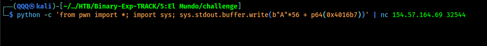

After confirming the exploit locally, the exact same payload was sent remotely using:

```bash
python -c 'from pwn import *; import sys; sys.stdout.buffer.write(b"A"*56 + p64(0x4016b7))' | nc <IP> <PORT>
```

No modifications were required.

Sometimes simple exploitation techniques scale perfectly from local to remote targets.

This was one of those times.

---

## Step 7: Retrieving the Remote Flag

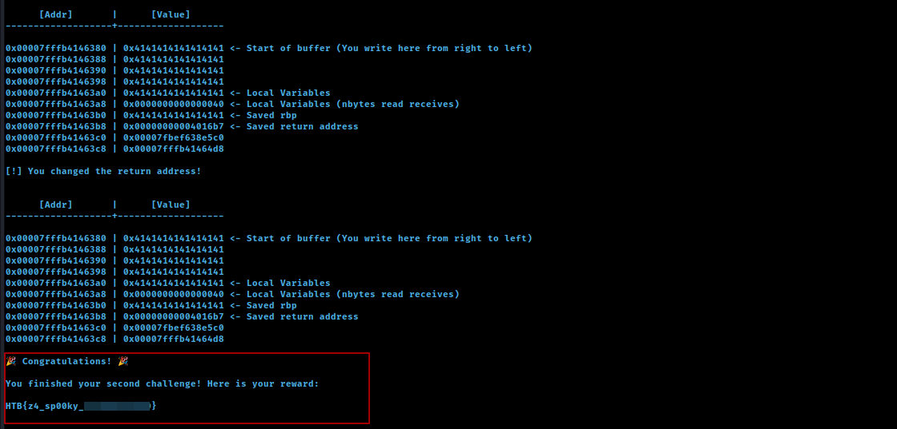

The remote service accepted the payload successfully and redirected execution into `read_flag()`.

The real HTB flag was returned immediately after the overwritten function return.

At this point, the challenge was fully compromised through direct execution flow manipulation.

---

## Step 8: Challenge Completion

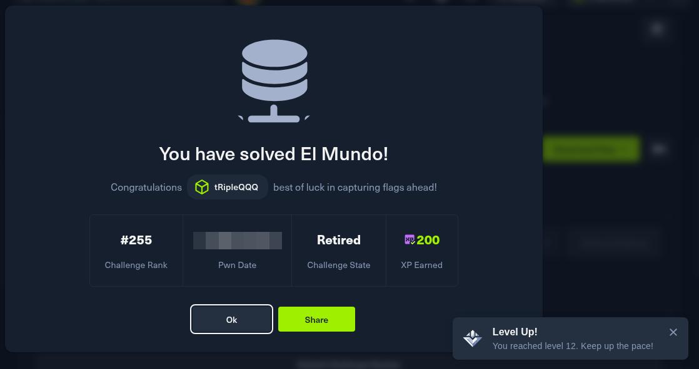

The El Mundo challenge was successfully solved and validated by Hack The Box.

---

# 📌 Conclusion

Across these five HTB Binary Exploitation challenges, several core exploitation concepts were explored progressively:

* integer overflow
* format string vulnerabilities
* stack variable corruption
* shellcode injection
* return address overwrites

What made this track particularly enjoyable was how each challenge focused heavily on understanding *why* exploitation works instead of blindly throwing payloads at binaries.

Some challenges were simple.
Some looked intimidating at first.
Some practically handed over the exploit path once the stack layout became clear.

But together, they created a very solid introduction to real binary exploitation fundamentals.

And honestly, watching a binary hand over its own flag after understanding its memory layout never really gets old.

---

---

This work is part of **FuzzRaiders**’ structured hands-on training and research program, where every lab, project, and technical study is formally documented, reviewed, and validated to ensure real-world applicability, methodological rigor, and effective security execution.

Happy hacking 🚀

---


