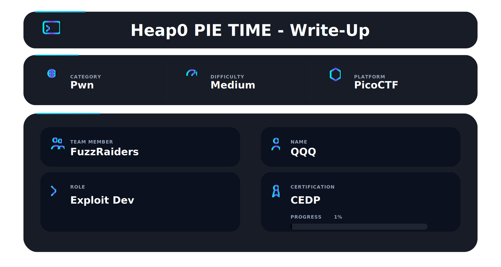

## 📌 Overview

“Programs are just logic, but exploitation is understanding how that logic lives in memory.”

This write-up covers two picoCTF challenges:

* **PIE TIME**
* **heap0**

These labs introduce key real-world concepts:

* Memory randomization (**Position Independent Executable**)
* Unsafe heap usage
* The importance of understanding memory layout

---

## Focus

Both challenges can be solved manually, but our goal was to use
**Pwntools** to:

* Automate exploitation
* Reduce human error
* Build reusable workflows

---

## Key Idea

> Exploitation is no longer about guessing — it’s about understanding and calculating memory at runtime.

* **PIE TIME** → Leak → Calculate → Exploit
* **heap0** → Understand layout → Overwrite → Control

---
# PIE TIME — Challenge 1 of 2

> “Modern exploitation is not about guessing addresses — it’s about deriving them at runtime.”
---

## Description

This challenge introduces binaries compiled with PIE, where function addresses change every execution.

The program helps by leaking:

> Address of `main()`

This leak allows us to compute the correct address of the target function (`win()`).

---

## 📷 Challenge Overview

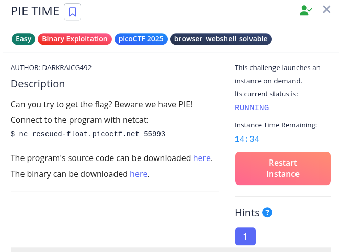

---

## 🔍 Understanding the Problem

Program flow:

1. Leak `main()` address
2. Ask for an address
3. Jump to it

Because of PIE:

* We cannot hardcode `win()`
* We must calculate it dynamically

---

## Exploitation Strategy

```text
Leak → Calculate Base → Derive win() → Execute
```

---

### Steps

```python
base = leaked_main - elf.symbols['main']
win  = base + elf.symbols['win']
```

Send `win` → gain execution.

---

## Exploit Implementation

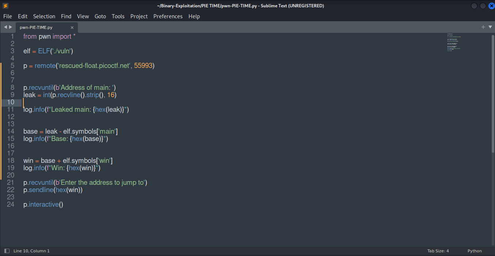

Using Pwntools allowed us to:

* Parse the leak
* Automate calculations
* Deliver payload reliably

---

## Exploitation Result
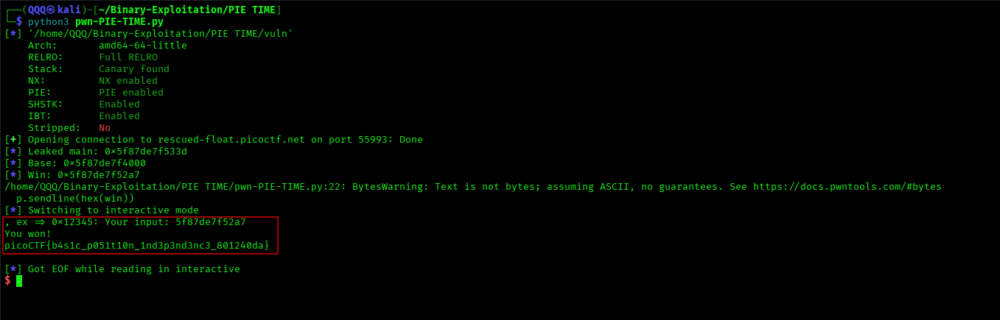

Execution is redirected to `win()`, successfully printing the flag.

---

## Flag Submission

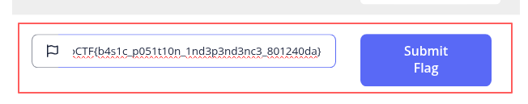

The flag is submitted and validated by the platform.

---

## ✅ Challenge Completion


Challenge marked as solved.

---

## What PIE TIME Teaches

* PIE randomizes addresses but **offsets stay constant**
* Leaks are enough to bypass protections
* Exploitation becomes a **calculation process**
* Pwntools enables automation and precision

---

# heap0 — Challenge 2 of 2

> “Memory is not safe just because it’s on the heap.”

---

## Description

The **heap0** challenge explores vulnerabilities in **heap memory management**.

The program allocates memory dynamically and allows user interaction with that memory. It assumes:

> Data stored on the heap cannot be tampered with.

This assumption is incorrect.

---

## 📷 Challenge Overview

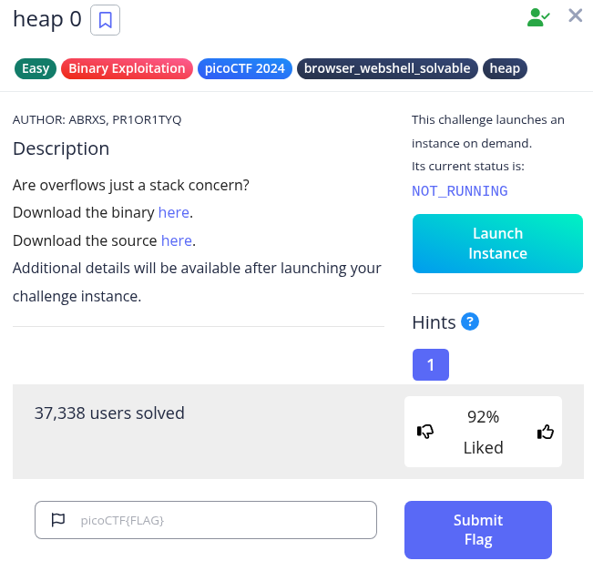

---

## Understanding the Problem

Initial heap state:

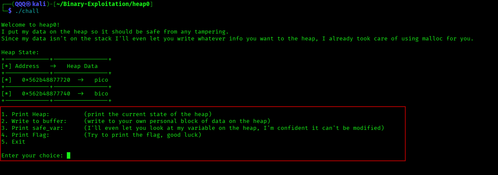

We observe two adjacent memory regions:

```text
[pico] → user-controlled buffer  
[bico] → safe_var (target variable)
```

The program allows writing to the buffer using `fgets` without properly enforcing boundaries.

---

## ⚠️ Unsafe Memory Handling

Although `fgets` is safer than `gets`, it can still lead to vulnerabilities when:

* Input exceeds logical boundaries
* Adjacent memory is not protected
* Heap isolation is assumed incorrectly

> Writing past the buffer causes a **heap overflow**.

---

## Analyzing the Interaction

### Step 1: Writing to the Buffer

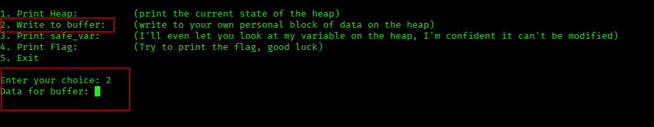

The program accepts arbitrary input into the heap buffer.

No clear size validation → potential overflow.

---

### Step 2: Inspecting `safe_var`

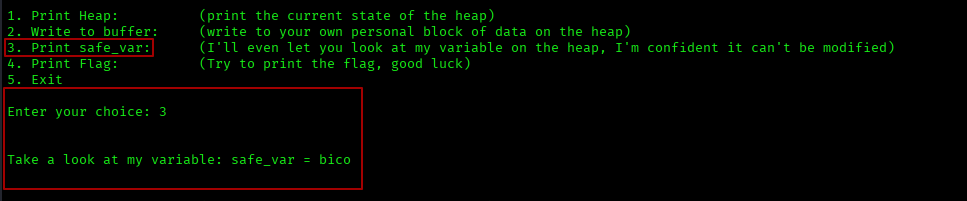

The variable contains:

```text
bico
```

 Confirms it is adjacent and targetable.

---

### Step 3: Failed Flag Attempt

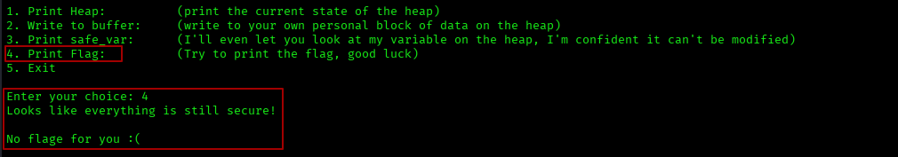

The program denies access because `safe_var` is unchanged.

Condition revealed:

```text
safe_var == "pico"
```

---

## What This Reveals

* Buffer and `safe_var` are adjacent
* No proper bounds checking
* Overwriting `safe_var` is the objective

```text
Overflow → Overwrite safe_var → Trigger flag
```

---

## Exploitation Strategy

Heap layout:

```text
[ buffer (0x20 bytes) ][ safe_var ]
```

Writing more than 32 bytes overwrites `safe_var`.

---

## Exploit Implementation

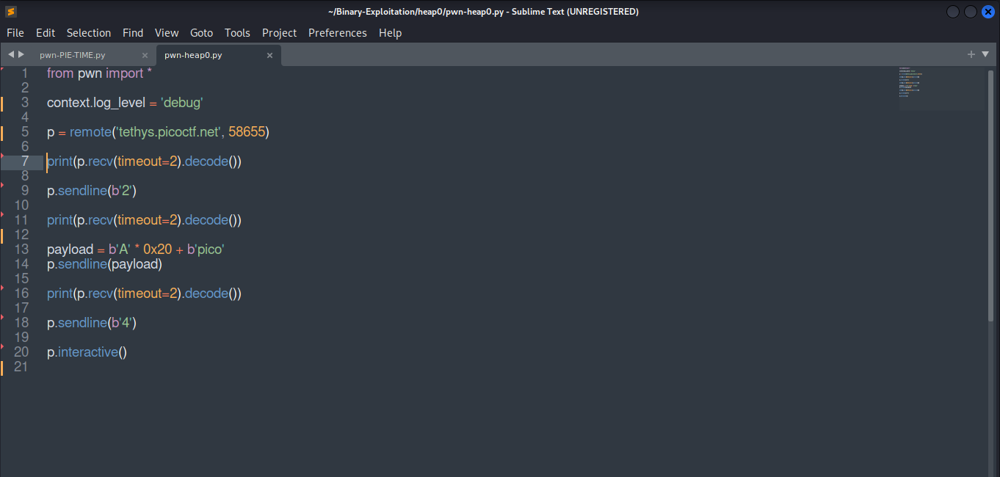

```python
payload = b'A' * 0x20 + b'pico'
```

Steps:

* Send option `2`
* Send payload
* Send option `4`

---

## Exploit Execution

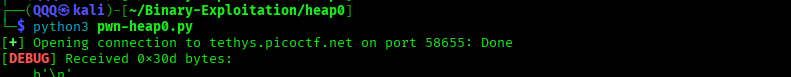


Pwntools automates the interaction and delivers the payload.

---

## Exploitation Result

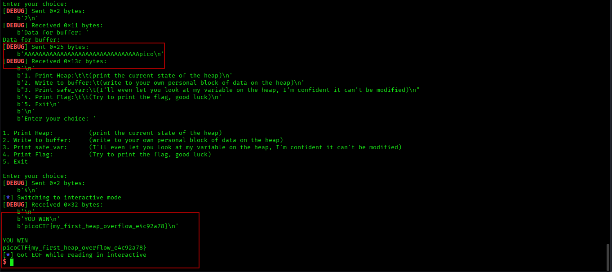

The overflow successfully modifies `safe_var`, revealing the flag.

---

## Flag Submission

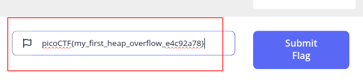

The flag is accepted by the platform.

---

## ✅ Challenge Completion


Challenge successfully solved.

---

## What heap0 Teaches

* Heap memory can be corrupted
* Adjacent allocations are exploitable
* Unsafe input handling leads to vulnerabilities
* Memory assumptions can be dangerous

---

## Key Insight

> Memory location does not guarantee safety — validation does.

Using Pwntools improves:

* automation
* accuracy
* repeatability

---

# What These Challenges Teach

The **PIE TIME** and **heap0** challenges highlight how vulnerabilities arise from how memory is handled.

Key takeaways:

* Memory randomization (PIE) can be bypassed using runtime leaks
* Function addresses change, but **offsets remain consistent**
* Heap memory is vulnerable when boundaries are not enforced
* Even safer functions like `fgets` can lead to overflows if misused
* Exploitation relies on understanding **memory layout and data flow**
* Automation with Pwntools makes exploitation reliable and repeatable

---

# 📌 Conclusion

These challenges show that successful exploitation comes from understanding how memory works, not guessing values.

By combining:

* runtime calculations (PIE)
* memory layout awareness (heap)
* and automation (Pwntools)

we move from solving challenges to building **structured exploitation workflows**.

> Exploitation begins when you understand memory, not when you guess it.

---

This work is part of **FuzzRaiders**’ structured hands-on training and research program, where every lab, project, and technical study is formally documented, reviewed, and validated to ensure real-world applicability, methodological rigor, and effective security execution.

Happy hacking 🚀

---

