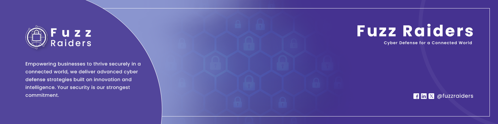

<p align="center">
  
</p>



Welcome to the **FuzzRaiders Write-Ups** repository.  
This space contains **public-safe cybersecurity write-ups**, including CTF solutions, challenge walkthroughs, methodology breakdowns, and case studies.

All content is written with clarity, structure, and educational value in mind.

---

## 🎯 Purpose of This Repository

- Document CTF and challenge solutions
- Share analysis methods and problem-solving approaches
- Provide high-quality educational material for learners
- Showcase structured thinking and security workflows
- Serve as a public reference for safe, ethical lessons

---

## 📂 Repository Structure

```
WRITE-UPS/
├── README.md
│
├── Web/
│   ├── Applications/
│   └── API/
│
├── Pwn/
│   ├── Linux/
│   └── Windows/
│
├── Privilege-Escalation/
│   ├── Linux/
│   └── Windows/
│
├── Active-Directory/
│
├── Cryptography/
│
├── Forensics/
│   ├── Disk/
│   ├── Memory/
│   └── Network/
│
├── Cloud/
│   ├── AWS/
│   ├── Azure/
│   └── GCP/
│
├── Mobile/
│   ├── Android/
│   └── iOS/
│
└── Reverse-Engineering/
    ├── Crackmes/
    └── Malware/

```

Each category includes folders for individual write-ups.

---

## 🧠 What You'll Find Here

### 🔹 CTF Challenge Write-Ups

Step-by-step solutions with explanations, not just commands.

### 🔹 Vulnerability Walkthroughs (Public-Safe)

Deep dives into known issues + defensive understanding.

### 🔹 Reverse Engineering Challenges

Clear and safe binary analysis workflows.

### 🔹 Forensics Cases

Structured evidence analysis and conclusions.

### 🔹 Cryptography Challenges

Breakdowns of logic, flaws, and solutions.

---

## 🧱 Write-Up Principles

- Public-safe (no harmful material)
- Clear and structured
- Educational tone
- No sensitive data
- Reproducible steps when possible
- Screenshots redacted where necessary

---

## 🤝 Contributing

To contribute a write-up, ensure:

- It is safe and non-destructive
- The explanation is clear and original
- All sensitive information is removed
- Folder names follow the existing structure

Submit via pull request after reviewing contribution guidelines.

---

## 📜 License

All write-ups are shared under the terms found in the `LICENSE` file.
