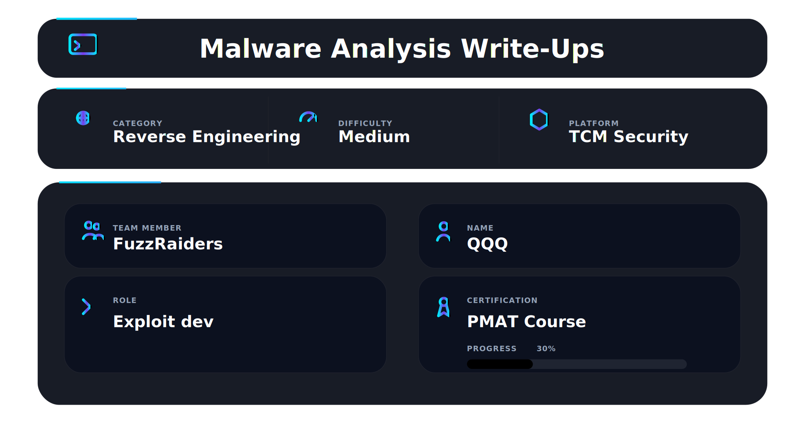
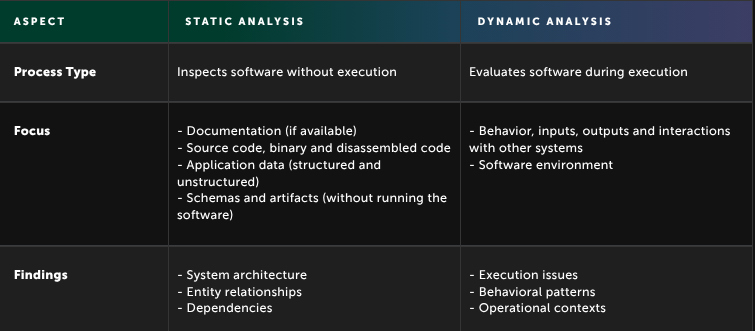
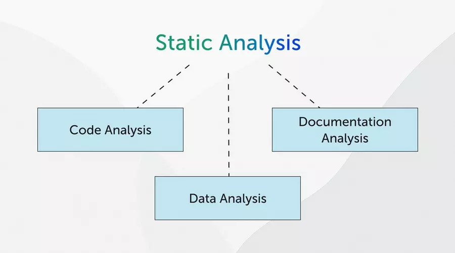
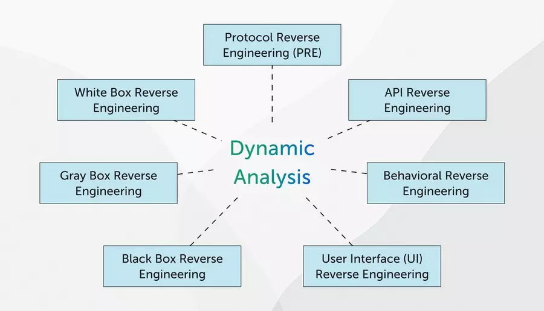

## 📌 Overview

This write-up covers **Part 1 of 2** of the **Practical Malware Analysis & Triage (PMAT)** course. This section focuses on building a secure malware analysis lab and applying foundational techniques to investigate suspicious binaries.

The objective is to safely examine malware samples, observe their behavior, and extract actionable indicators of compromise (IOCs) within a controlled environment.

This part establishes a strong foundation for deeper reverse engineering in Part 2 by emphasizing safety, tooling, and structured investigation methodologies, while aligning observations with frameworks such as MITRE ATT&CK.

---

## In this write-up, we cover

* Malware lab setup and safety practices
* Virtual lab deployment (Windows + REMnux)
* Analysis fundamentals
* Initial execution and detonation
* Network and host-based monitoring
* IOC identification basics

⚠️ **Note:** Malware samples, hashes, and indicators are generalized or redacted for safety and ethical reasons.

---

## 🛠 Tools

* VirtualBox → Provides virtualization and isolation for the lab environment
* Windows 10 VM → Serves as the malware execution environment
* REMnux → Linux-based toolkit for network and malware analysis
* FLARE-VM → Windows-based reverse engineering and analysis suite
* INetSim → Simulates internet services to safely interact with malware
* Wireshark → Captures and analyzes network traffic
* Procmon → Monitors real-time system activity (files, registry, processes)
* PEStudio → Performs PE file inspection
* FLOSS → Extracts and deobfuscates strings from binaries
* VirusTotal → Checks file reputation and known threat intelligence

---

## Lab Setup & Safety

* ## A secure and isolated lab environment was established before interacting with any samples.

### Key Components

* Host-only/internal networking (no external internet access)
* VM snapshots taken prior to execution for quick recovery
* INetSim configured to simulate internet services
* Segregated systems for controlled investigation

### Why This Matters

Malware can:

* Spread across networks
* Establish persistence mechanisms
* Exfiltrate sensitive data

## A properly configured lab ensures safe and controlled analysis without risking the host system.

---

## Types of Analysis

There are two primary approaches used during investigation:

### 1: Static Analysis

## Focuses on examining a program **without execution**.

It helps:

* Understand control flow and execution paths
* Analyze how data moves within the program
* Identify suspicious code patterns quickly
* Locate potential weaknesses directly in the code

**Disadvantages:**

* Does not reveal runtime behavior
* Can be time-consuming when performed manually
* Tools may produce false positives/negatives

**Common Tools:** Ghidra, IDA Pro, Radare2, GDB

---

### 2: Dynamic Analysis

## Focuses on observing a program **during execution** in a controlled environment.

It helps:

* Identify runtime behavior and interactions
* Detect issues not visible during initial inspection
* Validate earlier findings

**Disadvantages:**

* Harder to trace issues back to exact code locations
* Requires a properly secured environment

**Common Tools:** Procmon, Wireshark, OllyDbg

---

## **In Short**

* Static analysis → Understand structure and embedded indicators
* Dynamic analysis → Observe real behavior during execution

Together, they provide a complete view of how malware operates.

---

> *“Static analysis shows what malware is, dynamic analysis shows what it does.”*

---

## Basic Static Analysis

Initial inspection was performed to gather insights without executing the sample.

### Hashing the Sample

MD5 and SHA256 hashes were generated to uniquely identify the file and check for known detections.

---

### Malware Intelligence Lookup

The hash was queried on VirusTotal to determine detection rates and any known associations.

---

### String Analysis

Strings extracted using FLOSS revealed:

* Potential hardcoded URLs
* Command execution patterns
* Encoded or obfuscated content

## *“Every piece of malware tells a story — the analyst’s job is to read between the lines.”*

---
---

### Import Address Table Analysis

Reviewing imported Windows APIs (e.g., `CreateFile`, `WinExec`, `RegSetValue`) provided insight into possible capabilities such as:

* File manipulation
* Command execution
* Persistence mechanisms

---

### Packed Malware Detection

Indicators such as limited readable strings and unusual entropy suggested possible packing or obfuscation, requiring deeper inspection.

---

### PE Analysis

PEStudio highlighted structural anomalies, suspicious imports, and other indicators of potentially malicious behavior.

---

## Basic Dynamic Analysis

The sample was executed in an isolated environment to observe its behavior.

---

### Initial Detonation

“Initial Detonation” is a standard term in malware analysis. Let me break it down clearly by starting:

**What It Means?**

In malware analysis, detonation simply refers to running a suspicious malware sample in a controlled environment to observe what it does.

“Initial detonation” = the first time you execute the malware in your isolated lab.
The goal is not to infect anything outside the lab, but to see its behavior.

**Why It’s Important? You may ask**

Well when you run the malware, you can observe things like:

New processes it spawns
Files it creates or modifies
Registry keys it changes
Network connections it tries to make (like contacting a command-and-control server)
Any other malicious activity

This tells you what the malware actually does, instead of just what it looks like.

Example

If you have a malicious .exe file:

You start the VM in an isolated network (like VirtualBox with INetSim).
You run the malware once — this is the initial detonation.
You watch what happens using tools like Procmon (for system activity) and Wireshark (for network activity).
You take notes and capture indicators for later analysis.

After this step, you know the malware’s behavioral patterns, which helps in detection, defense, and further reverse engineering.

## In short:

Initial detonation = safely “detonating” the malware for the first time in your lab to observe its real behavior.

---

### 🌐 Network Analysis

Using Wireshark:

* Captured outbound traffic generated by the sample
* Observed attempts to communicate with external systems
* Identified behavior consistent with command-and-control (C2) activity

INetSim safely simulated network responses.

---

### Host-Based Analysis

Using Procmon:

* Detected file system changes
* Observed registry modifications indicating persistence
* Identified system-level activity

---

### Parent-Child Process Analysis

Process relationships revealed unusual execution chains, suggesting multi-stage activity.

---

### Reverse Shell Behavior

The sample exhibited behavior consistent with remote command execution:

* Initiated outbound connections
* Allowed interaction with an external system
* Correlated host and network activity confirmed this pattern

---

## Indicator Extraction (IOCs)

The following indicators were identified:

* File hashes (MD5/SHA256)
* Suspicious domains/IP addresses
* Registry keys related to persistence
* File paths of created or modified files
* Unusual process execution patterns

These indicators are essential for detection, threat hunting, and incident response.

---

## 🧠 What This Part Teaches

* Safe handling of malware samples
* Core analysis techniques
* Importance of API and string inspection
* Value of network traffic analysis
* Correlating multiple data points
* Introduction to behavioral mapping using MITRE ATT&CK

---

## Summary

Part 1 builds a strong foundation by combining:

* Secure lab setup
* File inspection techniques
* Controlled execution
* Behavioral observation

These skills prepare analysts for deeper reverse engineering and advanced investigation.

---

## 📌 Conclusion

Part 1 highlights the importance of structured investigation and safety when working with malware.

By applying these techniques, analysts can:

* Identify malicious behavior
* Extract actionable intelligence
* Strengthen defensive strategies

> **“The more you understand how something breaks, the better you become at defending it.”**

---

This work is part of **FuzzRaiders**’ structured hands-on training and research program, where every lab, project, and technical study is formally documented, reviewed, and validated to ensure real-world applicability, methodological rigor and real-world security execution

Happy hacking 🚀

---

