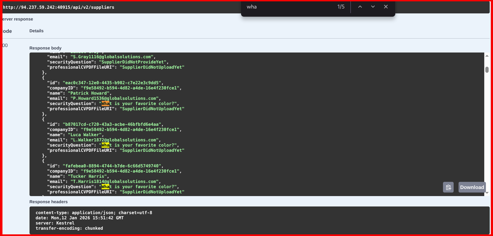

# Hack The Box – API Attacks (Skills Assessment)

<br>
<br>


---

## 📌 Overview

This skills assessment focuses on **real‑world API attack techniques** commonly seen in modern web applications. The target API exposed multiple weaknesses across **authentication, authorization, password reset logic, and file handling**, which together formed a complete attack chain.

Due to weak security controls and improper trust boundaries, it was possible to escalate from basic API access to sensitive data disclosure.

> _In this write‑up, we cover_

- JWT‑based authentication usage
- API endpoint enumeration
- Supplier data exposure
- Insecure password reset via security questions
- Automated guessing using a wordlist
- Unsafe file URI handling
- Data extraction through Base64 responses

---

## 🛠 Tools

The following tools and techniques were used:

```
curl / httpie      → API interaction
ffuf               → Parameter fuzzing & brute forcing
jq                 → JSON parsing
Linux terminal     → Automation and scripting
Wordlists          → Security question guessing
```

---

## 🧭 Walkthrough

### 1️⃣ Authentication & JWT Token

The application provided valid credentials, which were used to authenticate against the API. A **JWT token** was returned upon successful login.

This token was then attached to subsequent requests using the standard authorization header:

```
Authorization: Bearer <JWT>
```


This step established an authenticated session but did not guarantee proper authorization controls.

---

### 2️⃣ Supplier Enumeration

With a valid JWT, a supplier‑related endpoint was accessible:

```
GET /api/v2/suppliers
```


The response returned a list of supplier objects containing **email addresses** and additional metadata. Some suppliers were configured with a **security question**:

> _What is your favorite color?_ > 

This represented a critical exposure, as email addresses are sensitive identifiers that can be abused in account recovery flows.

---

### 3️⃣ Email Extraction

Supplier email values were extracted from the JSON response and written to a local file for further testing.

This enabled automation against downstream authentication and password reset functionality.

---

## 🔐 Password Reset Weakness

### Insecure Security Question Flow

The API exposed a password reset endpoint that relied solely on:

- Supplier email
- Security question answer
- New password

Because security question answers are **low‑entropy** and the endpoint lacked strong rate limiting, the reset mechanism was vulnerable to automated guessing.

---

### 4️⃣ Automated Answer Guessing

Using a publicly available **colors wordlist**, combinations of:

- Supplier emails
- Common color names

were tested against the password reset endpoint.

Once a valid answer was discovered for a supplier account, the password reset succeeded.

> This demonstrates why knowledge‑based authentication is unsuitable for sensitive recovery flows.

---

### 5️⃣ Supplier Account Access

After resetting the password, authentication as a valid supplier user was possible. This granted access to supplier‑only API endpoints.

---

## 📄 File Handling Vulnerability

### 6️⃣ CV Upload Abuse

The supplier CV upload endpoint accepted a file reference field intended for PDF uploads. However, the backend trusted user‑supplied file URIs.

By providing a **local file URI**, the backend attempted to read from the server’s filesystem and stored the retrieved content as the supplier CV.

This behavior indicates **unsafe file scheme handling** and improper input validation.

---

### 7️⃣ CV Retrieval & Data Decoding

Retrieving the stored CV returned the content encoded in **Base64** format.

Decoding this data revealed sensitive information stored on the server.

🏁 

---

## 🧠 What This Assessment Teaches

- JWT authentication does not imply secure authorization
- API endpoints often expose excessive data
- Security questions are weak authentication factors
- Lack of rate limiting enables brute‑force attacks
- File URI handling must be strictly controlled
- Base64 encoding does not provide security

---

## 📌 Conclusion

This skills assessment demonstrates how multiple **small API weaknesses** can be chained together into a complete compromise. Individually, each issue may seem minor, but together they result in full data exposure.

> _APIs must be designed with zero trust, strict validation, and layered defenses._

---

## Author: Z4B0

## [LinkedIn](https://www.linkedin.com/in/mahamud-abdirahman-151493375/)
