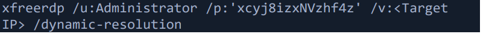
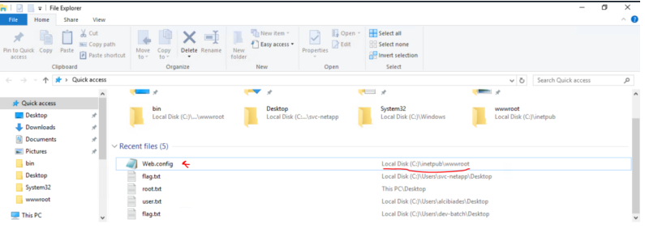
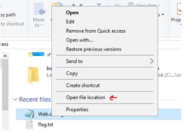
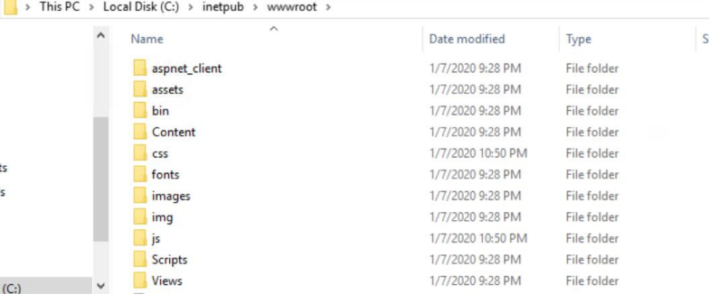
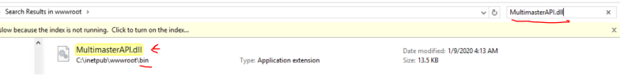
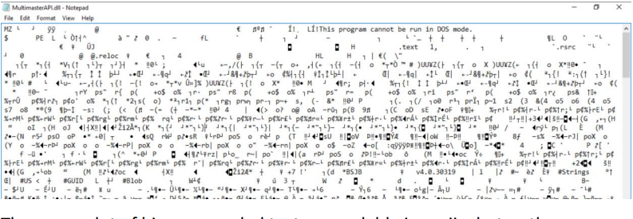
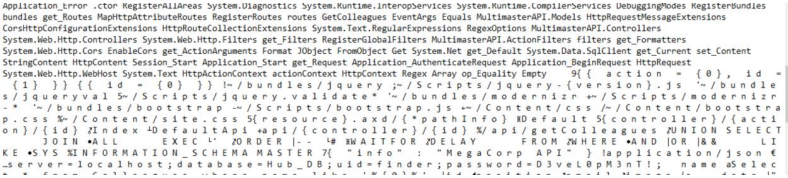
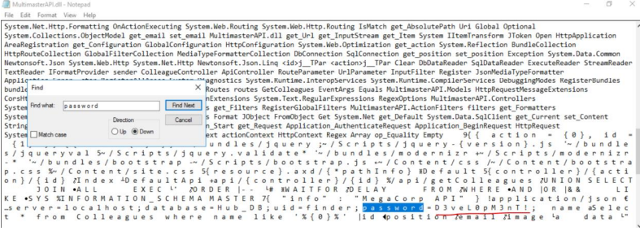

<div align="left">


</div>

## Attacking Common Applications – Skills Assessment III

<div align="left">

<br>
<br>


## </div>

This challenge is a great introduction to **basic static analysis and insecure credential handling**, focusing on:

- Identifying sensitive application files on a Windows web server
- Reviewing configuration artifacts such as `web.config`
- Performing basic static inspection of compiled DLL files
- Recognizing hardcoded secrets embedded in application binaries
- Extracting credentials from readable string sections without advanced tooling

---

## 🛠 Tools

No specialized tools were required — only basic system access and manual inspection.

---

## 🔐 Credential Discovery

**Question:**
What is the hardcoded password for the database connection in the `MultimasterAPI.dll` file?

**Answer:**

```
D3v***********nT!
```

The password is embedded directly in the application binary and is recoverable through simple static analysis.

---

## 🧭 Initial Access (RDP)

Using the provided credentials, we authenticate to the Windows target via RDP:

```bash
xfreerdp /u:Administrator /p:'xcyj8izxNVzhf4z' /v:<TARGET_IP> /dynamic-resolution
```

Successful authentication provides full desktop access to the Windows environment.



---

## 📁 Locating Application Files

After logging in:

1. Open **File Explorer**
2. Observe `web.config` listed under **Recent Files**
3. Navigate to the associated application directory






Within this directory, the target binary is identified:

```
MultimasterAPI.dll
```



---

## 🔎 Static Analysis of MultimasterAPI.dll

The DLL is opened using **Notepad** to perform a basic string inspection:



While most of the content appears as binary data, a readable **strings section** is visible further down the file.



Some strings appear normally, while others are displayed with spaces between characters.

---

## 🔑 Extracting the Password

A direct search for the keyword `password` yields no results. However, searching for spaced characters:

```
p a s s w o r d
```

Reveals the hardcoded credential.



Removing the spacing produces the final password value:

```
D3veL0pM3nT!
```

## 🧠 What This Lab Teaches

- Hardcoded secrets are commonly exposed in web application deployments
- Configuration and binary files should always be reviewed during assessments
- Sensitive data can often be recovered without specialized tools
- Poor secret management leads directly to system compromise

This lab reinforces core **web security assessment techniques** and the importance of reviewing server-side artifacts.

---

## 📌 Conclusion

Embedding credentials directly in application files is a critical security failure. Even minimal inspection can expose sensitive secrets and enable unauthorized access.

> _If secrets exist on disk, assume an attacker will find them._

This work is part of **FuzzRaiders’ structured hands-on training and research program**, where every lab, project, and technical study is formally documented, reviewed, and validated to ensure real-world applicability, methodological rigor, and real-world security execution

Happy hacking 🚀

# Author: Z4B0 [LinkedIn](https://www.linkedin.com/in/mahamud-abdirahman-151493375/)
